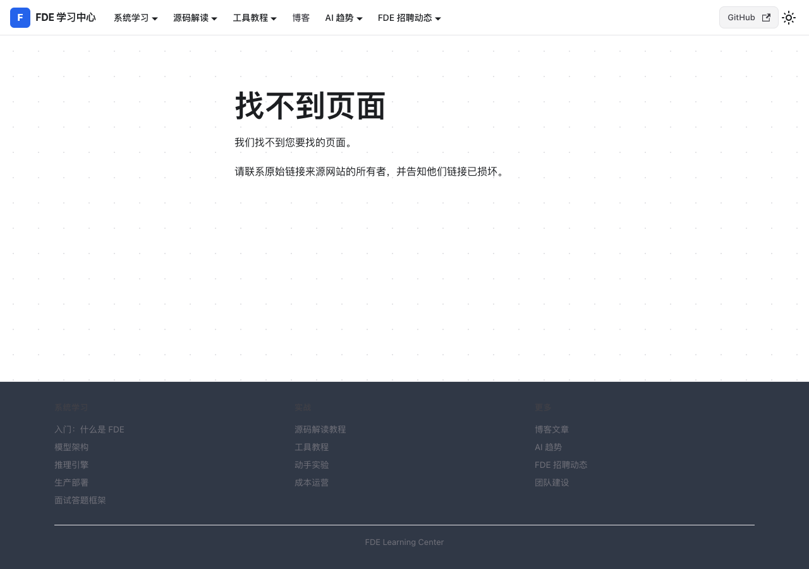
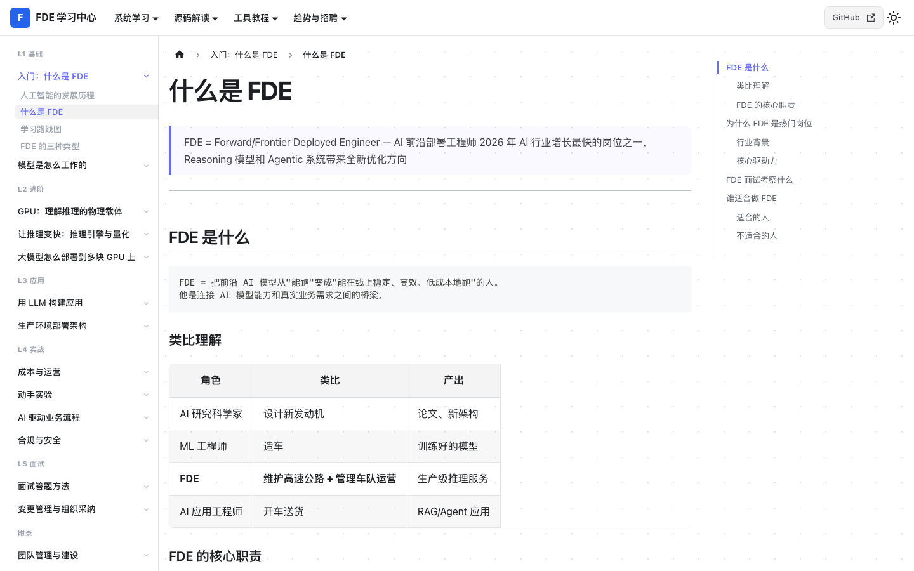
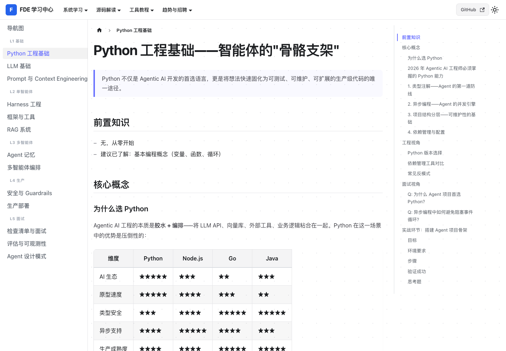
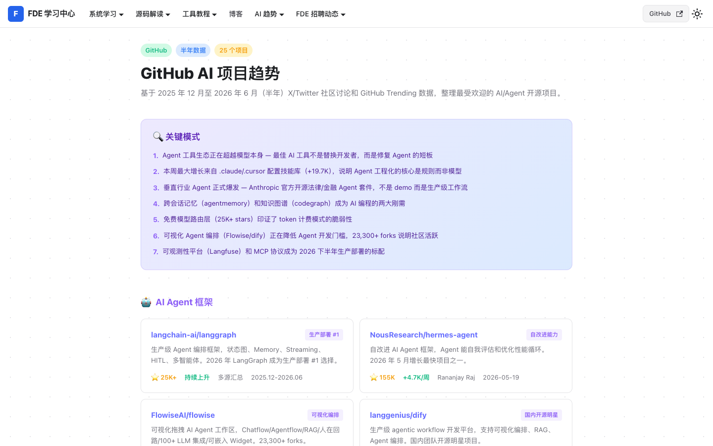
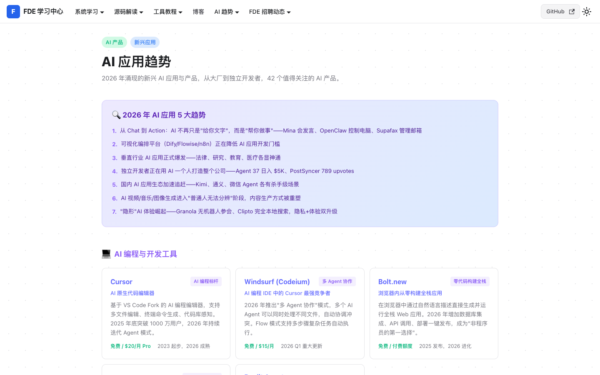

<p align="center">
  <h1 align="center">FDE 学习中心</h1>
  <p align="center">AI 前沿部署工程师（Frontier Deployment Engineer）—— 从入门到面试的一条龙学习平台</p>
</p>

<p align="center">
  <a href="https://luoboask.github.io/fde-learning/">
    
  </a>
</p>

<p align="center">
  
</p>

---

## 📖 平台简介

FDE 学习中心是一个面向 **AI 前沿部署工程师** 的系统性学习平台，覆盖从 AI 基础到生产部署的全栈能力。内容持续更新，免费开放。

| 模块 | 路由 | 内容量 | 适合人群 |
|------|------|--------|----------|
| 🧠 FDE 系统学习 | `/` | 15 个阶段 | AI 解决方案架构师 |
| 🤖 Agentic AI 系统学习 | `/agentic-ai/` | 20 篇 | AI Agent 工程师 / 校招 / 实习生 |
| 🔍 开源源码解读 | `/opensource/` | 6 个项目 | nanoGPT、llm.c、llama.cpp、vLLM、SGLang、Claude Code |
| 🛠️ 工具教程 | `/tools/` | 5 篇 | Cursor、Claude Code、Karpathy AI 编程、OpenSpec 工作流 |
| 📈 AI 行业趋势 | `/trends/` | 30+ 条动态 | S/A/B/C 四级影响评估，每周更新 |
| ⭐ GitHub 趋势 | `/github-trends/` | 半年数据 | 5 大分类 31 个项目 |
| 🚀 AI 应用趋势 | `/ai-applications/` | 40+ 产品 | 从大厂到独立开发者的新兴 AI 产品 |
| 💼 FDE 招聘动态 | `/jobs/` | 5 大类别 | 推理/部署、Agent、算法/架构、平台/基础设施、解决方案 |

---

## 🎯 适合谁学

### AI 解决方案架构师 → FDE 系统学习
> 掌握从 GPU 底层到生产部署的完整架构能力，涵盖推理引擎、分布式系统、可观测性、成本优化。

### AI Agent 工程师 → Agentic AI 系统学习
> LangGraph、RAG、多智能体编排、MCP/A2A 协议，从 Python 基础到多 Agent 实战。

### 校招 / 实习生 → Agentic AI 系统学习
> 从 Python 基础到实战项目，一条路径直达，降低入门门槛。

### 转行 AI 的开发者 → 双路径并行
> Transformer → Agent 全栈能力，理论与实战并行。

### 技术负责人 → FDE 系统学习
> 团队建设、招聘体系、技术选型、成本管控，从技术到管理的全局视角。

---

## 📸 页面预览

<table>
  <tr>
    <td><strong>首页</strong><br/></td>
    <td><strong>系统学习 — 什么是 FDE</strong><br/></td>
  </tr>
  <tr>
    <td><strong>Agentic AI — Python 工程基础</strong><br/></td>
    <td><strong>GitHub AI 趋势（半年数据）</strong><br/></td>
  </tr>
  <tr>
    <td colspan="2" align="center"><strong>AI 应用趋势（40+ 新兴产品）</strong><br/></td>
  </tr>
</table>

---

## 📚 内容涵盖

- **AI 基础理论**：Transformer、模型训练、GPU 架构、推理优化
- **生产部署实战**：vLLM/SGLang 推理引擎、K8s 部署、可观测性、成本优化
- **Agentic AI**：LangGraph、RAG、多智能体编排、MCP/A2A 协议
- **源码解读**：nanoGPT、llm.c、llama.cpp、vLLM、SGLang、Claude Code 架构
- **面试与招聘**：面试答题框架、技能知识图谱、真实岗位列表
- **行业动态**：AI 趋势、GitHub 热门项目、新兴 AI 产品

---

## 🚀 本地运行

```bash
npm install
npm start
```

打开 [http://localhost:3000](http://localhost:3000) 即可查看。

## 📦 部署

站点通过 GitHub Pages 自动部署：

```bash
git push origin master
npm run deploy
```

## 🤝 贡献

1. Fork 本仓库
2. 创建特性分支：`git checkout -b feature/your-feature`
3. 提交修改：`git commit -m '描述你的改动'`
4. 推送并提 Pull Request

## 📄 License

MIT
