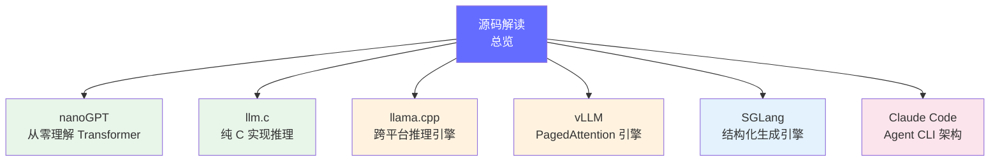
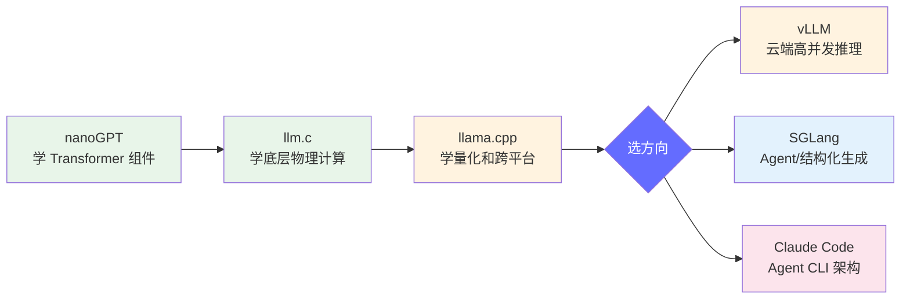

# 源码解读教程

> 通过逐行阅读优秀项目的源码，将前面学到的知识落到实处。从教学级的 nanoGPT 到生产级的 vLLM 和 SGLang，再到 Agent CLI 的 Claude Code，逐步深入。

## 导航图

## 项目概览

| 难度 | 项目 | 对应知识 | 核心看点 | 代码量 |
|------|------|---------|---------|-------|
| ⭐ | [nanoGPT](./nanogpt.md) | Transformer 架构 | 从零实现 GPT，理解 Attention 维度变换 | ~300 行 |
| ⭐⭐ | [llm.c](./llm-c.md) | 推理引擎底层 | 纯 C 实现 LLM 推理，理解物理计算 | ~1200 行 |
| ⭐⭐ | [llama.cpp](./llama-cpp.md) | 量化与跨平台推理 | GGUF 格式、计算图驱动、多后端 | ~50000 行 |
| ⭐⭐⭐ | [vLLM](./vllm.md) | 推理引擎架构 | PagedAttention、Continuous Batching | ~8000 行 |
| ⭐⭐⭐ | [SGLang](./sglang.md) | 结构化生成 | RadixAttention、FSM 约束生成 | ~5000 行 |
| ⭐⭐⭐ | [Claude Code](./claude-code/00-文档导航) | Agent CLI 架构 | TypeScript + Ink + 工具系统 + 记忆系统 | ~51 万行 |

## 学习路径建议

**推荐顺序**：

1. **nanoGPT** → 先理解 Transformer 的每个组件是怎么用代码表达的
2. **llm.c** → 再看同样的架构如何从 Python 映射到 C 语言
3. **llama.cpp** → 学习生产级推理引擎的架构（计算图、量化、多后端）
4. **vLLM 或 SGLang** → 根据方向选择：
   - 做云端服务/高并发 → 看 vLLM
   - 做 Agent/函数调用 → 看 SGLang

## 阅读方法

1. **先看文档，再读代码**：每个项目先读懂 README 和架构文档
2. **带着问题读**：比如 "vLLM 的 PagedAttention 怎么实现的？"
3. **逐文件追踪**：从入口文件开始，逐层深入核心组件
4. **写笔记**：读完每个项目写一段总结
5. **做对比**：读完 vLLM 再读 SGLang，对比两者的 KV Cache 管理策略

---

*返回 [FDE 学习中心](/)
