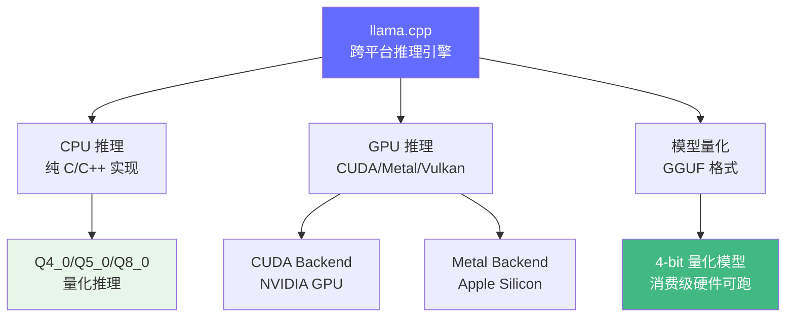
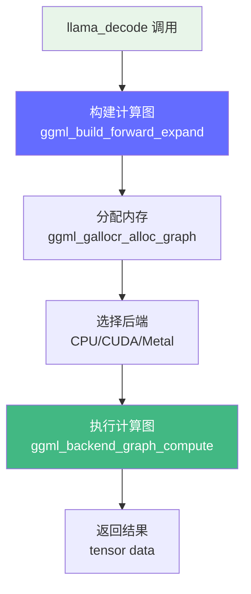

# llama.cpp 深度解读

> llama.cpp 是当前最流行的跨平台推理引擎，纯 C/C++ 实现，支持 CPU/GPU 混合推理。它的 GGUF 格式已成为模型量化的事实标准。项目规模约 5 万行代码。

**GitHub**: https://github.com/ggerganov/llama.cpp

## 前置知识

- [量化基础](/04-inference-optimization/quantization-basics/) — 了解量化概念
- [llm.c 纯 C 实现](./llm-c.md) — 理解底层推理的基本流程
- [GPU 基础](/03-gpu-basics/gpu-overview/) — 了解 GPU 计算特性

## 项目定位

llama.cpp 解决的核心问题：**如何在不依赖 GPU 的前提下，让消费级硬件也能跑通大模型推理？**



## 完整项目文件树

```
llama.cpp/
├── src/
│   ├── llama.cpp           # 核心：模型加载、推理、KV Cache (~8000行)
│   ├── llama-impl.h        # 内部头文件
│   ├── llama-cpp.cpp       # C++ 封装层
│   ├── ggml.c              # 核心计算图库 (~15000行)
│   ├── ggml-alloc.c        # 内存分配器
│   ├── ggml-backend.c      # 后端抽象层
│   ├── ggml-quants.c       # 量化算子实现
│   ├── unicode.cpp         # Unicode/Tokenization 处理
│   ├── sampling.cpp        # 采样策略（top-k, top-p, temperature）
│   └── grammar-parser.cpp  # 语法约束生成（GBNF）
├── ggml/
│   ├── include/ggml.h      # 公共头文件
│   ├── src/ggml.c          # 核心计算图
│   ├── src/ggml-cuda/      # CUDA 后端（多个 .cu 文件）
│   ├── src/ggml-metal/     # Metal 后端（.m 文件）
│   └── src/ggml-vulkan/    # Vulkan 后端
├── examples/
│   ├── main/main.cpp       # 交互式聊天
│   ├── server/server.cpp   # HTTP 服务
│   └── convert/            # 模型转换工具
├── common/                 # 共享工具代码
├── convert_hf_to_gguf.py   # HuggingFace → GGUF 转换脚本
└── CMakeLists.txt          # 构建系统
```

## 核心架构：计算图驱动

llama.cpp 和 PyTorch 最大的区别在于它使用 **计算图（Computation Graph）** 而非 eager 执行。所有算子先被添加到图中，然后一次性执行。



### 1. GGUF 文件格式 — 量化模型的事实标准

GGUF（GPT-Generated Unified Format）是 llama.cpp 的模型存储格式：

```
GGUF 文件结构:
┌──────────────────────────────────────────────────┐
│ Header (12 bytes)                                 │
│   magic: "GGUF" (4 bytes) = 0x46554747            │
│   version: 3 (4 bytes)                            │
│   tensor_count: 291 (8 bytes)                     │
├──────────────────────────────────────────────────┤
│ Metadata KV (键值对存储模型配置)                    │
│   key: "general.architecture" → "llama" (string)   │
│   key: "llama.context_length" → 4096 (uint32)      │
│   key: "llama.embedding_length" → 4096 (uint32)    │
│   key: "llama.head_count" → 32 (uint32)            │
│   key: "llama.head_count_kv" → 32 (uint32)         │
│   key: "llama.rope.freq_base" → 10000.0 (float32)  │
│   key: "general.name" → "Llama 3 8B" (string)      │
│   ... 更多配置                                     │
├──────────────────────────────────────────────────┤
│ Tensor Info (每个张量的元数据)                       │
│   tensor.name: "token_embd.weight"                │
│   tensor.type: 8 (GGML_TYPE_Q4_0)                 │
│   tensor.n_dims: 2                                 │
│   tensor.ne[0]: 4096  (rows)                      │
│   tensor.ne[1]: 128256 (cols)                     │
│   tensor.offset: 1024 (数据在文件中的偏移量)         │
│   ... 291 个 tensor 的信息                          │
├──────────────────────────────────────────────────┤
│ Tensor Data (对齐到 32 字节)                        │
│   tensor_0_data: [Q4_0 encoded weights...]         │
│   tensor_1_data: [Q4_0 encoded weights...]         │
│   ...                                               │
└──────────────────────────────────────────────────┘
```

**支持的量化类型（ggml_type 枚举）**：

| 类型 | 枚举值 | 每 weight 位数 | 大小（7B模型） | 精度损失 | 适用场景 |
|------|-------|---------------|--------------|---------|---------|
| F32 | 0 | 32 bits | 28 GB | 无 | 训练/调试 |
| F16 | 1 | 16 bits | 14 GB | 极小 | 高质量推理 |
| Q8_0 | 7 | 8 bits | 7 GB | 几乎无 | 平衡精度/大小 |
| Q5_0 | 12 | 5 bits | ~4.5 GB | 小 | 主流推荐 |
| Q4_0 | 2 | 4 bits | ~3.5 GB | 中等 | 资源受限 |
| IQ4_XS | 27 | 4.25 bits | ~3.7 GB | 比 Q4_0 好 | 高质量 4-bit |

### 2. 量化数据结构 — Q4_0 格式详解

Q4_0 是 llama.cpp 最常用的量化格式，理解它对面试非常重要：

```c
// 定义在 ggml-common.h
#define QK4_0 32  // 每个 block 有 32 个权重

// Q4_0 block: 18 字节存 32 个 float
typedef struct {
    ggml_fp16_t d;           // scale factor (2 bytes, FP16)
    uint8_t qs[QK4_0 / 2];   // quantized values (16 bytes, 4 bits each)
} block_q4_0;

// 编码过程: 32 个 FP32 → 18 字节
// 1. 找 block 中最大绝对值 max_val
// 2. 计算 scale = max_val / 8 (因为 4-bit signed 范围是 [-8, 7])
// 3. 每个权重量化: q = round(weight / scale) + 8 (变为 [0, 15])
// 4. 两个 4-bit 值打包到一个字节: qs[i/2] = q[i] | (q[i+1] << 4)

// 解码过程: 18 字节 → 32 个 FP32
// v0 = (qs[j/2] & 0x0F) - 8  // 取低 4 位，减 8 恢复符号
// v1 = (qs[j/2] >> 4) - 8    // 取高 4 位，减 8 恢复符号
// weight = v * d              // 乘 scale 恢复近似值
```

**压缩率**：32 个 float（128 字节） → 18 字节 = 7.1 倍压缩！

### 3. 量化矩阵乘法 — 核心算子

```c
// 定义在 ggml-quants.c
// Q4_0 量化矩阵乘法: C = A @ B(Q4_0)
// src0: 量化权重 Q4_0 [ne00, ne01]
// src1: 激活值 F32 [ne10, ne11]
// dst:  输出 F32 [ne01, ne11]
void ggml_vec_dot_q4_0_q8_0(int n, float* s,
    const void* vx, const void* vy) {

    const block_q4_0* x = (const block_q4_0*)vx;
    const block_q8_0* y = (const block_q8_0*)vy;

    const int nb = n / QK4_0;  // block 数量
    float sumf = 0.0f;

    for (int i = 0; i < nb; i++) {
        // 1. 获取 Q4_0 的 scale
        float d0 = GGML_FP16_TO_FP32(x[i].d);

        // 2. 获取 Q8_0 的 scale（激活值通常是 Q8_0 量化）
        float d1 = GGML_FP16_TO_FP32(y[i].d);

        // 3. 组合 scale
        float d = d0 * d1;

        // 4. 解包并累加
        int32_t sumi = 0;
        for (int j = 0; j < QK4_0 / 2; j++) {
            // Q4_0: 一个字节存两个 4-bit 值
            const uint8_t vi0 = x[i].qs[j];

            // Q8_0: 一个字节存一个 8-bit 值
            const int8_t* y0 = y[i].qs;

            // 解包 Q4_0 的两个半字节
            const int8_t vi0_0 = vi0 & 0x0F;           // 低 4 位
            const int8_t vi0_1 = (vi0 >> 4) & 0x0F;   // 高 4 位

            // 注意：实际实现中有更复杂的 offset 处理
            sumi += vi0_0 * y0[2*j+0] + vi0_1 * y0[2*j+1];
        }

        // 5. scale * 累加和 = 当前 block 的贡献
        sumf += d * sumi;
    }

    *s = sumf;
}
```

**关键点**：
- 激活值（输入）也做了 Q8_0 量化，这样计算完全在整数域进行
- 只在最后乘以 scale 时才转回浮点
- 这就是所谓的 "integer-only inference" 的核心

### 4. 计算图构建 — 以 Llama 模型为例

llama.cpp 的模型前向传播通过构建计算图实现：

```c
// 简化版的 llama_build_graph 函数（实际在 llama.cpp 中约 6000 行）
static struct ggml_cgraph* llama_build_graph(
    llama_model& model,
    llama_kv_cache& kv_cache,
    const llama_batch& batch) {

    // 1. 创建计算图上下文
    struct ggml_init_params params = {
        .mem_size   = model.mem_size,    // 预分配的内存
        .mem_buffer = model.mem_buffer,
        .no_alloc   = true,               // 先不分配，后面统一分配
    };
    struct ggml_context* ctx0 = ggml_init(params);

    struct ggml_cgraph* gf = ggml_new_graph_custom(ctx0, GGML_DEFAULT_GRAPH_SIZE, false);

    // 2. 获取输入 token
    struct ggml_tensor* inpL = ggml_get_rows(ctx0, model.tok_embeddings, inp_tokens);

    // 3. 逐层构建 Transformer
    for (int il = 0; il < n_layer; ++il) {
        // ===== Step A: LayerNorm =====
        struct ggml_tensor* cur = ggml_norm(ctx0, inpL, eps);
        cur = ggml_add(ctx0, ggml_mul(ctx0, cur, model.layers[il].attn_norm),
                           model.layers[il].attn_norm_b);

        // ===== Step B: QKV 投影 =====
        // 输入: [n_tokens, n_embd]
        // Q: [n_tokens, n_embd] = inp @ Wq
        struct ggml_tensor* Qcur = ggml_mul_mat(ctx0, model.layers[il].wq, cur);
        struct ggml_tensor* Kcur = ggml_mul_mat(ctx0, model.layers[il].wk, cur);
        struct ggml_tensor* Vcur = ggml_mul_mat(ctx0, model.layers[il].wv, cur);

        // ===== Step C: RoPE 位置编码 =====
        // Rotary Position Embedding: 将位置信息编码进 Q 和 K
        Qcur = ggml_rope_inplace(ctx0, Qcur, pos, n_embd_head,
                                 GGML_ROPE_TYPE_NEOX, n_ctx);
        Kcur = ggml_rope_inplace(ctx0, Kcur, pos, n_embd_head,
                                 GGML_ROPE_TYPE_NEOX, n_ctx);

        // ===== Step D: 存储 KV 到缓存 =====
        // 将 Kcur 和 Vcur 写入 KV Cache
        ggml_build_forward_expand(gf, ggml_cpy(ctx0, Kcur,
            ggml_view_1d(ctx0, kv_cache.k, n_tokens * n_embd,
                         offset_k)));
        ggml_build_forward_expand(gf, ggml_cpy(ctx0, Vcur,
            ggml_view_1d(ctx0, kv_cache.v, n_tokens * n_embd,
                         offset_v)));

        // ===== Step E: 从 KV Cache 读取完整 K 和 V =====
        // 对于 decode 阶段，需要读取所有历史 token 的 KV
        struct ggml_tensor* K = ggml_view_3d(ctx0, kv_cache.k,
            n_embd_head, n_kv, n_head_kv, ...);
        struct ggml_tensor* V = ggml_view_3d(ctx0, kv_cache.v,
            n_embd_head, n_kv, n_head_kv, ...);

        // ===== Step F: Flash Attention =====
        // KQV attention: Q @ K^T -> softmax -> @ V
        struct ggml_tensor* Q = ggml_reshape_3d(ctx0, Qcur, n_embd_head, n_head, n_tokens);
        struct ggml_tensor* KQ = ggml_mul_mat(ctx0, K, Q);  // K^T @ Q

        // 应用因果 mask（如果是预填充阶段）
        if (causal) {
            KQ = ggml_diag_mask_inf_inplace(ctx0, KQ, n_past);
        }

        // Softmax + @ V
        struct ggml_tensor* KQ_soft = ggml_soft_max_inplace(ctx0, KQ);
        struct ggml_tensor* V_trans = ggml_reshape_3d(ctx0, V, ...);
        struct ggml_tensor* KQV = ggml_mul_mat(ctx0, V_trans, KQ_soft);

        // ===== Step G: 输出投影 =====
        struct ggml_tensor* KQV_merged = ggml_reshape_2d(ctx0, KQV, n_embd, n_tokens);
        cur = ggml_mul_mat(ctx0, model.layers[il].wo, KQV_merged);

        // ===== Step H: 残差连接 =====
        inpL = ggml_add(ctx0, cur, inpL);

        // ===== Step I: MLP =====
        // 类似流程: LayerNorm → FC1 → GELU/SiLU → FC2 → 残差
        cur = ggml_norm(ctx0, inpL, eps);
        cur = ggml_add(ctx0, ggml_mul(ctx0, cur, model.layers[il].ffn_norm),
                           model.layers[il].ffn_norm_b);

        struct ggml_tensor* up = ggml_mul_mat(ctx0, model.layers[il].ffn_up, cur);
        struct ggml_tensor* gate = ggml_mul_mat(ctx0, model.layers[il].ffn_gate, cur);

        // SiLU 激活: SiLU(x) = x * sigmoid(x)
        // LLama 用 SwiGLU: SiLU(gate) * up
        struct ggml_tensor* gate_silu = ggml_silu(ctx0, gate);
        cur = ggml_mul(ctx0, gate_silu, up);

        cur = ggml_mul_mat(ctx0, model.layers[il].ffn_down, cur);
        inpL = ggml_add(ctx0, cur, inpL);
    }

    // 4. 最终 LayerNorm
    inpL = ggml_norm(ctx0, inpL, eps);
    inpL = ggml_add(ctx0, ggml_mul(ctx0, inpL, model.output_norm),
                        model.output_norm_b);

    // 5. 输出头 (LM head)
    struct ggml_tensor* logits = ggml_mul_mat(ctx0, model.output, inpL);

    // 6. 设置图输出
    ggml_build_forward_expand(gf, logits);
    return gf;
}
```

**计算图的优势**：
1. **内存复用**：中间张量的内存在计算完成后可以立即释放
2. **后端无关**：同一个计算图可以在 CPU、CUDA、Metal 上执行
3. **算子融合**：可以分析图并融合连续的算子（如 matmul + bias + activation）

### 5. KV Cache — 环形缓冲区实现

```c
// 定义在 llama.cpp 内部
struct llama_kv_cell {
    llama_pos pos;     // 位置 ID
    llama_pos delta;   // 位置偏移（用于滑动窗口）
    int32_t   src;     // 复制来源（用于 KV cache 转移）
    int32_t   tail;    // 下一个空闲位置
    bool      is_normal;
    bool      is_cross;
};

struct llama_kv_cache {
    // 连续的内存缓冲区
    uint8_t* buf;        // 原始缓冲区
    size_t   buf_size;   // 缓冲区大小

    // KV 数据
    void* k;  // [n_layer, n_embd_k, n_ctx, n_head_kv]
    void* v;  // [n_layer, n_embd_k, n_ctx, n_head_kv]

    // 管理
    std::vector<llama_kv_cell> cells;  // 每个位置的元数据
    uint32_t head;                      // 当前写入位置

    // 查找空闲 slot
    bool find_slot(uint32_t n_tokens) {
        if (n_tokens == 0) return false;

        // 策略 1: 如果末尾空间足够，直接用
        if (head + n_tokens <= n_ctx) {
            return true;
        }

        // 策略 2: 环形缓冲 — 从头开始找空位
        // 这是 llama.cpp 支持长上下文的关键
        uint32_t new_head = 0;
        while (new_head + n_tokens > head) {
            // 检查从 new_head 开始的 n_tokens 个位置是否都空闲
            bool all_free = true;
            for (uint32_t j = 0; j < n_tokens; j++) {
                if (cells[(new_head + j) % n_ctx].pos >= 0) {
                    all_free = false;
                    break;
                }
            }
            if (all_free) {
                head = new_head;
                return true;
            }
            new_head++;
            if (new_head >= n_ctx) return false;  // 没有足够空间
        }

        head = 0;
        return true;
    }
};
```

### 6. 多后端架构 — 统一接口

```
llama.cpp 后端架构:
┌─────────────────────────────────────────────┐
│ llama.cpp (高层)                              │
│   llama_new_context_with_model()              │
│   llama_decode()                              │
├─────────────────────────────────────────────┤
│ ggml-backend (后端抽象层)                      │
│   ggml_backend_t                              │
│   ggml_backend_graph_compute()                │
├──────────┬──────────┬──────────┬────────────┤
│ CPU      │ CUDA     │ Metal    │ Vulkan     │
│ ggml.c   │ ggml-cuda│ ggml-metal│ ggml-vulkan│
│          │ .cu      │ .m       │            │
├──────────┴──────────┴──────────┴────────────┤
│ 硬件层: CPU / NVIDIA GPU / Apple Silicon / GPU│
└─────────────────────────────────────────────┘
```

```c
// 统一的计算接口（定义在 ggml-backend.h）
struct ggml_backend_i {
    const char* (*get_name)(ggml_backend_t backend);
    void (*free)(ggml_backend_t backend);

    // 分配内存
    ggml_backend_buffer_type_t (*get_default_buffer_type)(ggml_backend_t);
    ggml_backend_buffer_t (*alloc_buffer)(ggml_backend_t, ggml_backend_buffer_type_t);

    // 执行计算图
    enum ggml_status (*graph_compute)(ggml_backend_t,
                                       struct ggml_cgraph*);

    // 操作符实现
    // 每个后端自己实现 ggml_op_compute
};

// CPU 后端初始化
ggml_backend_t ggml_backend_cpu_init(void) {
    static const struct ggml_backend_i cpu_backend_i = {
        .get_name        = "CPU",
        .free            = ggml_backend_cpu_free,
        .graph_compute   = ggml_backend_cpu_graph_compute,
        // ...
    };
    // 创建并返回 CPU 后端
}

// CUDA 后端初始化
ggml_backend_t ggml_backend_cuda_init(int device) {
    static const struct ggml_backend_i cuda_backend_i = {
        .get_name        = "CUDA",
        .free            = ggml_backend_cuda_free,
        .graph_compute   = ggml_backend_cuda_graph_compute,
        // ...
    };
    // 创建并返回 CUDA 后端
}

// llama.cpp 使用后端
struct llama_context {
    ggml_backend_t backend;       // 计算后端
    ggml_gallocr_t compute_alloc; // 内存分配器
    // ...
};
```

### 7. 采样策略 — sampling.cpp

```cpp
// llama.cpp 支持多种采样策略
struct llama_sampling_context {
    // 采样参数
    int32_t top_k = 40;           // 只考虑概率最高的 K 个 token
    float   top_p = 0.95f;        // 累积概率阈值
    float   min_p = 0.05f;        // 最小概率阈值
    float   temperature = 0.80f;  // 温度
    int32_t penalty_last_n = 64;  // 重复惩罚的历史长度
    float   penalty_repeat = 1.1f;// 重复惩罚系数

    // Grammar（约束生成）
    std::shared_ptr<llama_grammar> grammar;
};

// 采样主流程
llama_token llama_sample(
    struct llama_sampling_context* ctx,
    struct llama_context* ctx_main,
    const std::vector<llama_token>& candidates) {

    // 1. 获取 logits（模型原始输出）
    float* logits = llama_get_logits(ctx_main);

    // 2. 应用重复惩罚
    if (ctx->params.penalty_repeat != 1.0f) {
        llama_sample_repetition_penalties(ctx, candidates,
            ctx->params.penalty_last_n,
            ctx->params.penalty_repeat,
            ctx->params.penalty_freq,
            ctx->params.penalty_present);
    }

    // 3. 应用温度
    if (ctx->params.temperature > 0.0f) {
        for (int i = 0; i < n_logits; i++) {
            logits[i] /= ctx->params.temperature;
        }
    }

    // 4. Top-K 过滤: 只保留概率最高的 K 个
    if (ctx->params.top_k > 0) {
        llama_sample_top_k(ctx, candidates, ctx->params.top_k);
    }

    // 5. Top-P 过滤: 只保留累积概率达到 P 的 token
    if (ctx->params.top_p < 1.0f) {
        llama_sample_top_p(ctx, candidates, ctx->params.top_p);
    }

    // 6. Min-P 过滤: 过滤概率低于阈值的 token
    if (ctx->params.min_p > 0.0f) {
        llama_sample_min_p(ctx, candidates, ctx->params.min_p);
    }

    // 7. 从候选中采样
    llama_token id = llama_sample_token(ctx, candidates);

    // 8. 如果设置了 grammar，约束采样结果
    if (ctx->grammar) {
        llama_grammar_accept_token(ctx->grammar, ctx_main, id);
    }

    return id;
}
```

## 与 vLLM 的对比

| 维度 | llama.cpp | vLLM |
|------|-----------|------|
| 语言 | C/C++ | Python + CUDA |
| 部署 | 单进程、嵌入式 | 服务端、多进程 |
| GPU 支持 | CUDA/Metal/Vulkan | 仅 NVIDIA CUDA |
| 量化 | Q4/Q5/Q8 原生支持 | 需要额外转换 |
| 并发 | 单请求 | Continuous Batching |
| 适合场景 | 本地部署、嵌入式、Mac | 云端服务、高并发 |

## 代码量统计

| 模块 | 代码行数 | 职责 |
|------|---------|------|
| `src/llama.cpp` | ~8,000 行 | 模型加载、推理、KV Cache |
| `ggml/src/ggml.c` | ~15,000 行 | 计算图、各种算子实现 |
| `ggml/src/ggml-cuda/` | ~5,000 行 | CUDA 后端 |
| `ggml/src/ggml-metal/` | ~3,000 行 | Metal 后端 |
| `src/sampling.cpp` | ~800 行 | 采样策略 |
| `src/unicode.cpp` | ~2,000 行 | Tokenization |

## 面试视角

| 面试官问题 | llama.cpp 对应的答案 |
|-----------|-------------------|
| "4-bit 量化是怎么工作的？" | 32 个权重打包成 block，每 weight 4 bits + 1 个 scale |
| "为什么 llama.cpp 在 Mac 上快？" | Metal 后端直接利用 Apple Silicon 的统一内存 |
| "GGUF 和 GGML 的区别？" | GGML 是内存格式，GGUF 是文件格式 |
| "llama.cpp 的计算图有什么优势？" | 内存复用、后端无关、算子融合 |
| "RoPE 位置编码是什么？" | 旋转位置编码，通过旋转 Q/K 向量注入位置信息 |
| "llama.cpp 适合什么场景？" | 本地部署、消费级硬件、低并发、边缘设备 |

## 延伸阅读

- 读完 llama.cpp 后，看 [vLLM](./vllm.md) 理解高并发场景的推理引擎
- 再看 [SGLang](./sglang.md) 理解结构化生成的特殊需求

---

*上一节：[llm.c](./llm-c.md) | 下一节：[vLLM](./vllm.md)*
