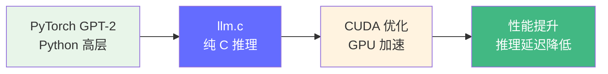
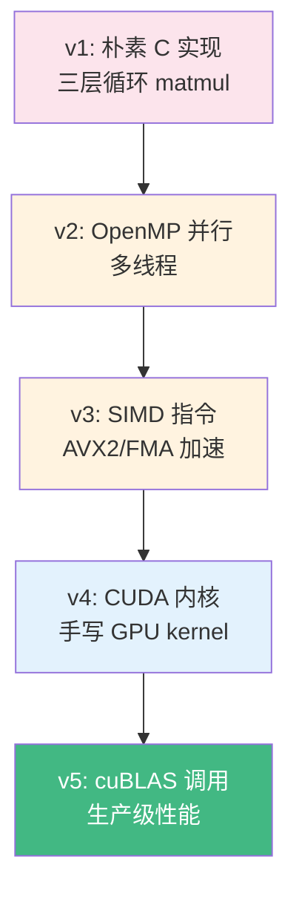

# llm.c 深度解读

> Karpathy 的 llm.c 用纯 C 语言实现了 GPT-2 的推理和训练，展示了从高层 Python 到底层 C 的完整映射过程。它让你理解推理引擎的物理执行过程。

**GitHub**: https://github.com/karpathy/llm.c

## 前置知识

- [GPU 基础](/03-gpu-basics/gpu-overview/) — 了解 GPU 的计算特性
- [nanoGPT 解读](./nanogpt.md) — 理解 Python 侧的参考实现

## 项目定位

llm.c 解决一个核心问题：**从 Python 的 PyTorch 代码到 C 语言的推理引擎，到底发生了什么变化？**



**从 nanoGPT 到 llm.c 的映射关系**：

| Python (nanoGPT) | C 语言 (llm.c) | 变化 |
|-----------------|---------------|------|
| `nn.Linear` | 手动分配权重矩阵 + `matmul()` | 框架依赖 → 手动实现 |
| `F.softmax` | 手动实现 exp + 归一化 | 内置函数 → 手写数学 |
| `torch.matmul` | 三层循环矩阵乘法 | GPU 加速 → CPU 标量 |
| `torch.Tensor` | `float*` 数组 | 高级类型 → 原始内存 |
| `nn.LayerNorm` | 手写均值方差计算 | 框架算子 → 逐元素操作 |

## 完整项目文件树

```
llm.c/
├── train_gpt2.c        # 纯 C 训练（朴素版本）
├── run.c               # 纯 C 推理
├── runq.c              # 量化推理（INT8）
├── train_gpt2cu.c      # CUDA 训练
├── runcu.c             # CUDA 推理
├── doc/
│   └── train_gpt2/     # 训练教程
├── test_gpt2.c         # 测试
└── Makefile            # 编译配置
```

## 逐文件源码解读

### 1. 数据结构定义 — 模型的内存布局

```c
// 所有浮点数统一用 float（对应 PyTorch 的 FP32）
typedef struct {
    // 超参数
    int max_seq_len;    // 最大序列长度
    int vocab_size;     // 词表大小
    int num_layers;     // Transformer 层数
    int num_heads;      // 注意力头数
    int channels;       // 嵌入维度

    // 权重参数（扁平化为一维数组）
    // token 和位置嵌入: [vocab_size, channels] + [max_seq_len, channels]
    float* wte;         // Word Token Embedding
    float* wpe;         // Word Position Embedding

    // 每层的权重（扁平存储）
    float* ln1w;        // LayerNorm 1 权重 [num_layers, channels]
    float* ln1b;        // LayerNorm 1 偏置
    float* qkvw;        // QKV 合并权重 [num_layers, 3*channels, channels]
    float* qkvb;        // QKV 合并偏置
    float* attprojw;    // Attention 投影权重
    float* attprojb;    // Attention 投影偏置
    float* ln2w;        // LayerNorm 2 权重
    float* ln2b;        // LayerNorm 2 偏置
    float* fcw;         // MLP 第一层权重 [num_layers, 4*channels, channels]
    float* fcb;         // MLP 第一层偏置
    float* fcprojw;     // MLP 投影权重
    float* fcprojb;     // MLP 投影偏置

    // 最终 LayerNorm
    float* lnfw;
    float* lnfb;

    // 分类头（语言模型头）
    float* cls_w;       // 通常和 wte 共享
    float* cls_b;       // [vocab_size]
} ParameterGroup;
```

**关键设计**：所有张量都扁平化为一维 `float*` 数组。多维访问通过手动计算索引实现，例如 `matrix[row * cols + col]` 访问二维矩阵。

### 2. 矩阵乘法 — 推理的瓶颈操作

```c
// 最朴素的三层循环矩阵乘法: C = A @ B
// A: [BT, BC], B: [BC, OC], C: [BT, OC]
// BT = batch * time, BC = in_channels, OC = out_channels
void matmul_forward(float* C, const float* A, const float* B,
                    int BT, int OC, int BC) {
    for (int b = 0; b < BT; b++) {
        for (int o = 0; o < OC; o++) {
            float val = 0.0f;
            for (int i = 0; i < BC; i++) {
                // A 按行访问, B 按列访问
                val += A[b * BC + i] * B[i * OC + o];
            }
            C[b * OC + o] = val;
        }
    }
}
```

**为什么这段代码很重要**：
- Transformer 中 90%+ 的计算量来自矩阵乘法
- PyTorch 的 `matmul` 底层调用的是 cuBLAS（CUDA BLAS）
- 朴素版本的 B 是按列访问的，缓存不友好。优化版需要转置 B 再计算

**性能优化路径**：

```c
// ===== 优化 1: 转置 B 矩阵，变列访问为行访问 =====
// 转置后: B_T[o * BC + i] = B[i * OC + o]
// 现在两个矩阵都是行优先访问，缓存命中率大幅提升
void matmul_forward_opt1(float* C, const float* A, const float* B,
                         int BT, int OC, int BC) {
    // 先转置 B
    float* B_T = (float*)malloc(BC * OC * sizeof(float));
    for (int i = 0; i < BC; i++) {
        for (int o = 0; o < OC; o++) {
            B_T[o * BC + i] = B[i * OC + o];
        }
    }

    // 现在 A 和 B_T 都是行优先
    for (int b = 0; b < BT; b++) {
        for (int o = 0; o < OC; o++) {
            float val = 0.0f;
            for (int i = 0; i < BC; i++) {
                val += A[b * BC + i] * B_T[o * BC + i];  // 都是行访问!
            }
            C[b * OC + o] = val;
        }
    }
    free(B_T);
}
```

### 3. LayerNorm — 手写归一化

```c
// LayerNorm: 对输入的最后一个维度做归一化
// 公式: y = (x - mean) / sqrt(variance + eps) * weight + bias
void layernorm_forward(float* out, float* mean, float* rstd,
                       const float* inp, const float* weight, const float* bias,
                       int B, int T, int C) {
    float eps = 1e-5f;  // 防止除零

    for (int b = 0; b < B; b++) {
        for (int t = 0; t < T; t++) {
            // 1. 计算均值
            float sum = 0.0f;
            const float* x = inp + b * T * C + t * C;  // 指向当前 token
            for (int i = 0; i < C; i++) {
                sum += x[i];
            }
            float m = sum / C;

            // 2. 计算方差
            float var = 0.0f;
            for (int i = 0; i < C; i++) {
                float diff = x[i] - m;
                var += diff * diff;
            }
            var /= C;

            // 3. 计算逆标准差（避免后续重复计算除法）
            float invstd = 1.0f / sqrtf(var + eps);

            // 4. 归一化 + 缩放 + 偏置
            float* y = out + b * T * C + t * C;
            for (int i = 0; i < C; i++) {
                y[i] = weight[i] * ((x[i] - m) * invstd) + bias[i];
            }

            // 保存均值和逆标准差（反向传播时用）
            if (mean) mean[b * T + t] = m;
            if (rstd) rstd[b * T + t] = invstd;
        }
    }
}
```

**对比 PyTorch**：`torch.nn.LayerNorm(C)` 一行就搞定的事情，在 C 语言中需要手写均值、方差、归一化、缩放、偏置五步。但理解这个过程对于调试推理引擎至关重要。

### 4. 注意力机制的完整 C 实现

```c
// 注意力前向传播
// out: 输出 [B, T, C]
// att: attention 权重 [B, T, T]（用于调试/可视化）
// Q, K, V: 已计算的查询、键、值 [B, T, C]
void attention_forward(float* out, float* att,
                       const float* Q, const float* K, const float* V,
                       int B, int T, int C, int NH) {
    int C3 = C * 3;
    float scale = 1.0f / sqrtf((float)(C / NH));  // 1/sqrt(d_k)

    for (int b = 0; b < B; b++) {
        for (int t = 0; t < T; t++) {
            // ===== 步骤 1: 计算 Q @ K^T =====
            // 对于当前 token t，计算它与所有 t2 <= t 的注意力分数
            for (int t2 = 0; t2 <= t; t2++) {  // Causal: 只看 t2 <= t
                float val = 0.0f;

                // 对每个注意力头，计算点积
                for (int h = 0; h < NH; h++) {
                    float* q = (float*)Q + b*T*C + t*C + h*(C/NH);
                    float* k = (float*)K + b*T*C + t2*C + h*(C/NH);

                    for (int i = 0; i < C / NH; i++) {
                        val += q[i] * k[i];
                    }
                }
                val *= scale;  // 缩放

                // 存储到 attention 矩阵
                att[b*T*T + t*T + t2] = val;
            }

            // ===== 步骤 2: Softmax 归一化 =====
            // 2a. 找最大值（防止 exp 溢出）
            float maxval = -INFINITY;
            for (int t2 = 0; t2 <= t; t2++) {
                maxval = fmaxf(maxval, att[b*T*T + t*T + t2]);
            }

            // 2b. exp(x - maxval) 并求和
            float sum = 0.0f;
            for (int t2 = 0; t2 <= t; t2++) {
                float e = expf(att[b*T*T + t*T + t2] - maxval);
                att[b*T*T + t*T + t2] = e;
                sum += e;
            }

            // 2c. 归一化
            for (int t2 = 0; t2 <= t; t2++) {
                att[b*T*T + t*T + t2] /= sum;
            }

            // ===== 步骤 3: Attention @ V =====
            // 用注意力权重加权求和 V
            for (int i = 0; i < C; i++) {
                float val = 0.0f;
                for (int t2 = 0; t2 <= t; t2++) {
                    float* v = (float*)V + b*T*C + t2*C;
                    val += att[b*T*T + t*T + t2] * v[i];
                }
                out[b*T*C + t*C + i] = val;
            }
        }
    }
}
```

**与 [nanoGPT](./nanogpt.md) 的逐行对比**：

```
nanoGPT (Python/PyTorch):               llm.c (C):
──────────────────────────────────     ────────────────────────────────
q, k, v = c_attn(x).split(C, dim=2)    // QKV 已在前面通过 matmul 计算
q = q.view(B,T,nh,hs).transpose(1,2)   // 通过指针偏移访问不同 head
att = (q @ k.transpose(-2,-1))         // 三重循环计算点积
att = att * (1.0 / sqrt(hs))           // scale = 1/sqrt(hs), val *= scale
att = att.masked_fill(mask, -inf)      // 循环边界 t2 <= t 隐式实现
att = F.softmax(att, dim=-1)           // 手动: max -> exp -> sum -> normalize
y = att @ v                            // 加权求和循环
y = y.transpose(1,2).contiguous()      // 输出按 head 累加到 out 数组
y = c_proj(y)                          // 再通过一次 matmul
```

### 5. 残差连接 — 完整的 Transformer Block 前向

```c
// 完整的 Transformer Block 前向传播（对应 nanoGPT 的 Block.forward）
void transformer_forward(const Transformer* model, const float* inp,
                         float* out, int B, int T) {
    // 分配中间缓冲区
    float* residual = (float*)malloc(B * T * C * sizeof(float));
    float* ln_out   = (float*)malloc(B * T * C * sizeof(float));
    float* qkv      = (float*)malloc(B * T * C * 3 * sizeof(float));
    float* att_out  = (float*)malloc(B * T * C * sizeof(float));
    float* mlp_out  = (float*)malloc(B * T * C * sizeof(float));

    for (int l = 0; l < model->num_layers; l++) {
        // ===== 第一步: 残差 + LayerNorm 1 =====
        memcpy(residual, inp, B * T * C * sizeof(float));  // 保存残差
        layernorm_forward(ln_out, NULL, NULL, inp,
                         model->ln1w + l*C, model->ln1b + l*C,
                         B, T, C);

        // ===== 第二步: QKV + Attention =====
        // QKV 合并计算: [B,T,C] @ [3C,C]^T = [B,T,3C]
        matmul_forward(qkv, ln_out, model->qkvw + l*3*C*C, B*T, 3*C, C);

        // Attention 计算（见上面的 attention_forward）
        attention_forward(att_out, NULL, qkv, qkv+C, qkv+2*C, B, T, C, NH);

        // ===== 第三步: Attention 输出投影 =====
        float* att_proj_out = (float*)malloc(B * T * C * sizeof(float));
        matmul_forward(att_proj_out, att_out,
                      model->attprojw + l*C*C, B*T, C, C);

        // ===== 第四步: 残差连接 =====
        for (int i = 0; i < B * T * C; i++) {
            out[i] = residual[i] + att_proj_out[i];
        }

        // ===== 第五步: 残差 + LayerNorm 2 =====
        memcpy(residual, out, B * T * C * sizeof(float));  // 保存残差
        layernorm_forward(ln_out, NULL, NULL, out,
                         model->ln2w + l*C, model->ln2b + l*C,
                         B, T, C);

        // ===== 第六步: MLP =====
        // MLP 第一层: [B,T,C] @ [4C,C]^T = [B,T,4C]
        float* mlp_hidden = (float*)malloc(B * T * 4*C * sizeof(float));
        matmul_forward(mlp_hidden, ln_out,
                      model->fcw + l*4*C*C, B*T, 4*C, C);

        // GELU 激活: GELU(x) ≈ 0.5 * x * (1 + tanh(sqrt(2/pi) * (x + 0.044715 * x^3)))
        for (int i = 0; i < B * T * 4 * C; i++) {
            float x = mlp_hidden[i];
            mlp_hidden[i] = 0.5f * x * (1.0f + tanhf(0.7978845608f * (x + 0.044715f * x * x * x)));
        }

        // MLP 投影层: [B,T,4C] @ [C,4C]^T = [B,T,C]
        matmul_forward(mlp_out, mlp_hidden,
                      model->fcprojw + l*C*4*C, B*T, C, 4*C);

        // ===== 第七步: 残差连接 =====
        for (int i = 0; i < B * T * C; i++) {
            out[i] = residual[i] + mlp_out[i];
        }

        free(att_proj_out);
        free(mlp_hidden);
    }

    free(residual);
    free(ln_out);
    free(qkv);
    free(att_out);
    free(mlp_out);
}
```

### 6. 权重加载 — 从 .bin 文件读取

```c
// 从二进制文件加载预训练权重
void model_init(Transformer* model, const char* checkpoint_path) {
    FILE* file = fopen(checkpoint_path, "rb");
    if (!file) {
        fprintf(stderr, "无法打开权重文件: %s\n", checkpoint_path);
        exit(1);
    }

    int model_index;
    int header_size = 256;  // 文件头大小

    // 1. 读取模型配置
    fread(&model->max_seq_len, sizeof(int), 1, file);
    fread(&model->vocab_size, sizeof(int), 1, file);
    fread(&model->num_layers, sizeof(int), 1, file);
    fread(&model->num_heads, sizeof(int), 1, file);
    fread(&model->channels, sizeof(int), 1, file);

    // 2. 跳过文件头剩余部分
    fseek(file, header_size, SEEK_SET);

    // 3. 读取 token 嵌入和位置嵌入
    // wte: [vocab_size, channels]
    model->wte = (float*)malloc(model->vocab_size * model->channels * sizeof(float));
    fread(model->wte, sizeof(float), model->vocab_size * model->channels, file);

    // wpe: [max_seq_len, channels]
    model->wpe = (float*)malloc(model->max_seq_len * model->channels * sizeof(float));
    fread(model->wpe, sizeof(float), model->max_seq_len * model->channels, file);

    // 4. 读取每层权重
    // 每层包含: ln1w, ln1b, qkvw, qkvb, attprojw, attprojb, ln2w, ln2b, fcw, fcb, fcprojw, fcprojb
    // 总共约 12 组权重 / 层
    int num_params = 0;
    num_params += model->vocab_size * model->channels;          // wte
    num_params += model->max_seq_len * model->channels;         // wpe
    for (int l = 0; l < model->num_layers; l++) {
        num_params += model->channels;                          // ln1w
        num_params += model->channels;                          // ln1b
        num_params += 3 * model->channels * model->channels;    // qkvw
        // ... 更多权重
    }

    // 5. 分配内存并读取
    model->memory = (float*)malloc(num_params * sizeof(float));
    // ... 逐步分配和读取

    fclose(file);
}
```

**权重文件格式**：
```
[offset 0-255: file header]
  - model config (5 ints): max_seq_len, vocab_size, num_layers, num_heads, channels
[offset 256+: weight data]
  - wte: vocab_size * channels floats
  - wpe: max_seq_len * channels floats
  - for each layer:
    - ln1w, ln1b, qkvw, qkvb, attprojw, attprojb
    - ln2w, ln2b, fcw, fcb, fcprojw, fcprojb
  - lnfw, lnfb
  - cls_b
```

### 7. 推理主循环

```c
// run.c 的核心推理循环
int main(int argc, char* argv[]) {
    // 1. 加载模型
    Transformer transformer;
    model_init(&transformer, argv[1]);

    // 2. 初始化输入
    int* tokens = (int*)malloc(T * sizeof(int));
    tokens[0] = start_token;  // 起始 token

    // 3. 自回归生成
    for (int t = 1; t < T; t++) {
        // 前向传播
        float* logits;
        transformer_forward(&transformer, tokens, &logits, 1, t);

        // 取最后一个位置的 logits
        float* last_logits = logits + (t-1) * transformer.vocab_size;

        // 采样下一个 token（贪婪或温度采样）
        int next_token = sample_argmax(last_logits, transformer.vocab_size);
        tokens[t] = next_token;

        printf("%s", decode_token(next_token));
    }

    // 4. 清理
    model_free(&transformer);
    free(tokens);
}
```

## 优化路径：从朴素到高效



| 版本 | 优化手段 | 性能提升 | 适用场景 |
|------|---------|---------|---------|
| v1 朴素 C | 三层循环 | 基准 | 教学 |
| v2 OpenMP | 多线程并行 | 4-8x | 多核 CPU |
| v3 SIMD | AVX2/FMA 向量指令 | 2-4x | 现代 CPU |
| v4 CUDA | 手写 GPU kernel | 10-50x | NVIDIA GPU |
| v5 cuBLAS | 调用厂商优化库 | 最优 | 生产环境 |

## 代码量统计

| 文件 | 代码行数 | 职责 |
|------|---------|------|
| `train_gpt2.c` | ~1,200 行 | 训练（朴素 C） |
| `train_gpt2cu.c` | ~2,000 行 | 训练（CUDA 优化） |
| `run.c` | ~800 行 | 推理（朴素 C） |
| `runq.c` | ~1,500 行 | 推理（量化版本） |

## 面试视角

| 面试官问题 | llm.c 对应的答案 |
|-----------|-------------------|
| "推理引擎的底层计算是什么？" | 90%+ 是矩阵乘法，其余是 LayerNorm、Softmax、GELU |
| "为什么需要 CUDA 优化？" | 朴素 C 的 matmul 太慢，GPU 并行计算可以快 50x |
| "量化在底层是怎么做的？" | FP32 → INT8，权重提前量化，推理时用 INT8 计算 |
| "CPU 推理和 GPU 推理的差异？" | CPU 靠 SIMD + 多线程，GPU 靠数千核心并行 |

## 延伸阅读

- 读完 llm.c 后，可以看 [llama.cpp](./llama-cpp.md) 了解更完善的 C++ 推理引擎
- 再看 [vLLM](./vllm.md) 理解现代推理引擎如何优化显存和调度

---

*上一节：[nanoGPT](./nanogpt.md) | 下一节：[llama.cpp](./llama-cpp.md)*
