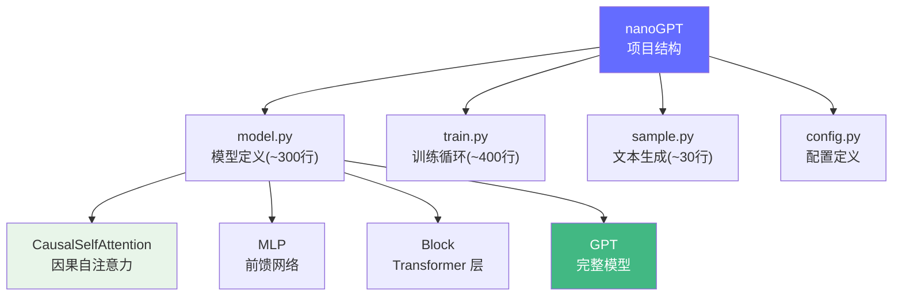

# nanoGPT 深度解读

> Karpathy 的 nanoGPT 是最精简的 GPT 实现，核心模型定义 `model.py` 不到 300 行就能跑通训练和推理。它是理解 Transformer 核心组件是如何用代码表达的最佳入门材料。

**GitHub**: https://github.com/karpathy/nanoGPT

## 前置知识

- [Transformer 概述](/02-model-architecture/transformer-overview/) — 了解模型架构
- [Attention 机制](/02-model-architecture/attention-mechanism/) — 理解 Self-Attention 的计算过程

## 项目定位

nanoGPT 不是用来生产的，它是 **教学工具**。它用最少的代码实现了一个完整的 GPT 训练和推理流程，让你能看到 Transformer 的每个组件是如何用代码表达的。



## 完整项目文件树

```
nanoGPT/
├── model.py          # GPT 模型定义（核心）
├── train.py          # 训练循环
├── sample.py         # 文本生成
├── config/
│   ├── train_shakespeare_char.py  # 字符级训练配置
│   └── eval_shakespeare_char.py   # 评估配置
├── data/
│   └── shakespeare_char/          # 数据集
├── out-shakespeare-char/          # 训练输出目录
└── train_base.sh     # 训练脚本
```

## 逐文件源码解读

### 1. config.py — 配置定义

nanoGPT 用一个 `dataclass` 定义所有超参数，这是 GPTConfig：

```python
@dataclass
class GPTConfig:
    block_size: int = 1024   # 最大序列长度（上下文窗口）
    vocab_size: int = 50304  # 词表大小（GPT-2 用的是 50257，对齐到 64 的倍数加速计算）
    n_layer: int = 12        # Transformer 层数
    n_head: int = 12         # 注意力头数
    n_embd: int = 768        # 嵌入维度
    dropout: float = 0.0     # dropout 比例
    bias: bool = False       # LayerNorm 和线性层是否用 bias（GPT-2 不用 bias）
```

**面试考点**：为什么 `vocab_size` 对齐到 64 的倍数？这是因为 GPU 的 Tensor Core 在处理 64 的倍数时效率最高。GPT-2 实际词表是 50257，但填充到 50304 = 50257 + 47。

### 2. CausalSelfAttention — 核心组件逐行解读

这是整个项目最关键的部分，完整实现了 QKV 计算：

```python
import torch
import torch.nn as nn
import torch.nn.functional as F
import math

class CausalSelfAttention(nn.Module):

    def __init__(self, config):
        super().__init__()
        assert config.n_embd % config.n_head == 0  # 嵌入维度必须能被头数整除

        # 关键：用一个 Linear 同时生成 Q, K, V
        # 输入: n_embd, 输出: 3 * n_embd
        # 等价于三个独立的 Linear(n_embd, n_embd)，但参数合并了
        self.c_attn = nn.Linear(config.n_embd, 3 * config.n_embd, bias=config.bias)

        # 输出投影: 把多头 attention 的结果投影回 n_embd
        self.c_proj = nn.Linear(config.n_embd, config.n_embd, bias=config.bias)

        # Dropout
        self.attn_dropout = nn.Dropout(config.dropout)
        self.resid_dropout = nn.Dropout(config.dropout)

        # 关键属性
        self.n_head = config.n_head
        self.n_embd = config.n_embd
        self.dropout = config.dropout

        # 注册 causal mask buffer（不会被梯度更新）
        # 这是一个下三角矩阵，用于阻止 token 看到右边的内容
        self.register_buffer(
            "bias",
            torch.tril(torch.ones(config.block_size, config.block_size))
                .view(1, 1, config.block_size, config.block_size)
        )

    def forward(self, x):
        # x 的形状: (B, T, C) = (batch, 序列长度, 嵌入维度)
        B, T, C = x.size()

        # ===== 第一步: 生成 Q, K, V =====
        # self.c_attn(x) 输出形状: (B, T, 3C)
        # 例如 C=768, 输出就是 (B, T, 2304)
        qkv = self.c_attn(x)

        # split 将 3C 拆成三个 C
        # q, k, v 每个的形状都是 (B, T, C)
        q, k, v = qkv.split(self.n_embd, dim=2)

        # ===== 第二步: 多头 reshape =====
        # 将 (B, T, C) 变成 (B, n_head, T, head_size)
        # head_size = C // n_head = 768 // 12 = 64
        # 注意 transpose(1, 2) 是关键：把 T 和 n_head 的位置交换
        # 这样每个头的计算才是独立的
        q = q.view(B, T, self.n_head, C // self.n_head).transpose(1, 2)
        k = k.view(B, T, self.n_head, C // self.n_head).transpose(1, 2)
        v = v.view(B, T, self.n_head, C // self.n_head).transpose(1, 2)

        # ===== 第三步: 计算 Attention 分数 =====
        # Q @ K^T: (B, nh, T, hs) @ (B, nh, hs, T) -> (B, nh, T, T)
        # 每个 token 和其他所有 token 计算相似度
        att = (q @ k.transpose(-2, -1)) * (1.0 / math.sqrt(k.size(-1)))

        # ===== 第四步: 应用 Causal Mask =====
        # mask 为 0 的位置设为 -inf，这样 softmax 后这些位置权重为 0
        att = att.masked_fill(self.bias[:, :, :T, :T] == 0, float('-inf'))

        # ===== 第五步: Softmax =====
        # 对每个 token 的所有注意力分数做归一化
        att = F.softmax(att, dim=-1)
        att = self.attn_dropout(att)

        # ===== 第六步: 加权求和 =====
        # (B, nh, T, T) @ (B, nh, T, hs) -> (B, nh, T, hs)
        y = att @ v

        # ===== 第七步: 合并多头 =====
        # transpose 变回 (B, T, nh, hs)
        # contiguous() 确保内存连续，然后 view 成 (B, T, C)
        y = y.transpose(1, 2).contiguous().view(B, T, C)

        # ===== 第八步: 输出投影 =====
        y = self.resid_dropout(self.c_proj(y))
        return y
```

**维度追踪示例**（GPT-2 Small, batch=2, 序列长度=10）：

```
输入 x:              (2, 10, 768)
c_attn 输出:         (2, 10, 2304)  # 3 * 768
q, k, v 各自:        (2, 10, 768)
多头 reshape 后:     (2, 12, 10, 64)  # (B, nh, T, hs)
Q @ K^T:             (2, 12, 10, 10)  # attention 矩阵
softmax 后 @ V:      (2, 12, 10, 64)
合并后:              (2, 10, 768)
c_proj 输出:         (2, 10, 768)
```

**面试考点**：
- `contiguous()` 为什么必要？`transpose` 不改变底层数据，只改变 stride。`view` 要求内存连续，所以需要先 `contiguous()`。
- 为什么用 `1.0 / sqrt(head_size)` 缩放？防止点积过大导致 softmax 梯度消失。

### 3. MLP（前馈网络）

```python
class MLP(nn.Module):
    def __init__(self, config):
        super().__init__()
        # 第一个线性层: 768 -> 4 * 768 = 3072（扩展 4 倍）
        self.c_fc    = nn.Linear(config.n_embd, 4 * config.n_embd, bias=config.bias)
        # 投影层: 3072 -> 768（压缩回来）
        self.c_proj  = nn.Linear(4 * config.n_embd, config.n_embd, bias=config.bias)
        self.dropout = nn.Dropout(config.dropout)

    def forward(self, x):
        # GELU 激活函数: 比 ReLU 更平滑
        # GELU(x) = x * Φ(x)，其中 Φ 是标准正态分布的 CDF
        x = self.c_fc(x)
        x = F.gelu(x)
        x = self.c_proj(x)
        x = self.dropout(x)
        return x
```

**为什么 FFN 是 4 倍？** 这是经验公式。Transformer 论文发现 4 倍给模型足够的"中间表示空间"。太小会导致信息瓶颈，太大则增加计算量但收益递减。

### 4. Block（单层 Transformer）

```python
class Block(nn.Module):
    def __init__(self, config):
        super().__init__()
        # Pre-Norm: LayerNorm 在 Attention/MLP 之前
        self.ln_1 = nn.LayerNorm(config.n_embd, bias=config.bias)
        self.attn = CausalSelfAttention(config)
        self.ln_2 = nn.LayerNorm(config.n_embd, bias=config.bias)
        self.mlp = MLP(config)

    def forward(self, x):
        # 残差连接: x = x + attn(ln_1(x))
        x = x + self.attn(self.ln_1(x))
        # 残差连接: x = x + mlp(ln_2(x))
        x = x + self.mlp(self.ln_2(x))
        return x
```

**Pre-Norm vs Post-Norm**：
- Pre-Norm（nanoGPT 用）：`x + attn(LN(x))` — 训练更稳定，适合深层网络
- Post-Norm（原始 Transformer）：`LN(x + attn(x))` — 表达能力更强但训练不稳定

### 5. GPT — 完整模型

```python
class GPT(nn.Module):
    def __init__(self, config):
        super().__init__()
        assert config.vocab_size is not None
        assert config.block_size is not None
        self.config = config

        self.transformer = nn.ModuleDict(dict(
            # Token 嵌入表: 将 token ID 映射为向量
            # 输入: ID (0~50303), 输出: 768 维向量
            wte = nn.Embedding(config.vocab_size, config.n_embd),
            # 位置嵌入表: 将位置 ID 映射为向量
            # 输入: 位置 (0~1023), 输出: 768 维向量
            wpe = nn.Embedding(config.block_size, config.n_embd),
            # Dropout
            drop = nn.Dropout(config.dropout),
            # Transformer 层列表
            h = nn.ModuleList([Block(config) for _ in range(config.n_layer)]),
            # 最终 LayerNorm
            ln_f = nn.LayerNorm(config.n_embd, bias=config.bias),
        ))

        # 语言模型头: 将 768 维向量映射回词表
        # 注意: 和 wte 共享权重（参数绑定），这是 GPT-2 的设计
        self.lm_head = nn.Linear(config.n_embd, config.vocab_size, bias=False)

        # 权重初始化
        self.apply(self._init_weights)

        # 残差连接的缩放: 每层除以 sqrt(2 * n_layer)
        # 这是为了稳定深层网络的训练
        for pn, p in self.named_parameters():
            if pn.endswith('c_proj.weight'):
                torch.nn.init.normal_(p, mean=0.0, std=0.02 / math.sqrt(2 * config.n_layer))

    def forward(self, idx, targets=None):
        """
        Args:
            idx: 输入 token IDs, 形状 (B, T)
            targets: 目标 token IDs（训练时用）, 形状 (B, T)

        Returns:
            logits: 模型输出, 形状 (B, T, vocab_size)
            loss: 交叉熵损失（如果 targets 不为 None）
        """
        b, t = idx.size()
        assert t <= self.config.block_size, f"序列太长: {t} > {self.config.block_size}"

        # ===== 第一步: 嵌入 =====
        # wte: (B, T) -> (B, T, 768)
        # wpe: 用 arange 生成位置 [0,1,...,t-1] -> (t, 768)
        # 广播相加: (B, T, 768) + (t, 768) -> (B, T, 768)
        tok_emb = self.transformer.wte(idx)
        pos_emb = self.transformer.wpe(torch.arange(t, device=idx.device))
        x = self.transformer.drop(tok_emb + pos_emb)

        # ===== 第二步: 多层 Transformer =====
        # 逐层通过 Block
        for block in self.transformer.h:
            x = block(x)

        # ===== 第三步: 最终 LayerNorm =====
        x = self.transformer.ln_f(x)

        # ===== 第四步: 输出 logits =====
        # lm_head: (B, T, 768) -> (B, T, 50304)
        logits = self.lm_head(x)

        # ===== 第五步: 计算损失（训练时）=====
        loss = None
        if targets is not None:
            # 交叉熵损失需要 (B*T, C) 和 (B*T,) 的形状
            loss = F.cross_entropy(
                logits.view(-1, logits.size(-1)),  # (B*T, 50304)
                targets.view(-1),                   # (B*T,)
                ignore_index=-1
            )
        return logits, loss
```

**权重共享**：`lm_head` 和 `wte` 共享权重。这是因为输入嵌入和输出投影本质上是同一个映射的逆变换。这可以减少参数量并提升泛化。

### 6. train.py — 训练循环核心

```python
# ===== 数据加载 =====
def get_batch(split):
    """从数据文件中随机采样一个 batch"""
    data = train_data if split == 'train' else val_data
    # 随机选择起始位置
    ix = torch.randint(len(data) - config.block_size, (batch_size,))
    # 每个 sample 取 block_size 个连续 token
    x = torch.stack([torch.tensor(data[i:i+config.block_size].tolist(), dtype=torch.long)
                     for i in ix])
    y = torch.stack([torch.tensor(data[i+1:i+1+config.block_size].tolist(), dtype=torch.long)
                     for i in ix])  # y 是 x 向右偏移一位（预测下一个 token）
    return x, y

# ===== 训练循环 =====
for step in range(max_iters):
    # 1. 获取 batch
    X, Y = get_batch('train')
    X, Y = X.to(device), Y.to(device)

    # 2. 前向传播
    ctx = nullcontext()  # 训练时不用 no_grad
    with ctx:
        logits, loss = model(X, Y)

    # 3. 反向传播
    scaler.scale(loss).backward()  # 混合精度训练

    # 4. 梯度裁剪（防止梯度爆炸）
    scaler.unscale_(optimizer)
    torch.nn.utils.clip_grad_norm_(model.parameters(), max_norm=1.0)

    # 5. 更新参数
    scaler.step(optimizer)
    scaler.update()
    optimizer.zero_grad(set_to_none=True)
```

**关键训练技巧**：
- **梯度累积**：当 GPU 显存不够大 batch 时，可以多次 `backward()` 后再 `step()`
- **学习率预热**：前 `lr_decay_iters` 步用 cosine 衰减，从 0 升到峰值再降回 0
- **混合精度训练**：用 `torch.cuda.amp` 同时使用 FP16 和 FP32

### 7. sample.py — 文本生成

```python
@torch.no_grad()
def sample(model, x, max_new_tokens, temperature=1.0, top_k=None):
    """自回归生成"""
    for _ in range(max_new_tokens):
        # 只取最后 block_size 个 token（上下文窗口限制）
        x_cond = x if x.size(1) <= config.block_size else x[:, -config.block_size:]

        # 前向传播得到 logits
        logits, _ = model(x_cond)

        # 取最后一个位置的 logits
        logits = logits[:, -1, :] / temperature

        # Top-k 采样: 只保留概率最高的 k 个 token
        if top_k is not None:
            v, _ = torch.topk(logits, min(top_k, logits.size(-1)))
            logits[logits < v[:, [-1]]] = -float('Inf')

        # Softmax + 采样
        probs = F.softmax(logits, dim=-1)
        idx_next = torch.multinomial(probs, num_samples=1)

        # 拼接到输入
        x = torch.cat((x, idx_next), dim=1)
    return x
```

## 代码量统计

| 文件 | 代码行数 | 职责 |
|------|---------|------|
| `model.py` | ~300 行 | GPT 模型定义（Attention + MLP + Block + GPT） |
| `train.py` | ~400 行 | 训练循环、学习率调度、Checkpoint、评估 |
| `sample.py` | ~30 行 | 文本生成（自回归采样） |
| `config/` | ~50 行 | 超参数配置 |

## 面试视角

| 面试官问题 | nanoGPT 对应的答案 |
|-----------|-------------------|
| "Transformer 的核心计算是什么？" | Q @ K^T / sqrt(d_k)，然后 softmax @ V |
| "为什么需要 Causal Mask？" | 保证自回归生成不依赖未来 token |
| "Pre-Norm 和 Post-Norm 的区别？" | nanoGPT 用 Pre-Norm（先 LN 再计算），训练更稳定 |
| "多头 Attention 怎么实现的？" | 拆分维度 + transpose 实现并行计算，每个头独立 |
| "GPT 的 FFN 为什么是 4 倍扩展？" | 经验公式，给模型足够的中间表示空间 |
| "为什么 lm_head 和 wte 共享权重？" | 输入嵌入和输出投影是同一映射的逆变换，减少参数 |
| "top-k 采样的作用？" | 限制生成范围，避免低质量 token，比纯贪婪/纯随机更好 |

## 延伸阅读

- 读完 nanoGPT 后，可以对比 [GPT-2 架构](/02-model-architecture/transformer-overview/) 看看工业级实现多了哪些组件（Rotary Embedding、Flash Attention 等）
- 再看 [llm.c](./llm-c.md) 理解同样的架构如何用 C 语言实现

---

*上一节：[开源项目解读总览](./index.md) | 下一节：[llm.c 纯 C 实现](./llm-c.md)*
