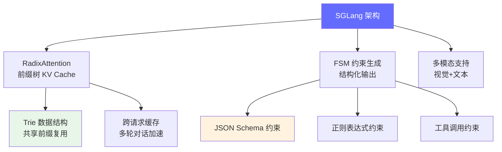

# SGLang 深度解读

> SGLang 是专注于结构化生成的推理引擎，通过 RadixAttention（前缀树 KV Cache 管理）实现了多轮对话和函数调用场景下的极致性能。

**GitHub**: https://github.com/sgl-project/sglang

## 前置知识

- [vLLM 深度解读](./vllm.md) — 理解 PagedAttention 和 Continuous Batching
- [KV Cache 详解](/02-model-architecture/kv-cache/) — 理解 KV Cache 的工作原理

## 项目定位

vLLM 优化的是 **通用推理吞吐**，SGLang 优化的是 **结构化生成**（JSON、函数调用、多轮对话）。



## 完整项目文件树

```
sglang/
├── python/
│   ├── sglang/
│   │   ├── srt/                    # SRT (SGLang Runtime)
│   │   │   ├── man/agers/
│   │   │   │   ├── scheduler.py        # 调度器 (~800行)
│   │   │   │   ├── tp_worker.py        # Tensor Parallel Worker
│   │   │   │   └── cache_manager.py    # 缓存管理
│   │   │   ├── mem_cache/
│   │   │   │   ├── radix_cache.py      # RadixAttention Trie (~600行)
│   │   │   │   └── req_to_token_pool.py # 请求到 token 的映射
│   │   │   ├── constrained_decoding/   # 约束生成
│   │   │   │   ├── fsm_cache.py        # FSM 缓存
│   │   │   │   └── grammar.py          # 语法解析
│   │   │   ├── layers/                 # 模型层
│   │   │   │   ├── linear.py           # 线性层
│   │   │   │   ├── attention.py        # Attention + RadixAttention
│   │   │   │   └── sampler.py          # 采样器
│   │   │   ├── model_executor/         # 模型执行
│   │   │   │   └── model_runner.py     # 模型 Runner
│   │   │   └── server.py               # HTTP 服务
│   │   ├── lang/                   # SGLang 语言
│   │   │   ├── interpreter.py          # 语言解释器 (~500行)
│   │   │   ├── choices.py              # 选择结构
│   │   │   └── functions.py            # 函数调用
│   │   └── test/
│   ├── pyproject.toml
│   └── setup.py
├── test/
└── benchmark/
```

## 核心架构

```
请求处理流程:
┌─────────────────────────────────────────────────┐
│ SGLang API (HTTP / Python SDK)                    │
│   /v1/chat/completions                             │
├─────────────────────────────────────────────────┤
│ SRT Scheduler                                      │
│   1. 请求入队列                                     │
│   2. RadixAttention 匹配前缀                        │
│   3. 构建 batch                                     │
├─────────────────────────────────────────────────┤
│ Model Runner                                       │
│   1. Tokenize                                       │
│   2. 前向传播 (模型推理)                              │
│   3. PagedAttention / RadixAttention 计算            │
├─────────────────────────────────────────────────┤
│ Sampler + FSM Constraint                           │
│   1. 采样 (top-k, top-p, temperature)               │
│   2. FSM 约束生成（如果设置了 JSON/正则约束）           │
│   3. 返回 token                                     │
└─────────────────────────────────────────────────┘
```

## 逐模块源码解读

### 1. RadixCache — 前缀树 KV Cache 管理

RadixAttention 是 SGLang 的核心创新。与 vLLM 的 BlockTable 不同，SGLang 用 **Trie（前缀树）** 管理 KV Cache。

```python
# sglang/srt/mem_cache/radix_cache.py (简化版)

class TreeNode:
    """前缀树中的一个节点

    每个节点代表一个 token，路径从 root 到某节点构成一个 token 序列。
    节点存储了对应的 KV Cache，多个请求可以共享同一个节点的 KV。
    """

    def __init__(self):
        self.children: Dict[int, 'TreeNode'] = {}  # token_id -> child
        self.parent: Optional['TreeNode'] = None
        self.key: Optional[int] = None              # 这个节点的 token ID
        self.value: Optional[Tensor] = None         # KV Cache tensor
        self.ref_counter: int = 0                   # 引用计数（多少请求用了这个节点）

    def prefix_match(self, key: List[int]) -> Tuple[int, 'TreeNode']:
        """在 Trie 中匹配最长公共前缀

        Args:
            key: 要匹配的 token 序列（新请求的 prompt）

        Returns:
            (matched_len, last_node): 匹配长度和最后的节点
        """
        node = self
        matched_len = 0

        for i, token_id in enumerate(key):
            if token_id not in node.children:
                # 找不到匹配的子节点，停止匹配
                break
            node = node.children[token_id]
            matched_len += 1

        return matched_len, node

    def insert(self, key: List[int], value: Tensor) -> None:
        """插入新的 token 序列和对应的 KV Cache

        这通常在推理完成后调用，将生成的 token 及其 KV 缓存存入 Trie。
        """
        node = self
        for token_id in key:
            if token_id not in node.children:
                # 创建新节点
                new_node = TreeNode()
                new_node.key = token_id
                new_node.parent = node
                node.children[token_id] = new_node
                node = new_node
            else:
                node = node.children[token_id]
                node.ref_counter += 1

            # 设置 KV Cache 值
            node.value = value


class RadixCache:
    """RadixAttention 的 KV Cache 管理器

    与 vLLM BlockTable 的核心区别:
    - vLLM: 每个请求独立管理自己的 blocks，不共享
    - SGLang: 所有请求共享同一个 Trie，前缀相同的 token 自动复用 KV

    数据结构:
        Trie 的前缀路径 → token 序列
        Trie 的节点值 → KV Cache

    优势场景:
    1. 多轮对话: 前几轮的 KV 直接复用
    2. 相同 System Prompt: 只计算一次
    3. 函数调用模板: 模板部分 KV 复用
    """

    def __init__(self, disable: bool = False):
        self.reset()

    def reset(self):
        self.root_node = TreeNode()
        self.evictable_size_ = 0  # 可被回收的节点数

    def match_prefix(self, key: List[int]) -> Tuple[List[int], TreeNode]:
        """匹配输入的最长前缀

        返回: (匹配的 token IDs, 匹配到的最后一个节点)
        """
        matched_len, last_node = self.root_node.prefix_match(key)
        matched_tokens = key[:matched_len]
        return matched_tokens, last_node

    def insert(self, key: List[int], value: Optional[Tensor] = None) -> None:
        """将 token 序列和 KV Cache 插入 Trie"""
        self.root_node.insert(key, value)
        self.evictable_size_ += len(key)

    def evict(self, num_tokens: int) -> int:
        """淘汰最少使用的节点，释放显存

        使用 LRU 策略淘汰长时间未被访问的节点。
        """
        # 实现 LRU 淘汰逻辑
        evicted = 0
        # ... 具体实现参考 LRU cache
        return evicted

    def get_retained_size(self) -> int:
        """返回被保留（不可淘汰）的节点数"""
        # ref_counter > 0 的节点表示当前有请求正在使用，不能淘汰
        return self._count_retained(self.root_node)
```

**RadixAttention vs PagedAttention 对比**：

```
场景: 3 个多轮对话请求，共享同一个 system prompt (100 tokens)

vLLM (PagedAttention - Block Table):
请求1: [Block0-6] ← 100 tokens (system) + user1 + assistant1
请求2: [Block7-12] ← 100 tokens (system，重新计算!) + user2 + assistant2
请求3: [Block13-18] ← 100 tokens (system，重新计算!) + user3 + assistant3
KV Cache 总使用: 100*3 + ... = 至少 300 tokens 的 KV

SGLang (RadixAttention - Trie):
root
├── sys_tok1 → sys_tok2 → ... → sys_tok100 (共享! KV 只存一份)
│   ├── user1_tok1 → ... → assistant1_response (请求1 独有)
│   ├── user2_tok1 → ... → assistant2_response (请求2 独有)
│   └── user3_tok1 → ... → assistant3_response (请求3 独有)
KV Cache 总使用: 100 (共享) + ... = 约 100 + 各自独有部分
节省了 200 tokens 的 KV 存储 + 200 tokens 的重复计算
```

### 2. Scheduler — 调度器（集成 RadixAttention）

```python
# sglang/srt/managers/scheduler.py (简化版)

class Scheduler:
    """SGLang 的调度器

    与 vLLM Scheduler 的核心差异:
    1. 在调度时先做 RadixAttention 前缀匹配
    2. 匹配到的前缀 KV 可以直接复用，减少计算量
    3. 推理完成后将新生成的 token+KV 插入 Trie
    """

    def __init__(
        self,
        model_config: ModelConfig,
        cache_config: CacheConfig,
    ):
        self.model_config = model_config
        self.cache_config = cache_config

        # 核心组件
        self.model_runner = ModelRunner(model_config)
        self.tree_cache = RadixCache()  # SGLang 特有的前缀树缓存

        # 请求队列
        self.recv_reqs: List[Req] = []  # 新到达的请求
        self.running_batch: List[Req] = []  # 正在推理的请求

    def event_loop_normal(self):
        """主事件循环

        这个循环不断:
        1. 接收新请求
        2. 准备 batch（包括 RadixAttention 匹配）
        3. 执行推理
        4. 处理结果
        """
        while True:
            # 接收新请求
            self.process_new_reqs()

            # 准备并执行 batch
            result = self.schedule_and_run()

            # 处理推理结果（采样、更新请求状态）
            self.process_batch_result(result)

    def schedule_and_run(self):
        """调度 + 推理

        关键流程:
        1. 为每个请求做 RadixAttention 前缀匹配
        2. 根据匹配的 KV Cache 决定 prefill 策略
        3. 构建 batch 并执行推理
        """
        # ===== Step 1: RadixAttention 前缀匹配 =====
        for req in self.recv_reqs:
            # 在 Trie 中匹配 prompt 的最长公共前缀
            matched_tokens, matched_node = self.tree_cache.match_prefix(
                req.fill_ids  # 请求的完整 token 序列
            )

            # 记录匹配结果
            req.prefix_offset = len(matched_tokens)
            req.cached_nodes = matched_node

            if req.prefix_offset > 0:
                # 有前缀匹配，只需要计算未匹配的部分
                req.extend_input_len = len(req.fill_ids) - req.prefix_offset
            else:
                # 没有匹配，需要完整 prefill
                req.extend_input_len = len(req.fill_ids)

        # ===== Step 2: 构建 batch =====
        # 选择要执行的请求（考虑显存限制）
        running_reqs = self.filter_running_reqs(self.running_batch)
        new_batch_reqs = self.get_new_batch(running_reqs, self.recv_reqs)

        # ===== Step 3: 执行推理 =====
        if new_batch_reqs:
            result = self.model_runner.forward(new_batch_reqs)
            return result
        return None

    def process_batch_result(self, result):
        """处理推理结果

        1. 对每个请求采样下一个 token
        2. 将新生成的 token+KV 插入 Trie
        3. 更新请求状态
        """
        for req, output in zip(result.reqs, result.outputs):
            # 采样得到下一个 token
            next_token = self.sample(output.logits, req.sampling_params)
            req.output_ids.append(next_token)

            # 将新生成的 token 插入 Trie（供未来请求复用）
            if req.finished():
                # 请求完成，将其完整序列的 KV 存入 Trie
                self.tree_cache.insert(req.fill_ids, req.kv_cache)
            else:
                # 请求未完成，增量插入
                self.tree_cache.insert([next_token], req.kv_cache[-1:])

            # 更新 running batch
            if req.finished():
                self.running_batch.remove(req)
```

### 3. FSM 约束生成 — 保证合法输出

```python
# sglang/srt/constrained_decoding/ (简化版)

class FSMCache:
    """有限状态机缓存

    对于相同的 JSON Schema 或正则，缓存编译后的 FSM，
    避免重复编译的开销。
    """

    def __init__(self):
        self.cache: Dict[str, outlines.FSM] = {}

    def get_fsm(self, schema_or_regex: str) -> outlines.FSM:
        if schema_or_regex not in self.cache:
            self.cache[schema_or_regex] = outlines.fsm.FSM(schema_or_regex)
        return self.cache[schema_or_regex]


class ConstrainedDecoding:
    """约束生成器

    核心思想:
    在每一步采样时，使用 FSM 确定哪些 token 是合法的。
    只有合法的 token 才参与采样，其他 token 的概率被设为 -inf。
    """

    def __init__(self, fsm_cache: FSMCache):
        self.fsm_cache = fsm_cache

    def get_allowed_tokens(
        self, fsm: outlines.FSM, fsm_state: int
    ) -> List[int]:
        """获取当前 FSM 状态下允许的 token IDs

        这是约束生成的关键: 通过 FSM 确定哪些 token 可以转移到下一个状态。
        """
        allowed = []
        for token_id, token_str in self.vocab.items():
            if fsm.can_transition(fsm_state, token_str):
                allowed.append(token_id)
        return allowed

    def apply_constraint(
        self,
        logits: torch.Tensor,
        fsm: outlines.FSM,
        fsm_state: int,
    ) -> torch.Tensor:
        """将约束应用到 logits

        将不允许的 token 的 logits 设为 -inf，这样 softmax 后概率为 0。
        """
        allowed = self.get_allowed_tokens(fsm, fsm_state)
        if not allowed:
            # FSM 结束，允许所有 token
            return logits

        # 将所有不允许的 token 的 logits 设为 -inf
        all_tokens = set(range(logits.shape[-1]))
        disallowed = all_tokens - set(allowed)
        logits[list(disallowed)] = float('-inf')
        return logits

    def update_fsm_state(
        self, fsm: outlines.FSM, fsm_state: int, token_str: str
    ) -> int:
        """根据生成的 token 更新 FSM 状态"""
        return fsm.transition(fsm_state, token_str)
```

**JSON Schema 约束生成完整示例**：

```python
# 用户请求: 提取信息并返回 JSON
schema = {
    "type": "object",
    "properties": {
        "name": {"type": "string"},
        "age": {"type": "integer"},
        "city": {"type": "string"}
    },
    "required": ["name", "age", "city"]
}

# SGLang 使用方式:
result = generate(
    "张三，28岁，来自北京",
    schema=schema  # 约束输出必须符合这个 JSON Schema
)

# 约束生成的内部流程:
# 1. 将 JSON Schema 编译为 FSM (有限状态机)
#    FSM 状态: start → { → "name" → : → "..." → , → "age" → : → ...
# 2. 每个 decode step:
#    a. 当前 FSM 状态 = start
#    b. 允许的 token: 只有 '{' (其他 token logits = -inf)
#    c. 采样得到 '{'，FSM 转移到下一个状态
#    d. 允许的 token: 只有 '"name"' 等
#    e. 重复直到 FSM 到达终态
# 3. 保证输出一定是: {"name": "...", "age": ..., "city": "..."}
```

### 4. SGLang 语言 — 结构化编程接口

```python
# sglang/lang/interpreter.py (简化版)

@sgl.function
def few_shot_qa(s, questions):
    """SGLang 语言的示例: Few-shot 问答

    SGLang 提供了一种 DSL (Domain Specific Language)，
    用 Python 装饰器和字符串拼接的方式定义 LLM 的生成流程。
    """
    s += "以下是问答任务，请根据问题回答:\n\n"

    for q, a in questions:
        s += f"问题: {q}\n答案: {a}\n\n"

    s += "问题: What is the capital of France?\n"
    s += "答案: " + sgl.gen("answer", stop="\n")

# 运行
result = few_shot_qa.run(questions=[
    ("What is 2+2?", "4"),
    ("What is the largest planet?", "Jupiter"),
])
print(result["answer"])  # "Paris"


@sgl.function
def tool_use(s, question):
    """工具调用示例: 让模型决定是否调用工具"""
    s += "你是一个助手，可以使用工具来帮助用户。\n\n"
    s += "可用工具:\n"
    s += "- search: 搜索网络信息\n"
    s += "- calculate: 执行数学计算\n\n"
    s += f"用户问题: {question}\n\n"

    # 模型选择工具
    s += "Action: " + sgl.gen("action",
                               choices=["search", "calculate"])

    if s["action"] == "search":
        s += "Query: " + sgl.gen("query", stop="\n")
        result = search_web(s["query"])
        s += f"Search result: {result}\n"
        s += "Answer: " + sgl.gen("final_answer")
    else:
        s += "Expression: " + sgl.gen("expression", stop="\n")
        result = calculate(s["expression"])
        s += f"Result: {result}\n"
        s += "Answer: " + sgl.gen("final_answer")


@sgl.function
def structured_extract(s, text):
    """结构化提取示例: 保证输出符合 JSON Schema"""
    s += f"从以下文本中提取姓名、年龄和城市:\n{text}\n\n"
    s += sgl.gen("result",
                 regex=r'\{"name":\s*".*?",\s*"age":\s*\d+,\s*"city":\s*".*?"\}')
```

### 5. Attention 层 — RadixAttention 实现

```python
# sglang/srt/layers/attention.py (简化版)

class RadixAttention(nn.Module):
    """SGLang 的 Attention 层

    与 vLLM 的 Attention 层不同:
    1. 使用 req_to_token 映射表来查找 token 在 KV Cache 中的位置
    2. 支持跨请求的前缀复用
    3. 与 RadixCache 配合实现高效的 KV 管理
    """

    def forward(
        self,
        q: torch.Tensor,            # Query [batch_size, num_heads, head_size]
        k: torch.Tensor,            # Key
        v: torch.Tensor,            # Value
        input_metadata: InputMetadata,  # 包含请求到 token 的映射
    ) -> torch.Tensor:
        """
        input_metadata 关键字段:
        - req_to_token_pool: 请求 → token 位置的映射
        - token_to_kv_pool: token 位置 → KV Cache 的映射
        - max_len_in_batch: batch 中最长序列的长度
        """

        # 1. 存储当前的 K, V 到 KV Cache
        #    与 vLLM 不同，SGLang 使用两级映射
        cache_loc = input_metadata.req_to_token_pool.get_loc(
            input_metadata.req_pool_indices,
            input_metadata.seq_lens,
        )
        # 写入 KV Cache
        input_metadata.token_to_kv_pool.write(cache_loc, k, v)

        # 2. 执行 Attention 计算
        #    使用 PagedAttention 的 kernel，但输入是 RadixCache 提供的 block table
        output = self._paged_attention_forward(
            q,
            input_metadata.token_to_kv_pool.get_kv_buffer(),
            input_metadata.block_tables,  # 来自 RadixCache
            input_metadata.seq_lens,
        )

        return output
```

## 代码量统计

| 模块 | 代码行数 | 职责 |
|------|---------|------|
| `sglang/srt/managers/scheduler.py` | ~800 行 | 调度器（RadixAttention + 请求管理） |
| `sglang/srt/mem_cache/radix_cache.py` | ~600 行 | Trie KV Cache 管理 |
| `sglang/srt/constrained_decoding/` | ~1,000 行 | FSM 约束生成 |
| `sglang/lang/interpreter.py` | ~500 行 | SGLang 语言解释器 |
| `sglang/srt/layers/attention.py` | ~400 行 | RadixAttention 实现 |
| `sglang/srt/model_executor/model_runner.py` | ~300 行 | 模型执行 |

## 与 vLLM / llama.cpp 的对比

| 维度 | SGLang | vLLM | llama.cpp |
|------|--------|------|-----------|
| 核心创新 | RadixAttention (Trie) | PagedAttention (Block) | GGUF 量化 |
| 结构化生成 | 原生支持 (FSM) | 需额外集成 | 不支持 |
| 多轮对话 | Trie 缓存复用 KV | 独立计算每个请求 | 独立计算 |
| 部署方式 | 服务端 (Python) | 服务端 (Python) | 本地/边缘 (C++) |
| 适合场景 | Agent、函数调用、JSON | 通用 API 服务 | 本地部署 |

## 面试视角

| 面试官问题 | SGLang 对应的答案 |
|-----------|-------------------|
| "RadixAttention 和 PagedAttention 的区别？" | Trie vs Block，前者共享前缀，后者按需分页 |
| "怎么保证 LLM 输出合法 JSON？" | FSM 约束生成，采样时过滤不符合 Schema 的 token |
| "多轮对话场景下怎么优化性能？" | 用 Trie 缓存共享前缀的 KV，避免重复计算 |
| "什么时候选 SGLang 而不是 vLLM？" | 需要函数调用、结构化输出、Agent 场景时 |
| "RadixAttention 的淘汰策略？" | LRU 淘汰，ref_counter=0 的节点可回收 |
| "SGLang 的 DSL 有什么价值？" | 将 LLM 调用流程化，便于调试、复用和约束生成 |

## 延伸阅读

- 对比 [vLLM](./vllm.md) 理解两种 KV Cache 管理策略的差异
- 了解 [Agent 架构](/06-ai-engineering/agent-architecture/) 理解结构化生成在 Agent 中的作用

---

*上一节：[vLLM](./vllm.md) | 下一节：[开源项目解读总览](./index.md)*
