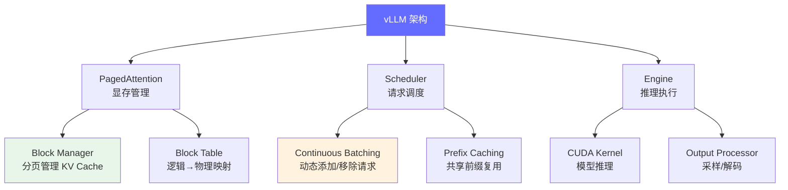
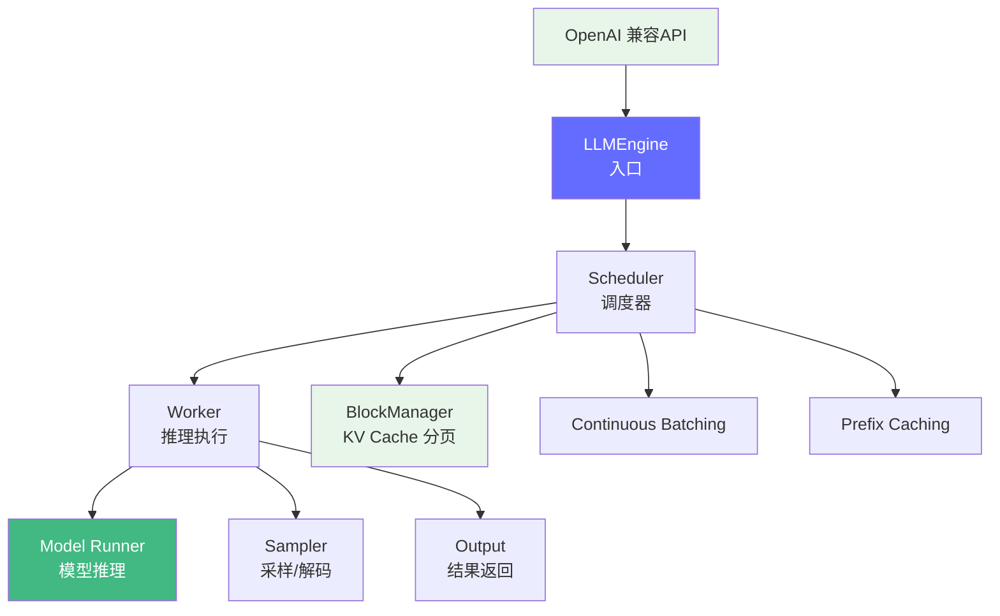

# vLLM 深度解读

> vLLM 是当前最流行的开源 LLM 推理引擎，其核心创新 PagedAttention 将操作系统中的分页内存管理引入推理过程，带来了 2-4x 的吞吐提升。

**GitHub**: https://github.com/vllm-project/vllm

## 前置知识

- [KV Cache 详解](/02-model-architecture/kv-cache/) — 理解 KV Cache 的作用和显存消耗
- [推理引擎概述](/04-inference-optimization/engine-overview/) — 了解推理引擎的核心职责
- [Continuous Batching](/04-inference-optimization/engine-overview/) — 理解批处理优化

## 项目定位

vLLM 解决的核心问题：**传统推理引擎的显存浪费在哪里？PagedAttention 如何像操作系统的虚拟内存一样高效管理 KV Cache？**



## 完整项目文件树

```
vllm/
├── vllm/
│   ├── __init__.py
│   ├── entrypoints/            # 入口点
│   │   ├── api_server.py       # OpenAI 兼容 API 服务
│   │   ├── cli.py              # CLI 入口
│   │   └── openai/             # OpenAI 兼容的路由
│   ├── core/                   # 核心调度逻辑
│   │   ├── block_manager.py    # KV Cache 块管理
│   │   ├── scheduler.py        # 请求调度器
│   │   ├── prefix_caching.py   # 前缀缓存
│   │   └── sequence.py         # 序列管理
│   ├── engine/                 # 推理引擎
│   │   ├── llm_engine.py       # 主引擎入口
│   │   ├── async_llm_engine.py # 异步引擎
│   │   └── arg_utils.py        # 参数解析
│   ├── worker/                 # 推理 Worker
│   │   ├── worker.py           # 单 GPU Worker
│   │   ├── cache_engine.py     # KV Cache 引擎
│   │   └── model_runner.py     # 模型执行器
│   ├── model_executor/         # 模型执行
│   │   ├── model_loader.py     # 模型加载
│   │   └── weight_utils.py     # 权重工具
│   ├── models/                 # 模型实现
│   │   ├── llama.py            # Llama 模型
│   │   ├── mixtral.py          # Mixtral (MoE)
│   │   └── ...
│   ├── attention/              # Attention 实现（核心）
│   │   ├── layer.py            # Attention 层
│   │   ├── ops/                # CUDA 算子
│   │   │   └── paged_attention.py  # PagedAttention CUDA
│   │   └── selector.py         # Attention 后端选择
│   ├── config.py               # 配置定义
│   ├── sampling_params.py      # 采样参数
│   └── sequence.py             # 序列数据结构
├── csrc/                       # CUDA C 源码
│   ├── attention/
│   │   ├── attention_kernels.cu    # PagedAttention CUDA kernel
│   │   └── ...
│   └── cache.h                 # Cache 操作
├── benchmarks/                 # 性能测试
└── examples/                   # 使用示例
```

## 逐模块源码解读

### 1. Sequence — 请求的数据结构

在理解调度器之前，先要理解 vLLM 如何表示一个请求：

```python
# vllm/sequence.py

class Sequence:
    """表示一个生成请求（一个 prompt + 它的生成结果）"""

    def __init__(
        self,
        seq_id: int,           # 唯一 ID
        prompt: str,           # 原始 prompt
        prompt_token_ids: List[int],  # prompt 的 token IDs
        block_size: int,       # KV Cache block 大小
    ):
        self.seq_id = seq_id
        self.prompt = prompt
        self.prompt_token_ids = prompt_token_ids

        # 生成过程中动态增长的 token IDs
        self.output_token_ids: List[int] = []

        # KV Cache 管理
        self._block_table = BlockTable(block_size)

    @property
    def token_ids(self) -> List[int]:
        """完整的 token 序列 = prompt + 生成的 tokens"""
        return self.prompt_token_ids + self.output_token_ids

    @property
    def get_len(self) -> int:
        return len(self.token_ids)

    def get_next_token_id(self) -> int:
        """返回最新生成的 token"""
        return self.output_token_ids[-1] if self.output_token_ids else -1

    def is_finished(self) -> bool:
        """检查是否完成（EOS、最大长度、stop string 等）"""
        return (
            self._has_eos() or
            len(self.output_token_ids) >= self.max_tokens or
            self._hit_stop_string()
        )


class SequenceGroup:
    """一组相关的 Sequence（用于并行采样，如 beam search）"""

    def __init__(
        self,
        request_id: str,
        seqs: List[Sequence],
        sampling_params: SamplingParams,
        arrival_time: float,
    ):
        self.request_id = request_id
        self.seqs = seqs             # 关联的 Sequence 列表
        self.sampling_params = sampling_params  # 采样参数
        self.arrival_time = arrival_time
        self.status = SequenceGroupStatus.WAITING  # WAITING/RUNNING/SWAPPED

    def get_seqs(self) -> List[Sequence]:
        return self.seqs


class SequenceGroupStatus(Enum):
    WAITING = "WAITING"   # 等待调度（还没分配 KV Cache）
    RUNNING = "RUNNING"   # 正在推理中
    SWAPPED = "SWAPPED"   # 被换出到 CPU（显存不够时）
```

**关键设计**：一个 `SequenceGroup` 可以包含多个 `Sequence`，这主要是为了 beam search 支持。但对于最常见的 greedy/top-p 采样，每个 group 只有一个 sequence。

### 2. BlockManager — PagedAttention 核心

这是 vLLM 最重要的组件，实现了 KV Cache 的分页管理：

```python
# vllm/core/block_manager.py (简化版)

class BlockTable:
    """管理单个 Sequence 的 KV Cache 物理 block 映射

    核心思想：
    - 每个 sequence 的逻辑 token 序列被分成固定大小的 blocks
    - block 在物理内存中可以是不连续的
    - BlockTable 维护逻辑 block index → 物理 block index 的映射
    """

    def __init__(self, block_size: int = 16):
        self.block_size = block_size
        self._blocks: List[int] = []  # 物理 block ID 列表
        self._num_tokens = 0          # 当前 token 总数

    def get_num_required_blocks(self, num_tokens: int) -> int:
        """计算 N 个 token 需要多少个 block"""
        return math.ceil(num_tokens / self.block_size)

    def allocate(self, block_allocator: "BlockAllocator") -> None:
        """分配一个新的物理 block"""
        new_block_id = block_allocator.allocate()
        self._blocks.append(new_block_id)

    def get_block_number(self, logical_block_idx: int) -> int:
        """获取逻辑 block 对应的物理 block ID"""
        return self._blocks[logical_block_idx]

    def get_physical_blocks(self) -> List[int]:
        """返回所有物理 block IDs（传给 CUDA kernel）"""
        return self._blocks.copy()


class BlockAllocator:
    """管理所有物理 block 的分配和释放

    类似于操作系统的物理内存管理器。
    维护一个 free_blocks 集合，分配时弹出，释放时加回。
    """

    def __init__(self, num_blocks: int, block_size: int):
        self.num_blocks = num_blocks
        self.block_size = block_size
        self._free_blocks: Set[int] = set(range(num_blocks))

    def allocate(self) -> int:
        """分配一个物理 block"""
        if not self._free_blocks:
            raise RuntimeError("Out of memory! No free blocks available.")
        block_id = self._free_blocks.pop()
        return block_id

    def free(self, block_id: int) -> None:
        """释放一个物理 block"""
        self._free_blocks.add(block_id)

    def get_num_free_blocks(self) -> int:
        return len(self._free_blocks)


class BlockSpaceManager:
    """调度器和 BlockAllocator 之间的桥梁

    负责决定是否能为一个 SequenceGroup 分配足够的 KV Cache。
    """

    def __init__(
        self,
        block_size: int,
        num_gpu_blocks: int,
        watermark: float = 0.01,  # 保留 1% 的 block 作为余量
    ):
        self.block_allocator = BlockAllocator(num_gpu_blocks, block_size)
        self.watermark = watermark  # 防止把显存完全用光
        self.watermark_blocks = int(num_gpu_blocks * watermark)

    def can_allocate(self, seq_group: SequenceGroup) -> bool:
        """检查是否有足够空间分配这个请求"""
        # 新请求需要分配 len(prompt) 个 token 的 block
        num_required_blocks = math.ceil(
            seq_group.get_max_prompt_len() / self.block_size
        )
        return (
            self.block_allocator.get_num_free_blocks()
            >= num_required_blocks + self.watermark_blocks
        )

    def allocate(self, seq_group: SequenceGroup) -> None:
        """为 SequenceGroup 中的每个 Sequence 分配 KV Cache blocks"""
        for seq in seq_group.get_seqs():
            num_blocks = seq.get_num_required_blocks()
            for _ in range(num_blocks):
                seq.allocate(self.block_allocator)

    def append_slots(self, seq: Sequence) -> None:
        """为新生成的 token 追加分配 block（如果需要）"""
        num_required = seq.get_num_required_blocks()
        num_allocated = len(seq._block_table._blocks)
        if num_required > num_allocated:
            seq.allocate(self.block_allocator)

    def free(self, seq: Sequence) -> None:
        """释放 Sequence 的所有 KV Cache blocks"""
        for block_id in seq._block_table.get_physical_blocks():
            self.block_allocator.free(block_id)
```

**PagedAttention 解决的核心问题**：

```
传统方式（预分配固定空间）：
请求1: [████████████████████████████]  分配了 2048 token，实际用了 500
请求2: [████████████████████████████]  分配了 2048 token，实际用了 1200
请求3: [████████████████████████████]  分配了 2048 token，实际用了 300
浪费: ~70% 的 KV Cache 空间

PagedAttention 方式（分页管理）：
请求1: [Block0][Block1]                按需分配，只用了 32 个 token
请求2: [Block2][Block3][Block4]        用了 48 个 token
请求3: [Block5]                        只分配 1 个 block (16 tokens)
浪费: <5% 的 KV Cache 空间
```

### 3. PagedAttention CUDA Kernel — GPU 上的分页读取

```cpp
// csrc/attention/attention_kernels.cu (简化版)

// PagedAttention 前向传播
// 这是 vLLM 性能优势的核心来源
template<typename scalar_t>
__global__ void paged_attention_v1_kernel(
    scalar_t* __restrict__ out,           // 输出 [num_seqs, num_heads, head_size]
    const scalar_t* __restrict__ q,       // Query [num_seqs, num_heads, head_size]
    const scalar_t* __restrict__ k_cache, // KV Cache K [num_blocks, block_size, num_kv_heads, head_size]
    const scalar_t* __restrict__ v_cache, // KV Cache V [num_blocks, block_size, num_kv_heads, head_size]
    const int* __restrict__ block_tables, // [num_seqs, max_num_blocks_per_seq]
    const int* __restrict__ context_lens, // [num_seqs]
    const float scale,                    // 1/sqrt(head_size)
    const int block_size,                 // 每个 block 的 token 数
    const int max_num_blocks_per_seq,     // 每序列最大 block 数
    const int num_kv_heads,
    const int head_size
) {
    // 每个 CUDA block 处理一个 sequence 的一个 head
    const int seq_idx = blockIdx.y;
    const int head_idx = blockIdx.x;

    // 1. 读取 Query 向量
    const int q_offset = seq_idx * gridDim.x * head_size + head_idx * head_size;
    const scalar_t* q_ptr = q + q_offset;

    // 2. 读取 block table
    const int* block_table = block_tables + seq_idx * max_num_blocks_per_seq;
    const int context_len = context_lens[seq_idx];
    const int num_blocks = (context_len + block_size - 1) / block_size;

    // 3. 分 block 计算 attention
    float max_val = -FLT_MAX;
    float sum_exp = 0.0f;

    // 第一个 pass: 找 max 并计算 exp sum
    for (int block_idx = 0; block_idx < num_blocks; block_idx++) {
        const int physical_block = block_table[block_idx];

        // 计算这个 block 中每个 token 的 attention score
        for (int token_in_block = 0; token_in_block < block_size; token_in_block++) {
            const int token_idx = block_idx * block_size + token_in_block;
            if (token_idx >= context_len) break;

            // 从物理 block 中读取 K
            const int k_offset = physical_block * block_size * num_kv_heads * head_size
                                + token_in_block * num_kv_heads * head_size
                                + head_idx * head_size;
            const scalar_t* k_ptr = k_cache + k_offset;

            // 计算 Q @ K (点积)
            float score = 0.0f;
            for (int d = 0; d < head_size; d++) {
                score += (float)q_ptr[d] * (float)k_ptr[d];
            }
            score *= scale;

            // 在线 softmax 更新
            float prev_max = max_val;
            max_val = fmaxf(max_val, score);
            float exp_val = expf(score - max_val);
            sum_exp = sum_exp * expf(prev_max - max_val) + exp_val;
        }
    }

    // 第二个 pass: 用 V 加权求和
    // (实际实现中两个 pass 会融合，这里为清晰分为两步)
    // ... 类似的循环，用 softmax 权重乘 V 得到最终输出
}
```

**关键性能优化**：
1. **不连续的 KV 读取**：传统的 attention 假设 KV 是连续内存，PagedAttention 通过 block_table 查找分散的物理 block
2. **在线 Softmax**：不需要先存完整的 attention 矩阵，边算边做 softmax（避免 O(T²) 的中间存储）
3. **共享 KV Cache**：多个 sequence 的 K/V 存在同一个大的连续 buffer 中，只通过 block_table 区分

### 4. Scheduler — Continuous Batching 实现

```python
# vllm/core/scheduler.py (简化版)

class Scheduler:
    """vLLM 的调度器，实现 Continuous Batching

    核心流程：
    1. 从 WAITING 队列中选择可以分配的请求
    2. 将 RUNNING 中已完成的请求移除
    3. 决定哪些请求可以进入下一个 decode step
    """

    def __init__(
        self,
        scheduler_config: SchedulerConfig,
        cache_config: CacheConfig,
    ):
        self.waiting: Deque[SequenceGroup] = deque()   # 等待分配
        self.running: Deque[SequenceGroup] = deque()    # 正在推理
        self.swapped: Deque[SequenceGroup] = deque()    # 被换出到 CPU

        self.block_manager = BlockSpaceManager(...)
        self.scheduler_config = scheduler_config

    def schedule(self) -> Tuple[List[SequenceGroup], List[SequenceGroup],
                                List[SequenceGroup]]:
        """调度决策，返回三个列表：
        - scheduled: 这个 step 要执行的 SequenceGroups
        - ignored_seq_groups: 因为显存不足被忽略的请求
        - newly_swapped_out: 被换出到 CPU 的请求
        """
        scheduled = []
        ignored_seq_groups = []
        newly_swapped_out = []

        # ===== Phase 1: 处理 RUNNING 队列 =====
        # 先把 RUNNING 的加入到 scheduled（它们已经在显存中）
        running_copy = list(self.running)
        self.running.clear()

        for seq_group in running_copy:
            if seq_group.is_finished():
                # 完成的请求，释放 KV Cache
                self._free_seq_group(seq_group)
                continue

            # 检查是否需要换出（显存不够时）
            if not self._can_run_seq_group(seq_group):
                self._swap_out_seq_group(seq_group)
                newly_swapped_out.append(seq_group)
                continue

            self.running.append(seq_group)
            scheduled.append(seq_group)

        # ===== Phase 2: 从 WAITING 队列加入新请求 =====
        # 这是 Continuous Batching 的核心：不等待 batch 完成才加新请求
        while self.waiting:
            seq_group = self.waiting[0]

            # 检查显存是否够分配这个请求
            if self.block_manager.can_allocate(seq_group):
                # 够分配，从 WAITING 移到 RUNNING
                self.waiting.popleft()
                self.block_manager.allocate(seq_group)
                self.running.append(seq_group)
                scheduled.append(seq_group)
            else:
                # 不够分配，停止尝试（后面的请求更大）
                break

            # 检查是否达到最大 batch 限制
            if len(scheduled) >= self.scheduler_config.max_num_seqs:
                break

        # ===== Phase 3: 尝试换回 SWAPPED 的请求 =====
        # 如果有空闲显存，把之前换出到 CPU 的请求换回来
        while self.swapped:
            seq_group = self.swapped[0]

            if self._can_swap_in_seq_group(seq_group):
                self.swapped.popleft()
                self._swap_in_seq_group(seq_group)
                self.running.append(seq_group)
                scheduled.append(seq_group)
            else:
                break

        return scheduled, ignored_seq_groups, newly_swapped_out

    def _free_seq_group(self, seq_group: SequenceGroup) -> None:
        """释放 SequenceGroup 的所有 KV Cache"""
        for seq in seq_group.get_seqs():
            self.block_manager.free(seq)
```

**Continuous Batching vs Traditional Batching 对比**：

```
Traditional Batching (如 HuggingFace Transformers):
Step 1: [Req1 ████████] [Req2 ████    ] [Req3 ████████]  全部一起 decode
Step 2: [Req1 ████████] [Req2 █████   ] [Req3 ████████]  Req2 已完成但必须等
Step 3: [Req1 ████████] [Req2 █████   ] [Req3 ████████]  等所有完成才加新请求
...
Step 8: [Req1 ████████] [Req2 █████   ] [Req3 ████████]  全部完成
Step 9: [Req4 ████████] [Req5 ████████] [Req6 ████████]  才能开始新 batch

Continuous Batching (vLLM):
Step 1: [Req1 ████████] [Req2 ████    ] [Req3 ████████]  decode 中
Step 2: [Req1 ████████] [Req2 完成!   ] [Req3 ████████]  Req2 完成
         + [Req4 ████                                    立即加入 Req4!
Step 3: [Req1 ████████] [Req3 ████████] [Req4 █████     ]
Step 4: [Req1 完成!   ] [Req3 ████████] [Req4 █████     ]  Req1 完成
         +                               + [Req5 ████]   立即加入 Req5!
```

### 5. LLMEngine — 推理引擎主循环

```python
# vllm/engine/llm_engine.py (简化版)

class LLMEngine:
    """vLLM 的主引擎，协调调度器和 Worker

    使用方式:
        engine = LLMEngine.from_engine_args(engine_args)
        engine.add_request("0", "Hello, my name is")
        outputs = engine.step()
    """

    def __init__(
        self,
        model_config: ModelConfig,
        cache_config: CacheConfig,
        scheduler_config: SchedulerConfig,
        ...
    ):
        # 1. 创建调度器
        self.scheduler = Scheduler(scheduler_config, cache_config)

        # 2. 创建 Worker（负责实际推理）
        self.worker = Worker(model_config, parallel_config, ...)

        # 3. 计算 KV Cache 大小
        num_gpu_blocks = self._determine_num_available_blocks()
        self.scheduler.block_manager.set_num_blocks(num_gpu_blocks)

        # 4. 初始化 KV Cache
        self.worker.init_cache(num_gpu_blocks)

    def add_request(
        self,
        request_id: str,
        prompt: str,
        sampling_params: SamplingParams,
    ) -> None:
        """添加一个新的推理请求"""
        # 1. Tokenize prompt
        prompt_token_ids = self.tokenizer.encode(prompt)

        # 2. 创建 Sequence
        seq = Sequence(
            seq_id=0,
            prompt=prompt,
            prompt_token_ids=prompt_token_ids,
            block_size=self.scheduler.block_manager.block_size,
        )

        # 3. 创建 SequenceGroup
        seq_group = SequenceGroup(
            request_id=request_id,
            seqs=[seq],
            sampling_params=sampling_params,
            arrival_time=time.time(),
        )

        # 4. 加入 WAITING 队列
        self.scheduler.waiting.append(seq_group)

    def step(self) -> List[RequestOutput]:
        """执行一个推理步骤（调用一次 decode）

        这是被反复调用的核心方法：
        1. 调度器决定哪些请求参与本轮推理
        2. Worker 执行实际的前向传播
        3. 采样器从 logits 中选择下一个 token
        4. 更新 Sequence 状态
        """
        # ===== Step 1: 调度 =====
        scheduled_seq_groups, ignored, swapped_out = self.scheduler.schedule()

        if not scheduled_seq_groups:
            return []  # 没有要处理的请求

        # ===== Step 2: 构建 batch =====
        # 把所有要执行的 sequence 组合成一个 batch
        input_tokens = []
        input_positions = []
        input_metadata = InputMetadata(
            seq_groups=scheduled_seq_groups,
            ...
        )

        # ===== Step 3: 执行前向传播 =====
        # Worker 执行一次 model forward pass
        # 输入: batch 中所有序列的 tokens
        # 输出: 每个序列最后一个 token 的 logits
        output = self.worker.execute_model(
            input_tokens, input_positions, input_metadata
        )

        # ===== Step 4: 采样 =====
        # 对每个序列的 logits 应用采样策略（top-k, top-p, temperature）
        sampled_token_ids = self._sample(output, scheduled_seq_groups)

        # ===== Step 5: 更新 Sequence 状态 =====
        for seq_group, sampled_ids in zip(scheduled_seq_groups, sampled_token_ids):
            for seq, token_id in zip(seq_group.get_seqs(), sampled_ids):
                seq.append_token_id(token_id)

                # 分配新的 KV Cache block（如果需要）
                self.scheduler.block_manager.append_slots(seq)

                # 检查是否完成
                if seq.is_finished():
                    self.scheduler._free_seq_group(seq_group)

        # ===== Step 6: 返回结果 =====
        return self._create_output(scheduled_seq_groups)
```

### 6. Prefix Caching — 共享前缀复用

```python
# vllm/core/prefix_caching.py (简化版)

class PrefixCachingBlockManager:
    """管理前缀缓存的 BlockManager

    核心思路：
    - 对每个 block 计算 hash（基于 block 中的 token IDs）
    - 如果新请求的前缀 block hash 已存在于缓存，直接复用
    - 只需计算新增的 token 部分
    """

    def __init__(self, block_size: int):
        self.block_size = block_size
        # hash -> physical block ID
        self.cached_blocks: Dict[bytes, int] = {}
        # block ID -> reference count (用于 LRU 淘汰)
        self.block_ref_counts: Dict[int, int] = {}

    def compute_block_hash(self, token_ids: Tuple[int, ...]) -> bytes:
        """计算 token block 的 hash"""
        return hashlib.sha256(
            struct.pack(f"{len(token_ids)}i", *token_ids)
        ).digest()

    def get_matching_blocks(
        self, prompt_token_ids: List[int]
    ) -> Tuple[int, List[Tuple[int, int]]]:
        """查找 prompt 的前缀匹配 blocks

        Returns:
            - 匹配的 token 数量
            - (logical_block_idx, physical_block_id) 列表
        """
        matched_tokens = 0
        block_mapping = []

        # 逐 block 匹配
        for block_idx in range(0, len(prompt_token_ids), self.block_size):
            block_tokens = tuple(prompt_token_ids[block_idx:block_idx + self.block_size])
            block_hash = self.compute_block_hash(block_tokens)

            if block_hash not in self.cached_blocks:
                break  # 找到第一个不匹配的 block，停止

            physical_block_id = self.cached_blocks[block_hash]
            block_mapping.append((block_idx // self.block_size, physical_block_id))
            self.block_ref_counts[physical_block_id] += 1
            matched_tokens += len(block_tokens)

        return matched_tokens, block_mapping

    def cache_block(
        self, block_token_ids: Tuple[int, ...], physical_block_id: int
    ) -> None:
        """将新 block 加入缓存"""
        block_hash = self.compute_block_hash(block_token_ids)
        self.cached_blocks[block_hash] = physical_block_id
        self.block_ref_counts[physical_block_id] = 1
```

**Prefix Caching 效果示例**：

```
场景：多轮对话 + 相同的 system prompt

System: "你是一个有帮助的助手..." (100 tokens → 7 blocks)
User1: "什么是 Transformer?" (20 tokens → 2 blocks)
User2: "什么是 Attention?" (20 tokens → 2 blocks)
User3: "什么是 KV Cache?" (20 tokens → 2 blocks)

无 Prefix Caching:
User1: 计算 120 tokens
User2: 计算 120 tokens (system prompt 重新计算!)
User3: 计算 120 tokens (system prompt 重新计算!)
总计: 360 tokens 的计算量

有 Prefix Caching:
User1: 计算 120 tokens (首次，全算)
User2: 计算 20 tokens (system 100 tokens 的 KV 直接从缓存取!)
User3: 计算 20 tokens (同上)
总计: 160 tokens 的计算量，节省 56%
```

### 7. 模型实现 — 以 Llama 为例

```python
# vllm/models/llama.py (简化版)

class LlamaForCausalLM(nn.Module):
    """vLLM 的 Llama 模型实现

    与 HuggingFace 的 LlamaForCausalLM 不同之处:
    1. 支持 PagedAttention (需要传入 block_tables 等参数)
    2. 支持 Continuous Batching (batch 中每个序列长度不同)
    3. KV Cache 管理在外部，模型只负责计算
    """

    def __init__(self, config: LlamaConfig):
        super().__init__()
        self.model = LlamaModel(config)
        self.lm_head = nn.Linear(config.hidden_size, config.vocab_size, bias=False)

    def forward(
        self,
        input_ids: torch.Tensor,
        positions: torch.Tensor,
        kv_caches: List[torch.Tensor],      # 预分配的 KV Cache
        input_metadata: InputMetadata,       # 包含 block_tables 等
    ) -> torch.Tensor:
        """
        前向传播，关键参数:
        - input_ids: [batch_size, seq_len] 输入 tokens
        - positions: [batch_size, seq_len] 每个 token 的位置
        - kv_caches: 预分配的 KV Cache (list of tensors, 每层一个)
        - input_metadata: 包含 block_tables, context_lens 等
        """
        hidden_states = self.model(
            input_ids, positions, kv_caches, input_metadata
        )
        logits = self.lm_head(hidden_states)
        return logits


class LlamaAttention(nn.Module):
    """使用 PagedAttention 的 Llama Attention 层"""

    def __init__(self, config: LlamaConfig):
        super().__init__()
        self.head_dim = config.hidden_size // config.num_attention_heads
        self.qkv_proj = QKVParallelLinear(
            config.hidden_size,
            self.head_dim,
            config.num_attention_heads,
            config.num_key_value_heads,
        )
        self.o_proj = RowParallelLinear(...)

    def forward(
        self,
        hidden_states: torch.Tensor,
        kv_cache: torch.Tensor,
        input_metadata: InputMetadata,
    ) -> torch.Tensor:
        # 1. QKV 投影
        qkv = self.qkv_proj(hidden_states)
        q, k, v = qkv.chunk(3, dim=-1)

        # 2. 应用 RoPE 位置编码
        q, k = apply_rotary_pos_emb(q, k, input_metadata.positions)

        # 3. 存储 K, V 到 KV Cache (PagedAttention 格式)
        #    这是一个关键的 in-place 操作
        num_seqs = len(input_metadata.block_tables)
        for i in range(num_seqs):
            block_table = input_metadata.block_tables[i]
            context_len = input_metadata.context_lens[i]
            kv_cache.store(k[i], v[i], block_table, context_len)

        # 4. PagedAttention 计算
        output = paged_attention(
            q,
            kv_cache.k,          # K cache (分页存储)
            kv_cache.v,          # V cache (分页存储)
            input_metadata.block_tables,
            input_metadata.context_lens,
        )

        # 5. 输出投影
        return self.o_proj(output)
```

## 架构设计



## 代码量统计

| 模块 | 代码行数 | 职责 |
|------|---------|------|
| `vllm/core/block_manager.py` | ~800 行 | PagedAttention 显存管理 |
| `vllm/core/scheduler.py` | ~600 行 | Continuous Batching 调度 |
| `vllm/worker/worker.py` | ~400 行 | 模型推理执行 |
| `vllm/attention/` | ~1,200 行 | Attention 实现（PagedAttention、FlashAttention） |
| `vllm/engine/` | ~500 行 | 推理引擎核心 |
| `vllm/models/` | ~2,000+ 行 | 各种模型实现（Llama、Mistral、Mixtral 等） |
| `csrc/attention/*.cu` | ~1,500 行 | PagedAttention CUDA kernel |

## 与 llama.cpp / SGLang 的对比

| 维度 | vLLM | llama.cpp | SGLang |
|------|------|-----------|--------|
| 语言 | Python + CUDA | C/C++ | Python + CUDA |
| 核心创新 | PagedAttention | GGUF 量化格式 | RadixAttention |
| 并发 | Continuous Batching | 单请求 | RadixAttention + 结构化生成 |
| KV Cache | 分页管理 | 线性/环形缓冲 | 前缀树管理 |
| 适合场景 | 高并发 API 服务 | 本地/边缘部署 | Agent/函数调用 |

## 面试视角

| 面试官问题 | vLLM 对应的答案 |
|-----------|-------------------|
| "PagedAttention 解决了什么问题？" | 传统推理引擎的 KV Cache 碎片化，PagedAttention 按需分配 block |
| "Continuous Batching 的原理？" | 不等待 batch 中所有请求完成，一个完成就加新请求 |
| "vLLM 的吞吐为什么比 TGI 高？" | PagedAttention + Continuous Batching 提升 GPU 利用率 |
| "Prefix Caching 在多轮对话中的效果？" | 共享 conversation 的 KV block 被复用，减少重复计算 |
| "vLLM 如何决定 KV Cache 大小？" | 启动时探测可用显存，减去模型权重占用，剩余全部分给 KV Cache |
| "block_size 怎么选？" | 太小会增加 overhead，太大浪费显存。通常 16 是经验值 |

## 延伸阅读

- 读完 vLLM 后，看 [SGLang](./sglang.md) 理解结构化生成引擎的设计差异
- 对比 [llama.cpp](./llama-cpp.md) 理解本地部署 vs 云端部署的不同优化方向

---

*上一节：[llama.cpp](./llama-cpp.md) | 下一节：[SGLang](./sglang.md)*
