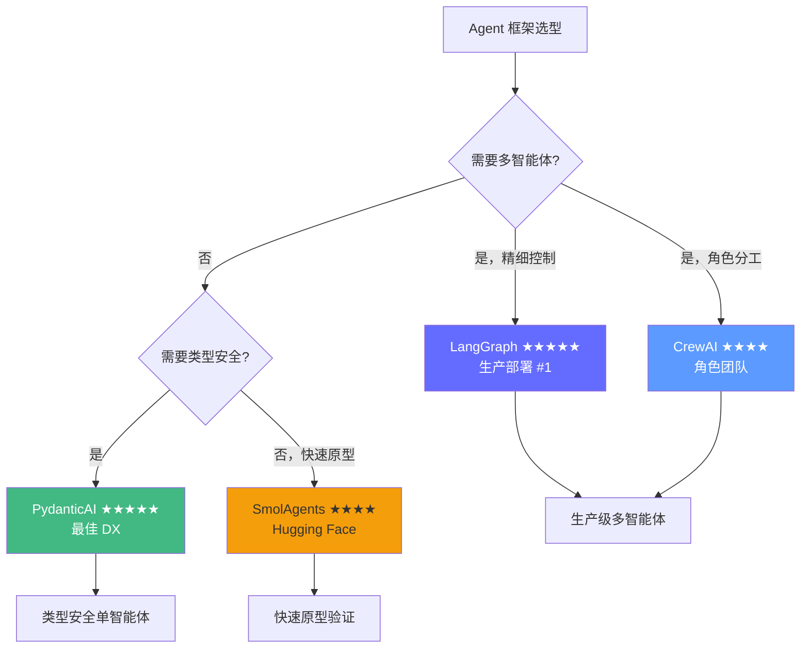
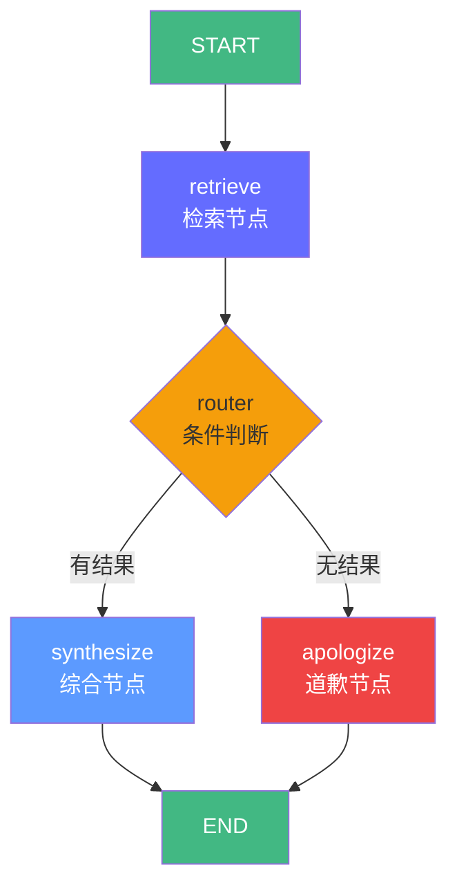
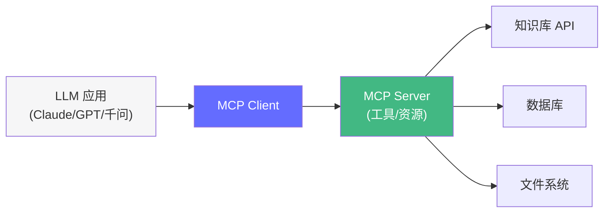

# 第四阶段：框架与工具调用——框架为用，架构为主

> 面对 20+ 个 Agent 框架，记住：工具是仆从，架构才是主人。2026 年还要掌握 MCP 协议——Agent 连接工具的行业标准。

## 前置知识

- Context Engineering（系统提示设计）
- LLM 函数调用原理

## 核心概念

### 2026 框架全景



| 框架 | 定位 | 多智能体 | 类型安全 | 学习曲线 | 生产排名 |
|------|------|----------|----------|----------|----------|
| **LangGraph** | 图式工作流 | ★★★★★ | ★★★ | 中等 | **#1** |
| **PydanticAI** | 类型安全 Agent | ★☆☆ | ★★★★★ | 低 | Top 3 |
| **SmolAgents** | 轻量代码 Agent | ★★☆ | ★★☆ | 极低 | Top 5 |
| CrewAI | 角色团队 | ★★★★★ | ★★☆ | 低 | 中等 |
| AutoGen | 多智能体对话 | ★★★★★ | ★★★ | 中等 | 中等 |
| Google ADK | Google 生态 | ★★★★ | ★★★★ | 中等 | 上升中 |

---

### LangGraph 详解（生产首选）

#### 核心概念：显式状态图



LangGraph 的核心思想：**将 Agent 的行为建模为显式的状态图**。

```python
from langgraph.graph import StateGraph, END
from typing import TypedDict, Literal
from pydantic import BaseModel, Field

# 1. 定义状态——这是 Agent 的"记忆"
class AgentState(TypedDict):
    query: str           # 用户查询
    results: list[dict]  # 检索结果
    answer: str          # 最终答案
    sources: list[str]   # 引用来源
    history: list[str]   # 执行日志

# 2. 定义节点函数——每个节点做一件事
def retrieve(state: AgentState) -> dict:
    """检索节点：从知识库搜索相关信息。"""
    query = state["query"]
    results = mock_search(query)  # 替换为实际检索
    history = state["history"] + [f"检索: {query} → {len(results)} 条结果"]
    return {"results": results, "history": history}

def synthesize(state: AgentState) -> dict:
    """综合节点：用 LLM 基于检索结果生成答案。"""
    context = "\n".join(r["content"] for r in state["results"])
    answer = mock_llm_answer(state["query"], context)
    sources = [r["title"] for r in state["results"]]
    history = state["history"] + [f"生成答案: {answer[:30]}..."]
    return {"answer": answer, "sources": sources, "history": history}

def apologize(state: AgentState) -> dict:
    """道歉节点：无结果时返回。"""
    history = state["history"] + ["无检索结果，返回道歉信息"]
    return {
        "answer": "抱歉，我目前没有相关信息。",
        "sources": [],
        "history": history,
    }

# 3. 定义路由函数——决定下一步
def router(state: AgentState) -> Literal["synthesize", "apologize"]:
    """根据检索结果决定走哪条路径。"""
    if state["results"]:
        return "synthesize"
    return "apologize"

# 4. 构建图
graph = StateGraph(AgentState)

# 添加节点
graph.add_node("retrieve", retrieve)
graph.add_node("synthesize", synthesize)
graph.add_node("apologize", apologize)

# 添加边
graph.set_entry_point("retrieve")
graph.add_conditional_edges(
    "retrieve",       # 从 retrieve 节点出来
    router,           # 用 router 函数决定去哪
    {                 # 映射：router 返回值 → 目标节点
        "synthesize": "synthesize",
        "apologize": "apologize",
    },
)
graph.add_edge("synthesize", END)
graph.add_edge("apologize", END)

# 5. 编译并运行
app = graph.compile()

result = app.invoke({
    "query": "什么是 KV Cache？",
    "results": [],
    "answer": "",
    "sources": [],
    "history": [],
})

print(result["answer"])
print("执行路径:", result["history"])
```

#### 为什么 LangGraph 适合生产

| 特性 | 说明 | 生产价值 |
|------|------|----------|
| **可观测性** | 每个节点、每条边的执行都有日志 | 问题定位精确到节点 |
| **可恢复性** | MemorySaver 检查点，断点恢复 | 长时间运行任务不丢失状态 |
| **可控性** | 显式条件分支，无黑盒 | 避免死循环、无限重试 |
| **可测试性** | 每个节点是纯函数（输入→输出） | 单元测试覆盖 |
| **多智能体** | 原生支持 supervisor/handoff 模式 | 无需换框架 |

---

### MCP 协议（Model Context Protocol）

#### MCP 是什么



MCP 是 Anthropic 推出的**标准化 Agent-Tool 连接协议**。类比：USB 之于外设，MCP 之于 Agent 工具。

#### 为什么需要 MCP

| 不用 MCP | 用 MCP |
|----------|--------|
| 每个工具需要单独写集成代码 | 标准协议，即插即用 |
| 换模型后工具集成要重写 | 一次实现，多模型通用 |
| 工具发现困难 | 自动发现可用工具 |
| 跨应用不兼容 | 任何 MCP 应用可以互操作 |

#### 创建 MCP Server

```python
# mcp_server.py
from fastmcp import FastMCP

mcp = FastMCP("FDE Knowledge Tools")

@mcp.tool()
def search_knowledge(query: str, limit: int = 5) -> str:
    """搜索 FDE 内部知识库，返回相关文章摘要。

    Args:
        query: 搜索关键词，尽量简洁
        limit: 返回结果数量，默认 5，最大 20
    """
    # 实际实现：调用向量库搜索
    results = vector_store.search(query, limit=limit)
    return format_results(results)

@mcp.tool()
def get_document(doc_id: str) -> str:
    """获取指定文档的完整内容。

    Args:
        doc_id: 文档 ID，从搜索结果中获取
    """
    doc = database.get(doc_id)
    return doc.content

@mcp.resource("docs://{category}/{doc_id}")
def get_doc_resource(category: str, doc_id: str) -> str:
    """将文档作为资源暴露——MCP 的 Resource 能力。"""
    return database.get(f"{category}/{doc_id}").content

@mcp.prompt()
def qa_prompt(query: str) -> str:
    """提供一个标准问答提示模板——MCP 的 Prompt 能力。"""
    return f"""你是 FDE 知识库助手。基于以下信息回答：

{search_knowledge(query)}

问题：{query}
"""

if __name__ == "__main__":
    mcp.run()  # 默认监听 http://localhost:8080
```

#### Agent 连接 MCP Server

```python
# agent_with_mcp.py
from langchain_mcp import MCPClient
from langgraph.graph import StateGraph, END

# 1. 连接 MCP Server，自动发现所有工具和资源
client = MCPClient("http://localhost:8080/mcp")
tools = client.get_tools()  # 自动发现 search_knowledge, get_document

print(f"发现 {len(tools)} 个工具: {[t.name for t in tools]}")

# 2. 将 MCP 工具接入 LangGraph Agent
class MCPState(TypedDict):
    query: str
    answer: str

def agent_node(state: MCPState) -> dict:
    """使用 MCP 工具的智能体节点。"""
    response = llm_with_tools.invoke([
        {"role": "user", "content": state["query"]}
    ])
    # LangChain 自动处理工具调用和结果回填
    return {"answer": response.content}

graph = StateGraph(MCPState)
graph.add_node("agent", agent_node)
graph.set_entry_point("agent")
graph.add_edge("agent", END)

app = graph.compile()
```

**MCP 的核心价值**：你的工具只需要实现一次 MCP Server，就可以被任何 MCP Client（Claude Desktop、LangChain、自定义 Agent）使用。

---

### PydanticAI 详解（最佳开发者体验）

```python
from pydantic_ai import Agent, RunContext
from pydantic import BaseModel

class WeatherData(BaseModel):
    city: str
    temperature: float
    description: str

# 1. 定义 Agent
agent = Agent(
    model="openai:gpt-4o",
    system_prompt="你是一个天气助手，能告诉用户指定城市的天气。",
)

# 2. 定义工具（FastAPI 风格装饰器）
@agent.tool
async def get_weather(ctx: RunContext[None], city: str) -> WeatherData:
    """获取指定城市的天气信息。"""
    # 模拟 API 调用
    return WeatherData(city=city, temperature=25, description="晴天")

# 3. 运行
result = agent.run_sync("北京今天天气怎么样？")
print(result.data)  # → "北京今天晴天，气温 25°C。"
```

**优势**：
- FastAPI 风格的类型安全——`@agent.tool` 自动从函数签名生成工具 Schema
- Pydantic 原生集成——输入输出自动验证
- 最少代码量——5 行代码实现一个带工具的 Agent

**限制**：
- 仅支持单智能体——没有内置的多智能体编排
- 复杂工作流需要搭配 LangGraph

---

### 智能体友好型工具设计

#### 4 大设计原则

| 原则 | 说明 | 好例子 | 坏例子 |
|------|------|--------|--------|
| **命名清晰** | 让模型一眼知道用途 | `search_knowledge_base` | `fn1`, `do_stuff` |
| **目的单一** | 一个工具只做一件事 | `search` + `write` 分开 | `search_and_write` |
| **输入输出结构化** | 方便模型识别 | Pydantic Schema | 自由格式字符串 |
| **失败快速** | 遇到错误及时返回 | `{"error": "超时"}` | 挂起不返回 |

#### 工具设计 Checklist

```
□ 名称动词开头（search_, get_, create_）或名词短语（knowledge_search）
□ 描述包含：用途、适用场景、不适用场景
□ 所有参数有类型注解和 description
□ 必填参数标记 required
□ 有默认值的参数标注 default
□ 返回值有明确的 Schema
□ 错误有结构化的错误格式
□ 有副作用的操作需要确认闸门
```

## 工程视角

### 框架成本对比

以相同的"检索 + 综合"任务为例：

| 框架 | 代码行数 | 运行成本 | 学习成本 | 适合 |
|------|----------|----------|----------|------|
| LangGraph | ~50 | $0.01/次 | 中 | 生产环境、复杂流程 |
| PydanticAI | ~15 | $0.01/次 | 低 | 单智能体、类型安全 |
| SmolAgents | ~10 | $0.01/次 | 极低 | 快速原型、探索 |
| CrewAI | ~30 | $0.02/次 | 低 | 角色分工团队 |
| 手写（无框架） | ~80 | $0.01/次 | 高 | 理解原理、定制控制 |

### MCP 协议的生产考量

| 方面 | 考量 |
|------|------|
| 部署 | MCP Server 独立部署为 HTTP/gRPC 服务 |
| 安全 | 工具层做权限控制（tenant_id 过滤） |
| 性能 | MCP 通信开销 ~1-5ms/调用（本地）或 ~10-50ms（远程） |
| 版本 | MCP Server 版本升级不影响 Client（向后兼容） |

## 面试视角

### Q: 什么时候该用框架，什么时候该手写？

**满分回答框架**：
- **原型阶段**：用 SmolAgents 或 PydanticAI，快速验证思路
- **生产环境**：用 LangGraph，需要可观测性、可恢复性、可测试性
- **学习阶段**：手写一次（不调框架），理解工具调用原理
- **核心判断**：你的工作流是否需要**条件分支、多轮迭代、状态恢复**？需要 → LangGraph；不需要 → PydanticAI

### Q: MCP 协议解决了什么问题？

**满分回答框架**：
- 解决了 Agent 和工具之间的**互操作性**问题
- 类比 USB 标准——之前每个外设需要不同的接口，MCP 让所有工具"即插即用"
- 一次实现 MCP Server，可被 Claude、LangChain、自定义 Agent 等多种 Client 使用
- 还统一了工具发现（Client 自动知道 Server 提供了哪些工具）

---

## 实战环节：用 LangGraph + MCP 构建一个知识问答 Agent

### 目标

创建一个 MCP Server 暴露搜索工具，用 LangGraph 构建 Agent 连接并调用。

### 环境要求

- Python 3.12+
- `uv add fastmcp langgraph langchain langchain-mcp`

### 步骤

**1. 创建 MCP Server**

```python
# mcp_server.py
from fastmcp import FastMCP

mcp = FastMCP("FDE Knowledge Server")

# 模拟知识库
KNOWLEDGE = {
    "kv-cache": "KV Cache 是大模型推理中的显存优化技术，通过缓存 Key 和 Value 矩阵避免重复计算。",
    "vllm": "vLLM 是一个高性能 LLM 推理引擎，核心创新是 PagedAttention，将 KV Cache 分页管理。",
    "quantization": "量化将 FP16 模型转换为 INT8/INT4，显存减少 2-4 倍，精度损失通常 <1%。",
}

@mcp.tool()
def search_knowledge(query: str, limit: int = 3) -> str:
    """搜索 FDE 知识库，返回与查询相关的文章摘要。"""
    results = []
    for key, content in KNOWLEDGE.items():
        if query.lower() in key.lower() or query.lower() in content.lower():
            results.append({"id": key, "content": content})
    return str(results[:limit])

@mcp.tool()
def get_document(doc_id: str) -> str:
    """获取指定文档的完整内容。"""
    return KNOWLEDGE.get(doc_id, f"文档 {doc_id} 不存在")

if __name__ == "__main__":
    mcp.run()
```

**2. 构建 LangGraph Agent**

```python
# agent.py
from langgraph.graph import StateGraph, END
from langchain_openai import ChatOpenAI
from langchain_mcp import MCPClient
from typing import TypedDict

class AgentState(TypedDict):
    query: str
    answer: str

llm = ChatOpenAI(model="gpt-4o-mini")

# 连接 MCP Server
mcp_client = MCPClient("http://localhost:8080/mcp")
tools = mcp_client.get_tools()
llm_with_tools = llm.bind_tools(tools)

def agent_node(state: AgentState) -> dict:
    messages = [
        {"role": "system", "content": "你是 FDE 知识库助手。基于工具返回的知识回答。"},
        {"role": "user", "content": state["query"]},
    ]
    response = llm_with_tools.invoke(messages)
    return {"answer": response.content}

graph = StateGraph(AgentState)
graph.add_node("agent", agent_node)
graph.set_entry_point("agent")
graph.add_edge("agent", END)

app = graph.compile()
```

**3. 运行**

```bash
# 终端 1：启动 MCP Server
uv run python mcp_server.py

# 终端 2：运行 Agent
uv run python -c "
from agent import app
result = app.invoke({'query': 'KV Cache 是什么？', 'answer': ''})
print(result['answer'])
"
```

### 验证成功

- [ ] MCP Server 启动成功，`http://localhost:8080` 可访问
- [ ] Agent 能调用 `search_knowledge` 工具并返回基于知识的回答
- [ ] Agent 能调用 `get_document` 工具获取文档详情
- [ ] 查询无关话题时返回"暂无相关信息"

### 思考题

1. 如果 MCP Server 挂了，Agent 应该如何优雅降级？
2. 如何让 Agent 在搜索结果为空时，自动尝试换关键词再搜一次？
3. MCP Server 的工具如何添加权限控制（不同用户只能访问不同文档）？

---

*上一阶段：[← Context Engineering](/tools/agentic-ai/03-context-engineering) | [下一阶段：RAG 系统 →](/tools/agentic-ai/05-rag-system)*
