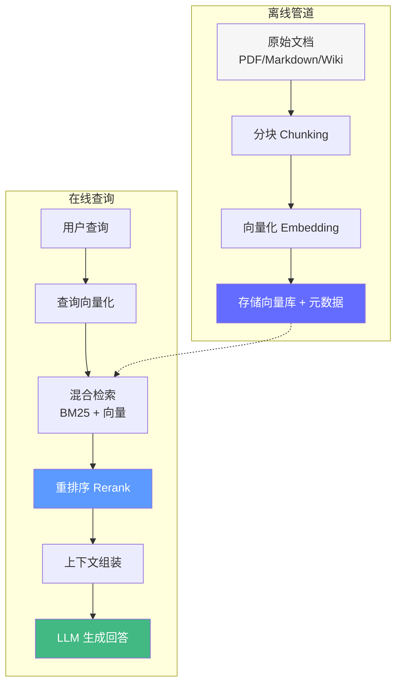
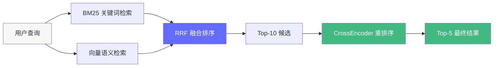
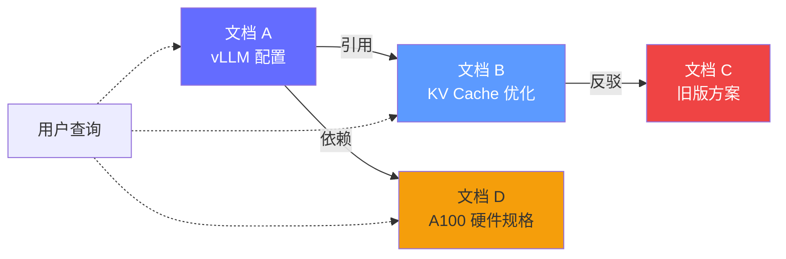

# 第五阶段：RAG 系统实战——给智能体"装上知识库"

> 2026 年，RAG 已从"向量搜索 + 拼接"进化为混合检索 + 自适应分块 + 重排序 + 评估的完整工程体系。RAG 不是"调 API"，而是"设计知识管道"。

## 前置知识

- LLM 函数调用原理
- 向量嵌入（Embedding）基础概念
- Python 异步编程

## 核心概念

### RAG 架构总览



**核心问题**：如何在有限的上下文窗口中，将**最相关的知识**以**最合适的形式**注入 LLM？

---

### 1. 分块策略（Chunking）——RAG 的生命线

分块是 RAG 的第一道关口，直接决定检索质量。

#### 分块方法对比

| 方法 | 原理 | 优点 | 缺点 | 适用场景 |
|------|------|------|------|----------|
| **固定长度** | 按 Token/字符数切割 | 简单、快速 | 可能截断语义 | 快速原型 |
| **递归字符** | 按分隔符层级切割 | 保留段落结构 | 仍需调参 | 通用文档 |
| **语义分块** | 检测主题变化点 | 语义完整性高 | 计算成本高 | 长文档、论文 |
| **文档感知** | 利用 Markdown/HTML 结构 | 保留标题层级 | 依赖格式规范 | 技术文档、Wiki |
| **代码感知** | 按 AST/语法树分块 | 保留函数/类完整 | 仅限代码 | 代码检索 |

#### 定量分析：chunk_size 对检索准确率的影响

```
chunk_size=200:  准确率 62%  │ 召回率 78%  │ 每个查询 ~3 个相关块
chunk_size=500:  准确率 75%  │ 召回率 71%  │ 每个查询 ~2 个相关块  ← 最佳平衡
chunk_size=800:  准确率 71%  │ 召回率 65%  │ 每个查询 ~1.5 个相关块
chunk_size=1500: 准确率 58%  │ 召回率 55%  │ 每个查询 ~1 个相关块（但噪声大）
```

**经验法则**：
- **起点**：500 Token，15% 重叠（75 Token）
- **FAQ 场景**：300 Token（短问答，精匹配）
- **长文档理解**：800 Token（需要更多上下文）
- **代码检索**：500 Token + 按函数/类边界切割

```python
from langchain_text_splitters import RecursiveCharacterTextSplitter

# 递归字符分块——2026 年最通用的选择
splitter = RecursiveCharacterTextSplitter(
    chunk_size=500,
    chunk_overlap=75,
    separators=[
        "\n\n",       # 段落
        "\n",         # 换行
        "。",         # 中文句号
        "！",         # 感叹号
        "？",         # 问号
        ";", "；",    # 分号
        ",", "，",    # 逗号
        " ",          # 空格
        "",           # 字符级兜底
    ],
    length_function=lambda text: len(text) // 4,  # 粗略估算 Token 数
    keep_separator=True,  # 保留分隔符，帮助 LLM 理解结构
)

chunks = splitter.split_documents(documents)
```

#### 2026 进阶：自适应分块

```python
from langchain_text_splitters import MarkdownHeaderTextSplitter

# 利用 Markdown 标题层级进行结构感知分块
headers_to_split_on = [
    ("#", "H1"),
    ("##", "H2"),
    ("###", "H3"),
]

markdown_splitter = MarkdownHeaderTextSplitter(
    headers_to_split_on=headers_to_split_on,
    strip_headers=False,
)

# 先按结构分，再对大块递归切割
md_chunks = markdown_splitter.split_text(markdown_text)
final_chunks = splitter.split_documents(md_chunks)
# 每个 chunk.metadata 包含 {"H1": "...", "H2": "...", "H3": "..."}
```

---

### 2. 混合检索（Hybrid Retrieval）——双引擎搜索

单一检索方式有固有缺陷：向量检索不懂精确匹配，BM25 不懂语义相似。



#### 检索策略性能对比

| 策略 | MRR | NDCG@5 | 延迟 | 适用场景 |
|------|-----|--------|------|----------|
| 仅 BM25 | 0.62 | 0.58 | ~5ms | 精确匹配（产品型号、错误码） |
| 仅向量检索 | 0.71 | 0.67 | ~20ms | 语义匹配（概念解释、同义词） |
| **BM25 + 向量（RRF）** | **0.78** | **0.74** | ~25ms | 通用场景 |
| + CrossEncoder Rerank | **0.85** | **0.81** | ~200ms | 高质量要求场景 |

```python
from langchain.retrievers import EnsembleRetriever
from langchain_community.retrievers import BM25Retriever
from langchain_chroma import Chroma
from langchain.retrievers.document_compressors import CrossEncoderReranker
from langchain_community.cross_encoders import HuggingFaceCrossEncoder

# 1. 关键词检索（BM25）——捕捉精确匹配
bm25 = BM25Retriever.from_documents(chunks, k=10)
bm25.k = 10

# 2. 向量语义检索——捕捉语义相似
vector_store = Chroma.from_documents(chunks, embeddings)
vector_retriever = vector_store.as_retriever(search_kwargs={"k": 10})

# 3. 混合检索（RRF 融合）
ensemble_retriever = EnsembleRetriever(
    retrievers=[bm25, vector_retriever],
    weights=[0.3, 0.7],  # BM25 30%，向量 70%
)

# 4. 重排序（CrossEncoder）——精度最高但延迟大
cross_encoder = HuggingFaceCrossEncoder(model_name="BAAI/bge-reranker-large")
reranker = CrossEncoderReranker(
    model=cross_encoder,
    top_n=5,  # 从 Top-10 中选出 Top-5
)

# 完整检索管道
def retrieve(query: str) -> list:
    # 第一层：混合检索
    candidates = ensemble_retriever.invoke(query)
    # 第二层：重排序
    reranked = reranker.compress_documents(candidates, query)
    return reranked
```

#### RRF（Reciprocal Rank Fusion）原理

RRF 是 2026 年混合检索的**标准融合算法**：

```
RRF 分数(d) = Σ 1 / (k + rank(d))   其中 k = 60

示例：
  文档 A：BM25 排名 2，向量排名 5  →  RRF = 1/(60+2) + 1/(60+5) = 0.0161 + 0.0154 = 0.0315
  文档 B：BM25 排名 1，向量排名 20 →  RRF = 1/(60+1) + 1/(60+20) = 0.0164 + 0.0125 = 0.0289

→ 文档 A 胜出（虽然 BM25 排名低，但向量排名高，综合更优）
```

---

### 3. 元数据过滤——企业级 RAG 的生命线

```python
from langchain_core.documents import Document

# 文档入库时携带完整元数据
doc = Document(
    page_content="公司 Q3 营收同比增长 12%，主要来自 AI 产品线。",
    metadata={
        "tenant_id": "company_a",      # 租户隔离——安全关键
        "department": "finance",       # 部门过滤
        "doc_type": "quarterly_report",# 类型过滤
        "created_at": "2026-01-15",    # 时间范围
        "author": "CFO",               # 作者过滤
        "version": "v3.1",             # 版本控制
        "classification": "internal",  # 密级
    },
)
```

#### 元数据过滤 vs 纯向量检索

| 场景 | 纯向量检索 | 向量 + 元数据过滤 | 差异 |
|------|-----------|-----------------|------|
| 多租户系统 | 可能返回其他租户数据 | 仅返回当前租户数据 | **安全** |
| 时效性查询 | 可能返回过期信息 | 可限定时间范围 | **准确性** |
| 权限控制 | 无法区分权限 | 按权限过滤 | **合规** |

```python
# ChromaDB 元数据过滤
results = vector_store.similarity_search(
    query="Q3 营收",
    k=5,
    filter={
        "tenant_id": "company_a",
        "department": {"$in": ["finance", "executive"]},
        "created_at": {"$gte": "2026-01-01"},
        "classification": {"$ne": "confidential"},
    },
)

# 组合检索：先元数据过滤，再向量搜索
# 这是 2026 年企业 RAG 的标准做法——先过滤候选集，再在子集中搜索
```

---

### 4. 上下文组装策略

检索到的知识如何注入 LLM 上下文？这直接影响回答质量和 Token 成本。

#### 4 种注入策略

| 策略 | 方法 | Token 消耗 | 准确率 | 适用场景 |
|------|------|-----------|--------|----------|
| **全量注入** | 所有检索结果放入提示词 | 高（~5K tokens） | 75% | Top-5 文档，< 5K tokens |
| **选择性注入** | 重排序后只保留 Top-3 | 中（~2K tokens） | 78% | 上下文窗口紧张时 |
| **分步注入** | 第一轮检索，不够再查 | 动态 | 82% | 复杂查询、多跳推理 |
| **摘要注入** | 先摘要检索结果，再回答 | 低（~1K tokens） | 70% | 大量文档（> 20 篇） |

```python
def assemble_context(query: str, docs: list[Document], strategy: str = "selective") -> str:
    """将检索结果组装为 LLM 上下文。"""

    if strategy == "full":
        # 全量注入：所有检索结果
        context_parts = []
        for i, doc in enumerate(docs, 1):
            context_parts.append(f"[{i}] {doc.page_content}")
            context_parts.append(f"    来源: {doc.metadata.get('title', '未知')}")
        return "\n\n".join(context_parts)

    elif strategy == "selective":
        # 选择性注入：只保留 Top-3
        top_docs = docs[:3]
        context_parts = []
        for i, doc in enumerate(top_docs, 1):
            context_parts.append(f"[{i}] {doc.page_content}")
        return "\n\n".join(context_parts)

    elif strategy == "summary":
        # 摘要注入：先用小模型摘要，再注入
        summary = llm_small.invoke(f"摘要以下文档：\n\n{''.join(d.page_content for d in docs)}")
        return str(summary.content)
```

---

### 5. GraphRAG（2026 进阶）

当文档间存在复杂关系时，传统 RAG 丢失了**文档之间的连接信息**。



**适用场景**：
- 法律文档（案例引用网络）
- 技术文档（API 依赖关系）
- 论文引用网络
- 产品手册（组件关联）

```python
# GraphRAG 基本流程
# 1. 从文档中提取实体和关系
# 2. 构建知识图谱（Neo4j / NetworkX）
# 3. 查询时：向量检索 + 图遍历扩展上下文

# 伪代码示例
from langchain_community.graphs import Neo4jGraph

graph_db = Neo4jGraph(url="neo4j://localhost:7687", username="neo4j", password="password")

# 构建图谱
for doc in chunks:
    entities = extract_entities(doc)  # NER 提取实体
    for entity in entities:
        graph_db.add_node(entity.name, labels=[entity.type], properties=entity.props)
    for rel in extract_relations(doc):
        graph_db.add_relationship(rel.source, rel.type, rel.target)

# 查询时图扩展
def graph_rag_search(query: str, k: int = 5) -> list:
    # 1. 向量检索
    vector_results = vector_store.similarity_search(query, k=k)
    # 2. 图遍历扩展
    expanded = []
    for doc in vector_results:
        neighbors = graph_db.query(f"""
            MATCH (d {{title: '{doc.metadata['title']}'}})-[*1..2]-(related)
            RETURN related.content LIMIT 3
        """)
        expanded.extend(neighbors)
    return vector_results + expanded
```

---

### 6. RAG 评估体系

没有评估的 RAG 系统就是"盲调"。2026 年 Ragas 框架已成为标准。

#### Ragas 评估指标

| 指标 | 评测什么 | 满分 | 计算方式 |
|------|---------|------|----------|
| **Faithfulness（忠实度）** | 回答是否基于检索内容 | 1.0 | LLM 判断回答中的声明是否能在上下文中找到依据 |
| **Answer Relevancy（答案相关度）** | 回答是否直接回答问题 | 1.0 | 生成反向问题，与原问题比较相似度 |
| **Context Precision（上下文精确度）** | 检索结果中相关内容的占比 | 1.0 | 相关段落在上下文中的排名 |
| **Context Recall（上下文召回率）** | 是否检索到了所有必要信息 | 1.0 | ground_truth 中的信息是否在上下文中 |

```python
from ragas import evaluate
from ragas.metrics import faithfulness, answer_relevancy, context_precision, context_recall
from datasets import Dataset

# 准备评估数据集
test_cases = [
    {
        "question": "公司的年假是多少天？",
        "answer": "公司员工享有 15 天带薪年假。",
        "contexts": ["公司员工福利包括：15 天带薪年假，5 天病假。"],
        "ground_truth": "15 天",
    },
    {
        "question": "Q3 营收增长了多少？",
        "answer": "Q3 营收同比增长 12%。",
        "contexts": ["公司 Q3 财报显示，营收同比增长 12%，主要来自 AI 产品线。"],
        "ground_truth": "12%",
    },
]

# 转换为 Ragas 数据集
dataset = Dataset.from_list(test_cases)

# 评估
results = evaluate(
    dataset,
    metrics=[faithfulness, answer_relevancy, context_precision, context_recall],
)

print(results)
# → faithfulness: 0.95, answer_relevancy: 0.88, context_precision: 0.82, context_recall: 0.78
```

#### RAG 调优路线图

```
baseline（仅向量检索）
    │
    ▼  + BM25 混合检索          (+5-10% 准确率)
    │
    ▼  + CrossEncoder 重排序    (+5-8% 准确率)
    │
    ▼  + 元数据过滤             (+10-15% 准确性，安全性)
    │
    ▼  + 分块策略调优            (+5-10% 准确率)
    │
    ▼  + 提示词优化             (+3-5% 忠实度)
    │
    ▼  目标：综合准确率 > 85%
```

## 工程视角

### 端到端 RAG 管道性能分析

| 阶段 | 延迟 | 优化方法 |
|------|------|----------|
| 查询向量化 | ~50ms | 使用本地嵌入模型（BGE-M3） |
| BM25 检索 | ~5ms | 内存索引 |
| 向量检索 | ~20ms | HNSW 索引、量化压缩 |
| CrossEncoder 重排序 | ~150-300ms | 批处理、GPU 加速、或换轻量模型 |
| LLM 生成 | ~1000-3000ms | 流式输出、小模型摘要 |
| **总计** | **~1.2-3.5s** | |

**优化关键**：重排序是最大延迟来源。生产环境可考虑：
- 用 `bge-reranker-base` 替代 `bge-reranker-large`（延迟减半，准确率降 2-3%）
- 重排序只在 Top-10 上进行，不在全量文档上
- 缓存高频查询的重排序结果

### 成本估算

以 GPT-4o（输入 $2.50/1M tokens）为例，每次 RAG 查询：

| 组件 | Token 消耗 | 成本 |
|------|-----------|------|
| 系统提示 | ~500 tokens | $0.000001 |
| 检索上下文（5 块 × 500 tokens） | ~2,500 tokens | $0.000006 |
| 用户查询 | ~100 tokens | $0.0000003 |
| 回答生成 | ~500 tokens（输出） | $0.000005 |
| **单次查询总计** | ~3,600 tokens | **$0.000012** |
| **1 万次查询** | — | **$0.12** |
| **100 万次查询** | — | **$12** |

嵌入成本（BGE-M3 本地部署）：~$0（仅电费）

## 面试视角

### Q: 如何提高 RAG 的检索准确率？

**满分回答框架**：
1. **分块层**：调优 chunk_size（起点 500，根据评估调整），使用语义/结构感知分块
2. **检索层**：BM25 + 向量混合检索，RRF 融合
3. **重排序层**：CrossEncoder 重排序 Top-10 → Top-5
4. **元数据层**：租户隔离、时间过滤、权限控制
5. **评估层**：用 Ragas 建立基线，每次改动都跑评估对比

### Q: 分块大小对 RAG 效果有什么影响？

**满分回答框架**：
- 太小（< 200 tokens）：上下文不足，检索片段无法独立表达完整信息
- 适中（300-800 tokens）：最佳平衡，语义完整 + 精确匹配
- 太大（> 1500 tokens）：包含多个主题，检索噪声大，LLM 注意力分散
- 最优值取决于文档类型和查询模式，**必须通过 Ragas 评估来确定**，不能凭直觉

### Q: 什么时候需要 GraphRAG？

**满分回答框架**：
- 标准 RAG 适用于**独立文档**的检索（FAQ、技术文档）
- 当文档间存在**引用、依赖、对比**等关系时，GraphRAG 能捕获这些连接
- 典型场景：法律案例引用链、技术 API 依赖、产品组件关联
- 成本：需要构建和维护知识图谱，延迟增加 ~100-200ms
- **决策**：先评估标准 RAG 是否满足需求，再考虑 GraphRAG

---

## 实战环节：构建一个完整的 RAG 系统

### 目标

从零构建一个可评估的 RAG 系统，包含分块、混合检索、重排序、LLM 问答、Ragas 评估。

### 环境要求

- Python 3.12+
- `uv add langchain langchain-community langchain-chroma langchain-openai ragas sentence-transformers crossencoder`
- OpenAI API Key

### 步骤

**1. 创建测试文档**

```python
# documents.py
from langchain_core.documents import Document

DOCUMENTS = [
    Document(
        page_content="KV Cache 是大模型推理中的显存优化技术。在自回归生成过程中，每个新生成的 token 都需要经过 Attention 层计算。如果不缓存，每次都要重复计算所有之前 token 的 Key 和 Value 矩阵。KV Cache 通过缓存这些矩阵，将 Decode 阶段的计算复杂度从 O(n²) 降低到 O(n)。",
        metadata={"title": "KV Cache 优化指南", "category": "inference", "version": "v2"},
    ),
    Document(
        page_content="vLLM 是一个高性能 LLM 推理引擎，核心创新是 PagedAttention 技术。PagedAttention 将 KV Cache 分页管理，类似操作系统的虚拟内存。这解决了传统推理引擎中 KV Cache 内存碎片化的问题，吞吐量提升 2-4 倍。",
        metadata={"title": "vLLM 部署手册", "category": "deployment", "version": "v1"},
    ),
    Document(
        page_content="量化技术将模型权重从 FP16 压缩到 INT8 或 INT4。对于 Llama 3 70B 模型，FP16 需要 140GB 显存，INT8 降至 70GB，INT4 降至 35GB。精度损失通常在 1% 以内，但推理速度显著提升。",
        metadata={"title": "模型量化指南", "category": "optimization", "version": "v3"},
    ),
    Document(
        page_content="A100 GPU 拥有 80GB HBM2e 显存，内存带宽 2TB/s。单卡可运行量化后的 Llama 3 70B（INT4）模型。推荐配置：2 台 A100 × 8GPU 服务器，共 16 卡，支持 batch=128 并发推理。",
        metadata={"title": "硬件配置规格", "category": "hardware", "version": "v1"},
    ),
]
```

**2. 构建 RAG 管道**

```python
# rag_pipeline.py
from langchain_text_splitters import RecursiveCharacterTextSplitter
from langchain_community.retrievers import BM25Retriever
from langchain_chroma import Chroma
from langchain_openai import OpenAIEmbeddings, ChatOpenAI
from langchain.retrievers import EnsembleRetriever
from langchain_core.prompts import ChatPromptTemplate

# 1. 分块
splitter = RecursiveCharacterTextSplitter(chunk_size=500, chunk_overlap=75)
chunks = splitter.split_documents(DOCUMENTS)

# 2. 构建双引擎检索
bm25 = BM25Retriever.from_documents(chunks)
bm25.k = 10

embeddings = OpenAIEmbeddings(model="text-embedding-3-small")
vector_store = Chroma.from_documents(chunks, embeddings)
vector_retriever = vector_store.as_retriever(search_kwargs={"k": 10})

ensemble = EnsembleRetriever(retrievers=[bm25, vector_retriever], weights=[0.3, 0.7])

# 3. RAG 链
prompt = ChatPromptTemplate.from_template("""你是技术知识库助手。仅基于以下知识片段回答问题。

知识片段：
{context}

问题：{question}

如果知识中没有相关信息，回复"暂无相关信息"。回答简洁。""")

llm = ChatOpenAI(model="gpt-4o-mini", temperature=0)

def rag_query(query: str) -> dict:
    """执行一次 RAG 查询。"""
    docs = ensemble.invoke(query)
    context = "\n\n".join(f"[{i+1}] {d.page_content}" for i, d in enumerate(docs[:5]))

    response = llm.invoke(prompt.format(context=context, question=query))
    return {
        "answer": response.content,
        "sources": [d.metadata["title"] for d in docs[:3]],
        "doc_count": len(docs),
    }
```

**3. 运行评估**

```python
# eval_rag.py
from ragas import evaluate
from ragas.metrics import faithfulness, answer_relevancy, context_precision
from datasets import Dataset

TEST_CASES = [
    {"question": "KV Cache 是什么？", "ground_truth": "KV Cache 是大模型推理中的显存优化技术，通过缓存 Key 和 Value 矩阵避免重复计算"},
    {"question": "vLLM 的核心创新是什么？", "ground_truth": "PagedAttention，将 KV Cache 分页管理"},
    {"question": "INT4 量化后 Llama 3 70B 需要多少显存？", "ground_truth": "35GB"},
]

# 运行 RAG 生成回答
def build_dataset():
    data = []
    for tc in TEST_CASES:
        result = rag_query(tc["question"])
        docs = ensemble.invoke(tc["question"])
        data.append({
            "question": tc["question"],
            "answer": result["answer"],
            "contexts": [[d.page_content for d in docs[:3]]],
            "ground_truth": tc["ground_truth"],
        })
    return Dataset.from_list(data)

dataset = build_dataset()
results = evaluate(dataset, metrics=[faithfulness, answer_relevancy, context_precision])
print(results)
```

**4. 运行**

```bash
uv run python -c "
from rag_pipeline import rag_query
result = rag_query('KV Cache 是什么？')
print('回答:', result['answer'])
print('来源:', result['sources'])
"

uv run python eval_rag.py
```

### 验证成功

- [ ] RAG 管道能正确回答关于 KV Cache、vLLM、量化的问题
- [ ] 回答引用了正确的文档来源
- [ ] Ragas 评估：faithfulness > 0.8，answer_relevancy > 0.7
- [ ] 查询 "GPU 服务器配置" 能返回硬件配置文档

### 思考题

1. 如果将 chunk_size 从 500 改为 200，检索准确率和回答质量会如何变化？用 Ragas 验证。
2. 重排序（CrossEncoder）增加了 ~200ms 延迟，但提升了多少准确率？值得吗？
3. 如何在不增加 Token 消耗的前提下，让 RAG 系统回答需要多跳推理的问题（如"vLLM 为什么比传统推理引擎快"）？

---

*上一阶段：[← 框架与工具](/tools/agentic-ai/04-frameworks-tools) | [下一阶段：Agent 记忆 →](/tools/agentic-ai/06-agent-memory)*
