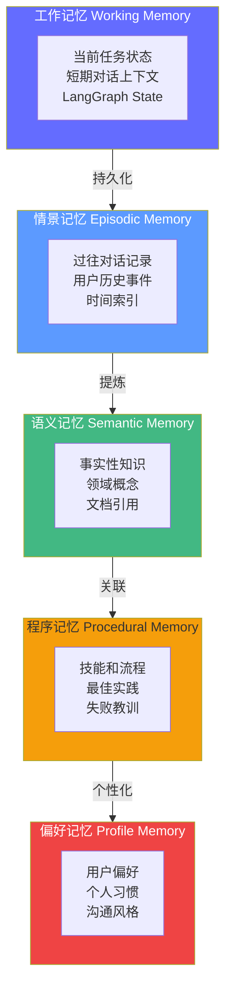
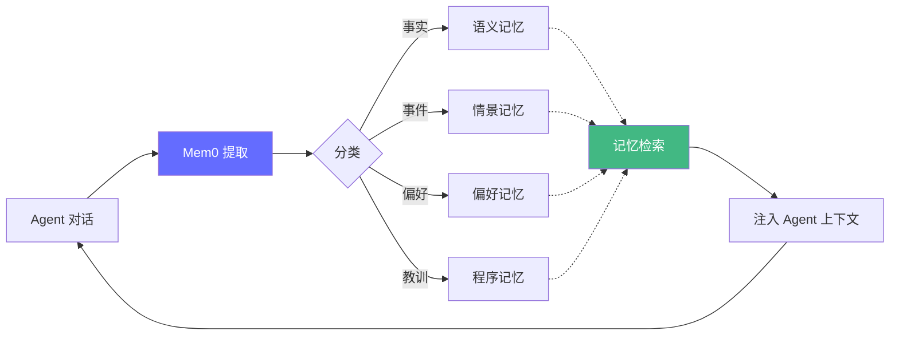
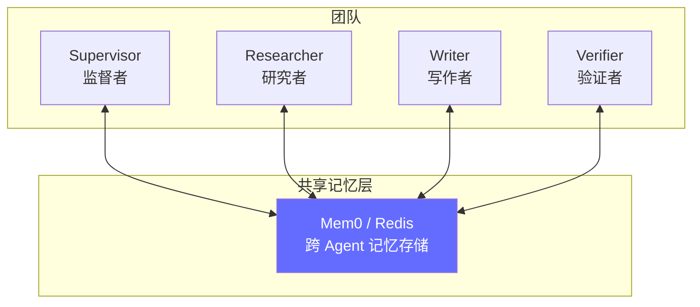

# 第六阶段：Agent 记忆工程——让智能体"记住你"

> 2026 年，Agent 记忆已从"context stuffing"发展为**有独立架构、工具和评测标准的工程领域**。Mem0 的诞生、LongMemEval 评测基准的发布、以及 LangGraph 的检查点机制，标志着记忆层正在成为 Agent 系统的标配。

## 前置知识

- Context Engineering（5 层上下文架构）
- LangGraph 状态图基础
- 向量检索概念

## 核心概念

### 为什么需要专门的记忆系统

| 仅用上下文窗口 | 专用记忆层 |
|----------------|------------|
| 随对话结束丢失 | 跨会话持久化 |
| 无结构化存储 | 可按用户/主题/时间检索 |
| 无法自我改进 | 可积累经验、偏好、教训 |
| 上下文窗口有限（128K） | 存储无上限，按需检索注入 |
| 每次重新加载所有上下文 | 动态选择最相关的记忆注入 |

**核心问题**：如何在海量记忆中，**快速找到最相关的片段**，并在**有限的上下文窗口中注入最有价值的信息**？

---

### 记忆架构的 5 个层次



#### 5 层记忆详解

| 层次 | 类比人类 | 存储方式 | 检索方式 | 示例 |
|------|---------|---------|---------|------|
| **工作记忆** | 短期记忆 | LangGraph State、Redis | 直接读取 | "正在处理第 2 步：查询报销标准" |
| **情景记忆** |  episodic memory | 向量库（时间索引） | 时间 + 语义检索 | "上周你帮我查过北京出差的报销政策" |
| **语义记忆** | 事实性知识 | 向量库 + 知识图谱 | 语义检索 | "公司的差旅报销上限是 800 元/天" |
| **程序记忆** | 技能和流程 | 结构化存储 + 向量库 | 关键词 + 语义检索 | "报销流程：提交 → 审批 → 打款" |
| **偏好记忆** | 个人偏好 | 键值存储 + 向量库 | 用户 ID + 语义检索 | "用户偏好简洁回答，不需要详细解释" |

---

### 1. 工作记忆（Working Memory）——LangGraph 检查点

工作记忆是 Agent 的"当前任务状态"，LangGraph 的检查点机制天然支持。

```python
from langgraph.checkpoint.memory import MemorySaver
from langgraph.checkpoint.postgres import PostgresSaver
from langgraph.graph import StateGraph, END
from typing import TypedDict

class AgentState(TypedDict):
    query: str
    results: list[dict]
    answer: str
    history: list[str]

# 1. 内存检查点（开发环境）
# 进程重启后丢失，但同一进程内可跨轮次保留状态
checkpointer = MemorySaver()

# 2. PostgreSQL 检查点（生产环境）
# 持久化到数据库，服务重启后仍能恢复
# checkpointer = PostgresSaver.from_conn_string("postgresql://...")

# 编译图时传入检查点
app = StateGraph(AgentState).compile(checkpointer=checkpointer)

# 使用 thread_id 标识对话会话
config = {"configurable": {"thread_id": "user-session-001"}}

# 第一轮对话
result1 = app.invoke({
    "query": "帮我查一下公司的报销政策",
    "results": [],
    "answer": "",
    "history": [],
}, config)

# 第二轮对话——Agent 能"记住"之前的内容
result2 = app.invoke({
    "query": "那出差报销呢？",  # 注意：没有重新说"公司的报销政策"
    "results": [],
    "answer": "",
    "history": [],
}, config)
# → Agent 知道"那出差报销"指的是"报销政策"的一部分
```

#### 检查点存储对比

| 存储方式 | 持久化 | 并发 | 适合场景 |
|----------|--------|------|----------|
| MemorySaver | 否（进程内） | 否 | 开发/测试 |
| PostgresSaver | 是 | 是 | 生产环境 |
| RedisSaver | 是 | 是 | 高并发、低延迟 |
| MongoDBSaver | 是 | 是 | 已有 MongoDB 基础设施 |

---

### 2. 长期记忆——Mem0 实战

[Mem0](https://mem0.ai/) 是 2026 年最流行的 Agent 记忆层，提供**跨会话的持久化记忆管理**。



#### Mem0 核心 API

```python
from mem0 import Memory

# 初始化——默认使用向量存储
memory = Memory()

# 1. 添加记忆——从对话中自动提取
result = memory.add(
    "张三喜欢用 Python 写代码，最近在学 LangGraph，项目 deadline 是 3 月 15 日",
    user_id="zhangsan",
)
# Mem0 自动提取结构化记忆：
# - {"memory": "张三喜欢用 Python", "category": "preference"}
# - {"memory": "张三在学 LangGraph", "category": "fact"}
# - {"memory": "项目 deadline 是 3 月 15 日", "category": "event"}

# 2. 检索记忆——语义搜索
memories = memory.search("张三最近在学什么？", user_id="zhangsan", limit=3)
for m in memories:
    print(f"[{m['score']:.2f}] {m['memory']}")
    # → [0.92] 张三在学 LangGraph
    # → [0.75] 张三喜欢用 Python

# 3. 获取所有记忆
all_memories = memory.get_all(user_id="zhangsan")
print(f"共 {len(all_memories)} 条记忆")

# 4. 更新记忆
memory.update(
    "张三已经掌握了 LangGraph，开始学习多智能体",
    memory_id=memories[0]["id"],
)

# 5. 删除记忆
memory.delete(memory_id=memories[0]["id"])
```

#### Mem0 在 Agent 中的使用模式

```python
from langchain_core.prompts import ChatPromptTemplate

class MemoryAgent:
    def __init__(self, llm, memory: Memory):
        self.llm = llm
        self.memory = memory

    def chat(self, query: str, user_id: str) -> str:
        # 1. 检索相关记忆
        relevant_memories = self.memory.search(query, user_id=user_id, limit=5)
        memory_context = "\n".join(f"- {m['memory']}" for m in relevant_memories)

        # 2. 将记忆注入上下文
        prompt = ChatPromptTemplate.from_template("""你是智能助手。

已知关于用户的信息：
{memory_context}

用户问题：{query}

基于已知信息回答。如果已知信息中没有相关内容，如实告知用户。""")

        # 3. 生成回答
        response = self.llm.invoke(prompt.format(memory_context=memory_context, query=query))

        # 4. 从对话中提取新记忆
        self.memory.add(
            f"用户说: {query}。助手回答: {response.content}",
            user_id=user_id,
        )

        return response.content
```

---

### 3. 对话历史管理——记忆压缩策略

随着对话变长，必须对历史进行**截断、摘要或压缩**，否则上下文窗口会被耗尽。

#### 4 种历史管理策略

| 策略 | 方法 | Token 消耗 | 记忆保留度 | 适用场景 |
|------|------|-----------|-----------|----------|
| **固定窗口** | 保留最近 N 轮对话 | 固定（~2K tokens） | 低（丢失早期信息） | 简单问答 |
| **滑动摘要** | 早期对话摘要 + 最近 N 轮原文 | 中（~3K tokens） | 中 | 多轮对话 |
| **重点提取** | 从历史中提取关键事实存入长期记忆 | 低（~1K tokens） | 高 | 长会话 |
| **对话摘要** | 用 LLM 对完整对话生成摘要 | 中（~2K tokens） | 中 | 会话结束归档 |

```python
from langchain_core.messages import SystemMessage, HumanMessage, AIMessage
from langchain_core.prompts import ChatPromptTemplate

def compress_history(
    messages: list,
    max_tokens: int = 3000,
    strategy: str = "sliding_summary",
) -> list:
    """压缩对话历史，控制 Token 消耗。"""

    if strategy == "fixed_window":
        # 固定窗口：只保留最后 N 条消息
        return messages[-10:]  # 最后 5 轮

    elif strategy == "sliding_summary":
        # 滑动摘要：早期对话摘要 + 最近 N 轮原文
        if len(messages) <= 6:
            return messages  # 对话短，不需要压缩

        # 最近 3 轮保留原文
        recent = messages[-6:]

        # 早期对话用 LLM 生成摘要
        early_messages = messages[:-6]
        early_text = "\n".join(m.content for m in early_messages if hasattr(m, "content"))

        summary_prompt = ChatPromptTemplate.from_template(
            "用 3 句话总结以下对话的关键信息：\n\n{early_text}"
        )
        summary = llm_small.invoke(summary_prompt.format(early_text=early_text))

        # 组合：摘要 + 原文
        return [SystemMessage(content=f"对话摘要: {summary.content}")] + recent

    elif strategy == "extraction":
        # 重点提取：从历史中提取事实，存入长期记忆
        # 然后只保留最近 N 轮
        extraction_prompt = ChatPromptTemplate.from_template(
            "从以下对话中提取关于用户的关键事实（5 条以内）：\n\n{history}\n\n"
            "以列表形式返回。"
        )
        facts = llm_small.invoke(extraction_prompt.format(
            history="\n".join(m.content for m in messages if hasattr(m, "content"))
        ))
        # 保存提取的事实到 Mem0
        memory.add(facts.content, user_id=user_id)
        return messages[-6:]  # 只保留最近 3 轮

    return messages
```

---

### 4. 多智能体共享记忆



```python
# 多个 Agent 共享同一个记忆存储
shared_memory = Memory()

# 研究者 Agent 保存发现
def researcher_node(state: TeamState) -> dict:
    findings = search_and_analyze(state["query"])
    # 保存研究发现到共享记忆
    shared_memory.add(
        f"研究发现: {findings}",
        user_id=state["thread_id"],  # 按会话 ID 组织
        metadata={"agent": "researcher", "timestamp": "2026-01-15"},
    )
    return {"result": findings}

# 写作者 Agent 读取共享记忆
def writer_node(state: TeamState) -> dict:
    # 检索研究者的发现
    research_memories = shared_memory.search(
        "研究发现",
        user_id=state["thread_id"],
        limit=5,
    )
    research_context = "\n".join(f"- {m['memory']}" for m in research_memories)

    # 同时检索用户偏好
    preference_memories = shared_memory.search(
        "用户偏好",
        user_id=state["thread_id"],
        limit=3,
    )

    report = write_report(research_context, preference_memories)
    return {"result": report}
```

---

### 5. 记忆评估——LongMemEval 基准

2026 年已有成熟的记忆评估基准，不再是"凭感觉"。

| 基准 | 评测内容 | 测试方法 |
|------|---------|----------|
| **LoCoMo** | 长期一致性——Agent 是否记住 30 天前说过的事 | 多轮对话后，问早期提及的事实 |
| **LongMemEval** | 长期记忆检索准确率——100 轮对话后能否准确检索 | 在长对话中插入事实，后续随机检索 |
| **BEAM** | 跨会话记忆质量——不同 session 间的一致性 | 多 session 测试，检查记忆连贯性 |

#### 自建记忆评估脚本

```python
# eval_memory.py
import asyncio
from mem0 import Memory

# 测试数据
TEST_SCENARIOS = [
    {
        "user_id": "user_001",
        "inject": "我的名字是张三，我在北京工作",
        "delay": "immediate",  # 立即测试
        "query": "我叫什么名字？我在哪个城市工作？",
        "expected": ["张三", "北京"],
    },
    {
        "user_id": "user_001",
        "inject": "我的团队有 5 个人，我们使用 Python 开发",
        "delay": "after_5_turns",  # 5 轮对话后测试
        "query": "我的团队有多大？用什么语言开发？",
        "expected": ["5", "Python"],
    },
]

async def evaluate_memory():
    memory = Memory()
    results = {"total": 0, "correct": 0}

    for scenario in TEST_SCENARIOS:
        # 1. 注入记忆
        memory.add(scenario["inject"], user_id=scenario["user_id"])

        # 2. 模拟干扰对话（延迟场景）
        if scenario["delay"] == "after_5_turns":
            distractions = [
                "今天天气怎么样？",
                "帮我写一段排序代码",
                "解释一下什么是 RAG",
                "Python 和 Go 有什么区别？",
                "推荐一个 REST 框架",
            ]
            for d in distractions:
                memory.add(f"用户问: {d}", user_id=scenario["user_id"])

        # 3. 检索并验证
        memories = memory.search(scenario["query"], user_id=scenario["user_id"], limit=5)
        retrieved_text = " ".join(m["memory"] for m in memories)

        results["total"] += len(scenario["expected"])
        for expected in scenario["expected"]:
            if expected.lower() in retrieved_text.lower():
                results["correct"] += 1

    accuracy = results["correct"] / results["total"] if results["total"] > 0 else 0
    print(f"记忆检索准确率: {accuracy:.0%} ({results['correct']}/{results['total']})")

asyncio.run(evaluate_memory())
```

## 工程视角

### 记忆层性能与成本

| 组件 | 延迟 | 成本（每千次） | 优化方法 |
|------|------|--------------|----------|
| Mem0 添加记忆 | ~50-100ms | ~$0.01（嵌入成本） | 批量添加、去重 |
| Mem0 检索记忆 | ~30-50ms | ~$0.005 | 限制 limit=5、缓存高频查询 |
| LangGraph 检查点 | ~5ms（内存） | $0 | — |
| 历史压缩（摘要） | ~500-1000ms | ~$0.003 | 用小模型（GPT-4o-mini）做摘要 |
| 对话提取事实 | ~300-500ms | ~$0.002 | 只在关键节点提取 |

### 记忆去重策略

```python
# 记忆去重——防止同一事实重复存储
def deduplicate_memory(memory: Memory, new_text: str, user_id: str, threshold: float = 0.85) -> bool:
    """检查是否已有相似记忆，避免重复存储。"""
    existing = memory.search(new_text, user_id=user_id, limit=3)
    for m in existing:
        if m["score"] >= threshold:
            # 高度相似——更新而非添加
            memory.update(new_text, memory_id=m["id"])
            return True  # 已去重
    return False  # 需要新增

# 使用
if not deduplicate_memory(memory, new_fact, user_id):
    memory.add(new_fact, user_id=user_id)
```

## 面试视角

### Q: Agent 记忆和 RAG 有什么区别？

**满分回答框架**：
- **RAG**：面向**外部知识**（文档、FAQ、产品手册），检索后注入上下文
- **记忆**：面向**个人化信息**（用户偏好、历史对话、经验教训），跨会话持久化
- **两者互补**：RAG 提供"世界知识"，记忆提供"个人知识"
- **技术栈不同**：RAG 用向量库 + 混合检索，记忆用 Mem0 + 检查点 + 提取策略

### Q: 如何实现一个跨会话记住用户偏好的 Agent？

**满分回答框架**：
1. **存储层**：用 Mem0 保存用户偏好（`memory.add("用户偏好简洁回答", user_id="xxx")`）
2. **检索层**：每轮对话前搜索相关记忆（`memory.search(query, user_id="xxx", limit=5)`）
3. **注入层**：将检索到的记忆注入系统提示
4. **更新层**：对话结束后提取新事实（用 LLM 从对话中提取用户偏好变化）
5. **去重层**：添加前检查是否已有相似记忆，避免重复
6. **压缩层**：定期用摘要压缩早期对话，提取关键事实存入记忆

### Q: 记忆系统如何评估好坏？

**满分回答框架**：
- **准确率**：用户问之前说过的事，Agent 能否正确回忆（LongMemEval 基准）
- **一致性**：不同 session 中对同一事实的回答是否一致（BEAM 基准）
- **时效性**：记忆是否能反映最新状态（更新/过期机制）
- **相关性**：注入的记忆是否真的对当前任务有帮助（A/B 测试）
- **成本**：记忆检索和压缩的 Token 成本是否在预算内

---

## 实战环节：构建一个带记忆的 Agent

### 目标

构建一个能跨会话记住用户信息、偏好和历史对话的 Agent。

### 环境要求

- Python 3.12+
- `uv add mem0 langgraph langchain langchain-openai`
- OpenAI API Key

### 步骤

**1. 创建记忆层 Agent**

```python
# memory_agent.py
from mem0 import Memory
from langchain_openai import ChatOpenAI
from langchain_core.prompts import ChatPromptTemplate
from langgraph.checkpoint.memory import MemorySaver
from langgraph.graph import StateGraph, END
from typing import TypedDict

class MemoryState(TypedDict):
    query: str
    answer: str
    user_id: str

class MemoryAgent:
    def __init__(self):
        self.llm = ChatOpenAI(model="gpt-4o-mini", temperature=0)
        self.memory = Memory()

        # 构建 LangGraph 工作记忆
        class AgentState(TypedDict):
            query: str
            answer: str
            history: list[str]

        def agent_node(state: AgentState) -> dict:
            # 检索长期记忆
            user_id = state.get("user_id", "default")
            memories = self.memory.search(state["query"], user_id=user_id, limit=5)
            memory_context = "\n".join(f"- {m['memory']}" for m in memories)

            prompt = ChatPromptTemplate.from_template("""你是智能助手。

关于用户的信息：
{memory_context}

用户问题：{query}

基于已知信息回答。如果不知道，诚实告知。""")

            response = self.llm.invoke(
                prompt.format(memory_context=memory_context, query=state["query"])
            )

            # 提取新记忆
            self.memory.add(
                f"用户: {state['query']}\n助手: {response.content[:200]}",
                user_id=user_id,
            )

            return {"answer": response.content, "history": state["history"] + [state["query"]]}

        graph = StateGraph(AgentState)
        graph.add_node("agent", agent_node)
        graph.set_entry_point("agent")
        graph.add_edge("agent", END)
        self.app = graph.compile(checkpointer=MemorySaver())

    def chat(self, query: str, user_id: str = "default") -> str:
        config = {"configurable": {"thread_id": f"{user_id}-session"}}
        result = self.app.invoke({
            "query": query,
            "answer": "",
            "history": [],
            "user_id": user_id,
        }, config)
        return result["answer"]
```

**2. 测试跨会话记忆**

```python
# test_memory.py
from memory_agent import MemoryAgent

agent = MemoryAgent()

# 会话 1：告诉 Agent 一些信息
print("=== 会话 1 ===")
result = agent.chat("我叫张三，在上海工作，喜欢用 Python 开发", user_id="user_001")
print(f"回答: {result}")

# 会话 2：不同 session，测试是否记住
print("\n=== 会话 2（新 session）===")
result = agent.chat("我叫什么名字？在哪个城市？", user_id="user_001")
print(f"回答: {result}")

# 会话 3：更新信息
print("\n=== 会话 3 ===")
result = agent.chat("我搬到北京了", user_id="user_001")
print(f"回答: {result}")

# 会话 4：验证更新
print("\n=== 会话 4 ===")
result = agent.chat("我在哪个城市工作？", user_id="user_001")
print(f"回答: {result}")
```

**3. 运行**

```bash
uv run python test_memory.py
```

### 验证成功

- [ ] 会话 2 能正确回答"张三，上海"（跨会话记忆）
- [ ] 会话 3 确认收到"搬到北京"的信息
- [ ] 会话 4 回答"北京"（记忆更新）
- [ ] 记忆检索延迟 < 100ms

### 思考题

1. 如果用户有 1000 条记忆，如何确保每次检索都能找到最相关的 5 条？Mem0 的 limit 参数应该怎么设置？
2. 记忆去重的阈值设为 0.85 是否合理？太高会漏去重，太低会误更新——如何自动找到最优阈值？
3. 如何实现记忆的"过期"机制？（比如 1 年前的项目 deadline 可能不再相关）

---

*上一阶段：[← RAG 系统](/tools/agentic-ai/05-rag-system) | [下一阶段：多智能体 →](/tools/agentic-ai/07-multi-agent)*
