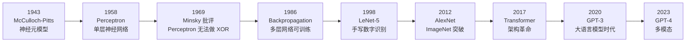
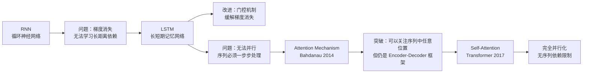
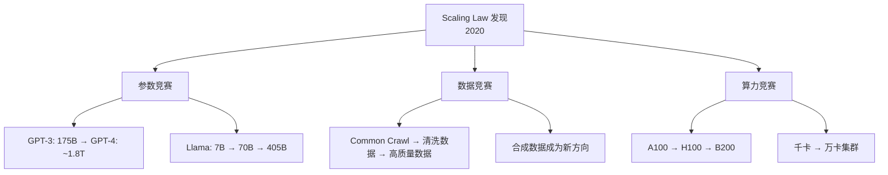
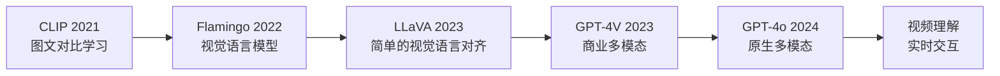

# 人工智能的发展历程

> 从图灵测试到 GPT-4，了解 AI 是如何一步步走到今天的。理解历史，才能判断未来。

## 为什么 FDE 需要了解 AI 历史

面试中不会直接考历史，但：

- 理解 **为什么 Transformer 能取代 RNN**，才能理解推理优化的方向
- 了解 **Scaling Law 的演进**，才能预判下一代模型的趋势
- 知道 **每次"AI 寒冬"的原因**，才能理性看待当前泡沫

---

## 第一次浪潮：符号主义 AI（1950s-1970s）

### 起源

1950 年，图灵发表论文《Computing Machinery and Intelligence》，提出 **图灵测试**：如果一台机器能够与人类进行对话，而人类无法区分它是机器还是人，那么这台机器就具有"智能"。

1956 年，达特茅斯会议首次提出 **Artificial Intelligence** 这一术语，标志着 AI 作为一门独立学科的诞生。

### 核心思想

```
智能 = 符号操作
只要把知识用符号表示出来，用逻辑规则推理，就能实现智能
```

### 代表性成果

| 年份 | 成果 | 意义 |
|------|------|------|
| 1956 | Logic Theorem Prover | 第一个 AI 程序，证明了罗素《数学原理》中的 38 个定理 |
| 1966 | ELIZA | 第一个聊天机器人，模拟心理治疗师 |
| 1970 | SHRDLU | 在受限积木世界中理解自然语言指令 |

### 第一次寒冬（1974-1980）

**原因：**

- 算力不足：当时的计算机内存只有几 KB，无法支撑有实用价值的系统
- 组合爆炸：符号推理的复杂度随问题规模指数增长
- Lighthill Report（1973）：英国政府报告认为 AI 研究"大部分是失败的"
- 资金断崖：DARPA 和英国政府大幅削减 AI 研究经费

---

## 第二次浪潮：专家系统与连接主义萌芽（1980s-1990s）

### 专家系统

```
专家系统 = 知识库（人工编写规则） + 推理引擎
```

代表系统：

| 系统 | 领域 | 规则数 | 效果 |
|------|------|--------|------|
| MYCIN | 血液感染诊断 | ~600 条 | 表现优于部分医生 |
| XCON | DEC 计算机配置 | ~10,000 条 | 每年为 DEC 节省 $40M |

### 连接主义的复兴

1986 年，Rumelhart、Hinton、Williams 发表 **Backpropagation** 论文，提出用反向传播训练多层神经网络。



### 第二次寒冬（1987-1993）

**原因：**

- 专家系统维护成本极高：每增加一条规则，可能破坏已有规则
- 桌面计算机崛起：通用计算机性能提升，专用 AI 硬件失去优势
- 神经网络再次被质疑：只能处理很小规模的问题

---

## 第三次浪潮：深度学习（2006-2017）

### 关键突破

| 年份 | 突破 | 意义 |
|------|------|------|
| 2006 | Hinton 提出 Deep Belief Network | "深度学习"一词诞生 |
| 2012 | **AlexNet** — GPU 训练的 CNN 在 ImageNet 夺冠 | 误差率从 26% 降到 15.3%，开启深度学习革命 |
| 2014 | **GAN** — 生成对抗网络 | 开启了生成式 AI 的先河 |
| 2014 | **Seq2Seq** — 编码器-解码器架构 | 机器翻译、文本生成的基础 |
| 2015 | **ResNet** — 残差网络 | 可训练 100+ 层的网络，CV 领域里程碑 |

### AlexNet 为什么重要

AlexNet 是第一个**真正用 GPU 训练**的深度学习模型：

```
CPU 训练：几周
GPU 训练：几天

GPU 的并行计算能力恰好匹配神经网络的海量矩阵运算
→ 从此 GPU 成为 AI 训练和推理的标准硬件
```

**这与 FDE 的关系：从 AlexNet 开始，AI 系统的性能优化就与 GPU 硬件深度绑定了。**

### RNN 的统治与局限

在 Transformer 出现之前，RNN（及其变体 LSTM、GRU）是 NLP 的主流架构：



**RNN 的核心问题**：无法并行训练。序列数据必须从左到右一步步处理，这在 GPU 上是巨大的浪费。

---

## Transformer 时代（2017-2020）

### 转折点：Attention Is All You Need（2017）

Google 提出 Transformer 架构，完全抛弃 RNN，只用 Self-Attention。

| 维度 | RNN/LSTM | Transformer |
|------|----------|-------------|
| 训练并行度 | 低（序列依赖） | 高（全局并行） |
| 长距离依赖 | 差（即使有 LSTM） | 好（直接 Attention） |
| 复杂度 | O(n) 步 | O(1) 步（但 Attention 是 O(n^2)） |
| 效果 | BLEU ~25 | BLEU ~28（翻译任务） |

### BERT（2018）

Google 用 Transformer Encoder 做预训练，在 11 个 NLP 任务上达到 SOTA。

```
预训练：在海量无标签文本上训练
    ↓
微调：在特定任务上用少量标注数据调整
    ↓
成为 NLP 的标准做法
```

### GPT 系列

| 模型 | 年份 | 参数量 | 关键创新 |
|------|------|--------|----------|
| GPT-1 | 2018 | 117M | 预训练 + 微调范式 |
| GPT-2 | 2019 | 1.5B | 无监督多任务能力，Zero-shot |
| GPT-3 | 2020 | **175B** | In-context Learning，Few-shot |

**GPT-3 的 In-context Learning 是范式转变**：不需要微调，只需在 prompt 里给几个例子，模型就能完成任务。

---

## 大语言模型时代（2020-2023）

### Scaling Law（2020）

OpenAI 发表论文，发现一个规律：

```
模型性能 ∝ (计算量)^a × (数据量)^b × (参数量)^c

其中 a ≈ b ≈ c ≈ 0.05

结论：只要增加计算、数据、参数，性能就会稳定提升
```

这个发现直接推动了后续的"军备竞赛"：



### ChatGPT 与对齐（2022）

```
GPT-3 → InstructGPT → ChatGPT

关键步骤：
1. 预训练（Pre-training）：海量文本上学习语言模型
2. 监督微调（SFT）：用人工标注的指令数据微调
3. RLHF：用人类反馈强化学习对齐输出
   a. 训练 Reward Model（人类标注偏好）
   b. PPO 优化策略（最大化 reward）
```

**RLHF 是 ChatGPT 成功的关键**。GPT-3 本身能力很强但"不听话"，RLHF 让它能遵循指令、拒绝有害请求。

### 开源崛起（2023）

| 项目 | 机构 | 意义 |
|------|------|------|
| Llama | Meta | 第一个大规模开源 LLM |
| Alpaca | Stanford | 用 52K 指令数据微调 Llama，效果接近 GPT-3.5 |
| Mistral 7B | Mistral AI | 7B 参数超越 Llama 2 13B |
| Qwen | 阿里 | 中文能力最强的开源模型之一 |

---

## 多模态与 Agent 时代（2023-2026）

### 多模态大模型



### Agent 系统

2023 年开始，研究从"模型本身"转向"如何使用模型"：

- **ReAct**：推理 + 行动的交替执行
- **Tool Use**：模型调用外部工具（搜索、代码执行、API）
- **Multi-Agent**：多个 Agent 协作完成复杂任务

---

## FDE 视角：从历史看未来

### 对岗位的影响

| 时代 | FDE 的角色 | 核心技能 |
|------|-----------|---------|
| 2020 前 | 模型服务化 | Docker、REST API |
| 2020-2022 | 大规模推理 | GPU 集群、分布式 |
| 2023-2024 | 推理优化 | vLLM、量化、KV Cache |
| 2025-2026 | **全栈部署** | 多模态、Agent、成本控制 |

### 每次技术变革带来的新优化点

```
RNN → Transformer：
  新优化点：KV Cache、Attention 加速

单模态 → 多模态：
  新优化点：图像/视频 encoder 的推理加速

单模型 → Agent：
  新优化点：多轮调用的延迟优化、工具调用的缓存

这些变化意味着 FDE 的技能栈需要持续更新。
```

---

## 面试视角

**Q: "说说 AI 发展历程中几个关键转折点？"**

回答框架：

1. **2012 AlexNet** — GPU + CNN，深度学习革命开始
2. **2017 Transformer** — 完全并行化，取代 RNN
3. **2020 GPT-3 + Scaling Law** — 证明"大就是好"，In-context Learning
4. **2022 ChatGPT + RLHF** — 对齐技术让模型"听话"
5. **2023 开源 LLM 爆发** — Llama、Mistral、Qwen，降低使用门槛

**Q: "为什么 GPU 成为 AI 的标准硬件？"**

- AlexNet（2012）首次用 GPU 训练 CNN，速度提升 50x
- GPU 的 SIMD 架构天然匹配矩阵乘法
- 从此 AI 和 GPU 深度绑定，FDE 必须理解 GPU 架构

---

*下一节：[什么是 FDE](./01-what-is-fde.md)*
