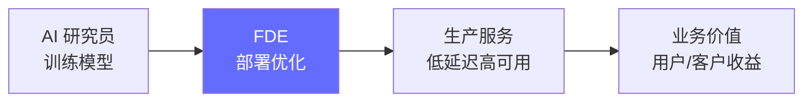
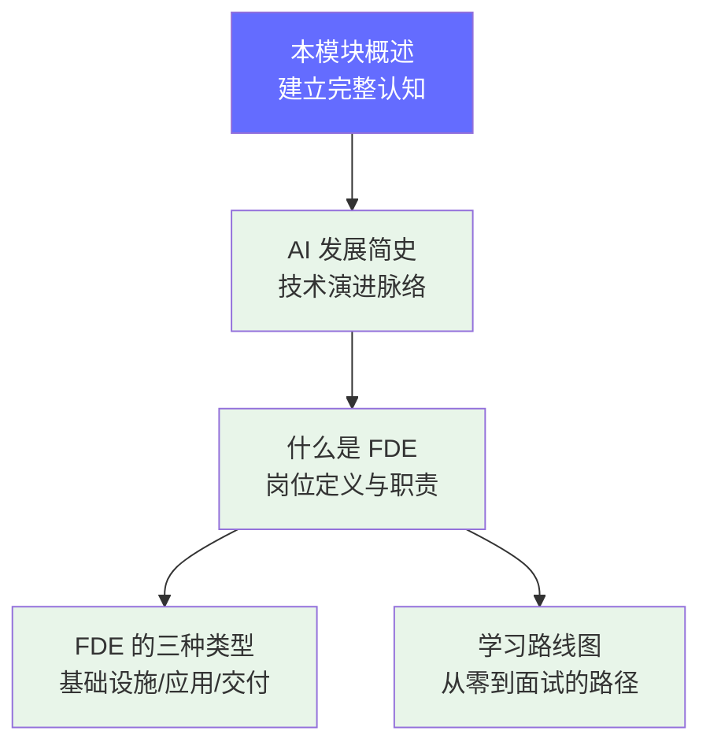

# 入门篇：什么是 FDE

> FDE（Frontier Deployment Engineer）是 AI 落地最后一公里的关键角色。本模块帮你建立对岗位、学习路线和能力模型的完整认知。

## 前置知识

无需任何技术前置——任何背景的读者都可以从这里开始。如果你已经熟悉 LLM 的基本概念，可以直接跳过 `AI 发展简史`。

## 为什么需要学这个

AI 行业快速发展，但 "会用 API" 不等于 "能部署"。FDE 填补的是从模型能力到生产服务之间的工程鸿沟。

这个模块帮助你：
- **建立岗位认知**：FDE 是什么、做什么、为什么重要
- **选择学习路径**：根据自己的背景选择最合适的路线
- **评估能力差距**：清楚自己当前的水平和需要补足的方向

## 本模块学习地图

| 顺序 | 文档 | 解决什么问题 | 时长 |
|------|------|-------------|------|
| 1 | [AI 发展简史](./00-ai-history.md) | 了解 LLM 的技术演进脉络 | 20 分钟 |
| 2 | [什么是 FDE](./01-what-is-fde.md) | FDE 岗位的定义、职责、行业背景 | 30 分钟 |
| 3 | [学习路线图](./02-learning-path.md) | 从零到面试的完整 18 周路径 | 15 分钟 |
| 4 | [FDE 的三种类型](./03-fde-types.md) | 基础设施型 vs 应用部署型 vs 客户交付型 | 25 分钟 |

## 核心概念速览

**FDE 的三种类型：**

| 类型 | 核心职责 | 技术要求 | 适合谁 |
|------|---------|---------|-------|
| **基础设施型 FDE** | GPU 集群、推理框架、分布式部署 | 深度（GPU/网络/编译器） | 有 SRE/Infra 经验 |
| **应用部署型 FDE** | Prompt 工程、RAG、Agent、评测 | 广度（全栈 AI 应用） | 有后端/应用开发经验 |
| **客户交付型 FDE** | 方案落地、客户对接、定制开发 | 综合（技术 + 沟通） | 有售前/咨询经验 |

**能力五维模型：** 工程能力、AI 理解力、运营意识、学习力、协作力——详见 [FDE 的三种类型](./03-fde-types.md)。

## 面试视角

面试前 10 分钟通常在考察 "你是否真正理解这个岗位在做什么"。本模块的文档帮助你形成清晰的岗位认知框架，让面试官看到你：
- 能清楚描述 FDE 的核心职责
- 知道不同类型的 FDE 对应不同的技术栈
- 有系统的学习路径，不是零散学知识点

## 学完本模块后，你应该能够...

- [ ] 清晰描述 FDE 岗位的定义和三种类型
- [ ] 说出从模型到上线的完整工程链路
- [ ] 制定适合自己的学习路径
- [ ] 评估自己当前的能力差距

*下一节：[AI 发展简史](./00-ai-history.md)*
