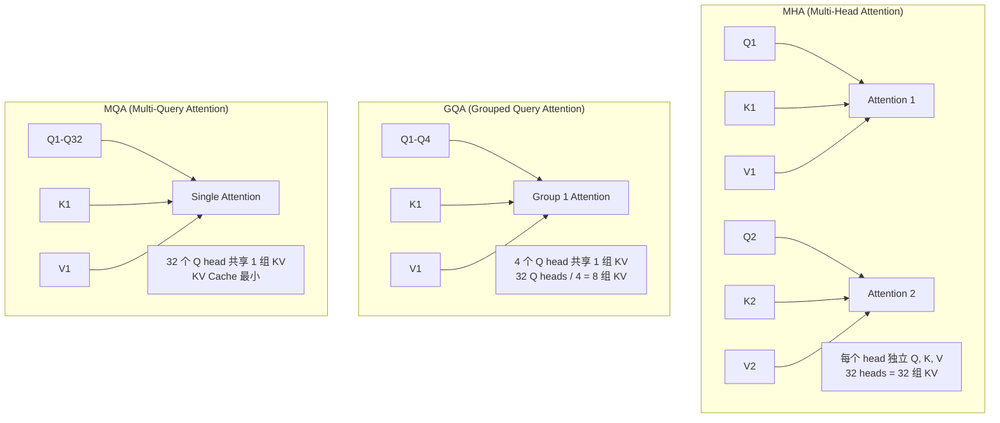

# Attention 机制深入

> 从 MHA 到 GQA 到 MQA，Attention 结构的演进是推理优化的核心线索

## 前置知识

- [Transformer 架构概述](./transformer-overview.md) — 理解推理的两个阶段和 KV Cache

## 核心概念

### 为什么 Attention 头结构影响部署

KV Cache 是推理中最大的显存消耗。Attention 头数直接决定 KV Cache 大小。而 Query、Key、Value 的分组方式（MHA / GQA / MQA）决定了每个 token 需要缓存多少数据。

### MHA 详细工作原理

```
输入: hidden_states [batch, seq_len, d_model]
      其中 d_model = num_heads × head_dim

1. 线性投影:
   Q = hidden @ W_q   → [batch, seq_len, num_heads × head_dim]
   K = hidden @ W_k   → [batch, seq_len, num_heads × head_dim]
   V = hidden @ W_v   → [batch, seq_len, num_heads × head_dim]

2. reshape 为多头:
   Q → [batch, seq_len, num_heads, head_dim] → transpose → [batch, num_heads, seq_len, head_dim]
   K → [batch, seq_len, num_heads, head_dim] → transpose → [batch, num_heads, seq_len, head_dim]
   V → [batch, seq_len, num_heads, head_dim] → transpose → [batch, num_heads, seq_len, head_dim]

3. Attention 计算:
   scores = Q @ K^T / sqrt(head_dim)   → [batch, num_heads, seq_len, seq_len]
   attn   = softmax(scores, dim=-1)
   output = attn @ V   → [batch, num_heads, seq_len, head_dim]

4. 拼接 + 输出投影:
   output → transpose → [batch, seq_len, num_heads, head_dim]
          → reshape → [batch, seq_len, d_model]
          → @ W_o → [batch, seq_len, d_model]
```

以 Llama 3 8B 为例：
- `num_heads = 32`, `head_dim = 128`, `d_model = 4096`
- 每个 Q/K/V 投影矩阵：`[4096, 4096]`
- KV Cache 每个 token 每层：`2 × 32 × 128 × 2 bytes = 16 KB`

### MHA / GQA / MQA 结构对比



### GQA 的分组策略

GQA 的核心思想：将 `num_heads` 个 Query head 分成 `G` 组，每组共享一组 K 和 V。

```
num_kv_heads = num_q_heads / G

KV Cache 减少倍数 = G 倍
```

**为什么 8 KV groups 是主流选择？**

| groups (G) | KV Cache 减少倍数 | 质量损失 | 代表模型 |
|-----------|-------------------|----------|----------|
| 1 (MQA) | num_heads 倍 | 较明显 | Falcon |
| 2 | num_heads/2 | 轻微 | 少数实验性模型 |
| **4** | **num_heads/4** | **极小** | **部分 Qwen 模型** |
| **8** | **num_heads/8** | **几乎不可测** | **Llama 3 70B、Qwen2** |
| 16 | num_heads/16 | 几乎为 0 | 过度分组，收益递减 |

8 groups 是经验和实验得出的甜蜜点：
- 质量：与 MHA 的差距通常 < 1%（在基准测试上）
- KV Cache：减少 8 倍，显存压力大幅下降
- 计算：Q @ K^T 的形状从 `[32, seq, seq]` 变为 `[8, seq, seq]`，Attention 计算也减少

### MQA 质量下降原因分析

MQA 将所有 Q heads 共享一组 KV，极端压缩了 KV Cache。但质量下降的原因在于：

1. **表达能力受限**：所有 Query head 只能从一个 KV 空间中提取信息，相当于限制了 Attention 的"关注维度"
2. **位置信息混淆**：不同 Query head 负责捕获不同位置关系的信息，共享 KV 后这些关系被压缩到一个低维空间
3. **训练不稳定**：单组 KV 需要同时服务所有 Q heads，梯度更新冲突更多

实验数据：MQA 相比 MHA 通常有 1-3% 的质量下降，而 GQA-8 几乎无下降。

### FlashAttention 原理简介

FlashAttention 是一种 **IO-aware** 的 Attention 实现，核心思路：

```
传统 Attention:
  QK^T 结果存到 HBM → softmax → 结果存到 HBM → 读取后与 V 相乘
  HBM 访问次数: O(N^2) 次读 + O(N^2) 次写（N = seq_len）

FlashAttention:
  将矩阵分块，每次只加载一个 tile 到 SRAM（片上缓存）
  在 SRAM 内完成 QK^T → softmax → V 的完整计算
  HBM 访问次数: O(N^2) 但常数大幅减小

关键优化:
  - 利用 SRAM（~192KB on A100）替代 HBM 的反复读写
  - 在线 softmax（online softmax）避免存储完整的 attention matrix
  - 重计算（recomputation）反向传播时重算而非存储
```

效果：在 A100 上，FlashAttention 2 比标准 Attention 快 **2-4x**，显存减少 **~20%**。

## 部署视角

### GQA 对部署的具体影响

**batch size 上限提升**：

```
假设 A100 80GB，预留 10GB 给权重和其他：
  可用显存给 KV Cache: ~70GB

MHA (32 KV heads, Llama-1 13B 级别):
  每 token 每层 KV: 2 × 32 × 128 × 2 = 16 KB
  40 层, seq=4096: 16 KB × 40 × 4096 × batch / 1GB
  batch_max ≈ 16

GQA (8 KV heads):
  每 token 每层 KV: 2 × 8 × 128 × 2 = 4 KB
  同样条件下: batch_max ≈ 64

结论：GQA 将 batch size 上限提升 4-8 倍。
```

**实际数字对比**：

| 模型 | Attention 类型 | batch_max (seq=4K, A100 80G) | 吞吐 (token/s) |
|------|---------------|------------------------------|----------------|
| Llama-1 13B | MHA (13B) | ~16 | ~400 |
| Llama 3 70B | GQA (8 groups) | ~32 | ~200 |
| Falcon 40B | MQA | ~128 | ~600 |

### KV Cache 节省的具体数字

```
Llama 3 70B, FP16, batch=32, seq_len=8192:

MHA (假设 32 KV heads):
  KV = 2 × 80 × 32 × 8192 × 32 × 128 × 2 ≈ 343 GB

GQA (8 KV heads):
  KV = 2 × 80 × 32 × 8192 × 8 × 128 × 2 ≈ 86 GB

节省: 343 - 86 = 257 GB (减少 75%)

这决定了 70B 模型能否在单张 A100 80G 上部署。
```

### 常见问题排查

| 症状 | 排查方向 |
|------|----------|
| MHA 模型 OOM | 切换到 GQA 模型或降低 batch/seq_len |
| FlashAttention 报错 | 检查 GPU 架构（需要 Ampere 及以上）、seq_len 是否超限 |
| GQA 推理质量差 | 检查是否正确加载了 GQA 的 KV head 映射 |

## 面试视角

### 面试官会怎么问

**Q1: "GQA 是怎么减少 KV Cache 的？为什么 8 groups 是主流？"**

满分回答：
- GQA 将 num_heads 个 Q 分成 G 组，每组共享一组 K 和 V
- KV heads = num_heads / G，KV Cache 减少 G 倍
- 8 groups 是实验得出的甜蜜点：质量损失 < 1%，KV Cache 减少 8 倍
- Llama 3 70B、Qwen2 都采用 8 groups

**Q2: "FlashAttention 为什么比普通 Attention 快？"**

满分回答：
- 传统 Attention 反复在 HBM 和 GPU 之间搬运 O(N^2) 的中间结果
- FlashAttention 利用 SRAM 分块计算，在片上完成完整的 QK^T → softmax → V
- IO-aware 设计：根据 SRAM 大小自动选择最优 tile size
- 在线 softmax 避免存储完整 attention matrix
- 速度提升 2-4x，显存减少 ~20%

**Q3: "MQA 为什么能最小化 KV Cache？它有什么代价？"**

满分回答：
- MQA 所有 Q heads 共享唯一一组 K 和 V，KV heads = 1
- KV Cache 减少 num_heads 倍
- 代价：表达能力受限，不同位置关系被压缩到一个低维空间
- 质量通常下降 1-3%，训练更不稳定
- Falcon 系列使用 MQA，但在更大模型中业界转向 GQA

**Q4: "MHA 中 Q/K/V 的维度是怎么变换的？"**

满分回答：
- 输入 `[batch, seq, d_model]` 经过线性层投影为 `[batch, seq, d_model]`
- reshape 为 `[batch, seq, num_heads, head_dim]`
- transpose 为 `[batch, num_heads, seq, head_dim]`（方便矩阵乘法）
- Q @ K^T 得到 `[batch, num_heads, seq, seq]` 的注意力分数
- softmax 后再 @ V `[batch, num_heads, seq, head_dim]`
- 最终 transpose + reshape 回 `[batch, seq, d_model]`

## 对比分析

### 三种 Attention 方案全面对比

| 维度 | MHA | GQA | MQA |
|------|-----|-----|-----|
| KV heads | num_heads | num_heads/G | 1 |
| KV Cache | 1x (基准) | 1/G | 1/num_heads |
| 模型质量 | 基准 | -0~1% | -1~3% |
| 训练稳定性 | 好 | 好 | 一般 |
| 最大 batch | 小 | 中等 | 大 |
| 长上下文可行性 | 差 | 好 | 很好 |
| 代表模型 | GPT-3, Llama-1 | Llama 3, Qwen2 | Falcon |

## 最佳实践

### 调参建议

- **选型优先级**：GQA > MQA > MHA（综合质量和效率）
- **FlashAttention**：必须开启（Ampere 及以上 GPU），默认 v2
- **GQA groups 选择**：生产环境用 8 groups（已有模型支持），实验可尝试 4 groups
- **seq_len > 16K 时**：必须用 GQA 或 MQA，MHA 的 KV Cache 会 OOM

### 避坑指南

- MHA 模型做长上下文推理时，batch=1 都可能 OOM
- FlashAttention 不支持 FP64，确保推理框架使用 FP16/BF16/FP8
- 不同框架对 GQA 的支持程度不同：vLLM 原生支持，但某些旧引擎需要手动适配 KV head 映射
- GQA 的 KV head 数必须整除 Q head 数，否则 reshape 会失败

*上一节：[Transformer 架构概述](./transformer-overview.md)*
*下一节：[KV Cache 详解](./kv-cache.md)*
