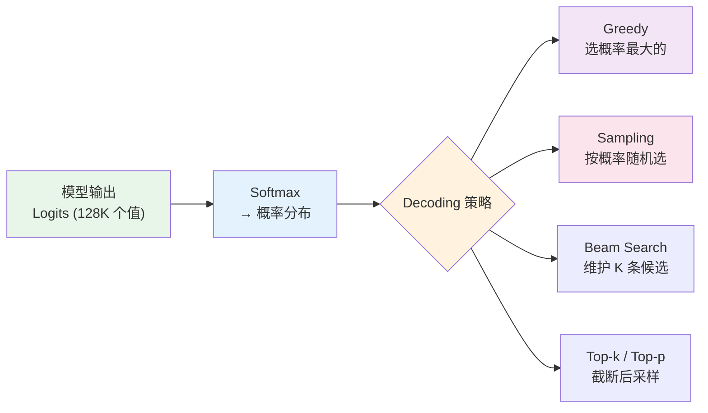
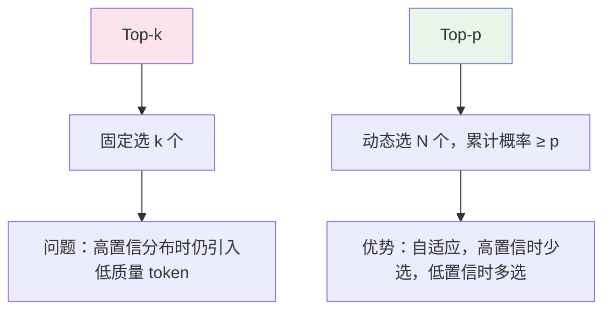
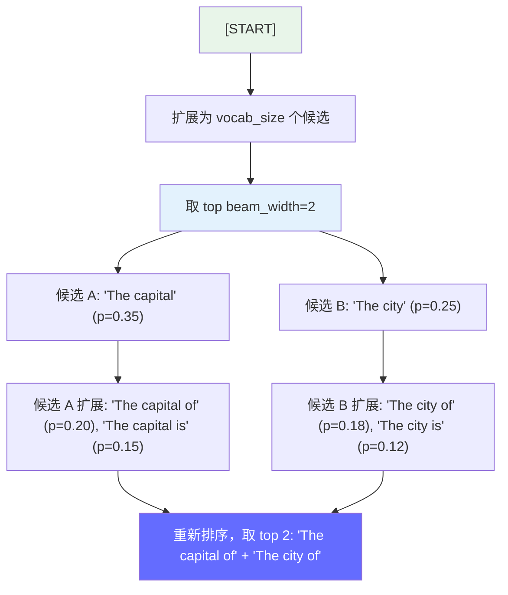
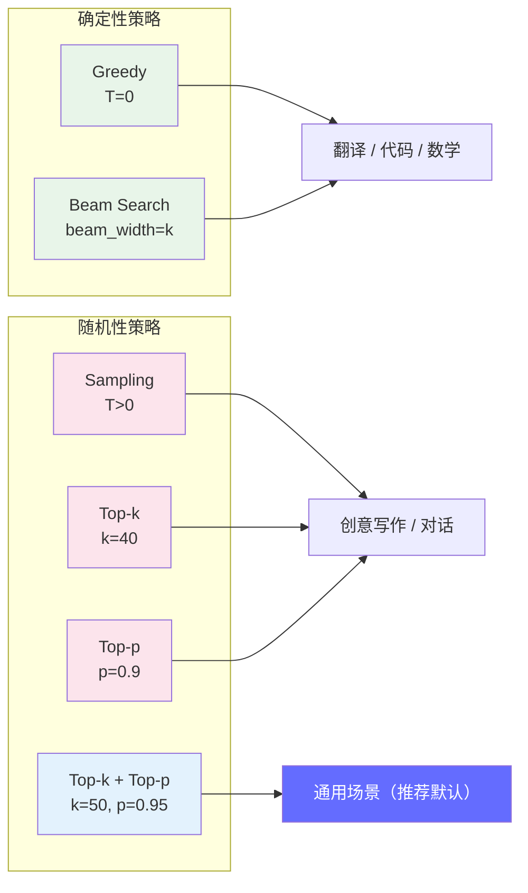

# Decoding 策略 — 从采样到生成的完整指南

> Decoding 策略决定了模型"如何从概率分布中选出下一个 token"，直接影响输出质量、多样性和推理性能。它是 LLM 推理中最基础也最常被问到的概念。

---

## 前置知识

- [Transformer 架构](./transformer-overview.md)
- [Attention 机制](./attention-mechanism.md)

---

## 核心概念：Decode 阶段发生了什么

在每个 Decode 步，模型输出一个 **logits 向量**（词汇表大小的未归一化分数），需要从中选出一个 token 作为输出：

```
词汇表大小: 128,000（如 Qwen2.5）

模型输出 logits: [3.2, -1.5, 0.8, 7.1, -0.3, ..., 2.4]  ← 128,000 个值

Decoding 策略的作用：从这个向量中选出下一个 token
```



---

## 一、Greedy Decoding（贪心解码）

### 原理

每个 Decode 步都选择 **概率最高的 token**：

```python
# 伪代码
logits = model(input_ids)        # [1, vocab_size]
probs = softmax(logits / temperature)  # temperature=1 时等价于 softmax
next_token = argmax(probs)       # 选概率最大的
```

### 特点

| 维度 | 说明 |
|------|------|
| 确定性 | 相同输入一定产生相同输出 |
| 质量 | 容易重复、单调（"I I I I I..."） |
| 速度 | 最快（只需要 argmax） |
| 适用场景 | 翻译、代码生成、摘要等需要确定性的任务 |

### 示例

```
输入: "The capital of France is"

Greedy: "Paris." ← 概率最高的 token 是 "Paris"
```

---

## 二、Sampling（随机采样）

### 原理

按 **概率分布随机选择** token，概率越高的被选中的概率越大：

```python
# 伪代码
logits = model(input_ids)
probs = softmax(logits / temperature)
next_token = random.choice(vocab, weights=probs)  # 按概率采样
```

### Temperature 的作用

```
Temperature 控制概率分布的"尖锐程度"：

假设原始 logits: [2.0, 1.0, 0.5, -0.5, -1.0]

T = 0.1（尖锐）:  logits/T = [20, 10, 5, -5, -10]
  softmax → [0.88, 0.04, 0.003, ~0, ~0] → 几乎确定选第1个
T = 1.0（原始）:  softmax → [0.51, 0.19, 0.11, 0.04, 0.02] → 按原始概率
T = 2.0（平坦）:  logits/T = [1.0, 0.5, 0.25, -0.25, -0.5]
  softmax → [0.33, 0.20, 0.16, 0.10, 0.06] → 更接近均匀随机

公式: probs = softmax(logits / T)
  T → 0: 趋近 greedy（分布极尖锐）
  T → ∞: 趋近均匀随机（分布极平坦）
```

### 特点

| 维度 | 说明 |
|------|------|
| 多样性 | 高，每次输出不同 |
| 质量 | 可能出现不合理的内容（低概率 token 被选中） |
| 速度 | 比 greedy 稍慢（需要随机采样） |
| 适用场景 | 创意写作、头脑风暴 |

---

## 三、Top-k Sampling

### 原理

只从 **概率最大的 k 个 token** 中采样，排除低概率的"长尾"token：

```
原始概率分布（vocab=8）:
[0.35, 0.25, 0.15, 0.10, 0.07, 0.04, 0.03, 0.01]

Top-k=3:
只保留前 3 个: [0.35, 0.25, 0.15]
重新归一化:    [0.47, 0.33, 0.20]  ← 在这 3 个中采样
排除:          [0.07, 0.04, 0.03, 0.01]
```


### 参数选择

| k 值 | 效果 | 适用场景 |
|------|------|---------|
| k=1 | 等价于 greedy | 翻译、代码 |
| k=10-20 | 多样性适中 | 对话、问答 |
| k=40-50 | 多样性高 | 创意写作 |
| k=100+ | 几乎无限制 | 自由创作 |

---

## 四、Top-p Sampling（Nucleus Sampling）

### 原理

选择 **累计概率达到 p 的最小 token 集合**，而不是固定数量：

```
排序后的概率分布:
[0.30, 0.20, 0.15, 0.12, 0.08, 0.06, 0.05, 0.04]

累计概率:
[0.30, 0.50, 0.65, 0.77, 0.85, 0.91, 0.96, 1.00]

Top-p=0.9:
取累计概率首次 ≥ 0.9 的前 N 个 token → 前 6 个 (0.30+0.20+0.15+0.12+0.08+0.06 = 0.91)
重新归一化后在这 6 个中采样
```

### Top-k vs Top-p 对比



| 维度 | Top-k | Top-p |
|------|-------|-------|
| 选择方式 | 固定数量 k | 动态数量，累计概率 ≥ p |
| 自适应性 | 无 | 有（高置信时少选，低置信时多选） |
| 推荐值 | k=40-50 | p=0.9-0.95 |
| 实际效果 | 可能选入质量很差的 token | 更智能地截断 |

---

## 五、Top-k + Top-p 组合

实际中最常用的策略：先 Top-k 截断，再 Top-p 截断：

```python
# 典型实现（vLLM / OpenAI API）
logits = model(input_ids)

# Step 1: Top-k 截断
top_k_logits, top_k_indices = torch.topk(logits, k=50)
logits = torch.full_like(logits, float('-inf'))
logits[top_k_indices] = top_k_logits

# Step 2: Top-p 截断
probs = torch.softmax(logits / temperature, dim=-1)
sorted_probs, sorted_indices = torch.sort(probs, descending=True)
cumulative_probs = torch.cumsum(sorted_probs, dim=-1)
# 找到累计概率 ≥ p 的最小集合
sorted_indices_to_remove = cumulative_probs > p
sorted_indices_to_remove[..., 1:] = sorted_indices_to_remove[..., :-1].clone()
sorted_indices_to_remove[..., 0] = False
probs[sorted_indices[sorted_indices_to_remove]] = 0.0

# Step 3: 采样
next_token = torch.multinomial(probs, num_samples=1)
```

---

## 六、Beam Search

### 原理

维护 **k 条候选序列**（beam），每步展开所有候选的所有可能后继，取概率最高的 k 条：



### 伪代码

```python
# beam_width = k
beams = [(start_token, 1.0)]  # (sequence, cumulative_prob)

for step in range(max_steps):
    all_candidates = []
    for seq, score in beams:
        logits = model(seq)
        probs = softmax(logits)
        top_k = torch.topk(probs, k=beam_width)
        for token, prob in zip(top_k.indices, top_k.values):
            all_candidates.append((seq + [token], score * prob))

    # 按累积概率排序，取 top beam_width
    beams = sorted(all_candidates, key=lambda x: x[1], reverse=True)[:beam_width]
```

### 特点

| 维度 | 说明 |
|------|------|
| 质量 | 最高（系统性地探索多条路径） |
| 多样性 | 低（beam_width 越大，输出越"安全"） |
| 速度 | 最慢（需要维护 k 条候选，每步对 k 条序列分别做 forward pass） |
| 显存 | k 倍的 decode 开销（k 条序列的 KV Cache） |
| 适用场景 | 翻译、摘要等需要高质量输出的任务 |

---

## 七、完整策略对比



| 策略 | 确定性 | 多样性 | 质量 | 速度 | 适用场景 |
|------|--------|--------|------|------|---------|
| **Greedy** | ✅ | ❌ | 中等（易重复） | 最快 | 翻译、代码、数学题 |
| **Beam Search** | ✅ | ❌ | 最高 | 最慢 | 翻译、摘要 |
| **Sampling (T=1)** | ❌ | ✅ | 中等 | 快 | 创意写作 |
| **Sampling (T=0.1)** | ~ ✅ | ~ ❌ | 高 | 快 | 需要确定性但有微调 |
| **Top-k (k=40)** | ❌ | ✅ | 中等 | 快 | 对话 |
| **Top-p (p=0.9)** | ❌ | ✅ | 中等 | 快 | 通用 |
| **Top-k + Top-p** | ❌ | ✅ | 中高 | 快 | **通用推荐默认** |

---

## 八、Penalty 机制 — 控制重复和新颖度

除了上述采样策略，LLM API 还提供 **Penalty 参数** 来控制生成内容的重复程度：

```
Presence Penalty（出现惩罚）:
  只要 token 在已生成序列中出现过，就给 logits 减去一个固定值
  效果: 鼓励使用新词汇，减少重复模式
  值域: -2.0 ~ 2.0，0 表示无惩罚
  示例: presence_penalty=0.1 → "我 喜欢 吃 苹果" 比 "我 喜欢 喜欢 喜欢 苹果" 更可能

Frequency Penalty（频率惩罚）:
  按 token 出现的次数施加惩罚，出现越多惩罚越重
  效果: 减少高频重复（如 "哈哈哈哈哈..."）
  值域: -2.0 ~ 2.0，0 表示无惩罚
  示例: frequency_penalty=0.5 → 出现 1 次的 token 罚 0.5，出现 3 次的罚 1.5

两者区别:
  Presence: 不管出现几次，只要出现过就惩罚（二元判断）
  Frequency: 出现次数越多惩罚越重（线性增长）

实战建议:
  创意写作: presence_penalty=0.1, frequency_penalty=0.1（鼓励多样性）
  代码生成: 两者都设为 0（代码需要精确重复，如函数调用）
  对话: presence_penalty=0.1（减少口头禅重复）
```

---

## 九、在推理引擎中的实现

### vLLM 中的 Decoding 参数

```python
from vllm import SamplingParams

# Greedy
SamplingParams(temperature=0.0)

# Top-k + Top-p + Temperature
SamplingParams(
    temperature=0.7,
    top_p=0.9,
    top_k=50,
)

# Beam Search
SamplingParams(
    use_beam_search=True,
    best_of=3,
)

# 其他常用参数
SamplingParams(
    temperature=0.7,
    top_p=0.9,
    top_k=50,
    max_tokens=2000,
    stop=["</thinking>", "\n\n"],          # 停止词
    presence_penalty=0.1,                  # 鼓励新内容
    frequency_penalty=0.1,                 # 惩罚重复
    seed=42,                               # 确定性采样（固定随机种子）
)
```

### 各种策略的性能影响

```
以 Llama-3-8B 在 H100-80G 上为例（batch=32, seq_len=1024, FP16）：

策略                  | 吞吐 (tok/s) | 相对速度 | 备注
─────────────────────|-------------|---------|------
Greedy (T=0)         | 6,500       | 1.00x   | 基准
Sampling (T=0.7)     | 6,400       | 0.98x   | 采样开销极小
Top-k (k=50)         | 6,300       | 0.97x   | top-k 截断开销极小
Top-p (p=0.9)        | 6,200       | 0.95x   | 排序 + 累计概率
Beam Search (k=3)    | 2,200       | 0.34x   | 需要 3 条并行 decode
Beam Search (k=5)    | 1,300       | 0.20x   | 需要 5 条并行 decode

> 注意：实际数值因 GPU 型号、batch 大小、prompt 长度而异。核心结论是采样策略对性能影响极小，Beam Search 对性能影响显著。
```

> **关键洞察**：Sampling / Top-k / Top-p 对性能影响极小（< 5%），因为主要计算在模型 forward pass，采样开销可忽略。Beam Search 是唯一对性能有显著影响的策略（3-5x 变慢）。

---

## 面试视角

### 常考问题

1. **"Temperature 是怎么影响生成的？"**

   - Temperature 是 softmax 的"温度"参数：`probs = softmax(logits / T)`
   - T → 0：概率分布趋尖锐，趋近 greedy，输出确定性最高
   - T = 1：原始概率分布
   - T → ∞：概率分布趋平坦，趋近均匀随机
   - 推荐：事实问答 T=0-0.3，对话 T=0.7，创意 T=0.9-1.0

2. **"Top-k 和 Top-p 有什么区别？为什么通常一起用？"**

   - Top-k 固定选 k 个，不自适应
   - Top-p 按累计概率动态选，高置信时少选，低置信时多选
   - 一起用：先 Top-k 排除明显很差的 token，再 Top-p 精确截断
   - 推荐默认值：k=50, p=0.95

3. **"Beam Search 为什么在翻译任务中最常用？"**

   - 翻译需要高质量、确定性输出
   - Beam Search 系统性地探索多条候选路径，找到累积概率最高的序列
   - 缺点是速度最慢（k 次 forward pass）
   - 实际中 beam_width=3-5 是甜蜜点

4. **"Decoding 策略对推理性能有什么影响？"**

   - Greedy / Sampling / Top-k / Top-p：影响 < 5%（采样开销可忽略）
   - Beam Search：3-5x 变慢（需要 k 次 forward pass，k 倍的 decode 开销）
   - 生产环境中通常不用 Beam Search（除非翻译等特定场景）

5. **"Presence Penalty 和 Frequency Penalty 是什么？"**

   - **Presence Penalty**：对已出现的 token 施加惩罚，鼓励模型使用新词汇
   - **Frequency Penalty**：按 token 出现的频率施加惩罚，减少重复
   - 值域：通常 [-2.0, 2.0]，0 表示无惩罚
   - 适用：减少生成中的重复模式

---

## 扩展阅读

- [The Curious Case of Neural Text Degeneration](https://arxiv.org/abs/1904.09751) — Top-p (Nucleus) Sampling 原始论文
- [Beam Search in Machine Translation](https://www.aclweb.org/anthology/D16-1088/) — Beam Search 分析
- [vLLM SamplingParams Documentation](https://docs.vllm.ai/en/latest/dev/sampling_params.html) — vLLM 参数文档

---

*上一节：[Thinking 模型](./thinking-models.md)*
*下一节：[Attention 机制深入](./attention-mechanism.md)*
