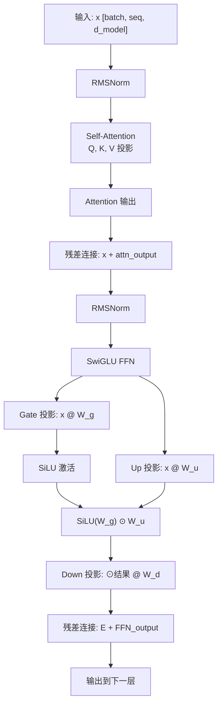
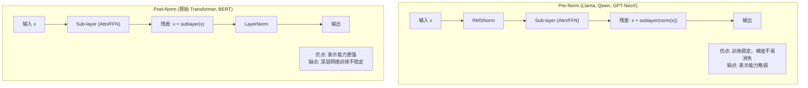

# FFN、Normalization 与位置编码

> Transformer Block 的三大核心组件：FFN 承担主要计算，Norm 稳定训练，Position 注入序列信息

## 前置知识

- [Transformer 架构概述](./transformer-overview.md) — 理解 Transformer Block 的结构
- [Attention 机制深入](./attention-mechanism.md) — 理解 Attention 的计算流程

## 核心概念

### Transformer Block 内部结构



现代 LLM（Llama 3/4、Qwen2/3、Claude 4）采用 **Pre-Norm + SwiGLU + RoPE** 的组合。

### FFN 层详细计算

#### 传统 FFN vs Gated FFN

```
传统 FFN (GPT-2, BERT):
  output = (x @ W_up + b_up) @ W_down
  = ReLU(x @ W_up) @ W_down
  参数: 2 × d_model × d_ff

SwiGLU FFN (Llama, Qwen):
  gate = SiLU(x @ W_gate)     # SiLU = x * sigmoid(x)
  up   = x @ W_up
  output = (gate ⊙ up) @ W_down
  参数: 3 × d_model × d_ff  (W_gate + W_up + W_down)

GeGLU FFN (PaLM):
  gate = GELU(x @ W_gate)
  up   = x @ W_up
  output = (gate ⊙ up) @ W_down
  参数: 3 × d_model × d_ff
```

**为什么 SwiGLU 更好？**

- Gating 机制让 FFN 可以动态选择"哪些特征通过"，类似轻量级的 MoE
- SiLU 比 ReLU 平滑，梯度不会在负半区截断
- 实验表明 SwiGLU 比传统 FFN 在同等参数量下质量高 ~1-2%
- 代价：参数量增加 50%（3 个投影矩阵 vs 2 个），计算量也增加

#### FFN 参数占比推导

```
假设:
  d_model = 4096
  d_ff = 11008 (Llama 3 8B 的 FFN 扩展比 ~2.7x)
  num_heads = 32
  head_dim = 128
  num_layers = 32

每层参数:
  Attention:
    W_q: d_model × (num_heads × head_dim) = 4096 × 4096 = 16.8M
    W_k: d_model × (num_kv_heads × head_dim) = 4096 × 1024 = 4.2M  (GQA-4)
    W_v: d_model × (num_kv_heads × head_dim) = 4096 × 1024 = 4.2M
    W_o: (num_heads × head_dim) × d_model = 4096 × 4096 = 16.8M
    小计: ~42M

  FFN (SwiGLU):
    W_gate: d_model × d_ff = 4096 × 11008 = 45.1M
    W_up:   d_model × d_ff = 4096 × 11008 = 45.1M
    W_down: d_ff × d_model = 11008 × 4096 = 45.1M
    小计: ~135M

  每层总计: ~177M
  FFN 占比: 135 / 177 ≈ 76%

结论:
  FFN 参数通常占每层参数的 2/3 到 3/4。
  这是因为 d_ff 通常是 d_model 的 2-4 倍（扩展比），
  而且 SwiGLU 有 3 个投影矩阵。
```

### Normalization 位置差异

#### Pre-Norm vs Post-Norm



| 维度 | Pre-Norm | Post-Norm |
|------|----------|-----------|
| Norm 位置 | Sub-layer 之前 | Sub-layer 之后（残差之后） |
| 训练稳定性 | **好**：梯度有直接路径 | 差：深层网络梯度消失 |
| 表示能力 | 略弱 | 强 |
| 是否需要 Warmup | 不需要（或很短） | 需要（学习率 warmup 防止早期震荡） |
| 现代 LLM 选择 | ✅ 主流（Llama, Qwen, GPT-3） | ❌ 少用 |

**为什么 Pre-Norm 成为主流？**

Pre-Norm 的残差连接中，`x` 有一条从输入直接到输出的"高速公路"。梯度回传时，即使 Sub-layer 的梯度很小，`x` 的梯度也能直接传回去（梯度 ≈ 1）。这使得深层网络（50+ 层）可以稳定训练。

Post-Norm 中，梯度必须穿过 Norm 层和 Sub-layer 才能到达前面的层，层数多了以后梯度呈指数衰减。

#### RMSNorm vs LayerNorm

```
LayerNorm (原始 Transformer):
  μ = mean(x)
  σ² = variance(x)
  output = (x - μ) / sqrt(σ² + ε) × γ + β
  计算: 需要均值和方差，参数: γ + β

RMSNorm (Llama, Qwen):
  rms = sqrt(mean(x²) + ε)
  output = (x / rms) × γ
  计算: 只需均方根，参数: γ（无 β）

RMSNorm 的优势:
  - 少一次减均值操作和一个可学习参数 β
  - 实验表明质量与 LayerNorm 几乎无差异
  - 在大规模推理中累积节省可观的计算量
```

### Position Encoding 方案对比

#### 为什么需要位置编码？

Self-Attention 的计算 `Q @ K^T` 是 token 之间的两两点积，不包含位置信息。`Attention(token_i, token_j)` 和 `Attention(token_j, token_i)` 的分数计算方式完全一样。如果不注入位置信息，模型无法区分 "A B C" 和 "C B A"。

#### 主流方案对比

| 方案 | 原理 | 外推能力 | 计算开销 | 代表模型 |
|------|------|----------|----------|----------|
| **RoPE** | 旋转矩阵，角度与位置相关 | **好**（NTK/YaRN scaling） | 低 | Llama, Qwen, DeepSeek |
| ALiBi | Attention 分数加线性偏置 | 好（天然外推） | 极低 | MPT, GLM |
| Absolute | 可学习的位置向量 | 差（超过训练长度失效） | 极低 | BERT, GPT-2 |
| Sinusoidal | 正弦函数编码 | 中等 | 极低 | 原始 Transformer |

#### 为什么 RoPE 成为主流？

```
RoPE (Rotary Position Embedding):
  将每个位置映射为一个旋转角度 θ_i
  Q 和 K 在计算 Attention 前被旋转到对应位置

  旋转矩阵:
    [cos(mθ)  -sin(mθ)]
    [sin(mθ)   cos(mθ)]

  其中 m 是 token 位置，θ 是基频

  关键性质:
    RoPE(Q_m) · RoPE(K_n) = f(Q, K, m-n)
    点积只依赖于相对位置 m-n，而非绝对位置

RoPE 的优势:
  1. 相对位置编码：Attention 分数只与 token 间相对距离有关
  2. 外推性好：通过 NTK-aware / YaRN scaling 可以外推到训练长度的 8-16 倍
  3. 计算开销低：只需要对 Q 和 K 做旋转变换，不增加额外参数
  4. 兼容 FlashAttention：旋转在 QK^T 之前做，不影响分块计算

RoPE Scaling 技术:
  NTK-aware: 通过缩放旋转基频 θ，使外推时高频分量保持不变
    - 核心思想：位置编码的频率决定了模型"感知"的相对距离
    - 缩小 θ → 降低旋转频率 → 使模型能"看到"更远的距离
  YaRN: 将位置分为"内插区"和"外推区"分别处理
    - 短距离位置：保持原始编码（内插，模型已学会）
    - 长距离位置：压缩编码空间（外推，模型没见过）
  效果: 训练 4K → 推理 128K（32 倍外推）质量损失 < 5%
```

## 部署视角

### FFN 计算对部署的影响

```
Prefill 阶段 FLOPs 分布（seq_len=4096, Llama 3 8B）:
  Attention（单层）: O(seq_len^2 × num_heads × head_dim)
    ≈ 4096^2 × 32 × 128 ≈ 68.7 GFLOPs
  FFN（单层）: O(seq_len × d_model × d_ff)
    ≈ 4096 × 4096 × 11008 ≈ 184.3 GFLOPs

  全模型（×32 层）:
  Attention: 68.7 × 32 ≈ 2,198 GFLOPs
  FFN:       184.3 × 32 ≈ 5,897 GFLOPs
  总计:      ~8,095 GFLOPs

  FFN 占 Prefill 计算量的 ~73%！

Decode 阶段（每步 seq_len 增长 1）:
  Attention: O(seq_len × num_heads × head_dim) — 随 seq_len 线性
  FFN: O(d_model × d_ff × num_layers) — 常数

结论:
  - Prefill 优化重点: FFN（占 ~73% FLOPs），但长 prompt 时 Attention 占比会上升
  - Decode 优化重点: 权重加载速度（memory-bound）
  - FFN 量化对 Prefill 加速效果最明显
```

### Pre-Norm 对推理的影响

- Pre-Norm 在推理时不需要保存 Norm 的中间结果，显存友好
- Post-Norm 需要在 Norm 之前保存残差，增加中间激活
- 推理框架对 Pre-Norm 的支持更成熟

### 常见问题排查

| 症状 | 原因 | 解决 |
|------|------|------|
| 长上下文质量下降 | RoPE 外推不足 | 启用 YaRN / NTK-aware scaling |
| 训练 loss 不下降 | 可能是 Post-Norm 不稳定 | 检查 warmup 设置，或切换 Pre-Norm |
| FFN 显存占用异常 | d_ff 扩展比过大 | 检查模型配置，有些模型 d_ff 是 d_model 的 8 倍 |
| RoPE 导致 NaN | 位置超出旋转表范围 | 检查 seq_len 配置是否超过 RoPE 支持的最大值 |

## 面试视角

### 面试官会怎么问

**Q1: "为什么 Transformer 中 FFN 层的参数占大多数？大概占多少？"**

满分回答：
- FFN 的中间维度 d_ff 通常是 d_model 的 2-4 倍（SwiGLU 有 3 个矩阵）
- Attention 的维度是 d_model × d_model
- FFN 是 d_model × d_ff × 3，d_ff ≈ 3-4 × d_model
- 所以 FFN 参数 ≈ 3 × d_model × d_ff，Attention 参数 ≈ 4 × d_model × d_model
- FFN 占比 ≈ (3 × d_ff) / (3 × d_ff + 4 × d_model) ≈ 2/3 到 3/4

**Q2: "Pre-Norm 和 Post-Norm 的区别是什么？为什么现代 LLM 用 Pre-Norm？"**

满分回答：
- Pre-Norm：Norm 在 Sub-layer 之前，`x + SubLayer(Norm(x))`
- Post-Norm：Norm 在残差之后，`Norm(x + SubLayer(x))`
- Pre-Norm 梯度有直接路径，深层训练稳定，不需要 warmup
- Post-Norm 深层训练容易梯度消失，需要 warmup
- 现代 LLM 都用 Pre-Norm 因为训练稳定性更重要

**Q3: "RoPE 是怎么工作的？为什么它能支持外推？"**

满分回答：
- RoPE 用旋转矩阵将位置信息注入到 Q 和 K 中
- 旋转角度 θ 与 token 位置 m 相关
- 点积只依赖相对位置 (m-n)，所以是相对位置编码
- 外推时通过 NTK-aware scaling 调整基频，使高频分量不变
- 可以从训练 4K 外推到 32K-128K

**Q4: "SwiGLU 比传统 FFN 多了什么？代价是什么？"**

满分回答：
- 多了 Gate 分支（W_gate）和 SiLU 激活
- 从 2 个矩阵变为 3 个矩阵（W_gate, W_up, W_down）
- 参数量增加 50%，计算量也增加
- 但 gating 机制让 FFN 可以选择性地传递信息
- 质量提升 ~1-2%，在 scaling 趋势下值得这个代价

**Q5: "RMSNorm 和 LayerNorm 的区别？"**

满分回答：
- LayerNorm 做均值归一化 + 方差归一化，有 γ 和 β 两个参数
- RMSNorm 只做均方根归一化，只有 γ 一个参数
- RMSNorm 计算量减少 ~7%，参数少一个
- 质量几乎无差异，所以 Llama/Qwen 都用 RMSNorm

## 对比分析

### FFN 变体对比

| 变体 | 激活函数 | 矩阵数 | 参数倍数 | 质量 | 代表模型 |
|------|----------|--------|----------|------|----------|
| FFN (ReLU) | ReLU | 2 | 1x | 基准 | GPT-2 |
| GeGLU | GELU | 3 | 1.5x | +1% | PaLM |
| **SwiGLU** | **SiLU** | **3** | **1.5x** | **+1-2%** | **Llama, Qwen** |
| GLU | Sigmoid | 3 | 1.5x | +0.5% | 早期实验 |

### Position Encoding 外推能力对比

| 方案 | 2x 训练长度 | 4x 训练长度 | 8x 训练长度 | 需要额外技巧 |
|------|------------|------------|------------|-------------|
| Absolute | 质量崩溃 | 完全不可用 | - | 需要 fine-tune |
| Sinusoidal | 可用 | 质量下降明显 | - | 需要插值 |
| ALiBi | 可用 | 可用 | 可用 | 不需要 |
| RoPE | 可用 | 可用 | 可用 + scaling | NTK-aware / YaRN |

## 最佳实践

### 调参建议

- **RoPE scaling**：部署时如果 seq_len 超过训练长度，必须启用 scaling（YaRN 或 NTK-aware）
- **FFN 量化**：Prefill 阶段 99% 的 FLOPs 在 FFN，FFN 量化对首 token 延迟优化效果最明显
- **block_size 选择**：RoPE 的基频（base_frequency）默认 10000，长上下文场景可增大到 1000000（NTK-aware）

### 避坑指南

- RoPE 外推超过 8x 训练长度时质量会明显下降，不要盲目拉长上下文
- SwiGLU 的 3 个矩阵在权重量化时需要分别处理，不能简单合并
- Post-Norm 模型在推理时中间激活更大，batch size 上限更低
- ALiBi 虽然外推性好，但现代模型基本都用 RoPE，部署时注意区分

*上一节：[KV Cache 详解](./kv-cache.md)*
*下一节：[MoE 架构](./moe-architecture.md)*
