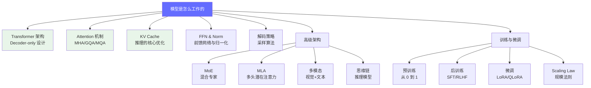

# 模型是怎么工作的

> 理解大模型内部的计算机制，是所有推理优化的基础。

## 模块概览

这个模块深入讲解 LLM 的核心工作原理。FDE 不需要手推数学公式，但必须理解每个组件的计算特征，才能回答诸如"为什么长上下文延迟会飙升"、"GQA 对显存有什么影响"这类问题。

## 学习路径

| 顺序 | 文档 | 核心内容 | 面试考点 |
|------|------|---------|---------|
| 1 | [Transformer 架构概述](./transformer-overview.md) | Decoder-only 设计、Prefill/Decode 两阶段 | 推理两阶段区别、KV Cache 显存估算 |
| 2 | [Attention 机制深入](./attention-mechanism.md) | MHA、GQA、MQA、Flash Attention | GQA vs MHA 的区别和部署影响 |
| 3 | [KV Cache 详解](./kv-cache.md) | KV Cache 原理、显存计算、优化策略 | 为什么 KV Cache 占显存 60-80% |
| 4 | [FFN、归一化与位置编码](./ffn-norm-pos.md) | SwiGLU、RMSNorm、RoPE | 为什么用 RoPE 不用绝对位置编码 |
| 5 | [解码策略](./decoding-strategies.md) | Greedy、Top-k、Top-p、Beam Search | 如何平衡生成质量和多样性 |
| 6 | [MoE 架构](./moe-architecture.md) | 混合专家模型原理和部署挑战 | MoE 模型的显存和吞吐特点 |
| 7 | [MLA 深度解析](./mla-deep-dive.md) | 多头潜在注意力（DeepSeek 使用） | MLA vs MHA 的区别 |
| 8 | [多模态模型](./multimodal-llm.md) | 视觉+文本的架构设计 | 多模态模型的推理延迟特点 |
| 9 | [思维链模型](./thinking-models.md) | o1 等推理模型的思维链机制 | 推理模型 vs 普通模型的差异 |
| 10 | [LLM 预训练](./llm-training.md) | 从 0 训练一个 LLM 的流程 | 预训练的关键步骤 |
| 11 | [预训练 vs 后训练](./pre-post-training.md) | SFT、RLHF、DPO 等方法 | 对齐技术的原理 |
| 12 | [LLM 微调](./llm-finetuning.md) | LoRA、QLoRA 等微调方法 | LoRA 的显存和效果特点 |
| 13 | [Scaling Law](./scaling-law.md) | Chinchilla 等规模法则 | 如何选择模型大小和训练数据量 |

## 前置知识

建议先完成 [L1 入门：什么是 FDE](/01-basics/) 了解岗位定位和学习路径。

---

*上一节：[L1 入门：什么是 FDE](/01-basics/)*
*下一节：[Transformer 架构概述](./transformer-overview.md)*
