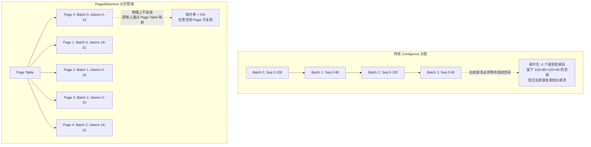

# KV Cache 详解

> KV Cache 占据推理显存的 60-80%，是 FDE 优化的核心战场

## 前置知识

- [Attention 机制深入](./attention-mechanism.md) — 理解 MHA/GQA/MQA 对 KV Cache 的影响
- [Transformer 架构概述](./transformer-overview.md) — 理解 decode 阶段为什么需要 KV Cache

## 核心概念

### 为什么需要 KV Cache

在 decode 阶段，每生成一个新 token，需要计算它和之前所有 token 的 Attention。如果不缓存 KV：

```
生成第 N 个 token 时:
  需要计算 token 1, 2, ..., N 的 Q, K, V
  其中 token 1 到 N-1 的 KV 在前 N-1 步已经算过
  如果不缓存：每步重新计算所有历史 token 的 KV
  复杂度：O(N^2) 每步，总复杂度 O(output_len^3)

如果缓存:
  每步只计算新 token 的 KV (O(1))，Attention 用缓存
  总复杂度：O(output_len^2)

加速比: O(output_len) 倍。当 output_len = 1000，就是 1000 倍加速。
```

### KV Cache 详细计算公式

```
KV_Cache_Size = 2 × num_layers × batch_size × seq_len × num_kv_heads × head_dim × bytes_per_element

各变量含义:
  2               → K 和 V 各一份
  num_layers      → Transformer 的层数（如 Llama 3 70B 有 80 层）
  batch_size      → 并发处理的请求数
  seq_len         → 当前序列长度（prompt + 已生成的 token）
  num_kv_heads    → KV 头数（MHA = num_heads, GQA = num_heads/G, MQA = 1）
  head_dim        → 每个头的维度（通常 64 或 128）
  bytes_per_element → 数据类型大小: FP32=4, FP16/BF16=2, FP8/INT8=1

单位换算: 结果以 bytes 计，除以 1024^3 得到 GB
```

### 不同模型的 KV Cache 对比

以下数据基于 `batch_size=1, seq_len=1024, FP16`：

| 模型 | 参数 | Layers | KV Heads | Head Dim | 单 token KV Cache | batch=32, seq=8192 |
|------|------|--------|----------|----------|-------------------|-------------------|
| Llama 3 8B | 8B | 32 | 8 (GQA) | 128 | 64 KB | 1.6 GB |
| Llama 3 70B | 70B | 80 | 8 (GQA) | 128 | 160 KB | 32.8 GB |
| Qwen2.5 72B | 72B | 80 | 8 (GQA) | 128 | 160 KB | 32.8 GB |
| Mixtral 8x7B | 46.7B | 32 | 8 (GQA) | 128 | 64 KB | 13.1 GB |
| DeepSeek-V3 | 671B | 61 | 128 (MLA) | 128 | 可变* | 复杂** |
| GPT-3 175B | 175B | 96 | 96 (MHA) | 128 | 1.5 MB | ~708 GB |

* DeepSeek-V3 使用 MLA（Multi-Latent Attention），KV Cache 结构特殊
** DeepSeek-V3 的 KV Cache 通过低秩压缩大幅减少，但计算复杂

**关键观察**：
- GPT-3 175B 用 MHA，单 token 就要 1.5 MB KV Cache，完全无法做大批量推理
- Llama 3 70B 用 GQA-8，单 token 仅 160 KB，是 GPT-3 的 1/10
- Mixtral 虽然参数多（46.7B），但层数少（32），KV Cache 比 70B 模型小一半多

### KV Cache 内存布局



### KV Cache 碎片化问题

**为什么 contiguous 分配会导致碎片？**

```
时间线示例 (总显存 80GB):

T0: Batch 0 请求, seq=2000 → 分配 3 GB
T1: Batch 1 请求, seq=1500 → 分配 2.3 GB
T2: Batch 2 请求, seq=3000 → 分配 4.5 GB

T3: Batch 1 完成 → 释放 2.3 GB (中间留下空洞)
T4: 新请求, seq=5000 → 需要 7.5 GB
     但最大连续空闲块只有 4 GB → OOM!
     实际空闲: 2.3 + (80 - 3 - 2.3 - 4.5) = 2.3 + 70.2 = 72.5 GB

空闲 72.5 GB 但因为无法找到 7.5 GB 的连续块而 OOM。
这就是碎片化问题。
```

### PagedAttention 如何解决碎片

vLLM 的 PagedAttention 借鉴操作系统虚拟内存的思想：

1. **固定大小 Page**：将 KV Cache 切分为固定大小的 block（如 block_size=16 tokens）
2. **Page Table 映射**：每个 sequence 维护自己的 block 映射表
3. **动态分配**：新 token 来时，从空闲 block 池中取一个，加入映射表
4. **零碎片**：block 物理上可以不连续，逻辑上通过 Page Table 组装

效果：显存利用率从 contiguous 的 ~60% 提升到 ~95%，实际 batch size 可以提升 2-4x。

### KV Cache 压缩技术

#### 量化（Quantization）

```
FP16 → INT8:  减少 50%，精度损失 < 0.5%
FP16 → FP8:   减少 50%，精度损失 < 0.3%
FP16 → INT4:  减少 75%，精度损失 1-2%

部署建议:
  INT8 量化 KV Cache 是最安全的优化
  FP8 需要 Hopper 架构 GPU 支持
  INT4 适合对质量不敏感的场景
```

#### Eviction（驱逐策略）

```
策略:
  - 保留最近 N 个 token 的 KV
  - 保留 attention score 最高的 token（关键 token）
  - 丢弃中间低 attention score 的 token

效果:
  seq_len 从 32K 压缩到 4K，KV Cache 减少 87.5%
  质量损失: 取决于任务，长文档 QA 损失较大，对话损失较小

代表工作: H2O, SnapKV, TOVA
```

## 部署视角

### 生产环境中的 KV Cache 管理

```
vLLM 中的 KV Cache 分配策略:

1. 启动时预分配最大可用显存给 KV Cache
   gpu_memory_utilization=0.9 → 90% 显存给 KV Cache

2. 计算最大可容纳的 token slots:
   max_num_tokens = KV_Cache_GPU_Memory / per_token_KV_size

3. Continuous Batching:
   - 每个请求用完立即释放其 block
   - 新请求可以插入任何有空闲 block 的位置
   - 不像传统 batching 需要等所有请求完成

4. Prefix Caching:
   - 相同 system prompt 的请求共享前缀 KV
   - 多轮对话场景可节省 50-90% KV Cache
   - 使用 LRU 策略管理缓存前缀
```

### KV Cache 监控指标

| 指标 | 正常范围 | 告警阈值 | 含义 |
|------|----------|----------|------|
| KV Cache 使用率 | 60-90% | > 95% | 接近满时新请求被排队 |
| 碎片率（PagedAttention） | < 5% | > 10% | 检查 block_size 配置 |
| 平均 seq_len | 500-4000 | > 16K | 长上下文请求增多 |
| prefix cache hit rate | 20-70% | < 10% | 请求复用率低 |

### 常见问题排查

| 症状 | 原因 | 解决 |
|------|------|------|
| OOM 但显存看起来够用 | Contiguous 碎片化 | 使用 vLLM 的 PagedAttention |
| 首 token 后延迟飙升 | KV Cache 预分配不足 | 增大 `gpu_memory_utilization` |
| 多轮对话越来越慢 | 上下文持续增长 | 启用 KV Cache eviction 或上下文截断 |
| 吞吐突然下降 | 长请求阻塞短请求 | 启用 chunked prefill |

## 面试视角

### 面试官会怎么问

**Q1: "KV Cache 的大小公式是什么？请解释每一项的含义。"**

满分回答：
- 写出完整公式，解释每项
- 强调 `2` 代表 K 和 V
- 提到 GQA 对 `num_kv_heads` 的影响
- 能举一个具体数字例子（如 Llama 3 70B, batch=1, seq=1024 → 160 KB）

**Q2: "计算题：Llama 3 70B，FP16，batch=16，seq_len=16384，GQA-8，KV Cache 多大？"**

满分回答：
```
KV = 2 × 80 × 16 × 16384 × 8 × 128 × 2 bytes
   = 2 × 80 × 16 × 16384 × 8 × 128 × 2
   = 4,294,967,296 × 16
   = 68,719,476,736 bytes
   ≈ 64 GB
```

**Q3: "PagedAttention 解决了什么问题？它是怎么做的？"**

满分回答：
- 解决了 contiguous 分配的碎片化问题
- 将 KV Cache 切分为固定大小的 block
- 通过 Page Table 做逻辑到物理的映射
- 类似操作系统虚拟内存
- 显存利用率从 ~60% 提升到 ~95%

**Q4: "KV Cache 太大了怎么办？有哪些压缩方法？"**

满分回答：
- 量化：INT8/FP8 减少 50%，INT4 减少 75%
- Eviction：丢弃低 attention score 的 token
- Prefix Caching：共享相同前缀的 KV
- 模型侧：使用 GQA/MQA 减少 num_kv_heads
- PagedAttention：减少碎片，提高有效利用率

## 对比分析

### KV Cache 管理方案对比

| 方案 | 显存利用率 | 实现复杂度 | 碎片率 | 代表实现 |
|------|-----------|-----------|--------|----------|
| Contiguous | ~60% | 低 | 高 | 早期推理框架 |
| PagedAttention | ~95% | 中 | < 5% | vLLM |
| RadixAttention | ~95% + prefix 缓存 | 中-高 | < 5% | SGLang |
| Chunked prefill | N/A（减少峰值） | 低 | 低 | vLLM, SGLang |

### KV Cache 压缩方案对比

| 方案 | 压缩比 | 精度损失 | GPU 要求 | 生产可用性 |
|------|--------|----------|----------|-----------|
| FP16（基准） | 1x | 0 | 任意 | 是 |
| INT8 量化 | 2x | < 0.5% | 任意 | 是，推荐 |
| FP8 量化 | 2x | < 0.3% | Hopper+ | 是（H100） |
| INT4 量化 | 4x | 1-2% | 任意 | 实验性 |
| Token Eviction | 2-8x | 1-5% | 任意 | 特定场景 |

## 最佳实践

### 调参建议

- **`gpu_memory_utilization`**：设为 0.85-0.95，留一些给中间激活和 CUDA context
- **`block_size`**：vLLM 默认 16，长上下文场景可设为 64（减少 Page Table 开销）
- **`max_num_seqs`**：根据业务并发量设置，70B 模型建议 ≤ 64
- **Prefix Caching**：多轮对话/Agent 场景必开，system prompt 相同可省 50-90% KV Cache

### 避坑指南

- 不要用 MHA 模型做生产部署（KV Cache 爆炸）
- batch=1 时 KV Cache 很小，但 batch 增大后线性增长，上线前必须做压力测试
- INT8 KV Cache 量化在 Llama 3 级别模型上几乎无质量损失，可以放心使用
- 监控 KV Cache 使用率，长期 > 90% 说明需要扩容或限制并发
- Prefix Caching 的 LRU 大小要合理设置：太小命中率低，太大浪费显存

*上一节：[Attention 机制深入](./attention-mechanism.md)*
*下一节：[FFN 与 Normalization](./ffn-norm-pos.md)*
