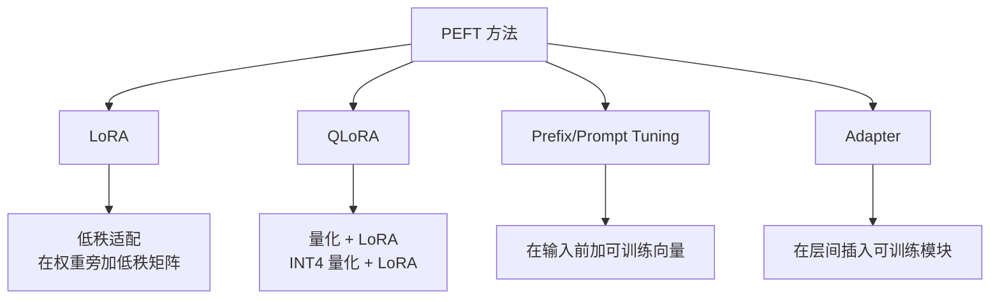
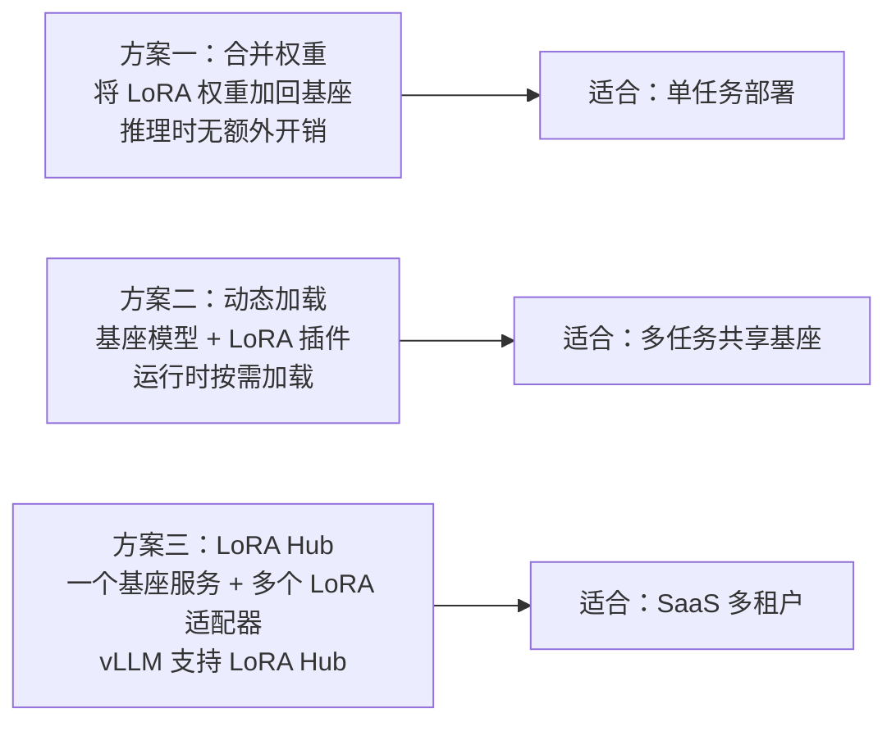
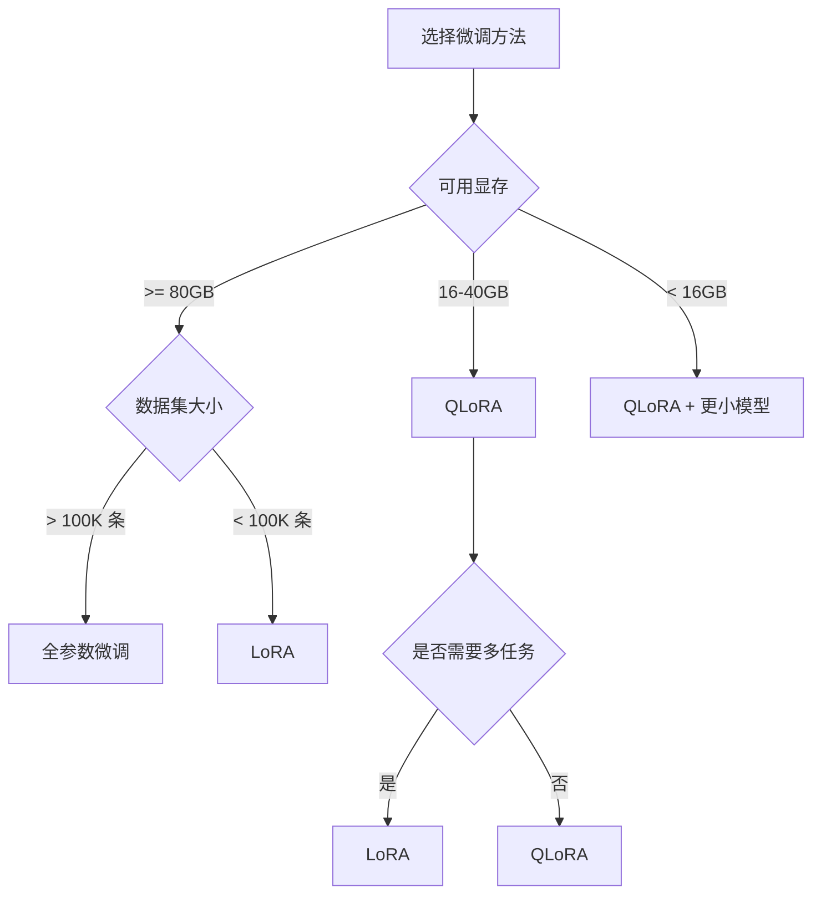

# 大模型微调实践

> 让通用模型变成专属模型的技术手段。FDE 需要理解微调对部署的影响。

## 前置知识

建议先阅读 [Transformer 架构概述](./transformer-overview.md) 和 [大语言模型训练流程](./llm-training.md)。

---

## 微调 vs 预训练

```
预训练：从零训练，需要海量数据和算力
微调：在已有模型基础上调整，少量数据即可

预训练 ≈ 从小学到大学的完整教育
微调 ≈ 大学毕业后参加一个短期职业培训
```

### 对比

| 维度 | 预训练 | 微调 |
|------|--------|------|
| 数据量 | 万亿级 token | 千到万级样本 |
| 计算量 | 万卡 × 月 | 单卡到百卡 × 天 |
| 目标 | 通用能力 | 特定领域/任务 |
| 参数更新 | 全部参数 | 全部或部分参数 |
| 对 FDE 的意义 | 决定模型基线能力 | 决定部署方式（LoRA 合并等） |

---

## 微调方法分类

### 全参数微调（Full Fine-tuning）

```
更新模型所有参数

优点：效果最好，模型完全适配新任务
缺点：
  - 需要大量显存（70B 模型约需 1.4TB 显存）
  - 容易过拟合小数据集
  - 每个任务需要保存一份完整模型权重
```

### 参数高效微调（PEFT）

只更新模型的一小部分参数，大幅降低显存需求。



---

## LoRA（Low-Rank Adaptation）

### 核心思想

```
原始权重 W（冻结不变）
           ↓
输入 x → xW → 输出

改为：
原始权重 W（冻结不变）
           ↓
输入 x → xW + xBA → 输出
           ↑
    低秩矩阵 B（d×r）和 A（r×d）可训练
    其中 r << d，通常 r = 8, 16, 64
```

### 参数量对比

| 模型 | 原始参数 | LoRA 参数（r=16） | LoRA 占比 |
|------|---------|-------------------|----------|
| 7B | 7B | ~4M | 0.06% |
| 13B | 13B | ~8M | 0.06% |
| 70B | 70B | ~42M | 0.06% |

### 显存节省

```
全参数微调 70B：
  - 模型权重：140GB（FP16）
  - 梯度：140GB
  - 优化器状态（Adam）：280GB
  - 总计：~560GB（需 8×A100 80GB）

LoRA 微调 70B（r=16）：
  - 模型权重：140GB（可量化为 INT4 → 35GB）
  - LoRA 参数：可忽略
  - 梯度 + 优化器：~2GB
  - 总计：~40-175GB（取决于量化）
```

### LoRA 的部署方式



---

## QLoRA（Quantized LoRA）

```
QLoRA = 4-bit 量化基座 + LoRA 微调

核心创新：
1. 基座模型量化到 4-bit（NF4 格式）
2. LoRA 参数保持 FP16
3. 量化误差通过双量化和分页优化器补偿
```

### 显存需求

| 模型 | 量化 | LoRA rank | 所需显存 |
|------|------|-----------|---------|
| 7B | 4-bit | r=16 | ~5GB |
| 13B | 4-bit | r=16 | ~10GB |
| 70B | 4-bit | r=16 | ~48GB |
| 70B | 4-bit | r=64 | ~52GB |

**70B 模型可以在单卡 A100 80GB 上进行 QLoRA 微调！**

---

## 微调对部署的影响

### 1. 模型体积

```
全参数微调：
  每个任务一个完整模型副本
  70B × N 个任务 = 70N × 140GB 存储

LoRA 微调：
  一个基座模型 + N 个 LoRA 适配器
  70B × 1 + LoRA × N = 140GB + N × 50MB
  存储节省 99%+
```

### 2. 推理引擎支持

| 引擎 | LoRA 支持 | 多 LoRA 切换 | 热加载 |
|------|----------|-------------|--------|
| vLLM | ✅ | ✅（同时加载多个） | ✅ |
| SGLang | ✅ | ✅ | ✅ |
| TGI | ✅ | 有限 | ❌ |
| TRT-LLM | ✅ | ✅ | 需重新编译 |

### 3. 推理性能

```
合并后推理：
  性能与原始模型完全一致（无额外开销）

动态 LoRA 推理：
  额外开销 < 2%（vLLM 的 LoRA Hub 实现）
  优势：多个任务共享一个基座模型
```

---

## 微调实践指南

### 选择合适的微调方法



### LoRA 超参数选择

| 参数 | 推荐值 | 说明 |
|------|--------|------|
| rank（r） | 8-64 | 越大表达能力越强，但显存也增加 |
| alpha | 2×r | 通常设为 rank 的 2 倍 |
| target_modules | q_proj, v_proj | 最常见，覆盖 Attention 的 query 和 value |
| dropout | 0.05-0.1 | 防止过拟合 |

### 常见框架

| 框架 | 特点 | 适用场景 |
|------|------|---------|
| Axolotl | 配置驱动，支持全量/LoRA/QLoRA | 生产级微调 |
| Unsloth | 2x 速度，5x 显存优化 | 快速实验 |
| PEFT（HuggingFace） | 灵活，可组合 | 自定义微调流程 |
| LLaMA-Factory | 全功能，Web UI | 可视化微调 |

---

## 面试视角

**Q: "LoRA 为什么有效？"**

回答框架：
1. **低秩假设**：模型适配新任务时，参数变化本质上是低秩的
2. **冻结基座**：保留预训练知识不变，只注入少量新知识
3. **参数共享**：LoRA 的 A 和 B 矩阵在所有输入间共享，学习的是通用适配

**Q: "微调后的模型如何部署？"**

回答要点：
- 单任务：合并 LoRA 权重到基座，推理无额外开销
- 多任务：vLLM/SGLang 的 LoRA Hub，一个基座服务多个适配器
- 切换成本：vLLM 支持热切换，延迟 < 1ms

**Q: "QLoRA 和 LoRA 有什么区别？什么时候用哪个？"**

- QLoRA 使用 4-bit 量化基座，显存需求更低
- LoRA 效果略好（基座精度更高）
- 显存充足用 LoRA，显存紧张用 QLoRA
- 实际中 QLoRA 效果通常与 LoRA 差距 < 1%

**Q: "微调数据需要准备多少？"**

- 简单任务（格式调整）：1K-5K 条
- 领域适配（医疗、法律）：10K-50K 条
- 复杂推理：50K+ 条
- 数据质量 > 数据数量

---

*上一节：[多模态大模型](./multimodal-llm.md)*
*下一节：[预训练与后训练](./pre-post-training.md)*
