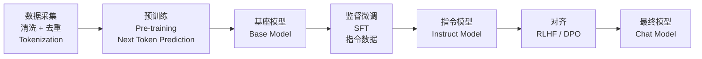
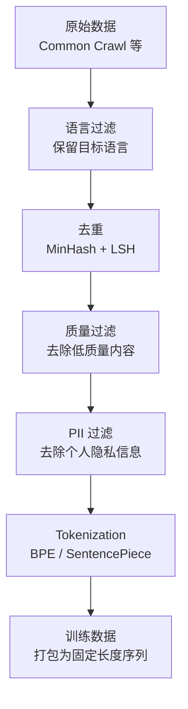
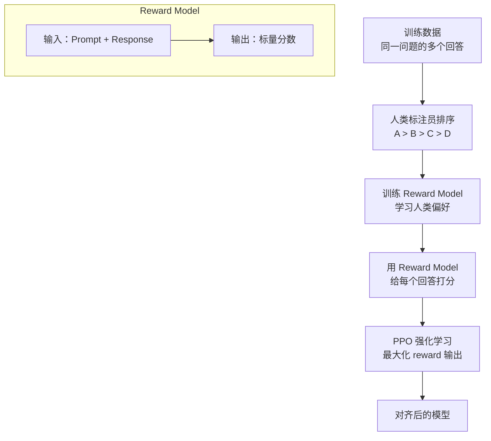

# 大语言模型训练流程

> 从预训练到对齐，理解 LLM 是如何被训练出来的。这对推理部署有直接影响。

## 前置知识

建议先阅读 [Transformer 架构概述](./transformer-overview.md) 和 [Attention 机制深入](./attention-mechanism.md)。

---

## 训练全流程概览



整个流程的计算成本递增：

| 阶段 | 数据量 | 计算量占比 | GPU 需求 | 时间（70B 模型） |
|------|--------|-----------|---------|----------------|
| 预训练 | 数万亿 token | ~85% | 万卡 H100 | 2-3 个月 |
| SFT | 数十万条指令 | ~10% | 百卡 H100 | 1-2 周 |
| 对齐（RLHF/DPO） | 数万条偏好 | ~5% | 百卡 H100 | 1-2 周 |

---

## 第一阶段：预训练（Pre-training）

### 目标

在海量无标签文本上训练模型，学习语言的统计规律和世界知识。

### 训练目标：Next Token Prediction

```
输入: "今天天气真"
目标: 预测下一个 token → "好"

Loss = -log P(token_t | token_1, ..., token_{t-1})
```

### 训练数据构成

| 数据类型 | 占比 | 示例 |
|---------|------|------|
| 网页文本 | ~50% | Common Crawl 清洗后的网页 |
| 代码 | ~15% | GitHub 开源代码 |
| 书籍 | ~10% | Project Gutenberg 等 |
| 学术论文 | ~5% | arXiv、PubMed |
| 百科/问答 | ~10% | Wikipedia、StackExchange |
| 其他 | ~10% | 新闻、社交媒体等 |

### 数据处理流水线



### 训练基础设施

```
典型配置（70B 模型）：
  - GPU: 8192 × H100 80GB
  - 显存分配：模型权重 + 梯度 + 优化器状态 ≈ 1.5TB
  - 并行策略：
    - 张量并行（TP=8）：单卡放不下一个层
    - 流水线并行（PP=8）：切分到不同 GPU 组
    - 数据并行（DP=128）：每个 GPU 组处理不同数据
  - 训练时长：约 2-3 个月
  - 总计算量：约 6 × 10^24 FLOPs
```

### 训练稳定性挑战

| 问题 | 原因 | 解决方案 |
|------|------|---------|
| Loss spike | 学习率过大、数据异常 | 自动检测 + checkpoint 回滚 |
| 梯度爆炸 | 深层网络数值不稳定 | 梯度裁剪、混合精度训练 |
| 显存 OOM | 激活值过大 | 激活检查点（重计算） |
| 多卡同步延迟 | NCCL 通信瓶颈 | 重叠计算和通信 |

### 对部署的影响

```
预训练阶段决定的模型属性，直接影响部署：

1. 上下文长度 → 决定 KV Cache 上限
   - 预训练的 max_position_embeddings = 最大上下文

2. 词汇表大小 → 影响首 token 延迟
   - vocab 越大，最后一层 Linear 的计算量越大

3. GQA vs MHA → 决定 KV Cache 大小
   - 训练时选择的 attention 类型，部署时无法更改

4. 精度（FP32/BF16） → 决定量化起点
   - BF16 训练的模型量化到 INT8 损失更小
```

---

## 第二阶段：监督微调（SFT）

### 目标

让模型学会遵循指令，从"续写文本"变成"回答问题"。

### 训练数据格式

```json
{
  "messages": [
    {"role": "system", "content": "你是一个有帮助的助手。"},
    {"role": "user", "content": "解释一下什么是 Attention？"},
    {"role": "assistant", "content": "Attention 机制允许模型..."}
  ]
}
```

### SFT 训练细节

| 参数 | 典型值 |
|------|--------|
| 数据量 | 50K-200K 条指令数据 |
| 学习率 | 2e-5（比预训练小 10-100x） |
| 训练轮数 | 1-3 epochs |
| 最大长度 | 2048-4096 |
| Batch size | 128-512（梯度累积） |

### 常见的指令数据类型

| 类型 | 示例 | 占比 |
|------|------|------|
| 问答 | "什么是..." | 25% |
| 代码生成 | "写一个 Python 函数..." | 20% |
| 翻译 | "把这句话翻译成..." | 15% |
| 摘要 | "总结以下文章..." | 15% |
| 推理 | "解这道数学题..." | 10% |
| 创意写作 | "写一首关于..." | 10% |
| 对话 | 多轮对话数据 | 5% |

---

## 第三阶段：对齐（Alignment）

### 为什么需要对齐

```
预训练模型 + SFT → 能力强但不可控

可能出现的问题：
  - 生成有害内容
  - 拒绝回答合理问题
  - 过度自信地编造答案
  - 不遵循用户指令

对齐的目标：让模型的输出符合人类价值观和期望
```

### 方法一：RLHF（Reinforcement Learning from Human Feedback）



**RLHF 的三阶段流程：**

1. **SFT**：用高质量指令数据微调基座模型
2. **训练 Reward Model**：
   - 收集同一 prompt 的多个回答
   - 人类标注员排序
   - 训练一个打分模型（Reward Model）
3. **PPO 优化**：
   - 用 Reward Model 给生成结果打分
   - 用 PPO 算法更新策略，最大化 reward
   - 加上 KL 惩罚，防止偏离 SFT 模型太远

### 方法二：DPO（Direct Preference Optimization）

DPO 是 RLHF 的简化版本，**不需要单独的 Reward Model 和 PPO**：

```
RLHF：SFT → 训练 Reward Model → PPO 优化（3 步，复杂）
DPO：  SFT → 直接用偏好数据优化（1 步，简单）
```

**DPO 的核心公式：**

```
Loss = -log σ(β × [log π(y_w|x) - log π(y_l|x)])

其中：
  y_w = 偏好的回答（winning）
  y_l = 不偏好的回答（losing）
  x = prompt
  β = 温度参数（通常 0.1-0.5）
```

### RLHF vs DPO 对比

| 维度 | RLHF | DPO |
|------|------|-----|
| 复杂度 | 高（3 阶段） | 低（1 阶段） |
| 计算成本 | 高（需要额外的 Reward Model 和 PPO） | 低（只需 SFT 模型 + 偏好数据） |
| 效果 | 略好 | 接近 RLHF |
| 稳定性 | PPO 训练不稳定 | 更稳定 |
| 使用场景 | 追求极致对齐效果 | 快速迭代、资源有限 |

---

## 部署视角

### 训练与部署的关系

```
训练时的选择，直接决定了部署时的优化空间：
```

| 训练选择 | 部署影响 |
|---------|---------|
| Decoder-only 架构 | 推理只需 decoder，无 encoder 开销 |
| GQA（Grouped Query Attention） | KV Cache 减少 4-8x，部署成本大幅降低 |
| SwiGLU 激活函数 | FFN 计算量增加 ~30%，但精度更好 |
| RoPE 位置编码 | 外推能力强，部署时可灵活设置 max_length |
| RMSNorm（代替 LayerNorm） | 计算更快，精度相当 |

### 模型选型 Checklist

部署前需要确认的模型属性：

- [ ] 架构类型（Decoder-only / Encoder-Decoder）
- [ ] 参数量和显存需求
- [ ] Attention 类型（MHA / GQA / MQA）
- [ ] 最大上下文长度
- [ ] 词汇表大小
- [ ] 训练精度（BF16 / FP16 / FP32）
- [ ] 是否经过 RLHF/DPO 对齐
- [ ] 许可证（商业可用 / 研究用）

---

## 面试视角

**Q: "LLM 的训练流程是怎样的？"**

满分回答：

1. **预训练**：海量无标签数据，Next Token Prediction，学习语言和世界知识
2. **SFT**：指令数据微调，从"续写"变"对话"
3. **对齐**：RLHF 或 DPO，让输出符合人类期望

**Q: "预训练和微调的学习率有什么区别？"**

- 预训练：~2e-4（数据量大，需要较快的学习率）
- SFT：~2e-5（数据量小，微调需要更小的学习率，避免灾难性遗忘）
- 典型比例：SFT 学习率 = 预训练的 1/10 到 1/100

**Q: "RLHF 和 DPO 哪个更好？"**

- DPO 更简单、更稳定，效果接近 RLHF
- RLHF 上限更高但训练复杂
- 实际中 DPO 是更好的起点，如果需要极致效果再上 RLHF

---

*上一节：[MoE 架构](./moe-architecture.md)*
*下一节：[Attention 机制深入](./attention-mechanism.md)*
