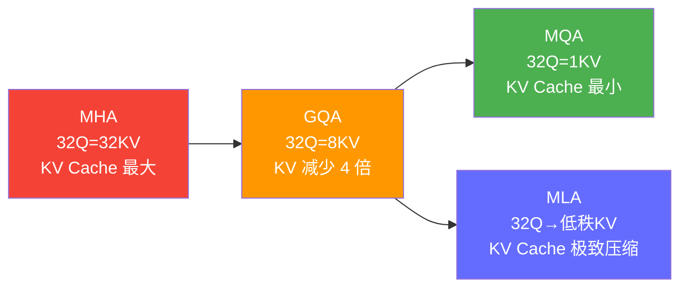
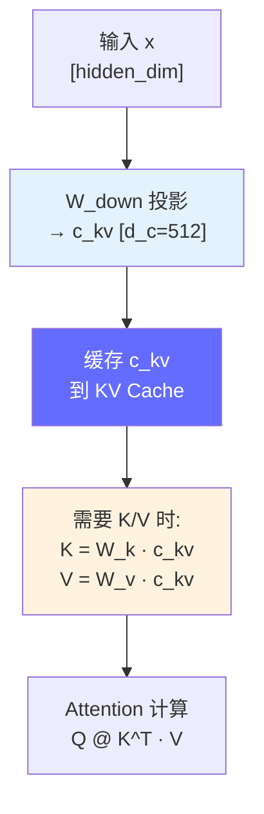

# MLA（Multi-Latent Attention）详解

> MLA 是 DeepSeek 在 DeepSeek-V2/V3/R1 中提出的注意力机制，将 GQA 的 KV 压缩思想进一步发展为"低秩投影"，使 671B 模型的 KV Cache 比 8B 模型的 GQA 还小。

---

## 前置知识

- [Attention 机制深入](./attention-mechanism.md) — MHA/GQA/MQA 原理
- [KV Cache](./kv-cache.md) — KV Cache 计算公式

---

## 核心概念：MLA 是什么

MLA = **Multi-Latent Attention**（多隐潜注意力），是 DeepSeek 对传统 Attention 的重新设计。

### 从 MHA 到 GQA 到 MLA 的演进



### GQA 的局限性

GQA 虽然减少了 KV Cache，但它有根本限制：

```
GQA:
  K = W_k · x    → 每个 token 的 K 向量维度 = head_dim × num_kv_heads
  V = W_v · x    → 每个 token 的 V 向量维度 = head_dim × num_kv_heads

  KV Cache per token = num_kv_heads × head_dim × 2 × num_layers × bytes
  减少方式: 只能减少 num_kv_heads 的数量

  但 num_kv_heads 不能无限减少！
    - num_kv_heads = 1 → MQA，质量下降明显
    - num_kv_heads = 8 → GQA，质量损失 < 1%
    - 再少 → 表达能力不够
```

**MLA 的核心创新：** 不再减少 KV heads 数量，而是把 K 和 V 压缩到更低的维度。

### MLA 原理

```
传统 GQA:
  K = W_k · x          → [batch, seq, num_kv_heads × head_dim]
  V = W_v · x          → [batch, seq, num_kv_heads × head_dim]

MLA:
  c_kv = W_down · x    → 先把输入投影到低维隐空间 [batch, seq, d_c]
  K = W_k · c_kv       → 再从低维空间恢复 K
  V = W_v · c_kv       → 再从低维空间恢复 V

  KV Cache 中只存储 c_kv（低维隐向量）！
  而不是存储完整的 K 和 V

  维度对比:
    GQA-8: KV 每 token = 8 × 128 × 2 = 2048 维
    MLA:   c_kv 每 token = 512 维（DeepSeek-V3）

    → KV Cache 减少 4 倍！
```



**关键洞察：**

- 训练时正常计算完整的 K 和 V（保证质量）
- 推理时只缓存低维的 `c_kv`，需要时从 `c_kv` 恢复 K 和 V
- 恢复操作是线性变换（矩阵乘法），计算量极小
- **KV Cache 从 "存储完整 K+V" 变为 "只存储低维隐向量"**

---

## MLA 与 GQA 的定量对比

### KV Cache 对比

```
以 70B 级别模型为例：

Llama-3-70B (GQA-8):
  num_kv_heads = 8, head_dim = 128, num_layers = 80
  KV per token = 80 × 8 × 128 × 2 × 2 bytes = 327,680 bytes ≈ 320 KB

DeepSeek-V3 (MLA):
  d_c = 512, num_layers = 61
  KV per token = 61 × 512 × 2 × 2 bytes = 124,928 bytes ≈ 122 KB

→ MLA 的 KV Cache 是 GQA-8 的 38%！（减少 62%）
```

| 模型 | Attention 类型 | 单 token KV Cache | batch=32, seq=4096 |
|------|---------------|-------------------|-------------------|
| Llama-3-8B | GQA-8 | 64 KB | 1.6 GB |
| Llama-3-70B | GQA-8 | 320 KB | 32.8 GB |
| DeepSeek-V2 | MLA | 150 KB | 15.4 GB |
| DeepSeek-V3 | MLA | 122 KB | 12.5 GB |

### 质量对比

| 模型 | Attention | MMLU | GSM8K | HumanEval |
|------|-----------|------|-------|-----------|
| Llama-3-70B | GQA-8 | 79.5 | 84.5 | 66.0 |
| DeepSeek-V3 | MLA | 88.5 | 96.6 | 85.3 |
| DeepSeek-R1 | MLA | 90.8 | 97.3 | 88.0 |

> MLA 不仅没有降低质量，反而因为 DeepSeek 的训练方法在多个 benchmark 上超越了 GQA 模型。

---

## MLA 的部署考量

### 优势

| 优势 | 说明 |
|------|------|
| **KV Cache 极小** | 比 GQA 减少 60%+，允许更大的 batch size |
| **质量不降** | 低秩投影保持了表达能力 |
| **长上下文友好** | 128K+ 上下文中 KV Cache 优势更明显 |
| **兼容现有引擎** | vLLM 已支持 DeepSeek-V3 的 MLA |

### 挑战

| 挑战 | 说明 |
|------|------|
| **额外计算** | 需要从 c_kv 恢复 K 和 V（矩阵乘法，但开销 < 2%） |
| **量化特殊** | MLA 的 c_kv 分布与传统 K/V 不同，量化策略需要调整 |
| **只有 DeepSeek 系列** | 非通用方案，只有 DeepSeek 模型支持 |
| **TensorRT 支持有限** | 早期 TRT-LLM 版本对 MLA 支持不完整 |

### vLLM 中的 MLA 部署

```bash
# DeepSeek-V3 部署（vLLM 已原生支持 MLA）
vllm serve deepseek-ai/DeepSeek-V3 \
  --tensor-parallel-size 8 \
  --gpu-memory-utilization 0.95 \
  --max-model-len 32768 \
  --enable-prefix-caching
```

### MLA 的量化考量

```
MLA 量化注意事项:

1. c_kv 的分布与标准 K/V 不同
   - 均值和方差可能偏离正常范围
   - AWQ/GPTQ 需要针对 c_kv 重新校准

2. DeepSeek 官方推荐的量化方案:
   - FP8 原生支持（H100 上有 1.5-2x 加速）
   - INT8 可用，但效果需要验证
   - INT4 不推荐（低秩表示再量化会丢失太多信息）

3. 量化时的显存对比:
   FP16: 122 KB/token (V3)
   FP8:   61 KB/token  ← H100 推荐
   INT8:  61 KB/token
   INT4:  30 KB/token  ← 不推荐
```

---

## MLA 与 GQA 的选择

```
什么时候关注 MLA？

→ 如果你的团队部署 DeepSeek 系列模型（V2/V3/R1）
  → 需要理解 MLA 的 KV Cache 特性来优化部署

→ 如果你部署 Llama/Qwen/Mistral 等非 DeepSeek 模型
  → MLA 暂时不适用，关注 GQA 即可

未来趋势：
  → GQA 是当前主流（Llama 3/4, Qwen 2.5/3, Mistral）
  → MLA 是 DeepSeek 的差异化优势
  → 其他厂商可能会借鉴 MLA 思想
```

---

## 面试视角

### 常考问题

1. **"MLA 和 GQA 有什么区别？"**

   回答框架：
   - GQA：减少 KV heads 数量，每组 Q 共享一组 KV
   - MLA：把 K/V 压缩到低维隐空间，只缓存隐向量
   - 效果：MLA 的 KV Cache 比 GQA 再减少 60%+
   - 质量：MLA 不降质量（DeepSeek-V3 超越了 Llama-3-70B）
   - 适用：MLA 只在 DeepSeek 模型中使用，GQA 是通用方案

2. **"MLA 为什么能把 KV Cache 压缩这么多？"**

   - 核心思想：K 和 V 的信息不需要完整存储
   - 训练时先通过 W_down 将输入投影到低维空间 c_kv
   - KV Cache 中只存 c_kv（512 维）而不是完整的 K+V（2048 维）
   - 推理时通过线性变换 W_k/W_v 从 c_kv 恢复 K 和 V
   - 恢复是矩阵乘法，计算量极小（< 2% 开销）

3. **"MLA 在部署时有什么需要注意的？"**

   - vLLM 已原生支持，正常部署即可
   - 量化需要特殊处理：c_kv 的分布不同于标准 K/V
   - DeepSeek-V3 原生支持 FP8，H100 上推荐用 FP8
   - TensorRT-LLM 对 MLA 的支持可能不完整，推荐用 vLLM

---

## 扩展阅读

- [DeepSeek-V2 Technical Report](https://arxiv.org/abs/2405.04434) — DeepSeek
- [DeepSeek-V3 Technical Report](https://github.com/deepseek-ai/DeepSeek-V3) — DeepSeek
- [vLLM DeepSeek Support](https://docs.vllm.ai/) — vLLM 文档

---

*上一节：[MoE 架构](./moe-architecture.md)*
*下一节：[多模态大模型](./multimodal-llm.md)*
