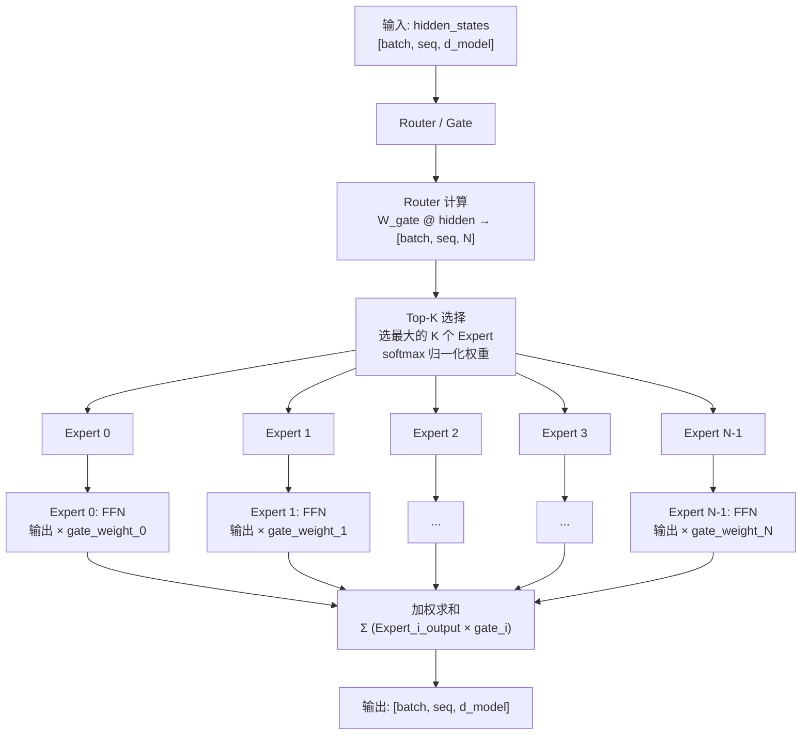

# MoE 架构详解

> 用稀疏激活实现"大参数、小计算"，但部署复杂度成倍增加

## 前置知识

- [Transformer 架构概述](./transformer-overview.md) — 理解 FFN 层和推理的两个阶段
- [FFN、Normalization 与位置编码](./ffn-norm-pos.md) — 理解 FFN 的内部结构

## 核心概念

### 为什么用 MoE

Dense 模型的参数增长面临两个瓶颈：

1. **训练成本**：每个 token 都要经过所有参数，参数量翻倍则计算量翻倍
2. **推理成本**：生成每个 token 都要加载全部权重，受限于 memory bandwidth

MoE（Mixture of Experts）的核心思想：**增加参数总量，但每个 token 只激活一小部分参数**。

```
Dense 模型:
  总参数 = 激活参数
  每个 token 经过 100% 的 FFN

MoE 模型:
  总参数 = N × Expert 参数 + Router 参数
  每个 token 只经过 Top-K 个 Expert（通常 K=2）
  激活参数 ≈ 总参数 × K/N

示例 Mixtral 8×7B:
  总参数: 46.7B (8 个 7B 级别的 Expert)
  激活参数: ~13B (每个 token 只用 2 个 Expert)
  推理时 FLOPs 接近 13B 模型，但知识容量接近 46.7B 模型
```

### MoE 的原理



### Router 机制

**Top-K Routing**：

```python
# 伪代码
gate_logits = hidden @ W_gate  # [batch*seq, N_experts]
# 选 Top-K 个 Expert
topk_values, topk_indices = torch.topk(gate_logits, K, dim=-1)
# 归一化权重
topk_weights = softmax(topk_values, dim=-1)
# 仅激活选中的 Expert
output = zeros_like(hidden)
for i in range(K):
    expert_idx = topk_indices[:, i]
    expert_output = expert[expert_idx](hidden)
    output += expert_output * topk_weights[:, i:i+1]
```

**Load Balancing Loss**：

Router 容易出现"马太效应"——某些 Expert 被过度选择，其他 Expert 几乎不被使用。为了解决这个问题，引入 Load Balancing Loss：

```
L_aux = α × N × Σ(f_i × P_i)

其中:
  N = number of experts
  f_i = fraction of tokens assigned to expert i (实际分配比例)
  P_i = fraction of router capacity allocated to expert i (路由概率均值)
  α = 辅助损失权重 (通常 0.01)

当所有 Expert 被均匀使用时，f_i = 1/N, L_aux 最小
```

如果没有 load balancing loss，训练中可能出现某些 Expert "饿死"（几乎不被选中），导致有效 Expert 数量下降。

### MoE 模型配置对比

| 模型 | 总参数 | 激活参数 | Experts | Top-K | 层数 | d_model | 特点 |
|------|--------|----------|---------|-------|------|---------|------|
| Mixtral 8×7B | 46.7B | 12.9B | 8 | 2 | 32 | 4096 | 开创性开源 MoE |
| Qwen2.5-MoE 27B | 27B | ~7B | 4 | 2 | 28 | 2048 | 轻量级 MoE |
| DeepSeek-V3 | 671B | ~37B | 256 | 8 | 61 | 7168 | 超大规模 MoE |
| DeepSeek-V2 | 236B | ~21B | 160 | 6 | 60 | 5120 | 使用 MLA + MoE |
| Grok-1 | 314B | ~28B | 8 | 2 | 64 | 6144 | xAI 开源 |

**关键观察**：
- MoE 模型的"激活参数"决定了 FLOPs（推理速度）
- "总参数"决定了模型的知识容量和显存占用（权重加载）
- DeepSeek-V3 的 Expert 数（256）远超传统 MoE，需要特殊的并行策略

### 为什么 MoE 推理不一定比 Dense 快

这是面试中的经典陷阱题。MoE 虽然在 FLOPs 上更省，但推理速度不一定更快：

```
MoE 推理瓶颈分析:

1. 权重加载 (Memory-Bound):
   MoE 的总参数更大（46.7B vs 7B）
   decode 阶段每步都要加载全部 Expert 权重到 GPU
   即使只用 2 个 Expert，其余 Expert 的权重仍然占据了 HBM
   → Memory bandwidth 压力更大

2. Router 开销:
   每个 token 都要经过 Router 计算 → Top-K 选择 → 分发
   这部分是额外计算

3. Expert 并行通信:
   当 Expert 分布在多 GPU 上时:
   - token 可能需要跨 GPU 传输
   - All-to-All 通信成为瓶颈
   - 网络延迟可能抵消 FLOPs 节省

4. 负载不均衡:
   不同 token 激活不同 Expert
   某些 GPU 上的 Expert 被频繁激活，其他空闲
   → 等待最慢的 GPU（木桶效应）

结论:
  MoE 的优势在于训练效率和知识容量
  推理时，如果 Expert 不能全部放入单卡显存，
  通信开销可能完全抵消参数稀疏带来的好处。
```

## 部署视角

### 生产环境中的 MoE 部署策略

```
场景 1: Expert 全部放入单卡显存
  优点: 无通信开销
  条件: 总参数 × 2 bytes < GPU 显存
  示例: Mixtral 8×7B = 46.7B × 2 = 93.4 GB → 需要 A100 80G × 2 或 H100

场景 2: Expert 分布到多卡 (Expert Parallelism)
  每张卡放 N/M 个 Expert
  token 通过 All-to-All 路由到对应 GPU
  通信开销: 取决于网络带宽（NVLink vs InfiniBand）

场景 3: 权重卸载 (Weight Offloading)
  不活跃的 Expert 权重存在 CPU 内存
  需要时动态加载到 GPU
  延迟增加但显存需求降低

实际部署建议:
  - Mixtral 8×7B: 至少 2×A100 80G，Expert 每卡 4 个
  - DeepSeek-V3: 需要 8+×H100，精细的 Expert 分配策略
  - 优先使用 NVLink 连接的多卡机器，而非跨节点
```

### MoE 推理性能数据

```
Mixtral 8×7B, A100 80G × 2, FP16:
  batch=1, seq=1024: ~30 token/s
  batch=16, seq=1024: ~200 token/s
  对比 Llama 3 8B: ~50 token/s (单卡)

MoE 的吞吐优势只有在较大 batch 时才能体现。
小 batch 下，Router 开销和权重加载成本占主导。
```

### 常见问题排查

| 症状 | 原因 | 解决 |
|------|------|------|
| MoE 推理比 Dense 还慢 | Expert 跨卡通信开销大 | 检查网络带宽，优先 NVLink |
| 某些 GPU 利用率 100%，其他 10% | Expert 负载不均衡 | 调整 Router 的 load balancing loss 权重 |
| OOM 但显存没满 | Expert 权重 + 中间激活 | 减少 batch 或启用 Expert offloading |
| Router 总选相同的 Expert | load balancing loss 没生效 | 检查训练配置，α 参数是否过小 |

## 面试视角

### 面试官会怎么问

**Q1: "MoE 是怎么做到参数大但计算量小的？每个 token 是怎么选择 Expert 的？"**

满分回答：
- 每个 FFN 层被替换为 N 个 Expert FFN + 一个 Router
- Router 计算每个 Expert 的得分，选 Top-K 个
- 每个 token 只经过 K 个 Expert 的 FFN（通常 K=2）
- 输出是 K 个 Expert 输出的加权和（权重来自 Router）
- 总 FLOPs ≈ Dense × K/N

**Q2: "MoE 部署时有什么挑战？为什么推理不一定比 Dense 快？"**

满分回答：
- 总参数量大，decode 每步加载全部权重 → memory-bound 更严重
- Expert 分布在多卡上需要 All-to-All 通信
- 负载不均衡导致 GPU 等待
- Router 本身有计算开销
- 小 batch 时 MoE 可能比同等激活参数的 Dense 模型还慢

**Q3: "Load Balancing Loss 是什么？为什么 MoE 训练需要它？"**

满分回答：
- Router 容易偏向某些 Expert（马太效应）
- 导致部分 Expert 几乎不被使用（"饿死"）
- Load Balancing Loss 鼓励 Router 均匀分配 token 到各 Expert
- 公式：L_aux = α × N × Σ(f_i × P_i)，均匀分配时最小
- 通常 α = 0.01，与主 Loss 加权

**Q4: "Mixtral 8×7B 的总参数和激活参数分别是多少？推理时显存主要由什么决定？"**

满分回答：
- 总参数 46.7B，激活参数 ~12.9B（8 Expert 选 2）
- 推理显存由**总参数**决定（46.7B × 2 bytes ≈ 93 GB），而非激活参数
- 因为 decode 阶段需要加载所有 Expert 权重，即使不激活
- 所以 Mixtral 8×7B 至少需要 2×A100 80G

## 对比分析

### MoE vs Dense 全面对比

| 维度 | Dense | MoE |
|------|-------|-----|
| 总参数 | P | N × P/K（更大） |
| 激活参数 | P | P × K/N |
| 训练 FLOPs | 基准 | ~K/N × Dense |
| 推理显存 | P × 2 bytes | N × P × 2 bytes（更大） |
| 推理速度 | 基准 | 可能更慢（通信+权重加载） |
| 模型质量 | 基准 | 同激活参数下更好 |
| 部署复杂度 | 低 | 高（Expert 并行、Router） |
| 适合场景 | 通用 | 需要大知识容量但计算受限 |

### MoE Router 策略对比

| 策略 | 选择方式 | 负载均衡 | 代表模型 |
|------|----------|----------|----------|
| Top-K | 选得分最高的 K | + auxiliary loss | Mixtral, Qwen-MoE |
| Soft MoE | 所有 Expert 加权 | 天然均衡 | 研究型 |
| Hash Routing | Hash(token) → Expert | 确定性均衡 | 实验性 |

## 最佳实践

### 调参建议

- **Expert 数选择**：生产环境 4-8 个 Expert 性价比最高；超过 32 个需要精细的并行策略
- **Top-K**：通常 K=2，增加 K 提升质量但增加 FLOPs
- **Load Balancing α**：从 0.01 开始，如果 Expert 使用率方差大则增大到 0.05
- **Expert 分布**：NVLink 连接的卡优先，跨节点通信开销通常不可接受

### 避坑指南

- 不要期望 MoE 的推理速度比 Dense 快——它的优势是训练效率和模型质量
- 部署 MoE 前必须确认总参数能否放入显存，否则通信开销会极大
- 监控每个 Expert 的激活频率，偏差超过 2x 说明 load balancing 需要调整
- vLLM 对 MoE 的支持不如 Dense 模型成熟，注意版本兼容性
- Mixtral 8×7B 至少需要 2×A100 80G，不要尝试单卡部署

*上一节：[KV Cache 详解](./kv-cache.md)*
*下一节：[FFN、Normalization 与位置编码](./ffn-norm-pos.md)*
