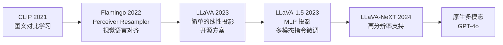
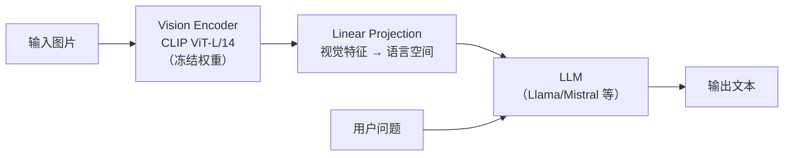
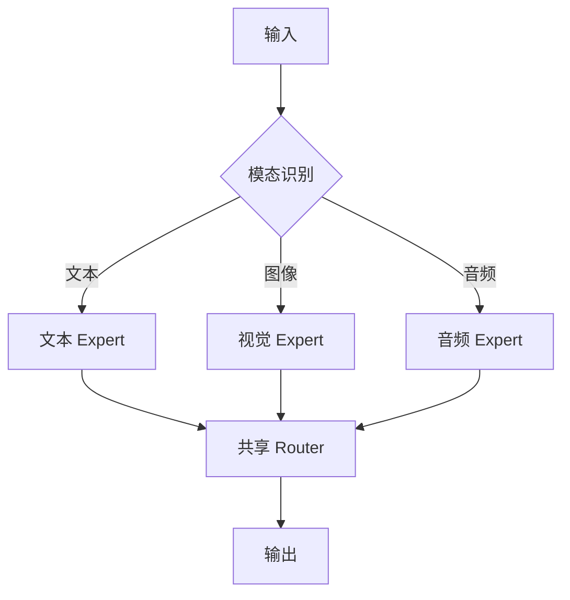
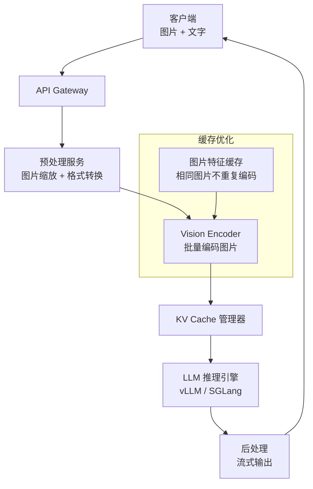

# 多模态大模型

> 从纯文本到图文音视频，理解多模态模型的架构和部署挑战。

## 前置知识

建议先阅读 [Transformer 架构概述](./transformer-overview.md) 和 [大语言模型训练流程](./llm-training.md)。

---

## 什么是多模态

```
单模态：只处理一种输入（通常是文本）
多模态：同时处理多种输入（文本 + 图像 + 音频 + 视频）
```

### 典型应用场景

| 场景 | 输入 | 输出 | 代表模型 |
|------|------|------|---------|
| 图像问答 | 图片 + 文字问题 | 文字回答 | GPT-4V、Qwen-VL |
| 图像生成 | 文字描述 | 图片 | DALL-E 3、Stable Diffusion |
| 视频理解 | 视频 + 文字指令 | 文字回答 | Gemini、GPT-4o |
| 语音交互 | 语音输入 | 语音回答 | GPT-4o、Gemini Live |

---

## 技术演进路线



---

## 三种多模态架构

### 架构一：冻结视觉编码器 + 投影层（LLaVA 系列）



**工作流程：**

1. 图片经过 Vision Encoder（如 CLIP）提取视觉特征
2. 视觉特征通过线性投影（Linear Projection）映射到语言空间
3. 投影后的特征拼接到文本 prompt 前面，作为 LLM 的输入
4. LLM 像处理普通文本一样，生成回答

**部署特点：**

| 组件 | 参数量 | 推理开销 |
|------|--------|---------|
| Vision Encoder（CLIP ViT-L） | ~300M | ~2ms（A100），固定开销 |
| Linear Projection | ~100M | 可忽略 |
| LLM（7B-70B） | 7-70B | 主导推理延迟 |

**关键洞察：视觉编码器的开销通常 < 5ms，远小于 LLM 的推理时间。所以多模态的推理瓶颈仍然是 LLM 部分。**

### 架构二：多模态 MoE



### 架构三：原生多模态（GPT-4o 等）

```
不再拼接，而是从预训练阶段就混合多模态数据

优点：模态间对齐更好
缺点：训练成本极高，部署显存需求更大
```

---

## 视觉 Token 化详解

### 图片如何变成 token？

```
输入图片: 224×224×3
    ↓
Vision Encoder (ViT):
  - 切分为 patch: 14×14 → (224/14)^2 = 256 个 patch
  - 每个 patch → embedding (1024 维)
  - 输出: [256, 1024]
    ↓
Linear Projection:
  - 将 1024 维投影到 LLM 的 hidden size (如 4096)
  - 输出: [256, 4096] — 等同于 256 个 token 的 embedding
    ↓
拼接到文本 prompt 前:
  [img_token_1, ..., img_token_256, text_token_1, ...]
```

### 视觉 token 对推理的影响

| 图片数量 | 视觉 token 数 | 对 KV Cache 的影响 |
|---------|-------------|-------------------|
| 1 张图 | ~256 | 相当于 256 个 text token |
| 4 张图 | ~1024 | 相当于 1K 上下文 |
| 10 张图 | ~2560 | 相当于 2.5K 上下文 |

**结论：多张图片会显著增加 KV Cache 大小，进而增加推理延迟和显存需求。**

### 高分辨率处理策略

```
问题：高分辨率图片（如 4K）会产生海量 patch

解决方案：
1. 动态分辨率：根据内容复杂度自适应选择分辨率
2. Patch 合并：将相邻 patch 合并为一个 token
3. 多级编码：先全局粗编码，再局部细编码
4. 按需编码：只编码用户关注的区域
```

---

## 多模态模型的部署挑战

### 1. 显存需求增加

```
7B LLM + CLIP ViT-L：
  LLM 权重（INT8）：7GB
  Vision Encoder：0.6GB
  KV Cache（含视觉 token）：额外 ~20%

总显存增加约 25-30%
```

### 2. 首 token 延迟

```
纯文本请求：
  Prefill → 首 token（~100ms）

多模态请求：
  Vision Encode → 投影 → Prefill → 首 token（~150ms）
  
增加了视觉编码的固定开销
```

### 3. Batch 大小限制

```
视觉 token 占用 KV Cache 空间
→ 同样显存下，多模态请求的 batch_size 更小
→ 吞吐下降
```

### 4. 多模态流式输出

```
纯文本流式：每个 token 独立输出
多模态流式：可能需要同时输出文本和图片
  → 需要支持图片编码和传输
  → 前端需要支持图片渲染
```

---

## 生产环境部署架构



### 优化策略

| 优化点 | 方法 | 效果 |
|--------|------|------|
| 图片缓存 | 相同图片的视觉特征缓存 | 减少 90% 重复编码 |
| 批量编码 | 多个请求的图片一起编码 | Vision Encoder 利用率提升 3x |
| 动态分辨率 | 根据图片内容选择分辨率 | KV Cache 减少 30-50% |
| 异步预处理 | 图片和 LLM 推理解耦 | 不阻塞 LLM decode 阶段 |

---

## 主流多模态模型对比

| 模型 | 视觉编码器 | 参数量 | 最大图片数 | 部署特点 |
|------|-----------|--------|-----------|---------|
| LLaVA-1.5 | CLIP ViT-L/14 | 7B/13B | 1 | 最简单，易部署 |
| Qwen-VL | ViT + Adapter | 7B | 多张 | 中文能力强 |
| InternVL | ViT-H | 20B+ | 多张 | 视觉能力强 |
| GPT-4V | 原生多模态 | 不公开 | 多张 | 需 API 调用 |
| Gemini | 原生多模态 | 不公开 | 视频 | 支持视频理解 |

---

## 面试视角

**Q: "多模态模型和纯文本模型的推理性能有什么差异？"**

回答框架：

1. **视觉编码开销**：Vision Encoder 通常 ~2-5ms，固定开销
2. **KV Cache 增加**：视觉 token 占用额外缓存，256 个视觉 token ≈ 256 个 text token
3. **Batch 大小减小**：同样显存下，batch_size 减小 20-30%
4. **整体延迟增加**：首 token 延迟增加约 50ms，生成速度基本不变

**Q: "多模态模型的 KV Cache 怎么计算？"**

```
KV Cache = 文本 KV + 视觉 KV

文本 KV = 2 × layers × batch × seq_len × kv_heads × head_dim × 2
视觉 KV = 2 × layers × batch × num_patches × kv_heads × head_dim × 2

总 KV Cache = 文本 KV + 视觉 KV
```

**Q: "多模态部署中最容易优化的点是什么？"**

- 图片缓存：相同图片不重复编码（收益最大，常见场景）
- 动态分辨率：低质量图片不需要高分辨率编码
- 批量视觉编码：多个请求的图片一起做 inference

---

*上一节：[大语言模型训练流程](./llm-training.md)*
*下一节：[Attention 机制深入](./attention-mechanism.md)*
