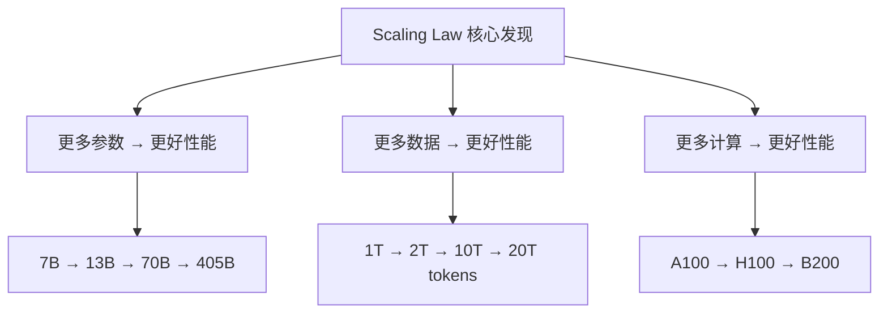
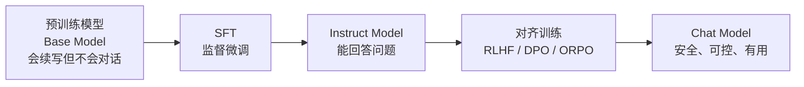
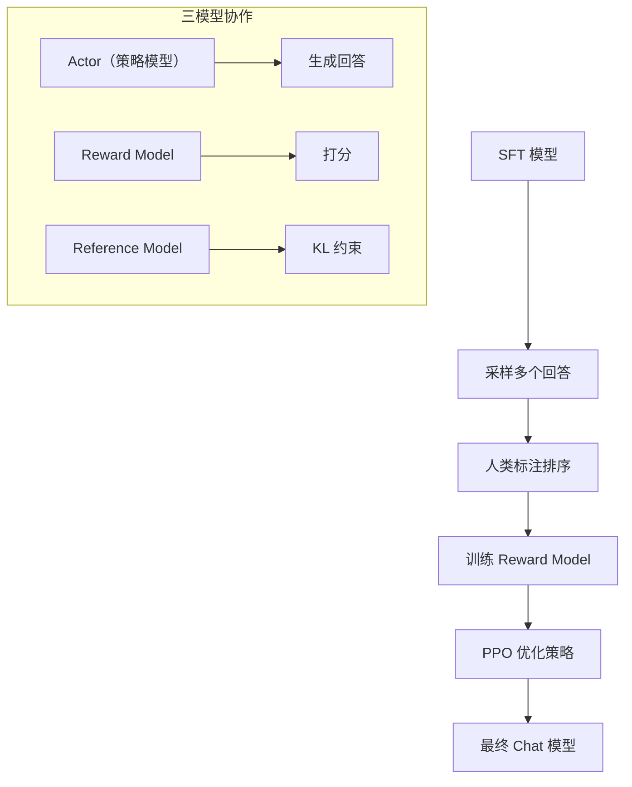

# 预训练与后训练

> Pre-training vs Post-training —— 理解两者的边界、目标和各自的优化方向。

## 前置知识

建议先阅读 [大语言模型训练流程](./llm-training.md)。

---

## 一句话区分

```
预训练（Pre-training）：让模型"有能力" —— 学习语言和知识
后训练（Post-training）：让模型"听话" —— 学会遵循指令和对齐
```

## 全景对比

| 维度 | 预训练 | 后训练 |
|------|--------|--------|
| 目标 | 学习语言统计规律和世界知识 | 对齐人类偏好、遵循指令 |
| 数据 | 无标签网页/书籍/代码 | 人工标注的指令和偏好数据 |
| 数据量 | 数万亿 token | 数千到数万条 |
| 计算占比 | ~90%+ | ~5-10% |
| GPU 规模 | 万卡级 | 百卡级 |
| 损失函数 | Next Token Prediction | SFT Cross-Entropy / RLHF Reward / DPO |
| 对部署的影响 | 决定模型大小、上下文长度 | 决定是否经过对齐、指令遵循能力 |

---

## 预训练（Pre-training）

### 核心目标

```
在海量无标签数据上学习 P(next_token | context)
```

模型学会：
- **语言结构**：语法、语义、常见表达
- **世界知识**：事实、常识、代码
- **推理能力**：简单的因果推理（从数据中隐式学习）
- **模式识别**：常见的文本模式（问答、对话格式等）

### 训练目标

```
Loss = -Σ log P(x_t | x_1, ..., x_{t-1})

即：对每个 token，预测它出现在这个位置的概率
```

### 关键设计决策

| 决策 | 影响 | 典型选择 |
|------|------|---------|
| 上下文长度 | 决定模型能"看到"多长的输入 | 2K → 4K → 32K → 128K |
| 词汇表大小 | 影响 OOV 率和最后一层计算量 | 32K（Llama）/ 128K（Qwen） |
| Attention 类型 | 决定 KV Cache 大小 | MHA → GQA → MQA |
| FFN 扩展倍数 | 影响模型参数量和 FLOPs | 3-4x（SwiGLU 是 2/3） |
| 归一化方式 | 影响训练稳定性 | LayerNorm → RMSNorm |

### 预训练的 Scaling Law



Chinchilla Scaling Law（2022）：

```
最优模型大小 ∝ 训练数据量

具体公式：
  N_optimal = 5.9 × 10^5 × D^0.46
  
  其中 N = 参数量, D = 训练 token 数

结论：
  - 参数量和训练数据量应该按比例增长
  - 数据不足时，增大模型效果递减
  - 数据充足时，增大模型效果显著
```

**实际影响**：GPT-3（175B, 300B tokens）是不均衡的，按照 Chinchilla 公式，更优的配置应该是一个更小的模型用更多数据训练。这直接推动了 Llama（65B, 1.4T tokens）的设计。

---

## 后训练（Post-training）

后训练是指在预训练模型基础上，让模型能够遵循指令、符合人类偏好的所有训练步骤。



### SFT（监督微调）

```
输入格式：
  <|system|> 你是一个有帮助的助手。
  <|user|> 解释什么是 Transformer？
  <|assistant|> Transformer 是一种...

目标：让模型学会"对话"而不是"续写"
```

### 对齐训练（Alignment）

#### RLHF（Reinforcement Learning from Human Feedback）



**核心难点：**

| 难点 | 说明 |
|------|------|
| Reward Hacking | 模型学会"骗分"而不是真正改进 |
| KL 惩罚权衡 | 太小 → 偏离 SFT 太多；太大 → 改进有限 |
| 标注一致性 | 不同标注员对同一回答评分可能差异很大 |
| 计算复杂度 | 需要同时运行 4 个模型（Actor, Critic, RM, Ref） |

#### DPO（Direct Preference Optimization）

```
RLHF 的简化版本：不需要单独的 Reward Model 和 PPO

直接优化偏好数据：
  Loss = -log σ(β × (log π(y_w|x) - log π(y_l|x)))
  
  y_w = winning response（人类偏好的）
  y_l = losing response（人类不偏好的）
```

**DPO 的优势：**

- 训练简单：只需要一个模型，没有 Reward Model
- 稳定：没有 PPO 的超参数敏感性
- 显存少：不需要同时维护 4 个模型
- 效果：通常与 RLHF 相当，有时更好

#### 其他对齐方法

| 方法 | 核心思想 | 复杂度 |
|------|---------|--------|
| ORPO | 在 SFT 阶段直接加入偏好优化 | 低（1 阶段） |
| KTO | 利用未配对的非偏好数据 | 低 |
| CPO | 结合 SFT 和偏好优化 | 中 |

---

## 预训练 vs 后训练：部署视角的差异

### 预训练模型部署

```
特点：
  - 能力强但不听话
  - 可能续写 prompt 而不是回答问题
  - 可能输出有害内容

使用场景：
  - 需要自主控制输出的场景（如代码补全）
  - 作为 SFT/对齐的起点
```

### 对齐后模型部署

```
特点：
  - 能遵循指令
  - 有安全护栏（拒绝有害请求）
  - 格式可控（JSON、Markdown 等）

使用场景：
  - 对话系统
  - API 服务
  - Agent 系统
```

### 推理性能对比

| 维度 | Base Model | Chat Model |
|------|-----------|-----------|
| 参数量 | 相同 | 相同 |
| 推理延迟 | 相同 | 相同 |
| 输入格式 | 自由 | 需要系统 prompt（额外 token） |
| KV Cache | 仅用户输入 | 用户输入 + 系统 prompt |
| 输出可控性 | 低 | 高 |

### 部署建议

```
如果你只需要续写能力（如代码补全、文本生成）：
  → 用 Base Model + 自定义 prompt 模板

如果你需要对话、问答、指令遵循：
  → 用 Chat Model（经过 SFT + 对齐）

如果你的领域有特殊需求：
  → 在 Chat Model 基础上做领域微调（Domain Adaptation）
```

---

## 面试视角

**Q: "预训练和后训练有什么区别？"**

回答框架：

1. **预训练**：无标签数据，Next Token Prediction，学习语言和世界知识，计算占 90%+
2. **后训练**：人工标注数据，包括 SFT（学会对话）和对齐（学会遵循人类偏好），计算占 5-10%
3. **关系**：预训练是"有能力"，后训练是"听话"。两者缺一不可

**Q: "Scaling Law 是什么？"**

- Chinchilla 公式：参数量和训练数据应该按比例增长
- 性能 ∝ 计算量^a × 数据量^b × 参数量^c
- 实际影响：推动了从 GPT-3（大模型少数据）到 Llama（小模型多数据）的设计转变

**Q: "RLHF 和 DPO 哪个更好？"**

- RLHF 上限高但复杂，需要 4 个模型协作
- DPO 简单稳定，效果接近 RLHF
- 实际推荐：先试 DPO，需要极致效果再上 RLHF

---

*上一节：[大模型微调实践](./llm-finetuning.md)*
*下一节：[Scaling Law](./scaling-law.md)*
