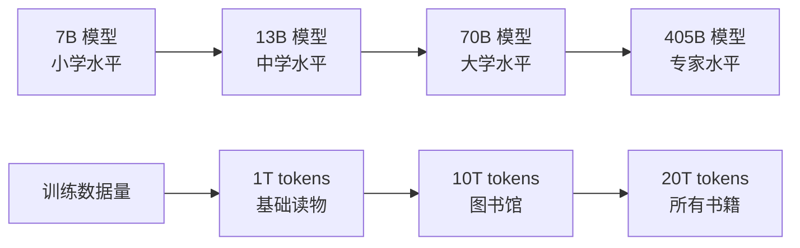
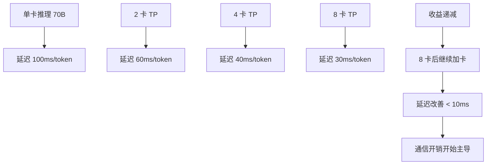

# 大模型 Scaling Law

> 大模型性能的数学规律 —— 理解它，就能预判下一代模型的趋势和资源需求。

## 前置知识

建议先阅读 [预训练与后训练](./pre-post-training.md)。

---

## 什么是 Scaling Law

```
Scaling Law 描述了一个现象：
  模型越大、数据越多、计算越多，性能就越好
  而且这种关系可以用简单的数学公式描述
```

这是过去十年 AI 研究中**最重要**的经验发现之一。

### 直观理解



**关键发现：这种提升不是线性的，而是遵循幂律（Power Law）。**

---

## 三大经典论文

### 1. Kaplan et al. (2020) — "Scaling Laws for Neural Language Models"

```
核心公式：
  L(N) = (N_c / N)^α

其中：
  L = Loss（交叉熵损失）
  N = 模型参数量
  N_c = 常数（约 430）
  α ≈ 0.076

结论：
  - Loss 随参数量的增加而降低
  - 但降低速度很慢（幂指数只有 0.076）
  - 模型大小增加 1000x，Loss 仅降低约 30%
```

**不足：Kaplan 只研究了模型大小的影响，没有考虑数据量。**

### 2. Chinchilla (Hoffmann et al., 2022) — "Training Compute-Optimal Large Language Models"

```
核心公式：
  L(N, D) = E + A/N^α + B/D^β

其中：
  N = 参数量
  D = 训练 token 数
  E = 不可约误差（模型能达到的最低 Loss）
  A, B = 常数
  α ≈ 0.34, β ≈ 0.28

关键结论：
  - 最优模型大小 ∝ 训练数据量^0.73
  - 数据量每增加 4x，模型大小应增加约 3x
  - 计算预算固定时，应该用更小的模型 + 更多的数据
```

**Chinchilla 的实际影响：**

```
GPT-3 的配置：
  175B 参数 × 300B tokens = 不均衡

Chinchilla 建议：
  175B 参数应该配 ~7T tokens

Llama 1 的设计：
  65B 参数 × 1.4T tokens（更接近 Chinchilla 最优）
```

### 3. DeepMind 联合 Scaling Law（2022）

```
将计算量 C 纳入公式：

  L(C) = (C_c / C)^γ

其中 C = 总计算量（FLOPs），γ ≈ 0.047

结论：
  - 计算量增加 100x → Loss 降低约 15%
  - 这意味着单纯堆算力有回报但递减
```

---

## 计算预算估算

### 训练一个模型需要多少计算量？

```
训练总 FLOPs ≈ 6 × N × D

其中：
  N = 参数量
  D = 训练 token 数
  6 的来源：前向传播 2× + 反向传播 4×
```

### 实例计算

| 模型 | 参数量 | 训练 Token | 总 FLOPs | 等效 H100 天数 |
|------|--------|-----------|----------|---------------|
| Llama 3 8B | 8B | 15T | 7.2×10^23 | ~30 天（256 卡） |
| Llama 3 70B | 70B | 15T | 6.3×10^24 | ~90 天（2048 卡） |
| GPT-3 | 175B | 300B | 3.1×10^23 | ~34 天（1000 卡 A100） |
| GPT-4 | ~1.8T | ~13T | ~1.4×10^26 | ~90 天（25000 卡 A100） |

### GPU 需求计算器

```
给定：
  模型参数 N = 70B
  训练 token D = 15T
  训练时间 = 60 天

计算：
  总 FLOPs = 6 × 70×10^9 × 15×10^12 = 6.3×10^24
  
  H100 理论峰值 = 989 TFLOPs（BF16 Tensor Core）
  实际利用率 ≈ 40% → 有效算力 ≈ 396 TFLOPs
  
  所需 GPU 数 = 6.3×10^24 / (396×10^12 × 60×86400)
              ≈ 3062 卡

结论：70B 模型在 60 天内训练完需要约 3000 张 H100。
```

---

## Scaling Law 在推理侧的延伸

### 推理 Scaling：Speculative Decoding

```
不只是训练，推理也有 Scaling Law：

  加速比 = 1 + γ × 接受率

见：[投机解码](../09-evaluation-frontier/speculative-decoding.md)
```

### 推理 Scaling：GPU 数量与延迟



### 推理 Scaling：模型大小与成本

```
推理成本（$/1K tokens）≈ 模型参数量 × 单价

| 模型 | 成本/1K tokens | 月度成本（100K req/day） |
|------|---------------|------------------------|
| 7B | ~$0.0003 | ~$900 |
| 70B | ~$0.003 | ~$9,000 |
| 405B | ~$0.017 | ~$51,000 |

结论：模型越大，成本越高。但大模型的效果不一定线性增长。
```

---

## 后训练的 Scaling Law

```
预训练 Scaling Law 已被广泛接受
后训练（SFT + RLHF）的 Scaling Law 仍在研究中

已知结论：
  1. SFT 数据质量 > 数据数量
     - 1K 条高质量指令 ≈ 50K 条低质量指令
  2. RLHF 的 reward 标注数据需要 ~10K-100K 条偏好对
  3. 对齐的效果有上限：不能突破预训练的知识边界
```

### "对齐税"（Alignment Tax）

```
对齐后的模型在某些基准上性能可能下降：

  GPT-3 → InstructGPT：
    数学推理能力下降 ~5%
    代码生成能力下降 ~3%

原因：
  RLHF 的 KL 惩罚限制了模型的表达空间
  对齐数据可能覆盖部分预训练知识

解决方向：
  - 使用更弱的 KL 约束
  - 在 SFT 阶段保留预训练知识的多样性
```

---

## Scaling Law 的局限性

### 1. 能力涌现（Emergent Abilities）

```
Scaling Law 预测的是平滑的性能提升
但实际中某些能力在特定规模突然出现：

  7B 模型：不会 Chain-of-Thought 推理
  70B 模型：突然会了 CoT

这种"涌现"无法用简单的幂律公式预测。
```

### 2. 上下文窗口 Scaling

```
Scaling Law 主要针对参数量和数据量
上下文窗口的扩展有不同的规律：

  窗口长度增加 → KV Cache 线性增长
  但模型需要额外训练才能利用长上下文
  
  结论：单纯增加 max_position_embeddings 不够
  需要长上下文微调（如 YaRN 方法）
```

### 3. 数据质量的瓶颈

```
高质量训练数据正在耗尽：

  互联网文本：~10^13 tokens（已接近用尽）
  书籍：~10^11 tokens
  学术论文：~10^10 tokens

解决方向：
  - 合成数据（Synthetic Data）
  - 课程学习（Curriculum Learning）
  - 数据质量筛选（Data Curation）
```

---

## 面试视角

**Q: "解释一下 Scaling Law"**

满分回答：

1. **Kaplan（2020）**：Loss 随模型大小按幂律降低，但只研究了参数量
2. **Chinchilla（2022）**：同时考虑参数和数据，发现两者应按比例增长。最优配置：N_optimal ∝ D^0.73
3. **实际影响**：Llama 的设计更接近 Chinchilla 最优，而 GPT-3 是"参数过多、数据不足"
4. **计算预算**：训练 FLOPs ≈ 6 × N × D，可用来估算所需 GPU 数量和时间

**Q: "70B 模型训练需要多少算力？"**

```
FLOPs = 6 × 70B × 15T ≈ 6.3 × 10^24
H100 有效算力 ≈ 400 TFLOPs（40% MFU）
需要约 3000 张 H100 训练 60 天
```

**Q: "Scaling Law 对推理部署有什么启示？"**

- 模型越大，推理成本越高，但效果提升递减
- 选择模型大小时要权衡性能和成本，不是越大越好
- 小模型 + 多数据（Chinchilla 最优）通常比大模型 + 少数据更高效

---

*上一节：[预训练与后训练](./pre-post-training.md)*
*下一节：[Attention 机制深入](./attention-mechanism.md)*
