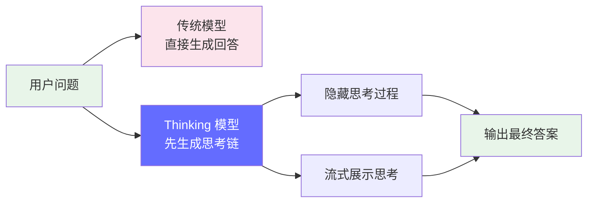
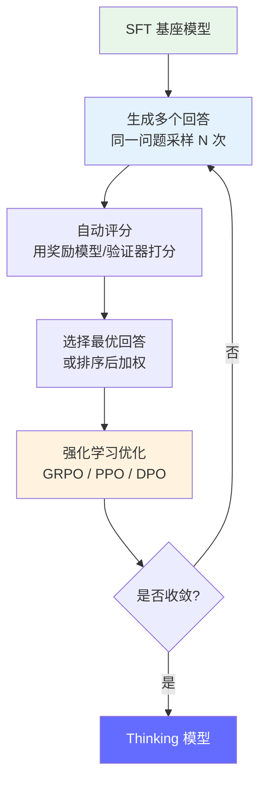
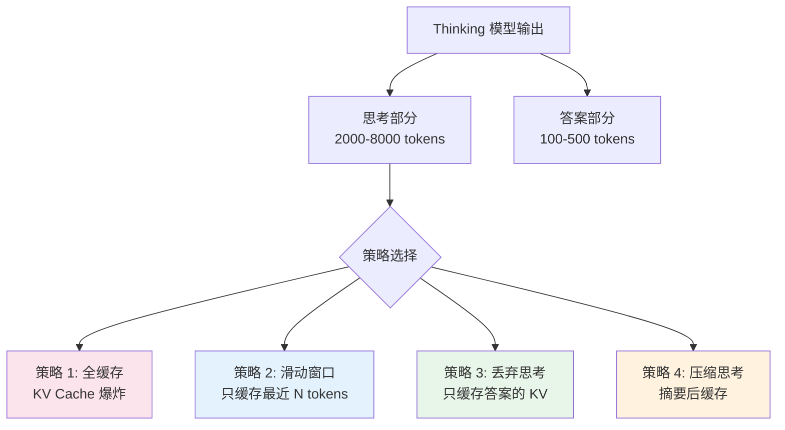
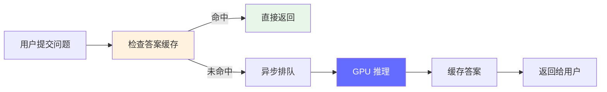

# Thinking / Reasoning 模型 — 推理部署的新范式

> 2025 年 DeepSeek R1 和 OpenAI o1/o3 的出现，标志着 LLM 从"直接回答"进入"先思考再回答"时代。这对 FDE 的部署策略、资源规划和延迟优化产生了根本性影响。

---

## 前置知识

- [Transformer 架构](./transformer-overview.md)
- [KV Cache](./kv-cache.md)
- [大模型后训练范式](./pre-post-training.md)

---

## 什么是 Thinking / Reasoning 模型

传统 LLM 是 **System 1 思维**（直觉式，直接生成回答）。Thinking 模型引入了 **System 2 思维**（慢思考，先生成推理链，再给出最终答案）。



### 代表模型时间线

```
2024.09  OpenAI o1-preview  — 首个商用"先思考再回答"模型
2024.12  DeepSeek R1-Lite   — 开源 Thinking 模型尝试
2025.01  DeepSeek R1        — 首个开源全能力 Thinking 模型，效果追平 o1
2025.02  Kimi k1.5          — 长上下文 + Thinking 结合
2025.04  OpenAI o3          — 更强的 reasoning 能力
2025.04  Claude 4 Opus      — 内置 extended thinking
2025.05  QwQ (Qwen)         — 阿里开源 Thinking 模型
2025.12  Gemini 2.5 Pro     — 原生 reasoning 能力
```

---

## 核心概念：Thinking 模型是怎么训练出来的

### 训练范式：从 SFT 到强化学习



### 关键训练技术

| 技术 | 提出方 | 说明 |
|------|--------|------|
| **Process Reward Model (PRM)** | OpenAI | 对推理链中每个步骤打分，而不仅是最终结果 |
| **GRPO（Group Relative Policy Optimization）** | DeepSeek | 同一问题生成多个回答，用组内相对得分优化策略 |
| **Outcome Reward Model (ORM)** | OpenAI | 只对最终答案打分，简单但粗糙 |
| **Rejection Sampling Fine-tuning** | DeepSeek / 阿里 | 过滤低质量回答，用高质量 CoT 数据做 SFT |
| **RLVR（RL with Verifiable Rewards）** | 社区 | 用可验证的规则（如数学答案正确性）作为奖励 |

**一行话：** Thinking 模型不是通过更多数据训练的，而是通过"让模型自己试错 + 强化学习"训练出推理能力。

---

## Thinking 模型对 FDE 部署的影响

### 影响 1：输出长度暴增

```
传统模型（回答同一问题）：
  输出: ~100 tokens

Thinking 模型：
  思考过程: ~2000-8000 tokens（内部推理链）
  最终答案: ~100-500 tokens
  总输出: ~2100-8500 tokens

输出长度比: 20-85 倍
```

**这对部署意味着：**

| 维度 | 传统模型 | Thinking 模型 | 影响 |
|------|---------|--------------|------|
| 单次请求输出 token | 100-500 | 2000-10000 | GPU 计算时间增加 10-50 倍 |
| KV Cache 占用 | 小 | 大（因为输出长） | 单张 GPU 并发数大幅下降 |
| TTFT | 正常 | 正常 | 不受影响 |
| 端到端延迟 | 秒级 | 10-60 秒级 | 用户体验需要流式展示 |
| GPU 利用率 | 较高 | 较低（decode 占主导） | 需要优化 decode 吞吐 |
| 单 GPU QPS | 10-50 | 1-5 | 成本大幅上升 |

### 影响 2：KV Cache 管理策略需要调整



**各策略对比：**

| 策略 | 显存占用 | 答案质量 | 实现难度 | 推荐场景 |
|------|---------|---------|---------|---------|
| 全缓存 | 极高 | 最高 | 低 | 单用户专用场景 |
| 滑动窗口 | 中等 | 中等（可能丢失早期推理） | 低 | 对话场景 |
| 丢弃思考 | 最低 | 中等（思考对多轮对话有用） | 中 | 单次问答场景 |
| 压缩思考 | 低 | 较高 | 高（需要额外模型） | 高价值场景 |

### 影响 3：流式输出需要区分 thinking 和 answer

```
用户看到的流式输出格式：

<thinking>
嗯，这个问题涉及到...首先我需要考虑...
假设我们有一个函数 f(x)，那么...
让我验证一下这个推导...
看起来是对的。
</thinking>

<answer>
答案是 42。
</answer>
```

**API 需要支持：**

```json
{
  "model": "deepseek-r1",
  "messages": [{"role": "user", "content": "1+1=?"}],
  "stream": true,
  "stream_options": {
    "include_usage": true,
    "separate_thinking": true
  }
}

// 返回的 chunks 格式：
// { "choices": [{ "delta": {"role": "assistant"}, "finish_reason": null, "usage": null }] }
// { "choices": [{ "delta": {"thinking": "嗯，这个问题..."}, "finish_reason": null }] }
// ... (thinking 部分)
// { "choices": [{ "delta": {"answer": "答案是 42。"}, "finish_reason": null }] }
// { "choices": [{ "delta": {}, "finish_reason": "stop", "usage": {"prompt_tokens": 10, "completion_tokens": 2100, "thinking_tokens": 2000}}] }
```

### 影响 4：GPU 资源规划需要重新计算

```
以 Llama-3-70B 在 H100 上为例：

传统模型（输出 200 tokens）：
  单 GPU 并发: ~30 请求
  QPS: ~10
  每请求 GPU 时间: ~3 秒
  月成本（1M 请求）: ~$3,000

Thinking 模型（输出 3000 tokens）：
  单 GPU 并发: ~5 请求（KV Cache 和计算时间都增加）
  QPS: ~1.5
  每请求 GPU 时间: ~40 秒
  月成本（1M 请求）: ~$40,000

成本增加: 13 倍
```

---

## Thinking 模型的部署优化策略

### 策略 1：异步处理 + 结果缓存



适用于：重复问题多的场景（FAQ、常见问题）

### 策略 2：分层推理

```
简单问题 → 快速路径（不 thinking，直接回答）
中等问题 → 短思考（限制 thinking 长度 ≤ 1000 tokens）
复杂问题 → 完整 thinking（不限制）

路由策略：
- 用小型分类模型判断问题复杂度
- 或用规则：数学题/编程题 → 完整 thinking
              日常对话 → 快速路径
```

### 策略 3：Thinking Token 限制 + 强制截断

```bash
# vLLM 启动参数（假设支持 thinking 分隔）
vllm serve deepseek-ai/DeepSeek-R1 \
  --max-thinking-tokens 4096 \
  --max-output-tokens 5000 \
  --stream-thinking true \
  --gpu-memory-utilization 0.95
```

### 策略 4：Prefill-Decode 分离（针对 Thinking 模型优化）

```
Thinking 模型的推理特点：
  - Prefill 很短（用户问题通常不长）
  - Decode 极长（thinking + answer 几千到上万 tokens）

因此 Prefill-Decode 分离特别适合：
  - Prefill 节点：小 GPU 实例，处理短 prompt
  - Decode 节点：大 GPU 集群，处理长 decode
  - 两个节点独立扩缩容，Decode 节点按需增加
```

---

## 面试视角

### 常考问题

1. **"Thinking 模型和普通模型有什么区别？"**

   回答框架：
   - 训练方式：不是用更多数据，而是用"模型自己试错 + 强化学习"训练出推理能力
   - 推理行为：先生成长推理链（思考过程），再给出最终答案
   - 输出长度：通常比普通模型长 20-80 倍
   - 质量：在数学、编程、逻辑推理上显著更强
   - 部署影响：KV Cache 和 GPU 时间大幅增加，需要流式展示和分层处理

2. **"Thinking 模型上线后 GPU 成本怎么控制？"**

   - 分层路由：简单问题走快速路径（不 thinking）
   - 答案缓存：重复问题直接返回缓存
   - Thinking Token 上限：限制最大思考长度
   - 用更小的 Thinking 模型（如 R1-Distill-Llama-8B）替代大模型处理中等难度问题
   - Prefill-Decode 分离：独立扩缩容 decode 节点

3. **"Thinking 模型的 KV Cache 和普通模型有什么不同？"**

   - 输出长度长 20-80 倍 → KV Cache 增长也长 20-80 倍
   - 思考部分的 KV 在生成答案时需要被关注 → 必须缓存
   - 但思考部分的内容对用户价值不大 → 可以考虑丢弃/压缩
   - 多轮对话中，前一轮的思考 KV 对下一轮可能有用 → 需要权衡

4. **"GRPO 训练的原理是什么？"**

   - 对同一个问题，生成 N 个不同的回答（采样）
   - 用验证器/奖励模型给每个回答打分
   - 用组内相对得分（而非绝对得分）来优化策略
   - 优势：不需要额外的奖励模型，用验证规则（如数学答案正确性）就能训练
   - 这是 DeepSeek R1 的核心训练方法

---

## 扩展阅读

- [DeepSeek R1 Technical Report](https://github.com/deepseek-ai/DeepSeek-R1) — DeepSeek
- [OpenAI o1 System Card](https://cdn.openai.com/o1-system-card.pdf) — OpenAI
- [GRPO: Group Relative Policy Optimization](https://arxiv.org/abs/2412.15113) — DeepSeek
- [Process Reward Models](https://arxiv.org/abs/2404.04430) — Anthropic

---

*上一节：[Scaling Law](./scaling-law.md)*
*下一节：[Decoding 策略](./decoding-strategies.md)*
