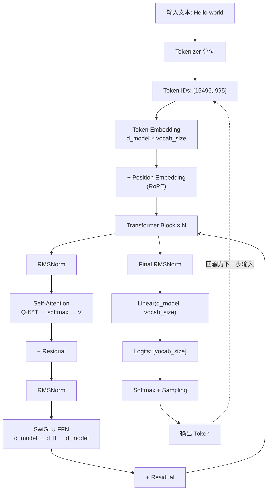
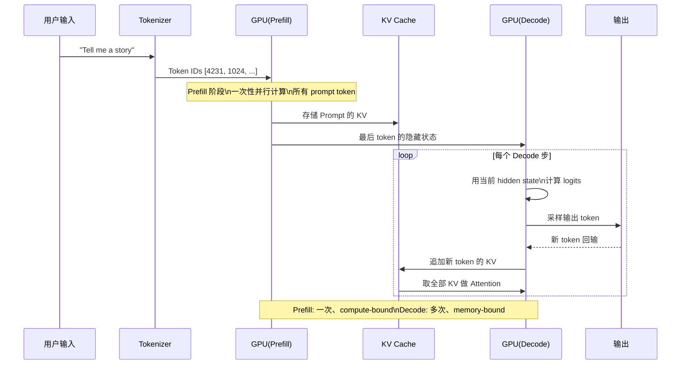

# Transformer 架构概述

> 理解 Transformer 的内部计算特征，是所有推理优化的基础

## 前置知识

建议先阅读 [什么是 FDE](/01-ai-basics/01-what-is-fde) 了解岗位定位。

## 核心概念

### 为什么 FDE 需要理解 Transformer

面试中不会让你手推 Attention 公式，但会问：

- "为什么长上下文的推理延迟会飙升？"
- "GQA 和 MHA 对部署有什么影响？"
- "为什么 decode 阶段是 memory-bound？"

**核心原则：理解计算特征，才能找到优化点。**

### Transformer 架构变体

| 架构 | 输入输出 | 代表模型 | 为什么/不为什么用于 LLM |
|------|----------|----------|------------------------|
| Encoder-only | 文本 → 表示向量 | BERT | 擅长理解，不适合生成 |
| Encoder-Decoder | 文本 → 文本 | T5、BART | 适合翻译/摘要，但推理慢（需 Encoder+Decoder 两轮） |
| **Decoder-only** | 文本 → 文本 | GPT、Llama、Qwen | **自回归生成简单高效，scaling law 表现最好** |

为什么 LLM 几乎全部采用 Decoder-only？

1. **训练简单**：只需要 Causal LM Loss（预测下一个 token），不需要额外的对齐任务
2. **推理简单**：自回归生成，每步只需要 Decoder，不需要 Encoder-Decoder 的 cross attention
3. **Scaling Law 最优**：Chinchilla 论文表明 Decoder-only 在同等参数量下性能最好
4. **上下文灵活**：可以做 in-context learning，zero-shot/few-shot 能力强

### 完整数据流：从 Token 到 Logit



### Attention 公式详解

```
Attention(Q, K, V) = softmax(QK^T / sqrt(d_k)) V
```

各维度：
- `Q`: 线性投影后 `[batch, seq_len, d_model]`，reshape 为 `[batch, seq_len, num_heads, head_dim]`，再 transpose 为 `[batch, num_heads, seq_len, head_dim]`
- `K`: 同 Q 的变换过程
- `V`: 同 Q 的变换过程
- `QK^T`: `[batch, num_heads, seq_len, seq_len]` — 注意力分数矩阵
- `softmax(...)` 在最后一个维度（key 维度）上做归一化

**为什么除以 `sqrt(d_k)`？**

如果 `Q` 和 `K` 的元素是均值为 0、方差为 1 的随机变量，那么 `Q·K^T` 每个元素的方差为 `d_k`。当 `d_k` 较大时，点积值会很大，导致 `softmax` 进入饱和区（梯度接近 0），即 **梯度消失** 问题。除以 `sqrt(d_k)` 将方差重新归一化为 1，使 softmax 的输入保持在合适的范围内。

### 推理的两个阶段

这是 FDE 面试中**最重要**的概念：

#### Prefill（预填充）

- 输入所有 prompt token，**并行计算**
- 复杂度：Attention 部分 `O(seq_len^2)`，FFN 部分 `O(seq_len)`
- **瓶颈：计算密集型（compute-bound）**，GPU 利用率可达 80-95%
- 只执行一次，通常占总推理时间的 5-15%

#### Decode（解码）

- **逐个生成 token**，每步依赖上一步的结果（自回归）
- 每步的 seq_len = 已生成的 token 数 + 1（逐步增长）
- 每步都要加载全部模型权重到 GPU
- **瓶颈：内存带宽型（memory-bound）**，GPU 利用率通常只有 10-30%
- 执行 output_length 次，占总推理时间的 85-95%



### KV Cache（核心优化）

#### 是什么

在 decode 阶段，把前面所有 token 的 Key 和 Value 缓存起来，避免重复计算 Attention 中已有的历史 token 矩阵乘法。

#### 显存计算

```
KV Cache 显存 = 2 × num_layers × batch_size × seq_len × num_kv_heads × head_dim × bytes_per_element

其中：
  - 2 是因为 K 和 V 各存一份
  - bytes_per_element: FP16 = 2, FP8 = 1, INT8 = 1
```

**考虑 GQA 的情况**：GQA 模型中 `num_kv_heads = num_q_heads / groups`，所以实际 KV Cache 比 MHA 小 G 倍。

**示例计算：Llama 3 70B（GQA, 8 KV groups）**

```
num_layers = 80
num_kv_heads = 8 (GQA: 32 Q heads / 8 groups = 4 Q per group)
head_dim = 128
batch_size = 32
seq_len = 8192
dtype = FP16 (2 bytes)

KV Cache = 2 × 80 × 32 × 8192 × 8 × 128 × 2
         = 2 × 80 × 32 × 8192 × 8 × 128 × 2
         = 2 × 80 × 32 × 8192 × 2048
         = 2 × 80 × 32 × 16,777,216
         = 2 × 80 × 536,870,912
         = 85,899,345,920 bytes
         ≈ 80 GB
```

**KV Cache 通常占推理显存的 60-80%。** 这是 FDE 优化的核心战场。

#### 为什么 Decode 是 Memory-Bound 的定量分析

以 Llama 3 70B 为例，单步 decode 的计算量和数据搬运：

```
模型参数量: 70B (FP16 = 140 GB 权重)
每步 FLOPs ≈ 2 × params (前向传播) = 140 GFLOPs

假设 GPU: A100, 理论峰值 312 TFLOPs, 显存带宽 2.0 TB/s

计算所需时间: 140 GFLOPs / 312 TFLOPs ≈ 0.45 ms
权重加载时间: 140 GB / 2.0 TB/s = 70 ms

实际耗时 ≈ 70 ms（权重加载占主导）
GPU 利用率 ≈ 0.45 / 70 ≈ 0.6%

这就是为什么 decode 是 memory-bound：
  计算量极小但需要搬运海量权重，GPU 算术单元大部分时间在空闲。
```

对比 prefill（seq_len=4096）：

```
Prefill FLOPs ≈ 2 × params × seq_len ≈ 140 GFLOPs × 4096 ≈ 574 TFLOPs
计算时间: 574 TFLOPs / 312 TFLOPs ≈ 1.84 s
权重加载: 140 GB / 2.0 TB/s = 70 ms (只需加载一次)

GPU 利用率 ≈ 1.84 / (1.84 + 0.07) ≈ 96%

Prefill 是 compute-bound：计算量远大于数据搬运。
```

## 部署视角

### 生产环境中的关键数字

| 指标 | 典型值 | 说明 |
|------|--------|------|
| Prefill 时间占比 | 5-15% | 即使 prompt 很长，decode 仍占主导 |
| Decode 时间占比 | 85-95% | token-by-token 生成 |
| KV Cache 显存占比 | 60-80% | batch 越大、上下文越长，占比越高 |
| FFN 参数占比 | ~2/3 | 模型参数主要花在 FFN 上 |
| A100 decode 吞吐 | 70B 模型约 8-15 token/s | memory-bound 限制了上限 |
| H100 decode 吞吐 | 70B 模型约 15-30 token/s | 带宽提升约 2x |

### 常见问题排查

| 症状 | 可能原因 | 排查方法 |
|------|----------|----------|
| 长 prompt 后 OOM | KV Cache 超出显存 | `batch_size × seq_len × num_kv_heads` 是否过大 |
| decode 极慢 | memory-bound 严重 | 检查是否启用了 FlashAttention、张量并行 |
| 首 token 延迟高 | prefill 计算量大 | 考虑 chunked prefill / 前缀缓存 |
| 吞吐不稳定 | batch 动态变化 | 检查 continuous batching 配置 |

### 部署优化方向

1. **减少 KV Cache**：GQA/MQA、KV Cache 量化、PagedAttention
2. **提高 Prefill 效率**：Chunked Prefill（将长 prompt 分段处理，避免 KV Cache 峰值）
3. **提高 Decode 效率**：Continuous Batching（动态合并不同请求的 decode 步）
4. **权重优化**：权重量化（INT8/FP8/INT4）、张量并行

## 面试视角

### 面试官会怎么问

**Q1: "解释一下 Transformer 推理的两个阶段，它们各自的特点是什么？"**

满分回答框架：
- Prefill：并行处理所有 prompt token，compute-bound，O(n^2) 复杂度，只执行一次
- Decode：逐个生成 token，memory-bound，每步加载全部权重，执行 output_length 次
- Decode 占总时间 85-95%，是优化重点

**Q2: "给你一个 70B 的模型，batch=64，seq_len=32K，FP16，用 GQA（8 groups），估算 KV Cache 大小？"**

满分回答框架：
- 写出公式：`2 × num_layers × batch × seq_len × num_kv_heads × head_dim × 2 bytes`
- 代入 Llama 3 70B 参数：80 层，num_kv_heads=8，head_dim=128
- 计算：`2 × 80 × 64 × 32768 × 8 × 128 × 2 ≈ 343 GB`
- 结论：单卡放不下，需要多卡或减少 batch/seq_len

**Q3: "为什么 decode 是 memory-bound 而不是 compute-bound？"**

满分回答框架：
- Decode 每步的 FLOPs 约为 `2 × params`，但需要加载全部 `params × 2 bytes` 的权重
- 以 A100 为例：计算只需 0.45ms，权重搬运需 70ms
- GPU 算术单元 99% 时间在等待数据从 HBM 搬运
- 因此优化方向是提高带宽利用率（量化减少数据量、张量并行分担带宽压力）

**Q4: "为什么 LLM 都用 Decoder-only 架构？Encoder-Decoder 不好吗？"**

满分回答：
- Decoder-only 训练简单（只需要 Causal LM Loss）
- 推理只需 Decoder，无需 cross attention
- Scaling Law 表现最优
- 支持 in-context learning
- Encoder-Decoder 需要 Encoder 预编码 + Decoder 生成 + Cross Attention，部署复杂度高

## 对比分析

### Decoder-only vs Encoder-Decoder 推理开销对比

| 维度 | Decoder-only | Encoder-Decoder |
|------|-------------|-----------------|
| 推理阶段 | 仅 Decode | Encoder 编码 + Decode |
| 每步 Attention | Self-Attention | Self + Cross Attention |
| KV Cache | 仅自身 | 自身 + Encoder KV |
| 训练 Loss | Causal LM | Masked LM + Cross Entropy |
| 部署复杂度 | 低 | 高 |
| Scaling 表现 | 最优 | 次优 |

## 最佳实践

### 调参建议

- **batch_size**：越大吞吐越高，但 KV Cache 线性增长。70B 模型在 A100 上建议 batch ≤ 32
- **max_seq_len**：根据业务需求设置，不要盲目设为模型最大值。KV Cache 随 seq_len 线性增长
- **chunked prefill**：prompt 超过 8K 时启用，避免 KV Cache 峰值导致 OOM
- **continuous batching**：必开，不同请求的 decode 步动态合并，提升吞吐 2-3x

### 避坑指南

- 不要用 MHA 模型做长上下文推理（KV Cache 爆炸）
- 不要一次性把所有显存分配给 KV Cache，留 10-20% 给中间激活
- 监控 GPU 利用率：decode 阶段低于 20% 是正常的（memory-bound 特性决定）
- 选择 H100 而非 A100 做推理：HBM3 带宽提升 1.5x，对 decode 有直接收益

*上一节：[入门篇](/01-ai-basics/)*
*下一节：[Attention 机制深入](./attention-mechanism.md)*
