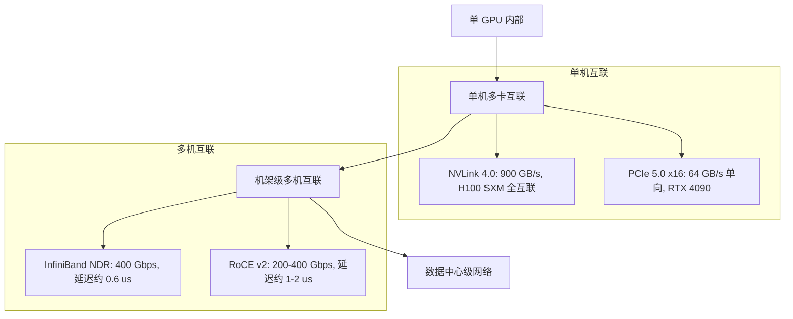
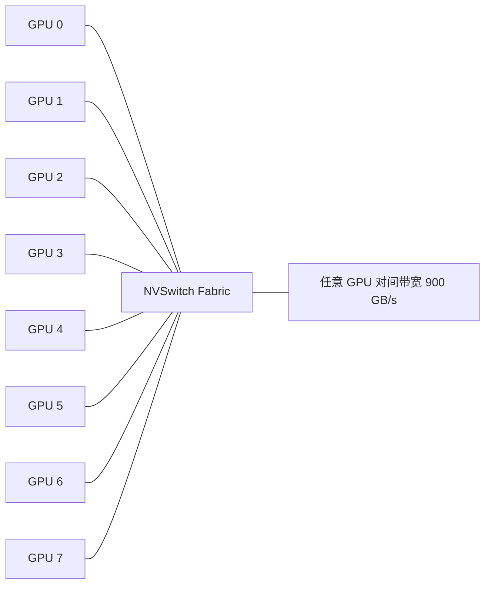

# GPU 互联与多卡通信

> 单机多卡靠 NVLink，多机多卡靠 InfiniBand。互联带宽直接决定张量并行（TP）的可行性。

## 前置知识

- [GPU 架构概览](./gpu-overview.md) — 理解 GPU 内部结构
- [张量并行](../05-distributed-inference/tensor-parallel.md) — 理解 TP 为什么需要高带宽通信

## 核心概念：GPU 互连拓扑

### 互联层级图



**互联带宽的层次差异**：

| 层级 | 技术 | 带宽 | 延迟 | 适用场景 |
|------|------|------|------|---------|
| 芯片内部 | 内部总线 | 大于 10 TB/s | 小于 1 cycle | SM 间通信 |
| 单机多卡 | NVLink 4.0 | 900 GB/s | 约 2-3 us | TP（张量并行） |
| 单机多卡 | PCIe 5.0 | 64 GB/s 单向 | 约 5-10 us | PP（流水线并行） |
| 机架多机 | InfiniBand NDR | 400 Gbps (约 50 GB/s) | 约 0.6 us | TP / PP / DP |
| 机架多机 | RoCE v2 | 200 Gbps (约 25 GB/s) | 约 1-2 us | PP / DP |

## PCIe：为什么不够用

### PCIe 带宽数据

| 版本 | 每 lane 带宽 | x16 总带宽（单向） | x16 双向带宽 |
|------|-------------|-------------------|-------------|
| PCIe 3.0 | 1 GB/s | 16 GB/s | 32 GB/s |
| PCIe 4.0 | 2 GB/s | 32 GB/s | 64 GB/s |
| PCIe 5.0 | 4 GB/s | 64 GB/s | 128 GB/s |
| PCIe 6.0（未来） | 8 GB/s | 128 GB/s | 256 GB/s |

### 为什么 PCIe 不能做 TP 通信

以 70B 模型 TP=4 为例，每卡持有约 17.5B 参数。每次前向传播需要在 GPU 间交换激活值（activation）：

- 假设每层 hidden size = 8192，32 层
- 每层传输量约等于 8192 乘以 4 bytes（FP32）= 32 KB
- 32 层乘以 32 KB = 约 1 MB / forward pass
- 如果目标 1000 token/s：1 MB 乘以 1000/s = 约 1 GB/s

PCIe 4.0 x16（32 GB/s 单向）看似够用，但实际上还有 All-Reduce、All-Gather 等集体通信操作，总通信量远大于此。更关键的是 **延迟**：

- PCIe 延迟约 5-10 us，NVLink 约 2-3 us
- 对于小消息高频通信（TP 每层都要同步），延迟的影响远大于带宽

**结论**：PCIe 可以做模型并行中的 PP（流水线并行，通信频率低），但不能做 TP（张量并行，通信频率高）。

### PCIe 拓扑限制

PCIe 是 **点到点总线**，经过 CPU Root Complex 或 PCIe Switch。这意味着：

1. 所有 GPU 间通信必须经过 CPU 或 Switch，引入额外延迟
2. 带宽受限于 Root Complex 的聚合能力
3. 不支持缓存一致性，需要显式数据传输
4. 多 GPU 共享 PCIe 带宽（如 16 条 lane 分给 2 张卡则每卡只有 x8）

## NVLink：GPU 间的高速公路

### NVLink 原理

NVLink 是 NVIDIA 专有的 GPU-GPU 互连技术，本质是 **高速点对点串行链路**：

1. **拓扑**：每个 GPU 有多个 NVLink 端口（H100 有 18 个 link），连接到其他 GPU 或 NVSwitch
2. **带宽**：H100 的 NVLink 4.0 每个 link 50 GB/s，18 个 link 总双向带宽 900 GB/s
3. **延迟**：约 2-3 us，比 PCIe 快 2-5 倍
4. **缓存一致性**：NVLink 支持 GPU Direct，可以绕过 CPU 直接在 GPU 间传输数据，甚至支持 GPU 间共享内存地址空间

### NVLink vs PCIe 对比

| 维度 | NVLink 4.0 | PCIe 5.0 x16 |
|------|-----------|-------------|
| 双向带宽 | 900 GB/s | 128 GB/s |
| 单向带宽 | 450 GB/s | 64 GB/s |
| 延迟 | 约 2-3 us | 约 5-10 us |
| 拓扑 | 全互联（通过 NVSwitch） | 点到点（经过 CPU/Root Complex） |
| 一致性 | GPU Direct 缓存一致 | 无 |
| 适用 | TP（张量并行） | 数据加载、PP（流水线并行） |

### 为什么 TP 需要 NVLink

张量并行（Tensor Parallelism）要求每层的前向传播中都要做 All-Reduce 或 All-Gather 通信：

```
Layer 1: GPU0 -- All-Reduce -- GPU1 -- All-Reduce -- GPU2 -- All-Reduce -- GPU3
Layer 2: GPU0 -- All-Reduce -- GPU1 -- All-Reduce -- GPU2 -- All-Reduce -- GPU3
...
Layer 80: GPU0 -- All-Reduce -- GPU1 -- All-Reduce -- GPU2 -- All-Reduce -- GPU3
```

如果 80 层每层都通信，总通信延迟 = 80 乘以 2-3 us = 约 160-240 us（NVLink），而 PCIe 下 = 80 乘以 5-10 us = 约 400-800 us。这直接影响 end-to-end 延迟。

### NVLink 代际对比

| 版本 | Link 数量 | 每 Link 带宽 | 总双向带宽 | 典型 GPU |
|------|----------|-------------|-----------|---------|
| NVLink 2.0 | 6 | 25 GB/s | 300 GB/s | V100 |
| NVLink 3.0 | 12 | 50 GB/s | 600 GB/s | A100 |
| NVLink 4.0 | 18 | 50 GB/s | 900 GB/s | H100 |
| NVLink 5.0 | 18 | 100 GB/s | 1.8 TB/s | B200 |

## NVSwitch：全互联的枢纽

### 原理

NVSwitch 是一个 **高速交换芯片**，将多个 GPU 的 NVLink 端口连接起来，实现 **全互联（fully-connected）拓扑**：



- H100 SXM 系统有 **4 个 NVSwitch 芯片**，每个 GPU 通过 18 个 NVLink 连接到所有 4 个 Switch
- 结果：**任意两张 GPU 之间的带宽都是 900 GB/s**，真正的全互联
- 相比之下，消费级 GPU（如 RTX 4090）没有 NVLink，只能走 PCIe

### NVSwitch 带宽计算

以 H100 SXM 8-GPU 为例：

- 每 GPU 到 NVSwitch：18 个 link 乘以 50 GB/s = 900 GB/s
- 8 GPU 总带宽：8 乘以 900 GB/s = 7.2 TB/s（双向）
- NVSwitch 内部交换容量需要支撑所有 GPU 对间同时通信
- 实际测试中，HGX H100 8 卡全互联 All-Reduce 带宽接近理论值

## 多机互联：InfiniBand vs RoCE

### RDMA 基础

**RDMA（Remote Direct Memory Access）** 允许一台机器直接读写另一台机器的内存，**绕过 CPU 和 OS 内核**：

- **零拷贝**：数据从网卡直接到目标内存，不经过 CPU
- **内核旁路**：不需要操作系统内核参与，减少上下文切换
- **低延迟**：微秒级，远低于 TCP/IP 的毫秒级

RDMA 有三种实现方式：

| 实现 | 传输层 | 特点 |
|------|--------|------|
| InfiniBand | 专用 IB 协议 | 延迟最低（约 0.6 us），需要专用硬件 |
| RoCE v2 | UDP over Ethernet | 延迟约 1-2 us，复用以太网基础设施 |
| iWARP | TCP over Ethernet | 兼容性最好，但延迟最高 |

### InfiniBand vs RoCE 对比

| 维度 | InfiniBand NDR | RoCE v2 |
|------|---------------|---------|
| 带宽 | 400 Gbps（约 50 GB/s） | 200-400 Gbps |
| 延迟 | 约 0.6 us | 约 1-2 us |
| 协议 | 专用 IB 协议 | RDMA over UDP/Ethernet |
| 硬件 | IB HCA + IB Switch | 标准以太网卡（需支持 RDMA）+ 以太网交换机 |
| 成本 | 高（专用硬件） | 低（复用以太网） |
| 拥塞控制 | 硬件级（完美） | 需要 DCQCN（可能丢包） |
| 部署复杂度 | 高（专用网络） | 中（无损以太网要求） |
| 适用场景 | 大规模集群 TP | 中小规模 / 成本敏感 |

### 不同互连下的 TP 通信延迟

以 70B 模型 TP=8 为例（每层 All-Reduce）：

| 互连方式 | 每层延迟 | 80 层总延迟 | 实际可行性 |
|---------|---------|-----------|-----------|
| NVLink 4.0（同机） | 约 3 us | 约 240 us | 推荐 |
| NVLink 4.0 跨 NVSwitch | 约 5 us | 约 400 us | 可用 |
| InfiniBand NDR | 约 15 us | 约 1.2 ms | 不推荐 |
| RoCE v2 200G | 约 30 us | 约 2.4 ms | 不推荐 |
| TCP/IP 以太网 | 约 100 us 以上 | 约 8 ms 以上 | 不可用 |

> 注：跨服务器 TP 的延迟还包括序列化/反序列化、网络栈开销，实际数字会比纯硬件延迟大很多。

## 部署视角：网络规划建议

### 单机多卡部署（推荐）

```
+---------------------------------------------+
|  HGX H100 8-GPU 服务器                       |
|                                             |
|  GPU0 <-> NVLink <-> GPU1 <-> NVLink ...    |
|    |          |           |                 |
|    +-------- NVSwitch（全互联）-------------+ |
|              每对 900 GB/s                   |
|                                             |
|  对外：2x InfiniBand NDR 400G               |
+---------------------------------------------+
```

- **TP 在单机内完成**：利用 NVLink 全互联，延迟约 240 us
- **多机之间用 IB 做 DP（数据并行）**：不同请求分发到不同服务器，无跨机 TP
- **这是目前主流部署方案**

### 多机多卡部署（不推荐用于 TP）

如果必须在多机之间做 TP（如模型太大单机放不下），需要：

1. 所有机器在同一个机架（减少网络跳数）
2. 使用 InfiniBand NDR（不要用 RoCE 做 TP）
3. 网络拓扑优化：尽量让通信频繁的两张卡在同一个 NVLink 域内
4. 预期延迟是单机 NVLink 的 5-10 倍

### 网络规划 checklist

- [ ] 单机内 TP 必须走 NVLink
- [ ] 多机间优先 InfiniBand NDR，不要跨机 TP
- [ ] RoCE 用于 DP 或 PP，不用于 TP
- [ ] 确保无损网络：启用 PFC（Priority Flow Control）和 ECN
- [ ] 网络拓扑与并行策略匹配：TP 同域，DP 跨域
- [ ] 监控 IB/RoCE 的 PFC 暂停帧和拥塞事件

### 实际网络拓扑示例

```
                    +-----------------+
                    |   Management    |
                    |   Network       |
                    +--------+--------+
                             |
        +--------------------+--------------------+
        |                    |                    |
  +-----+------+      +-----+------+      +-----+------+
  | IB Switch  |      | IB Switch  |      | IB Switch  |
  |   #1       |      |   #2       |      |   #3       |
  +-----+------+      +-----+------+      +-----+------+
        |                 |                  |
   +----+----+       +----+----+        +----+----+
   | HGX H100|       | HGX H100|        | HGX H100|
   | 8-GPU   |       | 8-GPU   |        | 8-GPU   |
   +---------+       +---------+        +---------+
```

每台 HGX H100 服务器通过 2 条 IB NDR 链路分别连接到不同的 IB Switch，实现冗余。

## 面试视角

### 常考问题

1. **"NVLink 和 PCIe 有什么区别？"**
   - 带宽：NVLink 4.0 双向 900 GB/s vs PCIe 5.0 双向 128 GB/s，差约 7 倍
   - 延迟：NVLink 约 2-3 us vs PCIe 约 5-10 us
   - 拓扑：NVLink 全互联 vs PCIe 点到点（经过 CPU）
   - 一致性：NVLink 支持 GPU Direct 缓存一致

2. **"什么是 NVSwitch？"**
   - NVSwitch 是 NVLink 的交换芯片，实现 GPU 间全互联
   - H100 SXM 有 4 个 NVSwitch，任意两张 GPU 间带宽都是 900 GB/s
   - 没有 NVSwitch 的话，GPU 只能通过部分 NVLink 连接（非全互联）

3. **"为什么跨服务器的 TP 不推荐？"**
   - 延迟：NVLink 约 3 us vs InfiniBand 约 15 us，差 5 倍
   - 每层都要做 All-Reduce，80 层总延迟差距约 240 us vs 约 1.2 ms
   - 直接反映在 end-to-end 延迟上，用户体验明显
   - 推荐方案：TP 在单机内，DP 跨机

4. **"InfiniBand 和普通以太网有什么区别？"**
   - InfiniBand 是专用协议和硬件，RDMA 原生支持，延迟约 0.6 us
   - 普通以太网走 TCP/IP 延迟约 100 us 以上
   - RoCE 在以太网上跑 RDMA，延迟约 1-2 us，但需要无损网络配置
   - InfiniBand 成本高但稳定，RoCE 成本低但调优复杂

5. **"TP（张量并行）和 DP（数据并行）对网络的要求有什么不同？"**
   - TP：每层前向传播都需通信，要求极低延迟（NVLink 级别）
   - DP：每个 step 结束时做一次梯度同步，通信频率低，可以用 IB/RoCE
   - 所以 TP 必须同机，DP 可以跨机

### 进阶问题

6. **"NVLink 和 NVSwitch 的关系是什么？"**
   - NVLink 是 GPU 间的点对点链路（类似网线）
   - NVSwitch 是交换芯片（类似交换机），将多条 NVLink 连接起来
   - 没有 NVSwitch，GPU 只能点对点连接（带宽受限）
   - 有了 NVSwitch，所有 GPU 间都是全互联

7. **"什么是 GPU Direct RDMA？"**
   - GPU Direct RDMA 允许网卡（NIC）直接读写 GPU 显存，不经过 CPU 内存
   - 路径：网卡 -> PCIe -> GPU 显存（绕过 CPU 内存拷贝）
   - 对多机推理/训练中，减少一次内存拷贝，降低延迟和 CPU 占用

8. **"RoCE v2 需要什么样的网络配置才能无损运行？"**
   - PFC（Priority Flow Control）：基于优先级的流量控制，防止丢包
   - ECN（Explicit Congestion Notification）：显式拥塞通知
   - DCQCN（Data Center Quantized Congestion Notification）：拥塞控制算法
   - 缺少任何一项都可能导致丢包，RDMA 重传会大幅增加延迟

## 最佳实践

1. **TP 绝不跨机**：跨机 TP 的延迟损失是 5-10 倍，直接反映在推理延迟上。如果单机放不下，增大 TP 到多机不如换更大的单机。
2. **NVLink 是生产环境的必需品**：不要用 PCIe 做 TP，延迟和带宽都不够。RTX 4090 没有 NVLink，只适合单卡开发。
3. **InfiniBand 用于 DP，不用于 TP**：多机场景用 DP（每个机器独立处理不同请求），用 IB 做数据分发。
4. **监控网络拥塞**：IB/RoCE 网络的 PFC 暂停帧、丢包率直接影响通信性能。定期检查 `ibstat` 和 `perftest`。
5. **H100 SXM 是部署 70B+ 模型的推荐选择**：8 卡 NVLink 全互联 + 900 GB/s 带宽，TP=8 延迟可接受。
6. **不要在以太网上跑 TP**：TCP/IP 延迟约 100 us 以上，80 层总延迟超过 8 ms，用户体验不可接受。

---

*GPU 基础完成 -> 进入 [分布式推理](../05-distributed-inference/distributed-overview.md)*
