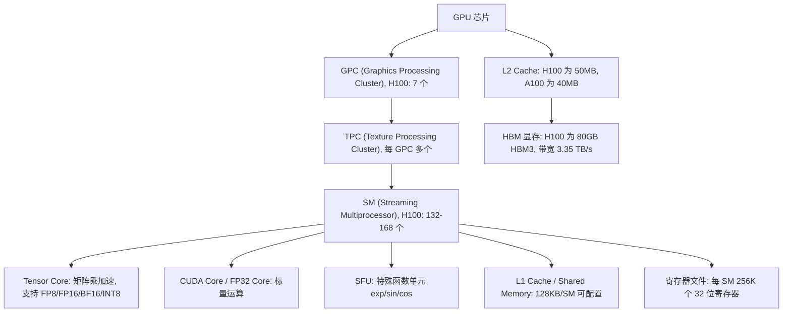
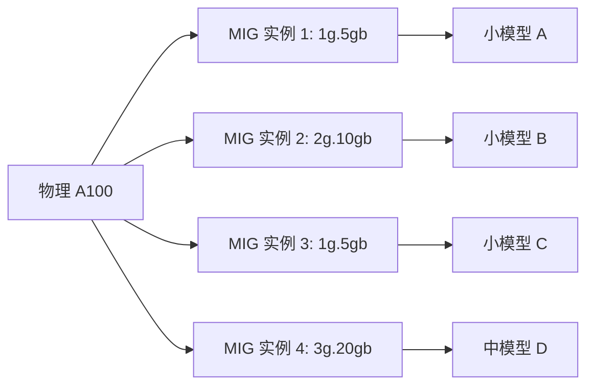

# GPU 架构概览

> GPU 是 LLM 推理的唯一载体，理解其架构是性能优化的前提。

## 为什么 FDE 需要懂 GPU

推理优化的最终战场在 GPU 上。从模型量化、算子融合、KV Cache 管理到多卡部署，每一项优化都建立在对 GPU 硬件的理解之上。面试中经常考察：为什么 decode 阶段是 memory-bound？为什么要用 Tensor Core？如何选 GPU 性价比最高？这些问题的答案都在架构细节里。

## 核心概念：GPU 架构概览

### 层级结构

GPU 的架构是一个严格的层级树，从大到小：



**关键路径**：数据从 HBM 经过 L2、L1/Shared Memory 到达 SM，在 SM 中由 Tensor Core 或 CUDA Core 执行计算，结果写回。每一步的延迟和带宽差异巨大。

### SM（Streaming Multiprocessor）—— GPU 的基本执行单元

SM 是 GPU 中真正的 "计算核心"。可以把它类比为 CPU 的一个核心，但设计理念完全不同：

- **H100**：132 个 SM（SXM 版本 168 个），每个 SM 包含 4 个 warp scheduler、128 个 FP32 Core、4 个 Tensor Core（第五代）
- **A100**：108 个 SM（SXM 版本），每个 SM 含 64 个 FP32 Core、1 个 Tensor Core（第三代）
- 每个 SM 可以同时调度多个 **warp**（32 个线程为一组）

SM 的核心优势是 **极高并发度**：单个 SM 可容纳 2048 个线程（Hopper），整个 H100 SXM 可以同时运行超过 34 万个活跃线程。

### Warp —— SIMT 执行的基本单位

Warp 是 32 个线程的组。SM 以 warp 为单位调度指令：

- **SIMT（Single Instruction, Multiple Threads）**：一个 warp 中的 32 个线程执行同一条指令，但各自操作不同的数据
- 如果 warp 中的线程走不同分支（if-else），会发生 **warp divergence**，两条路径串行执行，性能减半
- 这就是为什么 GPU kernel 要尽量保证相邻线程执行相同路径

```
示例：warp divergence
    if (thread_id % 2 == 0) {
        // 路径 A: 偶数线程执行
    } else {
        // 路径 B: 奇数线程执行
    }
    // 结果：路径 A 和路径 B 串行执行，总时间 = A + B
```

### Tensor Core —— LLM 推理的核心引擎

Tensor Core 是 NVIDIA Volta（2017）引入的专用矩阵乘法单元，到 Hopper 已经进化到第五代。

**为什么 Tensor Core 是 LLM 推理的核心？**

1. **MMA（Matrix Multiply-Accumulate）指令**：一次指令完成 D = A 乘以 B + C，其中 A、B、C 都是矩阵块。Hopper 第五代 Tensor Core 支持 FP8 精度下的 512 TOPS/SM，比 FP32 快 1000 倍以上。

2. **混合精度推理**：权重和激活用 FP8/FP16/BF16（低精度、省带宽），累加用 FP32（高精度、保精度）。这种精度策略大幅降低了显存带宽需求。

3. **LLM 的本质是矩阵乘法**：Attention 的 QKV 投影、MLP 的线性层全部是 GEMM（General Matrix Multiply），这正是 Tensor Core 最擅长的操作。LLM 中 95% 以上的计算量在 GEMM 上。

### CUDA Core vs Tensor Core

| 维度 | CUDA Core（FP32） | Tensor Core |
|------|-------------------|-------------|
| 运算类型 | 标量（1 次 FP32 FMA） | 矩阵块（4x4、8x8、16x16） |
| 峰值吞吐（H100 SXM） | 约 67 TFLOPS | 约 989 TFLOPS（FP8 密集） |
| 适用场景 | 通用计算、后处理 | GEMM、卷积、LLM 推理 |
| 精度 | FP32、INT32 | FP8、FP16、BF16、INT8、INT4 |
| 在 SM 中的数量 | 128 个/SM | 4 个/SM（第五代） |

### SIMT vs MIMD —— GPU 与 CPU 的本质差异

理解这一点是理解一切 GPU 性能优化的基础：

| 维度 | CPU（MIMD） | GPU（SIMT） |
|------|-------------|-------------|
| 设计理念 | 低延迟、强串行 | 高吞吐、大规模并行 |
| 核心数 | 8-128 | 数千至数万 |
| 缓存 | 大而复杂（L1/L2/L3） | 小但极快 |
| 适合场景 | 控制流复杂、分支多 | 数据并行、规则计算 |
| 矩阵运算 | 不擅长 | 天生适合（一个 warp 32 线程同时处理 32 个元素） |

GPU 适合矩阵运算的根本原因：**矩阵乘法的每个输出元素计算是独立的**，可以分配给不同的 warp 同时执行。GEMM 的 O(n 的三次方) 计算量和 O(n 平方) 数据量使得计算强度高，能够充分利用 GPU 的算力。

## NVIDIA GPU 产品线对比

### 推理场景关键参数表

| 参数 | H100 SXM | H100 NVL | A100 SXM | A10 | L40S | RTX 4090 |
|------|---------|---------|----------|-----|------|----------|
| 架构 | Hopper | Hopper | Ampere | Ampere | Ada Lovelace | Ada Lovelace |
| GPU 显存 | 80GB HBM3 | 94GB HBM3 | 80GB HBM2e | 24GB GDDR6 | 48GB GDDR6X | 24GB GDDR6X |
| 显存带宽 | 3.35 TB/s | 3.9 TB/s | 2.0 TB/s | 600 GB/s | 864 GB/s | 1.0 TB/s |
| FP16 Tensor | 989 TFLOPS | 1.5 PFLOPS | 312 TFLOPS | 125 TFLOPS | 366 TFLOPS | 330 TFLOPS |
| FP8 Tensor | 1978 TFLOPS | 3 PFLOPS | 不支持 | 不支持 | 731 TFLOPS | 660 TFLOPS |
| NVLink | 900 GB/s | 900 GB/s | 600 GB/s | 不支持 | 不支持 | 不支持 |
| TDP | 700W | 700W | 500W | 150W | 350W | 450W |
| 参考价 | 3 万美元以上 | 3.5 万美元以上 | 1.5 万美元以上 | 2 千美元以上 | 1 万美元以上 | 1600 美元 |
| 推理定位 | 旗舰多卡 | 旗舰多卡 | 主力通用 | 轻量推理 | 性价比推理 | 实验/开发 |

### H100 vs A100 关键差异

H100 相比 A100 的改进是代际性的，不只是 "更快一点"：

1. **HBM3 vs HBM2e**：带宽从 2.0 TB/s 提升到 3.35 TB/s（提升 67.5%）。这直接决定了 decode 阶段的 throughput 上限。

2. **NVLink 4.0**：带宽从 600 GB/s 提升到 900 GB/s（提升 50%）。对于 TP（张量并行）通信延迟影响巨大。

3. **FP8 支持**：H100 原生支持 FP8 Tensor Core，相比 FP16 几乎 **双倍 throughput**。这是 H100 推理性能的核心优势。FP8 量化正在成为 LLM 推理的事实标准。

4. **Transformer Engine**：H100 内置硬件级的自动混合精度引擎，可自动选择 FP8/FP16/BF16。

5. **SM 数量**：H100 SXM 168 个 vs A100 SXM 108 个（增加 56%），FP16 Tensor 吞吐增加 217%。

## 深入：GPU 硬件层次详解

### GPC 与 TPC

在 SM 之上，GPU 还有两层组织结构：

- **GPC（Graphics Processing Cluster）**：GPU 中最大的功能单元。H100 有 7 个 GPC，每个 GPC 包含多个 TPC 和一个 Raster Engine（光栅引擎，渲染用，推理不相关）。GPC 之间共享 L2 Cache。
- **TPC（Texture Processing Cluster）**：GPC 的子单元，通常包含 2 个 SM。TPC 是 NVIDIA 管理功耗和频率的基本单位。

对推理而言，我们主要关心 SM 和 Tensor Core，GPC/TPC 是物理组织层面，不影响编程模型。

### GPU 代际演进：从 CUDA 到 Blackwell

| 架构 | 年份 | Tensor Core 代数 | 关键特性 |
|------|------|-----------------|---------|
| Volta | 2017 | 第一代 | 首次引入 Tensor Core（FP16） |
| Turing | 2018 | 第二代 | INT8 推理支持 |
| Ampere | 2020 | 第三代 | FP32 翻倍、BF16 支持、TF32 |
| Ada Lovelace | 2022 | 第四代 | FP8 实验性支持、AV1 编码 |
| Hopper | 2022 | 第五代 | FP8 原生、Transformer Engine |
| Blackwell | 2024 | 第六代 | FP4 支持、1.8 TB/s NVLink |

**对 FDE 的意义**：架构代际直接决定了你能用什么精度。Ampere（A100）不支持 FP8，所以 FP8 量化在 A100 上无法使用 Tensor Core 加速。

### MIG（Multi-Instance GPU）

MIG 是 Ampere（A100/A30）引入的功能，可以将一张物理 GPU 切分成最多 7 个完全隔离的 GPU 实例：

- **隔离级别**：每个 MIG 实例有独立的 SM、显存、L2 Cache，互不干扰
- **切分模式**：1g.5gb（1/7 SM + 5GB）、2g.10gb、3g.20gb、4g.20gb、7g.40gb 等
- **适用场景**：多租户小模型部署、开发环境共享
- **不适用**：大模型部署（单个 MIG 实例 SM 数太少，无法支撑大模型的 TP）



## 部署视角：GPU 选型指南

### 按场景选 GPU

| 场景 | 推荐 GPU | 理由 |
|------|---------|------|
| 生产级 LLM 服务（70B+） | H100 SXM x 8 | 需要 HBM3 带宽 + NVLink 4.0 + FP8 |
| 生产级 LLM 服务（7B-13B） | A100-80G x 2-4 | 性价比最优 |
| 成本敏感推理（7B） | L40S x 1-2 | GDDR6X 够用，价格友好 |
| 开发/测试 | RTX 4090 | 单卡开发，FP16 性能强，但无 NVLink |
| 边缘推理（小于 1B 参数） | A10 / L4 | 低功耗，PCIe 单槽 |
| 多租户小模型 | A100 MIG | 一张卡切 7 份独立实例 |

### 选型核心指标

1. **显存容量**：决定能部署多大的模型。70B FP16 需要约 140GB，至少需要 2 张 A100-80G 或 2 张 H100-80G。
2. **显存带宽**：决定 decode 阶段的 token 生成速度。HBM3 大于 HBM2e 远大于 GDDR6。
3. **NVLink**：多卡 TP 通信的关键。没有 NVLink（如 RTX 4090），多卡只能走 PCIe，TP 通信延迟高 10 倍。
4. **FP8 支持**：H100 独有，FP8 量化可几乎翻倍 throughput。
5. **TCO**：考虑 TDP（电费）、机架空间、冷却成本。H100 700W vs RTX 4090 450W。

## 面试视角

### 进阶问题

6. **"GPU 的 GPC、TPC、SM 之间是什么关系？"**
   - GPU -> GPC（7 个）-> TPC（每 GPC 多个）-> SM（每 TPC 2 个）
   - GPC 是最大功能单元，TPC 是功耗管理单元，SM 是执行单元
   - 对推理编程，只关心 SM 数量（决定并行度）

7. **"CUDA Core 和 Tensor Core 的数量关系？"**
   - H100：每 SM 有 128 个 CUDA Core + 4 个 Tensor Core
   - Tensor Core 数量少但吞吐高（每个一次处理 16x16 矩阵块）
   - LLM 中 95% 以上计算走 Tensor Core，CUDA Core 只做后处理（layernorm、softmax 等）

8. **"Blackwell（B200）相比 H100 有什么改进？"**
   - NVLink 5.0：1.8 TB/s（H100 的 2 倍）
   - 第六代 Tensor Core：支持 FP4（极致量化）
   - 双 die 设计：两个 GPU die 封装，通过 10 TB/s 内部互连
   - 主要面向训练，推理亮点是 FP4 量化

### 常考问题

1. **"GPU 和 CPU 的架构区别是什么？为什么 GPU 适合 LLM 推理？"**
   - GPU 是 SIMT（大量简单核心同时执行相同指令），CPU 是 MIMD（少量复杂核心执行不同指令）
   - LLM 推理本质是大矩阵乘法（GEMM），高度数据并行，天然适合 SIMT
   - GPU 有 Tensor Core 专用矩阵单元，FP16 吞吐是 CPU 的 100 倍以上

2. **"什么是 Tensor Core？它和普通 CUDA Core 的区别？"**
   - Tensor Core 执行 MMA 指令（矩阵乘累加），一次操作处理矩阵块（如 16x16）
   - CUDA Core 执行标量运算（一次 FP32 FMA）
   - H100 上 Tensor Core FP8 吞吐约 1978 TFLOPS，FP32 只有约 67 TFLOPS

3. **"H100 相比 A100 有哪些关键升级？对推理有什么影响？"**
   - HBM3（3.35 TB/s vs 2 TB/s）：decode throughput 提升 60% 以上
   - FP8 Tensor Core：几乎双倍吞吐
   - NVLink 4.0（900 GB/s vs 600 GB/s）：多卡 TP 延迟降低

4. **"什么是 warp？什么是 warp divergence？"**
   - Warp = 32 个线程的调度组，SIMT 执行
   - Warp divergence = warp 内线程走不同分支，导致两条路径串行执行

5. **"70B 模型怎么部署？需要什么样的 GPU 配置？"**
   - FP16 权重约 140GB，至少需要 2 张 A100-80G 或 2 张 H100-80G
   - 还需要预留 KV Cache 空间，实际建议 4 张 A100-80G 或 4 张 H100-80G
   - 多卡之间需要 NVLink 做 TP 通信

6. **"MIG 是什么？什么场景适合用？"**
   - MIG 把一张 A100 切分成最多 7 个独立 GPU 实例
   - 适合多租户小模型部署，每个实例有独立 SM 和显存
   - 不适合大模型（SM 太少，无法支撑大模型 TP）

## 最佳实践

1. **生产环境优先选 HBM 显存的 GPU**：HBM 带宽是 GDDR 的 3-5 倍，对 LLM decode 阶段影响巨大。
2. **多卡部署必须用 NVLink**：不要尝试用 PCIe 做 TP 通信，延迟差 10 倍以上。
3. **关注 FP8 量化**：H100 上 FP8 推理已经成熟，吞吐接近 FP16 的两倍。
4. **开发用 RTX 4090，生产用 A100/H100**：开发环境不需要 NVLink，单卡 FP16 够用；生产环境必须考虑多卡和显存带宽。
5. **关注架构代际**：确认 GPU 是否支持你需要的精度（A100 不支持 FP8，H100 才支持）。
6. **不要只看 FP32 TFLOPS**：LLM 推理几乎全部走 Tensor Core（FP16/FP8/INT8），FP32 数据仅供参考。H100 FP32 只有 67 TFLOPS，但 FP8 有 1978 TFLOPS，差约 30 倍。
7. **SXM vs PCIe 版本**：同型号 GPU 的 SXM 版本比 PCIe 版本有更高带宽（NVLink only on SXM），推理部署优先选 SXM。

## 快速参考：关键公式

- **模型权重大小（GB）** = 参数量 乘以 bytes_per_param（FP16=2, INT8=1, INT4=0.5）
- **单卡 decode throughput（token/s）** 约等于 显存带宽（GB/s）/ 权重大小（GB）
- **KV Cache（GB）** = batch 乘以 seq_len 乘以 2 乘以 n_layers 乘以 n_heads 乘以 head_dim 乘以 bytes
- **70B FP16 最低配置** = 2 张 A100-80G（仅权重），推荐 4 张 A100-80G（含 KV Cache）

## 术语速查表

| 术语 | 全称 | 一句话解释 |
|------|------|-----------|
| SM | Streaming Multiprocessor | GPU 的基本执行单元，类似 CPU 核心 |
| GPC | Graphics Processing Cluster | GPU 中最大的功能分组 |
| TPC | Texture Processing Cluster | GPC 的子单元，功耗管理单位 |
| Warp | - | 32 个线程的 SIMT 调度组 |
| Tensor Core | - | 专用矩阵乘法加速单元 |
| CUDA Core | - | 标量运算单元（FP32 FMA） |
| HBM | High Bandwidth Memory | 3D 堆叠高带宽显存 |
| MMA | Matrix Multiply-Accumulate | Tensor Core 的核心指令 |
| SIMT | Single Instruction Multiple Threads | GPU 的执行模型 |
| MIG | Multi-Instance GPU | GPU 硬件分区技术 |

---

*下一节：[显存模型](./memory-model.md)*
