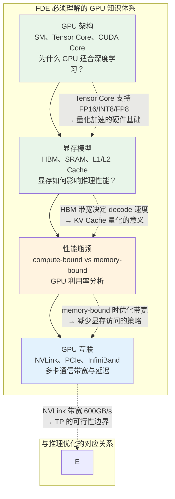
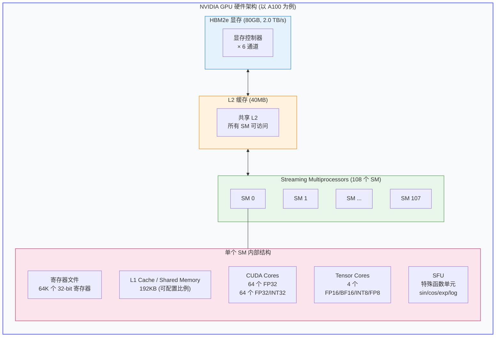
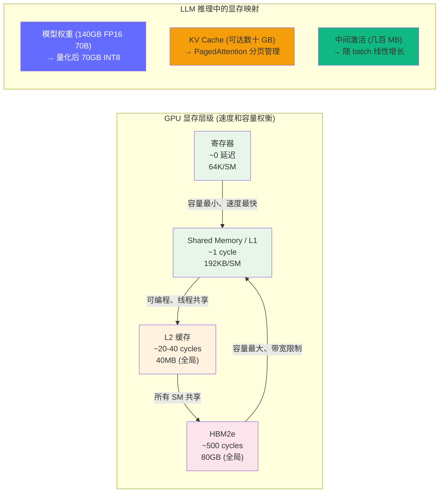
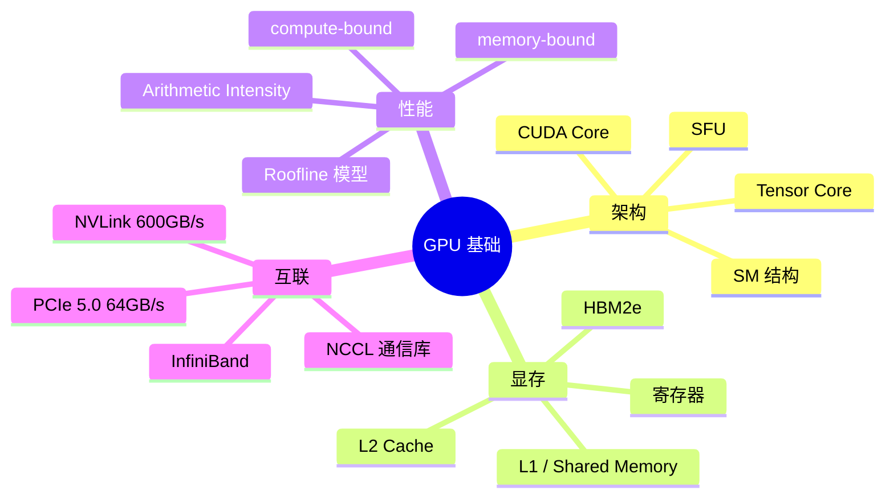

# GPU：理解推理的物理载体

> 所有的推理优化最终都要落到 GPU 的物理特性上。不理解 GPU 的架构和显存模型，就无法理解"为什么 decode 是 memory-bound"、"为什么量化能加速"这些核心问题。

## 为什么这个模块对 FDE 至关重要

很多 FDE 候选人能说出 Transformer 的公式，但回答不了：

- "同样 70B 模型，FP16 和 INT8 推理速度差多少？为什么？"
- "A100 80GB 能放下多少个 batch=32、seq_len=8192 的并发请求？"
- "为什么 TP=4 时，跨 NVLink 的通信开销会影响首 token 延迟？"
- "H100 比 A100 推理快多少？瓶颈在算力还是带宽？"

**GPU 是推理的物理载体。一切优化手段——量化、PagedAttention、Continuous Batching、张量并行——本质上都是在和 GPU 的物理特性博弈。**

## GPU 架构全景图

**关键数字（A100 80GB）：**

| 硬件组件 | 规格 | 对推理的影响 |
|---------|------|-------------|
| CUDA Cores | 6,912 (64 × 108 SM) | 通用计算，LLM 推理中使用较少 |
| Tensor Cores | 432 (4 × 108 SM) | **LLM 推理的核心算力**，支持 FP16/BF16/INT8/FP8 |
| HBM 带宽 | 2.0 TB/s | **decode 阶段的瓶颈**，决定每秒能生成多少 token |
| L2 缓存 | 40 MB | 减少 HBM 访问，提升小 batch 推理效率 |
| 寄存器文件 | 每个 SM 64K 个 | 决定 SM 能同时处理的线程数 |

## 显存层级与性能关系

## 学习路径

| 顺序 | 文档 | 核心内容 | 面试考点 |
|------|------|---------|---------|
| 1 | [GPU 架构概述](./gpu-overview.md) | SM、Tensor Core、CUDA Core、prefill/decode 在 GPU 上的执行特征 | 为什么 GPU 适合深度学习？prefill 和 decode 在 GPU 上的差异 |
| 2 | [显存模型](./memory-model.md) | HBM、SRAM、L1/L2 Cache、带宽与容量对推理的影响 | HBM 带宽如何限制 decode 速度 |
| 3 | [性能瓶颈分析](./performance-bottleneck.md) | compute-bound vs memory-bound、SM 利用率分析、Arithmetic Intensity | 如何判断推理是 compute-bound 还是 memory-bound |
| 4 | [GPU 互联](./gpu-interconnect.md) | NVLink、PCIe、InfiniBand 带宽对比、多卡通信拓扑 | TP=4 时跨卡通信开销有多大 |

## 模块知识结构图

## 前置知识

建议先完成 [模型是怎么工作的](/02-model-architecture/) 了解模型的计算特征（prefill 是 compute-bound，decode 是 memory-bound）。

---

*上一节：[模型是怎么工作的](/02-model-architecture/)*
*下一节：[GPU 架构概述](./gpu-overview.md)*
