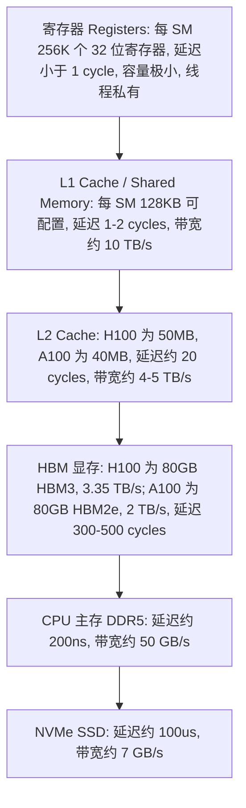
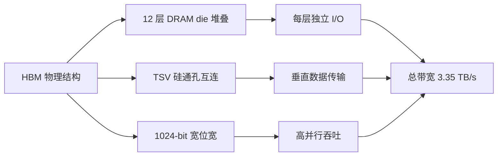
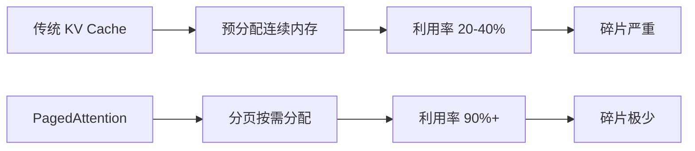

# GPU 显存模型

> LLM 推理的性能瓶颈不在算力，而在显存带宽。理解内存层级是优化的第一步。

## 前置知识

- [GPU 架构概览](./gpu-overview.md) — 理解 HBM、SRAM、L1/L2 缓存层级

## 核心概念：GPU 内存层级

### 内存层级图



从寄存器到 NVMe，**每向下走一级，容量增大、延迟升高、带宽降低**。LLM 推理的性能优化，本质上就是让数据尽量停留在上面的层级。

### 各层级详细参数

| 层级 | 容量 | 带宽 | 延迟 | 作用 |
|------|------|------|------|------|
| 寄存器 | 256K 乘以 32-bit/SM | 大于 20 TB/s | 小于 1 cycle | 线程私有数据 |
| Shared Memory / L1 | 128KB/SM（可配置） | 约 10 TB/s | 1-2 cycles | warp 内线程共享 |
| L2 Cache | 50MB（H100） | 约 4.5 TB/s | 约 20 cycles | SM 间共享 |
| HBM | 80GB（H100） | 3.35 TB/s | 300-500 cycles | 权重、KV Cache、激活 |
| DDR5（CPU 端） | TB 级 | 约 50 GB/s | 约 200ns | 权重存储（加载前） |

### HBM 原理：为什么叫 "高带宽内存"

HBM（High Bandwidth Memory）不是 "传统内存的升级版"，而是一种完全不同的物理结构：

1. **3D 堆叠**：HBM 将多个 DRAM die 垂直堆叠，通过 TSV（Through-Silicon Via，硅通孔）连接。HBM3 堆叠 12 层 die，每层提供独立的 I/O 通道。

2. **宽位宽**：HBM 使用 **1024-bit** 位宽（DDR5 只有 64-bit），相当于同时传输的数据宽度是 DDR 的 16 倍。

3. **带宽计算**：带宽 = 位宽 乘以 频率。HBM3 以 5.2 Gbps 运行，1024-bit 位宽，带宽 = 5.2 Gbps 乘以 1024 / 8 = **665 GB/s per stack**。H100 SXM 有 5 个 HBM3 栈，总带宽 = **3.35 TB/s**。

4. **代价**：HBM 成本极高（比 GDDR 贵 3-5 倍），且容量受限（堆叠 12 层是极限，80GB 已是上限）。

**对比**：
- HBM3（H100）：3.35 TB/s，80GB
- HBM2e（A100）：2.0 TB/s，80GB
- GDDR6X（RTX 4090）：1.0 TB/s，24GB
- DDR5（CPU）：约 50 GB/s，可插 128GB 以上

带宽差距是 2-67 倍，这就是为什么同样 24GB 显存，RTX 4090 的推理速度只有 A100 的一半。



### Shared Memory 编程模型

Shared Memory 是 GPU 程序员唯一可以直接控制的缓存层级（L2 和 HBM 由硬件自动管理）：

- **手动管理**：CUDA 程序员通过 `__shared__` 关键字显式将数据加载到 Shared Memory
- **典型应用**：Flash Attention 的核心技巧 —— 将 attention scores 的分块（tile）放在 Shared Memory 中，避免反复读写 HBM
- **容量限制**：128KB/SM，非常小。需要仔细规划数据布局

**Shared Memory vs L1 Cache**：
Hopper 架构中，L1 和 Shared Memory 共用 128KB 物理空间，可以动态配置：
- 最多 128KB 全部作为 Shared Memory（适合需要大量共享数据的 kernel）
- 或者 96KB Shared Memory + 32KB L1 Cache
- 或者 64KB Shared Memory + 64KB L1 Cache

合理配置这个比例是 CUDA kernel 优化的重要技巧。

### 内存合并访问（Memory Coalescing）

GPU 显存访问有一个关键要求：**warp 内 32 个线程的内存访问地址必须是连续的**，这样才能合并为一次事务。

```
好：线程 0 访问地址 0, 线程 1 访问地址 1, ..., 线程 31 访问地址 31
    -> 合并为 1 次 128-byte 事务

坏：线程 0 访问地址 0, 线程 1 访问地址 1000, ..., 线程 31 访问地址 31000
    -> 32 次独立的内存事务，性能差 32 倍
```

这就是为什么矩阵乘法要用特定的内存访问模式（行优先 vs 列优先）。在推理中，如果自定义算子性能差，第一个要检查的就是内存访问是否合并。

## KV Cache 的精确显存计算

KV Cache 是 LLM 推理中最大的动态显存消耗。精确计算如下：

```
KV Cache = batch_size * seq_len * 2 * n_layers * n_heads * head_dim * bytes_per_element
```

以 Llama-3-70B 为例（FP16，batch=32，seq_len=4096）：
- n_layers = 80，n_heads = 64，head_dim = 128
- KV Cache = 32 * 4096 * 2 * 80 * 64 * 128 * 2 bytes
- = **约 80 GB**

这意味着 70B 模型在较大 batch 和较长序列下，仅 KV Cache 就需要 80GB，加上 140GB 权重，总计 220GB，至少需要 **3 张 A100-80G**。这也是为什么实际部署中需要限制 max_model_len 和 max_num_seqs。

### KV Cache 优化：PagedAttention 的显存节省

vLLM 的 PagedAttention 通过分页管理 KV Cache 实现显存优化：

1. **传统方式**：为每个请求预分配连续显存，利用率 20-40%（因为按最大长度预分配）
2. **PagedAttention**：按需分配 page（类似 OS 分页），利用率提升到 90% 以上
3. **效果**：同样 80GB 显存，vLLM 能服务的 batch size 是传统方式的 2-4 倍



## 部署视角：LLM 推理的显存分配

### 静态 vs 动态显存

```
+----------------------------------------------+
|  模型权重（静态）                             |
|  70B FP16 = 140 GB                           |  <- 启动时固定分配
|  70B INT8 = 70 GB                            |
|  70B INT4 = 35 GB                            |
+----------------------------------------------+
|  KV Cache（动态，随请求增长）                  |
|  每个 token: head_dim * 2 * n_layers * n_heads |
|  70B 模型, batch=32, seq_len=2048             |  <- 请求期间持续增长
|  约 20-40 GB                                 |
+----------------------------------------------+
|  激活显存（动态，随 batch 变化）               |  <- 每层计算中间结果
|  约 2-5 GB                                   |
+----------------------------------------------+
|  预留 / 碎片                                  |  <- 显存分配器碎片
|  约 5-10%                                    |
+----------------------------------------------+
```

### 显存碎片化问题

**什么是显存碎片？**

GPU 显存分配器（如 CUDA malloc）在频繁分配和释放不同大小的内存块后，会产生碎片：总剩余显存够，但没有足够的连续空间分配新的块。

**典型场景**：
- vLLM 之前的推理引擎：不同请求释放不同长度的 KV Cache，产生碎片，导致 OOM
- 解决方案：**PagedAttention**（vLLM 核心创新），将 KV Cache 分页管理，类似操作系统虚拟内存，几乎消除碎片

**显存碎片率计算**：
```
碎片率 = 1 - (最大可用连续块 / 总空闲显存)
碎片率 > 30% -> 高碎片风险，可能 OOM
```

### 权重加载的显存传输瓶颈

模型从 CPU 内存加载到 GPU 显存需要通过 PCIe，这是一个常被忽略的瓶颈：

| 路径 | 带宽 | 加载 70B FP16（140GB）耗时 |
|------|------|--------------------------|
| PCIe 4.0 x16 | 32 GB/s | 约 4.4 秒 |
| PCIe 5.0 x16 | 64 GB/s | 约 2.2 秒 |
| NVLink（GPU 到 GPU） | 900 GB/s | 约 0.16 秒 |

**启示**：
- 模型加载时间长是正常的（几秒量级），不是 bug
- 如果需要热更新模型，提前 warm up 很重要
- 多卡场景下，GPU 间传输用 NVLink（0.16s）而非 PCIe（4.4s）

## 为什么 LLM 推理是 Memory-Bound：定量分析

### FLOPs vs 内存访问比

判断一个操作是 compute-bound 还是 memory-bound 的关键指标是 **计算强度（Compute Intensity）**：

```
计算强度 = FLOPs / 字节数 (bytes)
```

以矩阵乘法 C = A 乘以 B 为例（A: m 乘以 k, B: k 乘以 n）：
- FLOPs = 2 乘以 m 乘以 n 乘以 k（每个输出元素做 k 次乘加）
- 读取字节数 = 2 乘以 m 乘以 k + 2 乘以 k 乘以 n（FP16，每个数 2 字节）
- 计算强度约等于 n（当 m、n、k 都大时）

### Decode 阶段的定量分析

Decode 阶段每生成一个 token：
- **计算量**：模型的前向传播，70B 模型 = 70 * 10^9 * 2 = **140 GFLOPs**
- **内存访问量**：需要加载全部 70B 权重 = 70 * 10^9 * 2 bytes = **140 GB**
- **计算强度** = 140 * 10^9 FLOPs / 140 * 10^9 bytes = **1 FLOP/byte**

**H100 的平衡点**：
- 峰值 FP16 算力：989 TFLOPS
- 峰值 HBM 带宽：3.35 TB/s
- 平衡计算强度 = 989 * 10^12 / 3.35 * 10^12 约等于 **295 FLOPs/byte**

Decode 阶段只有 1 FLOP/byte，远小于 295 FLOPs/byte，因此是 **纯 memory-bound**。

这意味着：即使你的 GPU 算力再强（换成 H200、甚至理论无限算力），decode 速度也不会变快，因为瓶颈在带宽。提升 decode 速度的唯一方法是 **减少权重加载量**（量化、减少参数）。

### Prefill vs Decode 对比

| 阶段 | 计算量 | 内存访问 | 计算强度 | 瓶颈 |
|------|--------|---------|---------|------|
| Prefill（处理 prompt） | O(n 平方 乘以 d) | O(n 乘以 d) | **高**（n 大时） | Compute-bound |
| Decode（生成 token） | O(d 平方) | O(全部权重) | **极低**（约 1 FLOP/byte） | Memory-bound |

其中 n = sequence length, d = hidden dimension。Prefill 阶段因为要处理整段 prompt 的自注意力（O(n 平方)），计算量大；Decode 阶段每次只生成 1 个 token，计算量小但要加载全部权重。


## 面试视角

### 进阶问题

6. **"Shared Memory 和 L1 Cache 有什么区别？"**
   - 共用 128KB 物理空间，可动态配置比例
   - Shared Memory 由程序员手动管理（`__shared__`），L1 由硬件自动管理
   - Flash Attention 依赖 Shared Memory 存储 attention tile，避免 HBM 访问

7. **"什么是内存合并访问（Memory Coalescing）？"**
   - Warp 内 32 个线程的内存访问地址必须连续，才能合并为一次事务
   - 不合并会导致 32 次独立事务，性能差 32 倍
   - 自定义 CUDA kernel 性能差的第一排查点

8. **"KV Cache 的显存怎么精确计算？"**
   - batch 乘以 seq_len 乘以 2 乘以 n_layers 乘以 n_heads 乘以 head_dim 乘以 bytes
   - Llama-3-70B，batch=32, seq_len=4096，约 80GB KV Cache
   - 加上 140GB 权重，至少需要 3 张 A100-80G

### 常考问题

1. **"为什么 LLM 推理是 memory-bound 而不是 compute-bound？"**
   - Decode 阶段每生成一个 token 只需 O(d 平方) 计算，但要加载全部权重（O(参数量)）
   - 70B 模型 decode 计算强度约 1 FLOP/byte，而 H100 的平衡点约 295 FLOP/byte
   - 算力远未饱和，带宽先用完了

2. **"HBM 为什么比普通内存快？"**
   - 3D 堆叠（12 层 die）+ 宽位宽（1024-bit vs DDR 的 64-bit）
   - HBM3 带宽 3.35 TB/s vs DDR5 约 50 GB/s，差 67 倍

3. **"量化为什么能加速推理？"**
   - 量化减少了权重的字节数（FP16 到 INT8 减半，FP16 到 INT4 减为 1/4）
   - Memory-bound 阶段，减少数据量直接提升速度
   - 同时 FP8/INT8 在 Tensor Core 上的吞吐更高

4. **"PagedAttention 解决了什么问题？"**
   - 显存碎片化：不同请求释放不同长度的 KV Cache 产生碎片
   - PagedAttention 将 KV Cache 分页管理，像 OS 虚拟内存，碎片率降至 1% 以下

5. **"GPU 显存带宽对推理速度有什么影响？"**
   - Decode 阶段速度正比于 带宽 / 权重大小
   - H100（3.35 TB/s）比 A100（2 TB/s）decode 快 67%
   - 量化到 INT8：同等带宽下，速度翻倍

## 最佳实践

1. **量化是 memory-bound 阶段最有效的优化**：FP16 到 INT8 直接让带宽需求减半，速度翻倍。H100 上 FP8 效果更好。
2. **KV Cache 是显存大头**：合理设置 max_num_seqs 和 max_model_len，避免 KV Cache OOM。用 PagedAttention 管理。
3. **监控显存碎片率**：如果碎片率大于 30%，考虑重启服务或切换到 vLLM 等分页显存管理的框架。
4. **权重预热**：服务启动时提前加载模型到 GPU，避免首次请求的 PCIe 传输延迟（约 4.4 秒）。
5. **HBM 容量规划**：70B FP16 模型至少需要 160GB 以上（权重 140GB + KV Cache 20GB+），2 张 A100-80G 是最低配置。

---

*下一节：[性能瓶颈分析](./performance-bottleneck.md)*
