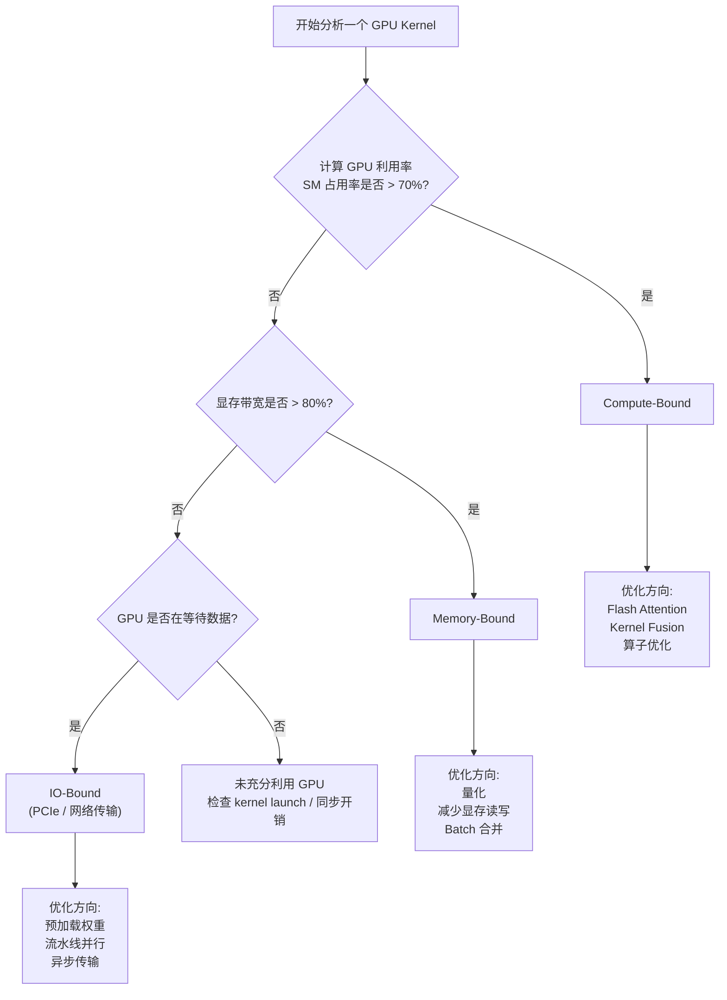

# GPU 性能瓶颈分析

> 理解 compute-bound vs memory-bound 是推理优化的核心能力，决定了你该优化计算还是优化带宽。

## 前置知识

- [GPU 架构概览](./gpu-overview.md) — 理解 SM、Tensor Core、HBM
- [Transformer 推理两阶段](../02-model-architecture/transformer-overview.md) — 理解 prefill vs decode

## 核心概念：瓶颈类型判定

### Compute-Bound vs Memory-Bound 判定流程



### Roofline Model —— 定量分析工具

Roofline Model 是 Berkeley 提出的可视化性能分析模型，横轴是 **计算强度**（FLOPs/Byte），纵轴是 **实际性能**（TFLOPS）：

```
    性能 (TFLOPS)
        │
   峰值算力 ───────┐  ← Compute-Bound 区域（平台）
        │        /
        │      /
        │    /  ← Memory-Bound 区域（斜线）
        │  /
        │/
        └──────────────── 计算强度 (FLOPs/Byte)
          ← 低 →  ← 高 →
```

- **斜线区域（Memory-Bound）**：性能受带宽限制，性能 = 带宽 × 计算强度。向右移动（提高计算强度）能提升性能。
- **平台区域（Compute-Bound）**：性能受算力限制，已达峰值。只能换硬件或优化算法。
- **拐点**：带宽和算力的交点，是 compute-bound 和 memory-bound 的分界线。

## LLM 推理的两个阶段

### Prefill 阶段 —— Compute-Bound

**Prefill 是处理用户输入 prompt 的阶段**，对所有输入 token 做完整的自注意力计算。

**为什么是 compute-bound？**

Attention 的核心计算是 `Q @ K^T`，复杂度为 **O(n² × d)**，其中 n = sequence length，d = head dimension：

```python
# Prefill: prompt 长度为 n
Q = X @ W_q    # (n, d) = (n, h) × (h, d)
K = X @ W_k    # (n, d) = (n, h) × (h, d)
V = X @ W_v    # (n, d) = (n, h) × (h, d)

scores = Q @ K^T / sqrt(d)  # (n, n) = (n, d) × (d, n)  ← O(n²) 矩阵乘法！
attn = softmax(scores) @ V  # (n, d) = (n, n) × (n, d)
```

当 n 较大时（如 n = 4096），`Q @ K^T` 的矩阵规模是 4096×4096，FLOPs 为 2 × 4096³ ≈ **137 GFLOPs**，但只需要加载 4096 × d 的数据。计算强度很高，GPU 的 Tensor Core 被充分占用。

**优化手段**：
- **Flash Attention**：IO-aware 算法，通过分块（tiling）减少 HBM 访问，prefill 阶段可加速 2-4 倍
- **Kernel Fusion**：将多个小算子融合为一个 CUDA kernel，减少 kernel launch 开销
- **CuDNN / cuBLAS 优化**：使用 NVIDIA 优化库而非手写 kernel

### Decode 阶段 —— Memory-Bound

**Decode 是逐 token 生成的阶段**，每次只生成 1 个新 token。

**为什么是 memory-bound？**

Decode 阶段每次只处理 1 个新 token：
- `Q` 的 shape 是 (1, d)，`K^T` 是 (d, 1)，矩阵乘法只有 O(d) 的计算量
- 但 **需要加载全部模型权重**（70B 参数 = 140 GB FP16）
- KV Cache 还需要追加 1 个 token 的数据

**定量计算：70B 模型 decode 阶段的内存带宽需求**

假设：
- 模型参数量：70B
- 精度：FP16（每个参数 2 字节）
- 权重总量：70 × 10^9 × 2 = **140 GB**
- 目标：每秒生成 100 token

每个 token 生成需要加载 140 GB 权重：
- 需要的带宽 = 140 GB/token × 100 token/s = **14,000 GB/s**

而 H100 SXM 的 HBM 带宽只有 3.35 TB/s = **3,350 GB/s**：
- 理论最大吞吐量 = 3,350 / 140 ≈ **24 token/s**（单卡）

如果用 4 卡 TP（张量并行）：
- 每卡权重 = 140 / 4 = 35 GB
- 每卡带宽 = 3.35 TB/s
- 每卡吞吐量 = 3,350 / 35 ≈ **96 token/s**
- 扣除 TP 通信开销后实际约 **70-80 token/s**

**结论**：Decode 阶段速度 = 总显存带宽 / 模型权重大小。这是物理定律，无法通过优化算法绕过。

### Prefill vs Decode 对比

| 维度 | Prefill | Decode |
|------|---------|--------|
| 输入长度 | 整个 prompt（n 个 token） | 1 个 token |
| 计算复杂度 | O(n² × d) | O(d²) |
| 内存访问 | O(n × d)（当前层激活） | O(全部参数量) |
| 计算强度 | 高（n 大时） | 极低（~1 FLOP/byte） |
| 瓶颈类型 | **Compute-Bound** | **Memory-Bound** |
| 优化方向 | Flash Attention、Kernel Fusion | 量化、减少权重加载 |
| GPU 利用率 | 可达 90%+ | 通常 < 30% |
| 延迟特征 | 随 prompt 长度平方增长 | 恒定（每 token 固定时间） |

## Profiling 工具实战

### nvidia-smi —— 实时监控

```bash
# 每秒刷新，查看 GPU 利用率、显存、温度
watch -n 1 nvidia-smi

# 只监控特定指标
nvidia-smi --query-gpu=utilization.gpu,memory.used,memory.total --format=csv -l 1
```

关键指标：
- **GPU-Util（GPU 利用率）**：> 70% 通常 compute-bound，< 30% 可能 memory-bound
- **Memory-Usage（显存使用）**：接近上限时注意碎片化
- **Power-Draw（功耗）**：高功耗 ≠ 高效，compute-bound 时功耗接近 TDP

### nvtop —— 交互式监控

```bash
# 安装
sudo apt install nvtop

# 运行
nvtop
```

nvtop 提供实时图表，直观展示 GPU 利用率、显存、编码器使用率的时序变化。

### nvidia-nsys —— 系统级 Profiling

NVIDIA Nsight Systems（nsys）是分析 GPU 性能瓶颈的专业工具，能生成详细的时间线报告：

```bash
# 对 vLLM 推理做 profiling
nsys profile --trace=cuda,nvtx,osrt -o output \
    python3 -m vllm.entrypoints.openai.api_server \
    --model meta-llama/Llama-3-70B-Instruct

# 查看报告
nsys stats output.nsys-rep

# 生成可视化时间线
nsys-ui output.nsys-rep
```

**关键分析维度**：
1. **CUDA Kernel 时间线**：哪些 kernel 占用时间最长？
2. **Memcpy 时间线**：CPU↔GPU 数据传输是否成为瓶颈？
3. **SM 占用率**：compute-bound 时 SM 利用率 > 80%，memory-bound 时 SM 大量空闲
4. **HBM 带宽利用率**：memory-bound 时接近峰值

**判断瓶颈的快速方法**：
```bash
# nsys 报告中查看
# SM throughput 高 + HBM 带宽低 → compute-bound
# SM throughput 低 + HBM 带宽高 → memory-bound
# 两者都低 → 可能是 IO-bound 或同步开销
```

### PyTorch Profiler

```python
import torch.profiler

with torch.profiler.profile(
    activities=[torch.profiler.ProfilerActivity.CUDA],
    profile_memory=True,
) as prof:
    model.generate(input_ids, max_new_tokens=128)

# 查看每个 kernel 的时间
print(prof.key_averages().table(sort_by="cuda_time_total", row_limit=20))

# 导出为 Chrome Trace 可视化
prof.export_chrome_trace("trace.json")
```

## 面试视角

### 常考问题

1. **"如何判断一个操作是 compute-bound 还是 memory-bound？"**
   - 计算 **计算强度** = FLOPs / 内存访问字节数
   - 与硬件的 **roofline 拐点** 比较（H100 拐点 ≈ 295 FLOP/byte）
   - 低于拐点 → memory-bound，高于拐点 → compute-bound
   - 工程上：`nvidia-smi` 看 GPU 利用率，> 70% → compute-bound

2. **"为什么 decode 阶段是 memory-bound？"**
   - 每次只生成 1 个 token，计算量 O(d²)，但要加载全部权重
   - 70B 模型的计算强度 ~1 FLOP/byte，远低于 H100 的平衡点 295 FLOP/byte
   - 速度 = 带宽 / 权重大小

3. **"为什么 prefill 阶段是 compute-bound？"**
   - Attention 的 Q @ K^T 是 O(n²) 矩阵乘法，计算量大
   - 当 n 较大时（如 4096），计算强度超过 roofline 拐点
   - GPU 的 Tensor Core 被充分占用

4. **"量化为什么能提升推理速度？"**
   - Decode 是 memory-bound，速度 ∝ 带宽 / 权重大小
   - FP16 → INT8 使权重大小减半，速度翻倍（近似）
   - 同时 FP8/INT8 在 Tensor Core 上的峰值吞吐更高

5. **"Flash Attention 优化了什么？"**
   - 优化了 prefill 阶段的 attention 计算
   - 通过 tiling（分块）减少 HBM 的读写次数
   - 将 O(n²) 的中间结果（attention scores）保持在 SRAM 中
   - 对 memory-bound 的 decode 阶段无效

6. **"如果 decode 阶段 GPU 利用率只有 20%，说明什么？怎么优化？"**
   - 说明是 memory-bound（正常现象）
   - 优化方向：量化减少权重加载量、增大 batch size 提高计算强度
   - 换更高带宽的 GPU（H100 比 A100 好 67%）

## 最佳实践

1. **Prefill 用 Flash Attention**：现代推理引擎（vLLM、TGI）默认启用，确保版本支持。
2. **Decode 用量化**：INT8 量化可让 decode 速度翻倍，FP8（H100）效果更佳。精度损失在可接受范围内。
3. **Batching 是 memory-bound 的救命稻草**：增大 batch size 可以在一次权重加载中服务更多请求，提高有效吞吐。但受限于显存。
4. **用 nsys 做深度 profiling**：`nvidia-smi` 只能告诉你 "有问题"，nsys 能告诉你 "问题在哪"。
5. **不要盲目优化 compute-bound 的东西**：确认瓶颈再动手。如果 decode 阶段 GPU 利用率只有 20%，优化 kernel 没有任何意义，应该做量化。
6. **关注 end-to-end 延迟**：Prefill 延迟 + Decode 延迟 + 排队延迟，不能只优化一个。

---

*下一节：[GPU 互联](./gpu-interconnect.md)*
