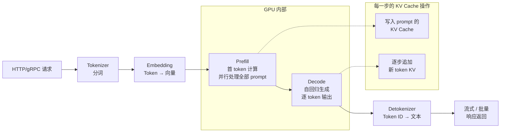
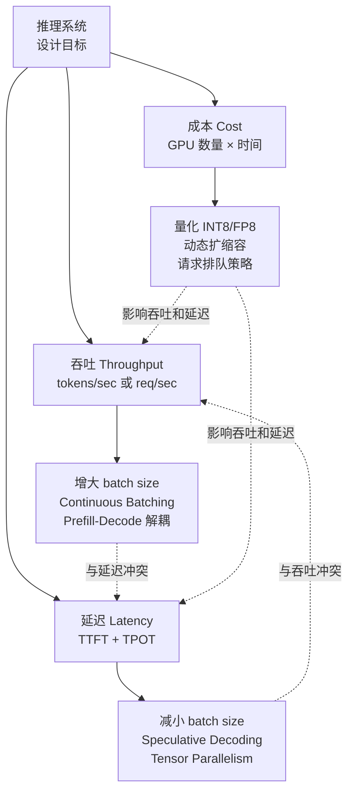
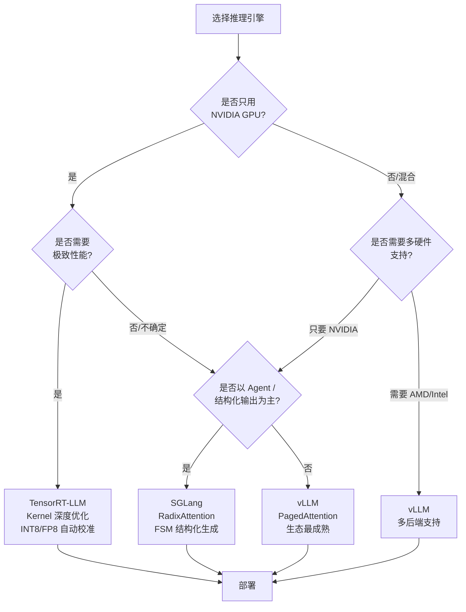

# 推理引擎概览

> 一句话概括：推理引擎是大模型生产部署的核心基础设施，负责把训练好的权重转化为高吞吐、低延迟的在线服务。

## 前置知识

- 理解 Transformer 的自回归生成机制（Prefill 和 Decode 两个阶段）
- 了解 GPU 显存层级结构（HBM、SRAM）和基本的 CUDA 编程概念
- 熟悉 PyTorch 模型的加载和 forward 调用流程

## 核心概念

### 为什么需要推理引擎

原始 PyTorch 直接推理存在三大核心问题：

1. **显存碎片化** -- KV Cache 在 decode 阶段动态分配，不同请求的 sequence length 差异导致大量显存碎片，实际利用率通常仅 50%-60%。
2. **批处理效率低** -- Static Batching 模式下，整个 batch 必须等待最长的请求完成，短请求被无意义阻塞。
3. **缺乏 kernel 优化** -- PyTorch 默认的 eager mode kernel 并非针对推理场景优化，大量小型算子 launch overhead 占主导。

**推理引擎的核心目标：让 GPU 跑得更快、更满、更便宜。**

### 推理引擎的四大核心职责

```
┌─────────────────────────────────────────────────┐
│              推理引擎核心职责                      │
├─────────────────────────────────────────────────┤
│                                                 │
│  1. 模型加载 & 管理                               │
│     - 权重加载（Checkpoint → GPU Memory）         │
│     - 分布式初始化（Tensor / Pipeline Parallel）  │
│     - 精度转换（FP16 / BF16 / INT8 / FP8）        │
│                                                 │
│  2. 请求调度                                      │
│     - Batch 构建（Continuous / In-flight）        │
│     - 优先级调度（FCFS / 感知 TTFT 的调度器）     │
│     - 显存感知的 admission control                │
│                                                 │
│  3. KV Cache 管理                                 │
│     - 按需分配与回收                              │
│     - 前缀共享（Prefix Caching）                  │
│     - CPU-GPU 交换（Swapping）                    │
│                                                 │
│  4. 执行优化                                      │
│     - Kernel Fusion & Custom Kernel              │
│     - 计算-通信重叠（Overlap）                    │
│     - Speculative Decoding 支持                   │
│                                                 │
└─────────────────────────────────────────────────┘
```

### 推理管线完整流程

一次 LLM 推理请求从进入到输出，经历以下完整管线：



- **Tokenization**：将原始文本切分为 Token ID 序列。不同 tokenizer（SentencePiece、TikToken）的词汇表和编码策略不同。
- **Embedding**：通过模型的 embedding layer 将 Token ID 映射为高维向量。
- **Prefill（Context Phase）**：并行处理整个 prompt，一次性计算所有 token 的 attention 并写入 KV Cache。这个阶段是**计算密集型**，TTFT（Time To First Token）主要取决于此。
- **Decode（Generation Phase）**：自回归逐 token 生成，每一步读取 KV Cache 并计算下一个 token。这个阶段是**显存带宽密集型**，TPOT（Time Per Output Token）是关键指标。
- **Detokenization**：将生成的 Token ID 序列还原为可读文本，处理 BPE 合并和特殊 token。

### 吞吐 vs 延迟 vs 成本 三角权衡

在生产环境中，三个指标不可同时最优化：



**定量参考**（以 Llama-3-8B 在 A100-80G 上为例）：

| 策略 | 吞吐（tok/s） | TTFT（ms） | TPOT（ms/token） | 成本 |
|------|--------------|-----------|-----------------|------|
| Batch=1（最小延迟） | ~2,000 | ~15 | ~5 | 高 |
| Batch=128（最大吞吐） | ~60,000 | ~500 | ~40 | 低 |
| Batch=32 + Continuous | ~35,000 | ~80 | ~15 | 中 |
| Batch=32 + FP8 | ~45,000 | ~90 | ~12 | 低 |

## 部署视角

### 四大推理引擎对比

| 维度 | **vLLM** | **TensorRT-LLM** | **SGLang** | **TGI** |
|------|----------|------------------|-----------|---------|
| **核心创新** | PagedAttention | Kernel 编译优化 | RadixAttention + 结构化生成 | 简洁 API + HF 集成 |
| **吞吐量** | 高 | 最高（1.2-2x vLLM） | 高 | 中等 |
| **延迟** | 低 | 最低 | 低 | 中等 |
| **模型支持** | 广（50+ 架构） | 有限（NVIDIA 验证列表） | 较广 | 较广 |
| **硬件** | NVIDIA/AMD/Intel | 仅 NVIDIA | NVIDIA | 主要 NVIDIA |
| **量化支持** | AWQ/GPTQ/FP8/INT8 | INT8/FP8（自动校准） | AWQ/FP8/INT8 | GPTQ/AWQ |
| **分布式** | TP/PP | TP/PP + DP | TP + RadixAttention | TP |
| **易用性** | 极好（pip install） | 中等（需 build） | 好 | 极好 |
| **生产成熟度** | 生产就绪 | 生产就绪 | 快速迭代中 | 生产就绪 |
| **典型用户** | 大多数场景 | 极致性能场景 | Agent / 结构化输出 | HF 生态用户 |

### 推理引擎选型决策树



### 关键部署考量

1. **模型-引擎兼容性**：并非所有引擎都支持所有模型。部署前务必查阅引擎的 supported models 列表。
2. **显存预算**：KV Cache 通常占总显存的 50%-80%。使用 `gpu_memory_utilization=0.9` 预留 10% 防止 OOM。
3. **并发模型**：流式（streaming）请求会长期占用 KV Cache slot，需要考虑 TTL 和超时机制。
4. **多租户隔离**：生产环境需要考虑请求级别的速率限制和配额管理。
5. **监控指标**：至少监控 QPS、P50/P99 延迟、GPU 利用率、KV Cache 使用率。

## 面试视角

### 如何回答"如何选择合适的推理引擎？"

面试官期望你展示**系统性思维**，而非简单背诵对比表。推荐的回答框架：

1. **明确需求**：先问清楚业务场景——是聊天服务、批量推理、Agent 还是 RAG？
2. **列出约束**：硬件（GPU 型号/数量）、模型（架构/大小）、SLA（延迟/吞吐要求）、团队技术栈。
3. **给出推荐并论证**：
   - "如果追求生态和灵活性，vLLM 是最安全的选择。"
   - "如果确定只用 NVIDIA 且对延迟极其敏感，TRT-LLM 能提供 20-100% 的额外性能。"
   - "如果是 Agent 场景需要大量结构化输出，SGLang 的 FSM 约束生成是关键优势。"
4. **提出验证方案**："我会用实际 workload 做 benchmark，比较 TTFT、TPOT 和吞吐。"

### 常见问题

**Q：推理引擎和推理框架有什么区别？**
A：推理引擎（vLLM、TRT-LLM）侧重执行效率和资源管理；推理框架（LangChain、LlamaIndex）侧重应用逻辑编排。两者互补。

**Q：为什么不能直接用 PyTorch 做生产推理？**
A：PyTorch eager mode 的 kernel launch overhead 高、缺少 KV Cache 管理、不支持 Continuous Batching、没有针对推理的 kernel 优化。在并发场景下，性能差距可达 5-10 倍。

**Q：TTFT 和 TPOT 分别受什么因素影响？**
A：TTFT 主要受 Prefill 阶段计算量和 batch 中的排队请求影响；TPOT 主要受 Decode 阶段的显存带宽和 batch size 影响。

---

*下一节：[vLLM 深度解析](./vllm-deep-dive.md)*
