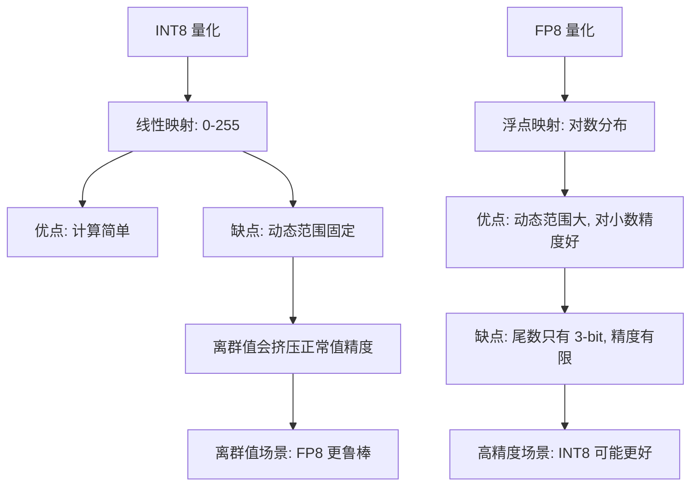
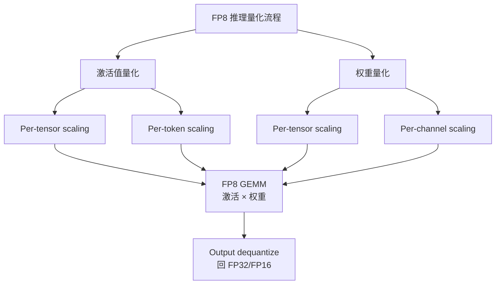

# FP8 推理

> H100 原生支持 FP8 Tensor Core，在精度损失 < 1% 的前提下实现 1.5-2x 推理加速。

## 核心概念：浮点数格式对比

```mermaid
graph LR
    subgraph FP32 (32-bit)
    A1[1 sign] --- A2[8 exponent] --- A3[23 mantissa]
    end

    subgraph FP16 (16-bit)
    B1[1 sign] --- B2[5 exponent] --- B3[10 mantissa]
    end

    subgraph BF16 (16-bit)
    C1[1 sign] --- C2[8 exponent] --- C3[7 mantissa]
    end

    subgraph FP8 E4M3 (8-bit)
    D1[1 sign] --- D2[4 exponent] --- D3[3 mantissa]
    end

    subgraph FP8 E4M3NV (8-bit)
    E1[1 sign] --- E2[4 exponent] --- E3[3 mantissa]
    end

    subgraph INT8 (8-bit)
    F1[8-bit integer]
    end
```

### 位分配对比

| 格式 | 总位数 | Sign | Exponent | Mantissa | 动态范围 | 精度 |
|------|-------|------|----------|----------|---------|------|
| FP32 | 32 | 1 | 8 | 23 | 2^-126 ~ 2^127 | ~7 位十进制 |
| FP16 | 16 | 1 | 5 | 10 | 2^-14 ~ 2^15 | ~3 位十进制 |
| BF16 | 16 | 1 | 8 | 7 | 2^-126 ~ 2^127 | ~2 位十进制 |
| **FP8 E4M3** | 8 | 1 | 4 | 3 | 2^-6 ~ 2^8 (~512) | ~1 位十进制 |
| **FP8 E5M2** | 8 | 1 | 5 | 2 | 2^-14 ~ 2^15 | ~0.7 位十进制 |
| INT8 | 8 | - | - | - | -128 ~ 127 | 离散 256 级 |

## FP8 格式详解

### E4M3（推荐用于推理）

- **位分配**：1 sign + 4 exponent + 3 mantissa
- **动态范围**：约 2^-6 到 2^8 = 0.0156 到 512
- **特殊值**：支持 NaN 和 Infinity
- **适用**：权重和激活的通用 FP8 格式

### E5M2（用于激活值）

- **位分配**：1 sign + 5 exponent + 2 mantissa
- **动态范围**：约 2^-14 到 2^15 = 6.1e-5 到 32768
- **适用**：激活值中可能有较大离群值的层（如 attention scores）

### E4M3 vs INT8 对比



## H100 FP8 Tensor Core

### 为什么 H100 的 FP8 比 A100 的 FP16 快？

| 维度 | A100 (FP16) | H100 (FP16) | H100 (FP8) |
|------|------------|------------|-----------|
| FP16 Tensor Core 吞吐 | 312 TFLOPS | 989 TFLOPS | - |
| FP8 Tensor Core 吞吐 | 不支持 | - | **1,978 TFLOPS** |
| FP8 相比 A100 FP16 | - | - | **6.3x 理论吞吐提升** |
| 实际推理加速 | 基准 | 1.5-2x | **2-3x** |

**关键原因：**

1. **硬件原生支持**：H100 的 Transformer Engine 原生执行 FP8 × FP8 → FP32 的矩阵乘法，无需反量化
2. **WGMMA 指令**：Hopper 架构的 Warp-level GMMA 指令在 FP8 模式下每个时钟周期处理的元素数是 FP16 的 2 倍
3. **双流水线**：FP8 Tensor Core 可以和 FP16/BF16 的 Tensor Core 并行工作

> A100 不支持 FP8 Tensor Core，但可以用软件模拟（无加速效果）。FP8 推理需要 H100 或更新架构。

## FP8 量化方案

### 量化策略



### Dynamic Scaling（动态缩放）

每层在推理时动态计算缩放因子：

```
FP8_value = FP32_value / scale_factor

其中 scale_factor 通常取该 tensor 的最大绝对值 / 最大可表示值

E4M3 最大可表示值 ≈ 448
所以 scale = max(|tensor|) / 448
```

### Per-Tensor vs Per-Channel

| 方案 | 粒度 | 精度 | 开销 | 推荐 |
|------|------|------|------|------|
| Per-tensor | 整个 tensor 1 个 scale | 较低（离群值影响） | 低 | 激活值 |
| Per-channel | 每个输出通道 1 个 scale | 较高 | 中 | 权重 |
| Per-token | 每个 token 1 个 scale | 最高 | 较高 | 激活值 (decode) |

### NVIDIA Transformer Engine 方案

NVIDIA 推荐的 FP8 训练/推理流程：

1. **校准阶段**：用少量数据跑前向传播，记录每层激活值的最大范围
2. **缩放因子确定**：根据校准数据计算 per-tensor / per-channel scale
3. **推理阶段**：使用校准后的 scale 进行 FP8 GEMM
4. **在线更新**：推理过程中持续更新 scale（应对输入分布漂移）

## FP8 推理精度损失分析

### 不同任务的精度影响

| 任务 | FP16 基准 | FP8 | 精度变化 |
|------|----------|-----|---------|
| MMLU (70B) | 78.5% | 77.8% | -0.7pp |
| HumanEval (70B) | 72.0% | 70.5% | -1.5pp |
| GSM8K (70B) | 85.0% | 83.8% | -1.2pp |
| MT-Bench (70B) | 8.5 | 8.3 | -0.2 |

> FP8 精度损失通常在 0.5-2pp（percentage points），远低于 INT4（3-5pp）。

### 哪些层对精度敏感？

```mermaid
graph TD
    A[模型层 FP8 敏感性] --> B[高敏感 - 保持 FP16/BF16]
    A --> C[中敏感 - FP8 + 更大 scale]
    A --> D[低敏感 - 可放心 FP8]

    B --> B1[Last Layer Normalization]
    B --> B2[Embedding Layer]
    B --> B3[Attention Scores (softmax 输入)]

    C --> C1[最后一层 Linear]
    C --> C2[残差连接附近]

    D --> D1[大部分 Linear 层权重]
    D --> D2[Feed-Forward 中间层]
    D --> D3[Query/Key/Value 投影]
```

## FP8 vs INT8：核心优势对比

### 面试经典问题

**面试官："FP8 相比 INT8 有什么优势？"**

关键回答要点：

1. **动态范围更大**：FP8 E4M3 范围约 0.0156-512，INT8 范围 -128 到 127
   - FP8 对离群值（activation outliers）更鲁棒，不易饱和
   - INT8 需要复杂的 off-the-shelf 校准策略处理离群值

2. **对数精度分布**：FP8 在小值区域精度更高（指数分布）
   - 这对神经网络激活值很重要（大量值集中在 [-1, 1] 区间）
   - INT8 在 [-1, 1] 区间只有约 2 个量化级别

3. **H100 原生加速**：FP8 直接走 Tensor Core 路径，不需要反量化
   - INT8 在 H100 上虽然也有加速，但 FP8 的吞吐是 INT8 的 1.5x
   - H100 FP8 Tensor Core: 1,978 TFLOPS vs INT8: ~1,300 TOPS

4. **精度损失更小**：FP8 通常损失 0.5-1.5pp，INT8 损失 1-3pp
   - FP8 保留了指数的缩放能力，适应不同层的数值分布

### 量化方案汇总对比

| 方案 | 硬件要求 | 加速比 | 精度损失 | 部署难度 |
|------|---------|-------|---------|---------|
| FP8 | H100+ | 1.5-2x | 0.5-1.5pp | 中 |
| INT8 | 通用 | 1.3-1.8x | 1-3pp | 低 |
| INT4 | 通用 | 1.5-2x | 2-5pp | 中 |
| NF4 | 通用 | 1.5-2x | 1.5-4pp | 中 |
| BF16 | 通用 | 基准 | 0 | 最低 |

## 部署视角

### 推理框架支持情况

| 框架 | FP8 推理 | FP8 训练 | 备注 |
|------|---------|---------|------|
| vLLM | 支持 | - | H100 + FP8 weight-only |
| TensorRT-LLM | 支持 | - | 完整的 FP8 推理 pipeline |
| SGLang | 支持 | - | 持续更新中 |
| DeepSpeed | 实验性 | 支持 | 需要特定配置 |
| PyTorch (原生) | 支持 | 支持 | torch.float8_e4m3fn |

### 启用 FP8 示例

```python
# vLLM + FP8
from vllm import LLM

llm = LLM(
    model="meta-llama/Llama-2-70b",
    quantization="fp8",  # 启用 FP8 量化
    dtype="float16",     # 计算数据类型
)
```

## 面试视角

**面试官可能问：**

1. **"FP8 的 E4M3 和 E5M2 有什么区别？什么时候用哪个？"**
   - E4M3（4 exponent, 3 mantissa）：范围较小（~512），精度稍好，适合权重
   - E5M2（5 exponent, 2 mantissa）：范围更大（~32768），精度较低，适合有离群值的激活
   - 实践中推荐权重用 E4M3，激活用 E5M2

2. **"为什么 FP8 适合 LLM 但不适合所有 ML 模型？"**
   - LLM 的激活值分布相对规则，对量化有鲁棒性
   - CNN/ResNet 等视觉模型的激活值有大量离群值，FP8 的 3-bit mantissa 可能不够
   - LLM 的 softmax 操作天然对输入的绝对精度不敏感（只关心相对大小）

3. **"H100 上 FP8 推理比 FP16 快多少？为什么？"**
   - FP8 Tensor Core 吞吐 1,978 TFLOPS vs FP16 的 989 TFLOPS → 理论 2x
   - 实际推理加速 1.5-2x（受限于非 GEMM 操作和数据传输）
   - 加速来源：FP8 GEMM 每个时钟周期处理 2x 数据 + 减少 HBM 带宽需求

## 最佳实践

1. **H100 优先启用 FP8**：精度损失 < 1%，加速 50-100%，ROI 极高
2. **权重用 FP8 E4M3，激活用 FP8 E5M2**：兼顾范围和精度
3. **关键层保持高精度**：embedding、last layer normalization 保持 BF16
4. **用 Transformer Engine 自动校准**：手动调 scale 费力且容易出错
5. **A100 不用 FP8**：没有硬件加速，反而可能变慢

---

*下一节：[评估流程](./frontier-eval-process.md)*
