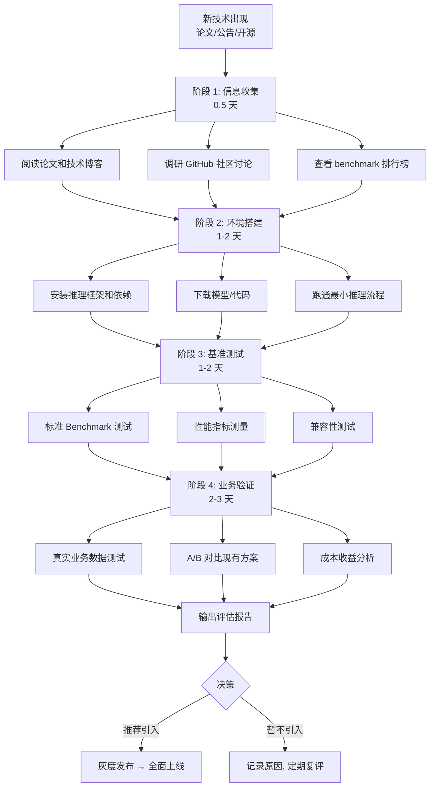
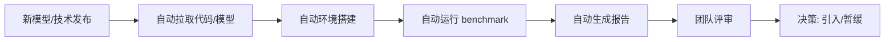

# 前沿技术评估流程

> 用系统化的四步法评估新技术：信息收集 → 环境搭建 → 基准测试 → 业务验证，确保技术选型有据可依。

## 核心概念：新模型/技术评估流程



## 评估维度

### 维度一：精度（Accuracy）

| 测试项 | 方法 | 目标 |
|-------|------|------|
| 通用知识 | MMLU、CMMLU（中文） | 不低于现有方案 |
| 推理能力 | GSM8K、BBH | 不低于现有方案 |
| 代码能力 | HumanEval、MBPP | 根据需求 |
| 中文能力 | CLUE、C-Eval | 根据业务需求 |
| 安全对齐 | TruthfulQA、ToxicChat | 无退化 |

### 维度二：性能（Performance）

| 指标 | 含义 | 测量方法 |
|------|------|---------|
| **TTFT** (Time to First Token) | 首 token 延迟，影响感知速度 | 发 100 个请求，取 P50/P99 |
| **TPOT** (Time Per Output Token) | 每 token 生成时间，影响生成速度 | 测量 decode 阶段 token/s |
| **Prefill Latency** | 处理 prompt 的延迟（与 input 长度线性相关） | 不同 input 长度下测量 |
| **Decode Throughput** | decode 阶段每秒生成 token 数 | batch=1 和 batch=16 分别测 |
| **最大并发** | 单 GPU 能同时处理的请求数 | 逐步增大并发直到延迟超标 |

**性能测试模板：**

```
Input tokens    | TTFT (P50/P99) | TPOT (ms) | Decode tok/s
----------------|----------------|-----------|-------------
100             | 15ms / 25ms    | 12ms      | 83
500             | 50ms / 85ms    | 12ms      | 83
2000            | 180ms / 300ms  | 15ms      | 67
4000            | 350ms / 580ms  | 20ms      | 50
```

### 维度三：兼容性（Compatibility）

| 检查项 | 方法 |
|-------|------|
| 推理框架支持 | vLLM / TGI / TensorRT-LLM / SGLang |
| API 兼容 | 是否支持 OpenAI-compatible API |
| 工具链集成 | LangChain / LlamaIndex 等 |
| 量化支持 | AWQ / GPTQ / GGUF |
| 硬件兼容 | GPU 型号要求（如 FP8 需 H100+） |

### 维度四：成本（Cost）

| 指标 | 计算方式 |
|------|---------|
| 单 token GPU 成本 | GPU 小时费 / 每秒 token 吞吐 |
| 显存需求 | 模型权重 + KV Cache 峰值 |
| GPU 数量 | 根据吞吐量和 SLA 计算 |
| 与现有方案对比 | 同 QPS 下的成本差异 |

### 维度五：生态与风险（Ecosystem & Risk）

| 检查项 | 评估方法 |
|-------|---------|
| 许可证 | 开源协议（Apache 2.0 / LLaMA License / 商用限制） |
| 社区活跃度 | GitHub stars、issue 响应速度、更新频率 |
| 长期维护 | 背后团队、是否有商业支持 |
| 安全合规 | 训练数据合规性、输出安全性 |

## Benchmark 工具选择

### 标准化 Benchmark

| 工具 | 覆盖范围 | 特点 |
|------|---------|------|
| **OpenCompass** | 全面（50+ 数据集） | 上海 AI Lab 出品，中文友好 |
| **LM Eval Harness** | 学术标准 | EleutherAI 维护，社区广泛使用 |
| **LMSYS FastChat** | 竞技场排名 | 基于众包投票，反映人类偏好 |
| **HELM** | 全面评估 | Stanford CRFM，包含偏见/毒性等 |

### 性能 Benchmark

| 工具 | 用途 | 输出指标 |
|------|------|---------|
| **vLLM benchmark** | 推理性能 | TTFT、TPOT、吞吐、QPS |
| **k6 / Locust** | 压力测试 | 端到端延迟、错误率 |
| **Perfetto** | GPU Profiling | 算子级耗时分析 |
| **Nsight Systems** | NVIDIA GPU 分析 | 硬件级性能瓶颈 |

### 自定义 Benchmark

```python
# 性能测试脚本示例
import time
from vllm import LLM, SamplingParams

llm = LLM(model="model-path")

prompts = [
    "What is the capital of France?" * 10,    # short prompt
    "Write a detailed essay about..." * 100,  # long prompt
]

for prompt in prompts:
    start = time.time()
    output = llm.generate(prompt, SamplingParams(max_tokens=200))
    elapsed = time.time() - start
    tokens_generated = len(output[0].outputs[0].token_ids)
    print(f"TTFT: {output[0].metrics.first_token_time*1000:.0f}ms")
    print(f"TPOT: {output[0].metrics.token_time*1000:.0f}ms")
    print(f"Throughput: {tokens_generated/elapsed:.0f} tok/s")
```

## 性能测试标准流程

### 1. Prefill 性能测试

```
目标：测量不同 input 长度下的首 token 延迟（TTFT）

测试矩阵：
  Input tokens: [100, 500, 1000, 2000, 4000, 8000]
  每个长度测 20 次，取 P50 和 P99

预期关系：
  TTFT ≈ input_tokens × prefill_time_per_token
  Prefill 是 memory-bound，与模型大小线性相关
```

### 2. Decode 性能测试

```
目标：测量 decode 阶段的吞吐量（tokens/s）和延迟（TPOT）

测试矩阵：
  Batch size: [1, 4, 8, 16, 32]
  Output tokens: [100, 200, 500]
  测量：
    - Decode throughput (total tokens/s)
    - TPOT (ms per output token)
    - 最大并发请求数（延迟 < SLA 阈值）

预期关系：
  Batch=1 时：TPOT 最低，吞吐最低
  Batch=16+ 时：吞吐最高，TPOT 可能升高
```

### 3. 端到端压力测试

```
目标：模拟真实流量的 QPS、延迟和稳定性

工具：Locust / k6

测试场景：
  - 稳态 QPS：100 QPS，持续 10 分钟
  - 突发 QPS：从 50 QPS 骤升到 500 QPS
  - 长时间运行：10 QPS，持续 24 小时（检测显存泄漏）

关注指标：
  - P50/P95/P99 延迟
  - 错误率（OOM、超时）
  - GPU 利用率
  - 显存使用趋势
```

## 评估报告模板

```markdown
# [技术/模型名称] 评估报告

## 1. 概述
- 来源：论文链接 / GitHub / 官方公告
- 评估日期：YYYY-MM-DD
- 评估人：XXX
- 结论摘要：推荐 / 有条件推荐 / 不推荐

## 2. 技术原理
- 核心创新点（3-5 句话）
- 与现有方案的差异

## 3. 精度评估
| Benchmark | 现有方案 | 新方案 | 变化 |
|-----------|---------|--------|------|
| MMLU | 78.5% | 79.2% | +0.7pp |
| GSM8K | 85.0% | 86.1% | +1.1pp |
| ... | ... | ... | ... |

## 4. 性能评估
| 指标 | 现有方案 | 新方案 | 变化 |
|------|---------|--------|------|
| TTFT (100 tokens) | 15ms | 12ms | -20% |
| TPOT (batch=1) | 12ms | 10ms | -17% |
| Decode 吞吐 (batch=16) | 3500 tok/s | 4200 tok/s | +20% |

## 5. 成本评估
- 单 token 成本：$X vs $Y（变化 Z%）
- GPU 需求变化：从 N 张降到/升到 M 张

## 6. 兼容性
- [x] vLLM 支持
- [x] OpenAI API 兼容
- [ ] 特殊硬件要求

## 7. 风险
- 许可证风险：XXX
- 维护风险：XXX
- 精度风险：XXX

## 8. 适用场景
- 推荐用于：XXX
- 不推荐用于：XXX

## 9. 结论和建议
- [ ] 推荐引入，灰度发布
- [ ] 有条件推荐，需解决 XXX 问题
- [ ] 不推荐，原因：XXX
- 后续计划：XXX
```

## 部署视角

### 评估流水线自动化



### 评估基础设施

| 组件 | 用途 |
|------|------|
| 标准 GPU 测试机 | 统一的 H100/A100 环境 |
| Benchmark 脚本仓库 | 标准化的性能和精度测试 |
| 评估 Dashboard | 可视化对比结果 |
| 评估 Checklist | 确保不遗漏关键维度 |

## 面试视角

**面试官可能问：**

1. **"你怎么评估一个新发布的 LLM 是否值得引入？"**

   核心回答框架：
   - 第一步：看公开数据（论文 benchmark、社区反馈、LMSYS 排名）
   - 第二步：快速 PoC 验证核心 claim（精度 + 性能各跑一个基准测试）
   - 第三步：在自己的业务数据上测试（最重要，公开 benchmark 可能有偏差）
   - 第四步：成本分析和部署可行性评估
   - 给出量化数据后再推荐，不凭感觉

2. **"你怎么测推理性能？"**

   - TTFT（首 token 延迟）：影响用户感知，测不同 input 长度下的 P50/P99
   - TPOT（每 token 时间）：影响生成速度，decode 阶段测量
   - Decode throughput：不同 batch size 下的 tokens/s
   - 最大并发：逐步增大并发直到延迟超标
   - 用 vLLM benchmark 工具自动化测试

3. **"评估报告应该包含哪些内容？"**

   - 精度（对比现有方案的核心 benchmark 结果）
   - 性能（TTFT、TPOT、吞吐、最大并发）
   - 成本（单 token 成本、GPU 需求变化）
   - 兼容性（推理框架、API、工具链）
   - 风险（许可证、维护、安全）
   - 明确的结论和建议

## 最佳实践

1. **建立标准化 benchmark 流程**：每次评估用同样的测试脚本和测试数据，结果可复现可比较
2. **业务数据测试最重要**：公开 benchmark 分数高不代表在你的场景下好用
3. **量化一切**：不要说"感觉快了一点"，要说"TTFT 从 25ms 降到 18ms，P99 从 80ms 降到 55ms"
4. **定期复评**：技术迭代快，每季度重新评估已引入的技术是否有替代方案
5. **记录不引入的原因**：和记录引入的原因一样重要，避免反复讨论同一个问题

---

*前沿跟踪完成 → 进入 [面试篇](../12-interview/interview-framework.md)*
