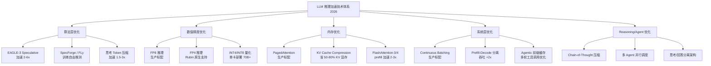
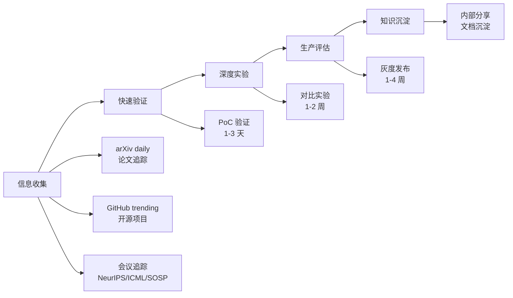

# 前沿技术概述

> 掌握推理加速前沿技术（Speculative Decoding、FP8/FP4、KV Cache Compression、Reasoning 优化等），在面试中展现技术深度和前瞻性。

## 核心概念：推理加速技术全景



## 技术分类详解

### 1. 算法层优化（减少计算量）

| 技术 | 核心思想 | 加速比 | 状态 | 适用场景 |
|------|---------|-------|------|---------|
| **EAGLE-3 Speculative** | 特征预测层，无需独立小模型 | 2-6x | 生产标配 | 通用文本、代码补全 |
| **SpecForge** | 灵活的推测解码训练框架 | 2-4x | 2026 新框架 | 自定义 draft-target 配对 |
| **FLy (Loosely Speculative)** | 放松验证标准，提高接受率 | 1.5-3x | 2025-2026 | 低确定性场景 |
| **SWIFT** | 自推测解码，无需额外训练 | 1.5-2.5x | ICLR 2025 | 快速部署场景 |
| **思考 Token 压缩** | 压缩 CoT 思考过程 token 数 | 1.5-3x | 2026 新方向 | Reasoning 模型推理 |
| **Prefill-Decode 分离** | 两类计算分开调度 | 吞吐 +2x | 生产标配 | 大流量服务 |

### 2. 数值精度优化（减少每操作计算量）

| 技术 | 核心思想 | 效果 | 硬件要求 | 状态 |
|------|---------|------|---------|------|
| **FP8** | 8-bit 浮点，H100 原生支持 | 吞吐 +50-100% | H100+ | 生产标配 |
| **FP4** | 4-bit 浮点，极致量化 | 吞吐 +2-3x | Rubin/B200 | 2026 前沿 |
| **INT8** | 8-bit 整数量化 | 吞吐 +50-100% | 通用 | 生产标配 |
| **INT4** | 4-bit 量化 | 显存 -75% | 通用 | 生产标配 |

### 3. 内存优化（减少显存瓶颈）

| 技术 | 核心思想 | 效果 | 状态 |
|------|---------|------|------|
| **PagedAttention** | 分页管理 KV Cache | 显存利用率 +2x | 生产标配 |
| **KV Cache Compression** | 压缩/丢弃低重要性 KV | KV 显存 -50-80% | 生产标配 |
| **FlashAttention-3/4** | 分块计算减少 HBM 访问 | Prefill 加速 2-3x | 生产标配 |
| **Reasoning KV 压缩** | 思考过程 token 的 KV Cache 压缩 | 显存 -30-50% | 2026 新方向 |

## 2026 年推理技术状态

### 已生产标配（2024 之前成熟的技术）

这些技术已成为推理框架的默认配置，面试中不需要特别强调"前沿"：

1. **PagedAttention** — vLLM 默认显存管理方案
2. **Continuous Batching** — 所有主流推理框架标配
3. **INT8/INT4 量化** — GPTQ/AWQ 成熟生态，单卡部署 70B+ 模型
4. **FP8 推理** — H100 环境的标准配置，vLLM/TRT-LLM/SGLang 全面支持
5. **GQA/MQA Attention** — Llama 3/4、Qwen3 等主流模型默认采用
6. **FlashAttention-3** — 预训练和推理框架默认集成

### 2025 年成熟并广泛采用的技术

这些技术在 2025 年完成从"实验"到"生产"的过渡，现在是 H100+/B200 环境的推荐配置：

1. **EAGLE-2/3 Speculative Decoding**
   - 使用训练后的特征预测层替代独立小模型
   - 接受率从 50% 提升到 70%+，加速比 2-6x
   - vLLM 和 SGLang 原生支持，Vertex AI 已生产采用
   - FDE 视角：代码补全和结构化输出场景收益最大

2. **Prefill-Decode 分离架构（DistServe / MoonCake）**
   - Prefill 节点（compute-bound）和 Decode 节点（memory-bound）分开调度
   - 吞吐提升 2x+，延迟降低 40%
   - FDE 视角：大流量服务（1000+ QPS）的架构首选

3. **FP8 E4M3 on H100/B200**
   - H100 Tensor Core FP8 吞吐 1,978 TFLOPS vs FP16 989 TFLOPS
   - B200 进一步优化 FP8 流水线
   - 实际推理加速 1.5-2x，精度损失 < 1%

### 2025-2026 前沿研究方向

这些是正在从论文走向生产的技术，FDE 应该开始评估和实验：

1. **SpecForge (2026-03)** — 灵活的开源推测解码训练框架
   - 优化 draft-target 配对关系，自动搜索最优 draft 配置
   - 比手动选择 draft model 接受率高 10-15%

2. **FLy — Training-Free Loosely Speculative Decoding (2025-12)**
   - 放松传统推测解码的严格验证标准
   - 在低确定性场景（创意写作、开放问答）仍有加速效果
   - 不需要额外训练，即插即用

3. **CAS-Spec (NeurIPS 2025)** — 级联自适应自推测
   - 单模型内多层级推测，无需额外模型
   - 根据内容复杂度动态调整推测深度

4. **EdgeLLM (2026)** — 端侧推理 + 推测解码
   - 在手机/边缘设备上跑 LLM 推理
   - 结合 speculative decoding 减少计算量
   - FDE 视角：边缘部署和 IoT 场景的新方向

5. **MXFP4/MXFP6 (H200/Rubin)**
   - NVIDIA H200 引入 Microscaling 格式
   - Rubin GPU 原生 FP4 支持，50 PFLOPS 推理性能
   - 比 FP8 更激进但仍保持可用精度

## 2026 年 FDE 新战场

### Reasoning 模型推理优化

GPT-5、Claude 4/4.5、Gemini 3 等"思考模型"（Reasoning Models）引入了 Chain-of-Thought (CoT) 中间步骤，产生了全新的推理优化挑战：

```
传统模型：Prompt → Token1 → Token2 → ...
Reasoning 模型：Prompt → [思考 Token × N] → 最终回答
```

**关键挑战：**
- 思考过程产生大量隐藏 token（可达最终回答的 5-10x），大幅增加 TTFT
- 思考 token 的 KV Cache 占用显著增加显存需求
- 用户只看到最终回答，但系统需要为所有思考 token 付费

**优化方向：**
- **思考 Token 压缩**：用更少的思考 token 达到同等推理质量（1.5-3x 加速）
- **思考 KV Cache 压缩**：对思考过程的 KV Cache 做激进量化/剪枝
- **思考/回答分离架构**：思考阶段用高精度，回答阶段用低精度
- **异步思考预计算**：对常见问题的思考过程做离线缓存

### Agentic 推理优化

Agent 系统的核心瓶颈是"多轮工具调用"场景下的推理效率：

```
Agent Loop:
  思考 → 调用工具 → 等待结果 → 继续思考 → 调用下一个工具 → ...
```

**优化方向：**
- **Agentic 前缀缓存**：Agent 多轮对话中，相同系统 prompt 和工具定义的 KV Cache 复用
- **并行工具调用调度**：当 Agent 需要调用多个独立工具时，并行生成所有工具调用
- **工具结果流式注入**：不等所有工具结果返回，已有结果立即注入继续生成
- **多 Agent 并行推理**：多个 Agent 子任务并行执行，最后汇聚结果

### MoE 大规模生产部署

Kimi K2（1 万亿参数 MoE）、Mistral Large（675B 总参数 / 41B 激活）等超大 MoE 模型进入生产：

**部署挑战：**
- Expert 分散在数十张 GPU 上，AllToAll 通信成为瓶颈
- 动态路由导致负载不均衡，部分 GPU 闲置
- 显存分布：Expert 权重 + 活跃 token 的 KV Cache 需要精细调度

**优化方向：**
- Expert 并行 + Tensor 并行混合策略
- 动态负载均衡：根据 traffic 模式调整 Expert 分布
- Expert 缓存：热门 Expert 预加载，冷门 Expert 按需加载

### FP4 极致量化

Rubin GPU（2026）原生支持 FP4 Tensor Core，50 PFLOPS 推理性能：

**意义：**
- 70B 模型 FP4 量化仅 ~17.5GB，单卡 Rubin 288GB 可部署 4-8 个 70B 实例
- 相比 FP8 再降 50% 显存，吞吐翻倍
- 精度损失控制在 1-2pp 以内（最新校准方案）

### 端侧推理优化

EdgeLLM、手机 NPU 推理等方向让 LLM 从云端走向边缘：

**挑战：**
- 手机端 8-16GB 内存限制，需要 INT4 甚至更低精度
- 电池续航要求，功耗 < 5W
- 离线场景，无法依赖云端

**优化方向：**
- 极致量化（INT2/INT1）+ 模型蒸馏
- 推测解码减少端侧计算量
- 混合云-端架构：简单问题端侧处理，复杂问题云端处理

## 如何保持技术敏感度



### 信息来源推荐

| 来源 | 频率 | 内容类型 |
|------|------|---------|
| arXiv cs.CL / cs.LG | 每天 | 最新论文 |
| NVIDIA Blog / GTC | 每季度 | 硬件和框架更新 |
| vLLM / SGLang GitHub | 每周 | 推理框架更新 |
| LMSYS Chatbot Arena | 每月 | 模型排行榜 |
| ML 会议 (NeurIPS, ICML, MLSys) | 每年 2-4 次 | 前沿技术论文 |

### 技术评估 Checklist

在评估一项新技术时，回答以下问题：

1. **原理是否清晰？** 能否用 5 分钟向同事解释？
2. **加速/收益有多少？** 有论文数据吗？开源实现验证了吗？
3. **适用条件是什么？** 有场景限制吗？（如只适合长文本？）
4. **精度影响多大？** 是否有 benchmark 证明精度不降？
5. **部署成本多少？** 需要额外硬件？额外训练？额外依赖？
6. **生态成熟度？** 主流推理框架支持了吗？（vLLM, TGI, TensorRT-LLM）

## 面试视角

**面试官可能问：**

1. **"最近 LLM 推理领域有什么值得关注的新方向？"**
   - EAGLE-3 将 Speculative Decoding 加速提升到 2-6x，vLLM/SGLang 已原生支持
   - FP8 成为 H100 环境标准配置，FP4 随 Rubin GPU 在 2026 年进入生产
   - Reasoning 模型的思考 token 压缩是 2026 年最大的新优化方向
   - Agentic 推理中多轮工具调用的前缀缓存优化
   - MoE 大规模部署（Kimi K2 1T 参数）的通信优化
   - 端侧推理（EdgeLLM）从实验走向生产

2. **"这些新技术你怎么评估？"**
   - 先看论文数据和开源实现
   - 快速 PoC 验证核心 claim
   - 在自己的 workload 上跑 benchmark
   - 评估部署成本和生态成熟度
   - 给出量化数据后再推荐

3. **"你怎么保持技术更新？"**
   - 日常关注 arXiv 热门论文和 GitHub trending
   - 参与推理框架社区（vLLM SGLang）
   - 定期做技术 PoC 并写内部报告
   - 参加行业会议和社区交流

4. **"这些技术在实际生产中有什么限制？"**
   - Speculative Decoding 在低接受率场景（如创意写作）加速效果有限，但 FLy 方法正在改善这一点
   - FP8 需要 H100 或更新硬件，A100 无法加速；FP4 需要 Rubin GPU
   - Reasoning 模型的思考 token 优化仍在早期，需要模型侧配合
   - MoE 部署中 Expert 通信和负载均衡是核心瓶颈
   - 端侧推理受限于手机内存和功耗
   - 任何新技术都需要在真实业务数据上验证，不能只看论文数字

5. **"你会优先考虑引入哪项技术？"**
   - 如果已有 H100：FP8 量化 + EAGLE-3 推测解码是第一步（改动最小，收益最大）
   - 如果延迟是瓶颈：EAGLE-3 Speculative Decoding（2-6x 加速）
   - 如果显存是瓶颈：PagedAttention + KV Cache Compression + INT4 量化
   - 如果吞吐是瓶颈：Continuous Batching + Prefill-Decode 分离
   - 如果是 Reasoning 模型：思考 token 压缩 + 异步预计算

## 部署视角

### 技术成熟度分级（2026 年中）

| 分级 | 技术 | 状态 |
|------|------|------|
| 已采用 | PagedAttention, Continuous Batching, GQA, FlashAttention-3, INT8/INT4 | 生产环境标配 |
| 推广中 | FP8 (H100/B200), EAGLE-3 Speculative, Prefill-Decode 分离 | H100+ 环境推荐 |
| 评估中 | FP4 (Rubin), FLy Loosely Speculative, SpecForge, Reasoning KV 压缩 | 2026 值得实验 |
| 观望中 | EdgeLLM 端侧部署, 思考/回答分离架构, 多 Agent 并行调度 | 早期探索阶段 |

## 最佳实践

1. **H100 环境：FP8 + EAGLE-3 是当前最优组合** — 改动最小，加速最大（1.5-2x + 2-6x）
2. **关注 Reasoning 模型优化** — 2026 年最大增量需求，思考 token 的 KV Cache 和延迟是核心瓶颈
3. **Agentic 场景优先做前缀缓存** — 多轮工具调用中，相同 system prompt 的 KV Cache 复用收益最大
4. **不要盲目追新** — PagedAttention + FP8 + Continuous Batching 已能解决 80% 的推理问题
5. **建立技术雷达** — 每季度更新团队的技术雷达，标注"采用/推广/评估/观望"
6. **MoE 部署从 2025 年开始成熟** — Kimi K2、Mistral Large 等超大 MoE 模型的部署经验是 2026 年差异化竞争力

---

*下一节：[Speculative Decoding](./speculative-decoding.md)*
