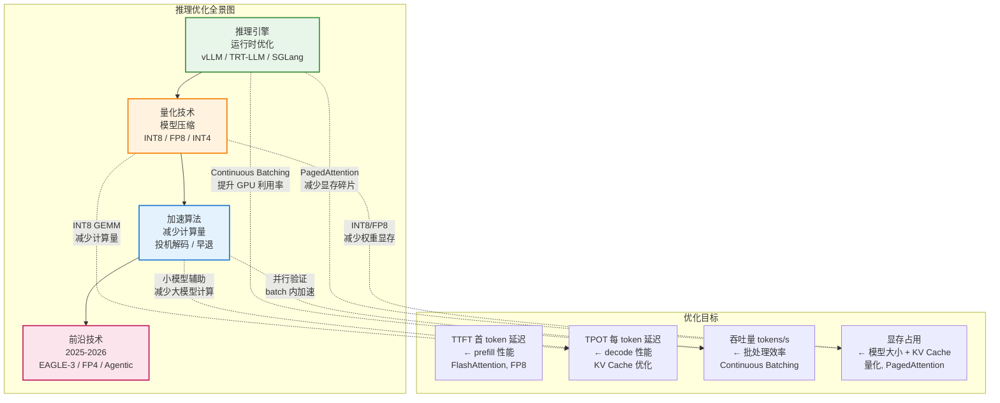
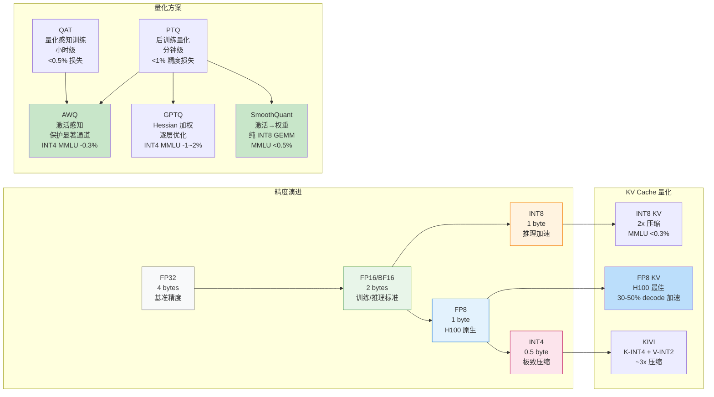
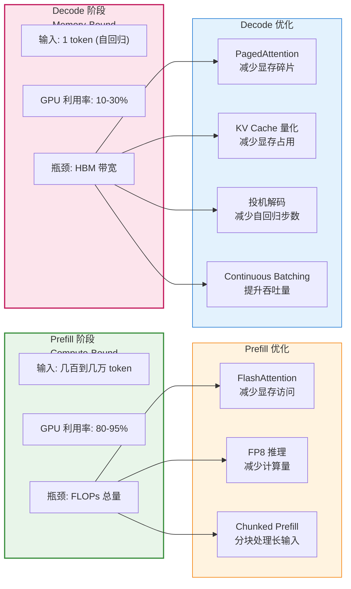
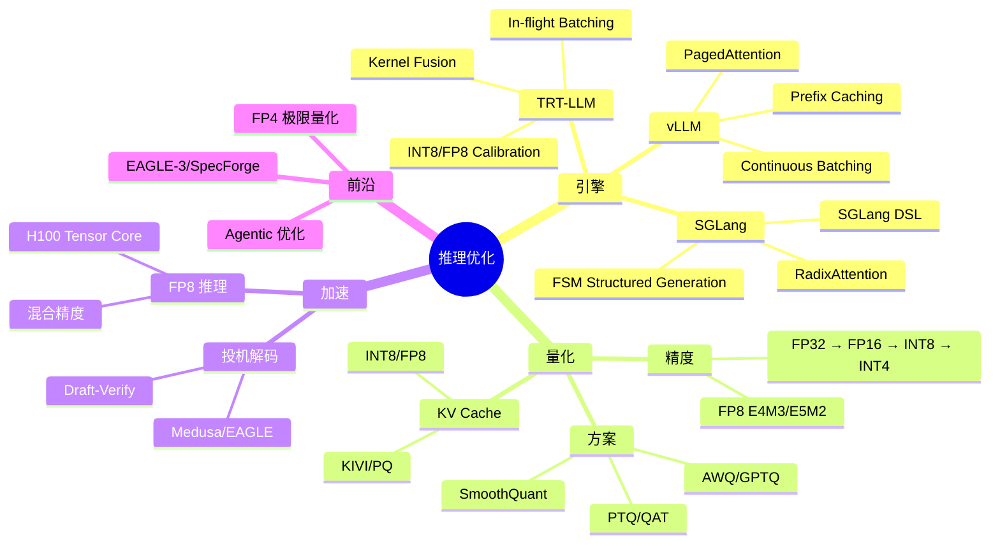

# 让推理变快：推理引擎与量化

> 理解主流推理引擎的原理和优化手段，掌握量化技术，让模型跑得更快、更省资源。

## 为什么这个模块对 FDE 至关重要

这是 FDE 的**核心技能区**。很多候选人能解释 Transformer 的公式，但回答不了：

- "vLLM 的 PagedAttention 比传统 KV Cache 好在哪里？为什么能提升 4 倍吞吐？"
- "AWQ 和 GPTQ 的 INT4 量化，哪个更适合生产环境？为什么？"
- "H100 上 FP8 推理比 FP16 快多少？精度损失有多大？"
- "投机解码的加速倍数如何计算？什么场景下最有效？"

**推理优化本质上是在和三个瓶颈博弈：显存（KV Cache）、算力（Tensor Core 利用率）、通信（多卡 AllReduce）。**

## 推理引擎架构全景

```mermaid
flowchart TB
    subgraph vLLM["vLLM: 运行时优化王者"]
        v1["API Server\nOpenAI 兼容 FastAPI"]
        v2["LLM Engine\n调度协调器"]
        v3["Scheduler\nDecode 优先级调度\nContinuous Batching"]
        v4["Worker\nGPU 进程 + Model Runner"]
        v5["PagedAttention\n固定大小 Block\nBlock Table 映射\n~95% 显存利用率"]
        v6["Prefix Caching\nBlock Hash 复用\nLRU 淘汰"]
    end

    subgraph TRTLLM["TensorRT-LLM: 编译时优化王者"]
        t1["Graph Parser\nONNX/PyTorch 导入"]
        t2["Kernel Auto-Tuning\n微基准测试选最优 Kernel"]
        t3["Layer Fusion\nElement-wise 融合\nAttention 融合\n全 Block 融合"]
        t4["INT8/FP8 校准\nKL 散度最小化"]
        t5["Engine 序列化\n直接部署推理"]
        t6["In-flight Batching\nToken 级别调度"]
    end

    subgraph SGLang["SGLang: Agent 场景王者"]
        s1["RadixAttention\nRadix Tree KV Cache\n最长前缀匹配\n跨请求前缀共享"]
        s2["FSM 结构化生成\nJSON Schema / Regex\nToken Masking\n100% 格式正确"]
        s3["SGLang DSL\n领域特定语言\nfew_shot_qa / tool_use"]
    end

    v1 --> v2 --> v3 --> v4 --> v5
    v4 --> v6
    t1 --> t2 --> t3 --> t4 --> t5 --> t6
    s1 --> s2 --> s3

    style vLLM fill:#e8f5e9,stroke:#388e3c,stroke-width:2px
    style TRTLLM fill:#fff3e0,stroke:#f57c00,stroke-width:2px
    style SGLang fill:#e3f2fd,stroke:#1976d2,stroke-width:2px
```

## 量化技术全景

## 70B 模型在不同精度下的显存需求

| 精度 | 权重显存 | KV Cache (batch=16, seq=8192) | 总显存 | 所需 GPU |
|------|---------|-------------------------------|--------|---------|
| FP16 | 140 GB | ~50 GB | ~190 GB | 3× A100-80G |
| INT8 (SmoothQuant) | 70 GB | ~25 GB | ~95 GB | 2× A100-80G |
| INT4 (AWQ) | 35 GB | ~12 GB | ~47 GB | 1× A100-80G |
| FP8 (H100) | 70 GB | ~12 GB | ~82 GB | 1× H100-80G |
| INT4 + INT8 KV | 35 GB | ~32 GB (INT8) | ~67 GB | 1× A100-80G |

**关键洞察：量化不只是省显存，更是让 70B 模型从"需要多卡"变成"单卡可跑"，从根本上消除了 TP 的通信开销。**

## Prefill vs Decode 的优化对应关系

## 硬件与量化方案匹配

| GPU | 推荐方案 | 原因 |
|-----|---------|------|
| A100 (无 FP8 Tensor Core) | INT8 SmoothQuant / INT4 AWQ | 不支持 FP8 原生加速 |
| H100 (FP8 Tensor Core) | FP8 权重 + FP8 KV Cache | 原生 FP8 GEMM，3958 TFLOPS |
| H200 / B200 | FP8 + FP4 探索 | 更大 HBM + 新精度支持 |
| 消费级 (RTX 4090) | INT4 GGUF / AWQ | 显存有限，INT4 是唯一选择 |

## 学习路径

| 顺序 | 文档 | 核心内容 | 面试考点 |
|------|------|---------|---------|
| 1 | [推理引擎概述](./engine-overview.md) | 推理指标、引擎对比、选型指南 | 如何选择推理引擎 |
| 2 | [vLLM 深度解读](./vllm-deep-dive.md) | PagedAttention、Continuous Batching | vLLM 的核心创新是什么 |
| 3 | [TensorRT-LLM 解读](./trt-llm-deep-dive.md) | NVIDIA 原生优化、推理加速 | TRT-LLM vs vLLM |
| 4 | [SGLang 解读](./sglang-deep-dive.md) | RadixAttention、结构化生成 | 什么时候用 SGLang |
| 5 | [量化基础](./quantization-basics.md) | PTQ、QAT、量化格式 | 量化对精度的影响 |
| 6 | [量化方案详解](./quantization-schemes.md) | SmoothQuant、AWQ、GPTQ | AWQ 的原理和优势 |
| 7 | [KV Cache 量化](./kv-cache-quant.md) | 量化 KV Cache 降低显存 | KV Cache 量化的精度损失 |
| 8 | [投机解码](./speculative-decoding.md) | 小模型辅助大模型生成 | 投机解码的加速原理 |
| 9 | [FP8 推理](./fp8-inference.md) | FP8 格式和混合精度推理 | FP8 vs FP16 的精度差异 |
| 10 | [前沿技术](./frontier-overview.md) | EAGLE-3、FP4、推理模型优化 | 2026 推理前沿趋势 |

## 模块知识结构图

## 前置知识

建议先完成 [GPU 基础](/03-gpu-basics/) 了解 GPU 的计算特性。

---

*上一节：[GPU：理解推理的物理载体](/03-gpu-basics/)*
*下一节：[推理引擎概述](./engine-overview.md)*
