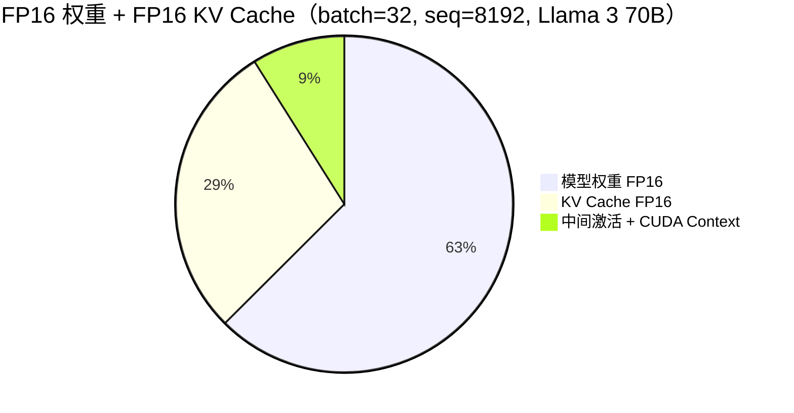
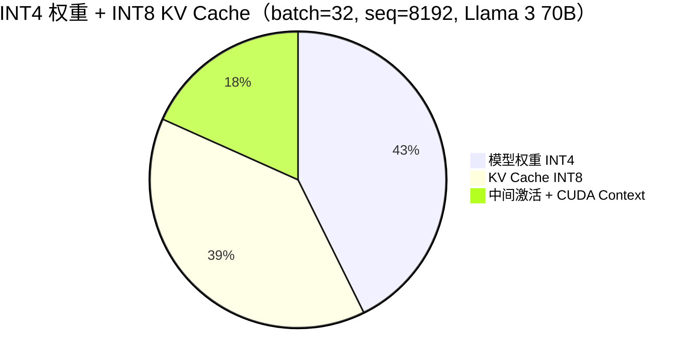

# KV Cache 量化

> KV Cache 占据推理显存的 60-80%，量化 KV Cache 是提升吞吐和并发量的最有效手段之一

## 核心概念（含 Mermaid 图）

### 为什么 KV Cache 值得量化

在 LLM 推理中，GPU 显存主要消耗在三个部分：**模型权重**、**KV Cache**、**中间激活值**。其中 KV Cache 在长上下文和大批量场景下占比最大。





**关键数据**：

```
Llama 3 70B，GQA-8，FP16 权重：
  batch=1,  seq=2048:   KV Cache = 160 KB × 2048 ≈ 0.33 GB  → 权重占主导
  batch=16, seq=8192:   KV Cache = 160 KB × 16 × 4  ≈ 10.2 GB  → KV 占 7%
  batch=32, seq=8192:   KV Cache = 160 KB × 32 × 4  ≈ 20.5 GB  → KV 占 15%
  batch=64, seq=32768:  KV Cache = 160 KB × 64 × 16 ≈ 164 GB  → KV 占 54%

观察：
  batch=1 短序列：KV Cache 很小，量化收益不大
  batch 大 + 长序列：KV Cache 爆炸式增长，量化收益巨大
  高并发长文本服务：KV Cache 是显存瓶颈的根因
```

### KV Cache 量化的独特挑战

KV Cache 量化与权重量化有本质区别：

| 维度 | 权重量化 | KV Cache 量化 |
|------|----------|---------------|
| **数据性质** | 静态，一次性量化 | 动态增长，每个 token 追加 |
| **分布** | 训练后已确定，大致稳定 | 随生成过程变化，前期和后期分布不同 |
| **校准** | 可以用离线校准数据统计 | 难以离线校准（online 数据不可预知） |
| **敏感度** | INT4 可接受 | KV Cache INT4 可能导致严重质量退化 |
| **量化粒度** | per-group/per-channel | 通常 per-tensor（简化 online 计算） |
| **反量化开销** | 可离线 dequantize | online dequantize 增加延迟 |

```
KV Cache 量化为什么更难：

1. KV Cache 是在推理过程中动态生成的
   → 无法用校准数据预先统计分布
   → 需要在线计算 scale（增加延迟）

2. 前几层的 KV 和后几层的 KV 分布差异大
   → 浅层 KV 变化剧烈，深层 KV 相对稳定
   → 统一量化策略对浅层不公平

3. KV Cache 中的异常值模式与权重不同
   → 某些 token 的 KV 值极大（通常是特殊 token 或标点）
   → per-tensor 量化时 scale 被 outlier 撑大

4. decode 阶段 KV Cache 读取是 memory-bound 的
   → 量化减少了带宽，但如果 dequantize 开销大则抵消收益
```

### 主流 KV Cache 量化方案

#### 方案 1：INT8 KV Cache 量化

```
最简单也最实用的方案：

量化策略：
  - per-tensor 对称 INT8 量化
  - 每个 KV head 独立 scale（per-head，而非全局 per-tensor）
  - scale = max(|KV|) / 127，在线计算

精度影响：
  - MMLU 损失 < 0.3%
  - 生成质量几乎无感知差异
  - 长文本场景（> 8K）可能有轻微退化

显存收益：
  - KV Cache 减半（FP16 → INT8）
  - batch size 可以翻倍（在相同显存预算下）

性能收益：
  - decode 延迟降低 20-40%（带宽减少主导）
  - 但需要 online dequantize（INT8 → FP16 给 Attention 计算）
  - fused dequantize kernel 可以将开销降到 < 5%
```

#### 方案 2：FP8 KV Cache 量化

```
H100 上的最佳选择：

量化策略：
  - E4M3 格式（权重用 FP8 时 KV 也用 FP8）
  - per-tensor 或 per-head scale
  - H100 Tensor Core 原生支持 FP8 Attention

精度影响：
  - MMLU 损失 < 0.2%
  - 几乎完全无损

显存收益：
  - KV Cache 减半（FP16 → FP8）
  - 与 INT8 相同的压缩比

性能收益：
  - FP8 GEMM 原生加速
  - 不需要 dequantize（FP8 直接计算）
  - decode 延迟降低 30-50%
```

#### 方案 3：KIVI（Kernel-aware INT4/INT2 KV Cache）

```
KIVI（2024）的核心观察：
  KV Cache 中 K 和 V 的量化敏感度不同
  → K（Key）对量化更敏感（决定 token 之间的相似度）
  → V（Value）对量化相对宽容

量化策略：
  - K 用 INT4，V 用 INT2
  - per-channel + per-token 量化
  - 专门优化的 fused Attention kernel

精度影响：
  - K-INT4 + V-INT2：MMLU 损失 0.5-1.5%
  - K-INT8 + V-INT4：MMLU 损失 < 0.3%
  - 全 INT4：MMLU 损失 1-2%

显存收益：
  - 混合 INT4/INT2：KV Cache 压缩到 1/3
  - 全 INT4：KV Cache 压缩到 1/2

适用场景：
  - 超长上下文（32K+）
  - 大批量服务（batch > 64）
  - 对质量有一定容忍度的场景
```

#### 方案 4：PQ（Product Quantization）KV Cache

```
PQ 的思路：
  将 high-dimensional KV 向量分组
  每组用 K-means 聚类出 codebook
  只存储 codebook 索引（如 8-bit 索引 = 256 个 cluster）

优势：
  - 压缩比极高（可以达到 10x+）
  - 不依赖硬件 INT8/FP8 支持

劣势：
  - 需要 online 查找 codebook → 推理延迟增加
  - codebook 需要存储在显存中
  - 实现复杂，工程化难度大

适用场景：
  - 学术研究 / 极限压缩场景
  - 目前生产环境较少使用
```

### 量化方案对比汇总

| 方案 | 压缩比 | MMLU 损失 | 实现难度 | GPU 要求 | 生产成熟度 |
|------|--------|-----------|----------|----------|-----------|
| FP16（基准） | 1x | 0 | 无 | 任意 | 基准 |
| INT8 | 2x | < 0.3% | 低 | 任意 | **高，推荐** |
| FP8 | 2x | < 0.2% | 低 | H100+ | 中-高（H100 普及中） |
| K-INT4/V-INT2 | ~3x | 0.5-1.5% | 中 | 任意 | 中 |
| INT4 | 2x | 1-2% | 低 | 任意 | 中（需验证质量） |
| PQ | 4-10x | 1-3% | 高 | 任意 | 低（实验性） |
| Token Eviction | 2-8x | 1-5% | 中 | 任意 | 中（场景依赖） |

## 部署视角

### KV Cache 量化 vs Weight 量化：先量化谁？

```
显存优化优先级建议：

场景 1：单请求，短序列（batch=1, seq < 4K）
  权重占显存主导 → 先量化权重（INT4/AWQ）
  KV Cache 很小，量化收益不大

场景 2：多请求，长序列（batch > 16, seq > 8K）
  KV Cache 占显存主导 → 先量化 KV Cache（INT8/FP8）
  权重量化作为第二步优化

场景 3：两者都量化
  INT4 权重 + INT8 KV Cache = 最佳性价比
  70B 模型：35GB(权重) + 32GB(KV) = 67GB → 1× A100-80G 搞定
  FP16 基线：140GB(权重) + 64GB(KV) = 204GB → 需要 3× A100

场景 4：极限压缩
  INT4 权重 + K-INT4/V-INT2 KV = 35GB + 21GB = 56GB
  但质量损失可能 > 2%，需要严格验证
```

### 实际部署配置建议

#### vLLM 中的 KV Cache 量化

```python
# vLLM INT8 KV Cache 量化配置
llm = LLM(
    model="meta-llama/Llama-3-70B-Instruct-AWQ-INT4",  # 权重已量化
    quantization="awq",
    kv_cache_dtype="int8",         # KV Cache INT8 量化
    gpu_memory_utilization=0.95,   # 量化后可以用更高的比例
    max_model_len=16384,
)

# vLLM FP8 KV Cache（H100）
llm = LLM(
    model="...",
    quantization="fp8",
    kv_cache_dtype="fp8",
    gpu_memory_utilization=0.95,
)
```

#### 不同场景的推荐配置

| 场景 | 权重量化 | KV Cache 量化 | 目标 |
|------|----------|--------------|------|
| 低延迟单请求 | INT4 (AWQ) | FP16 | 最小化首 token 延迟 |
| 高并发短文本 | INT8 | INT8 | 最大化 batch size |
| 高并发长文本 | INT4 (AWQ) | INT8 | 平衡质量和吞吐 |
| H100 集群 | FP8 | FP8 | 全链路 FP8，速度最优 |
| 成本极致优化 | INT4 (AWQ) | K-INT4/V-INT2 | 最小 GPU 数 |

### 监控 KV Cache 量化效果

```
关键监控指标：

1. KV Cache 显存占比
   - 量化前：60-80%
   - INT8 量化后：30-50%
   - 目标：降低 30-50 个百分点

2. 有效 batch size 提升
   - 同样显存预算下，batch size 应提升 1.5-2x
   - 如果提升不明显，检查是否权重未量化

3. 生成质量
   - 用 100 条业务数据做 A/B 测试
   - 比较量化前后的输出一致性
   - 关注：是否有重复生成、乱码、逻辑错误

4. 推理延迟
   - decode 阶段 per-token 延迟应降低 20-50%
   - 如果延迟没有降低，检查 dequantize 开销
```

## 面试视角

### 面试官常问问题

**Q1: "KV Cache 量化和权重量化有什么区别？为什么 KV Cache 量化更难？"**

满分回答要点：
- 权重是静态的，可以离线校准统计分布；KV Cache 是动态生成的，需要 online scale 计算
- 权重的分布相对均匀稳定；KV Cache 的分布随生成过程变化，前期和后期差异大
- 权重量化有成熟的 AWQ/GPTQ 方案；KV Cache 量化通常只能用简单的 per-tensor 方法
- KV Cache 中的 outlier 模式与权重不同（某些特殊 token 产生极端 KV 值）
- INT4 权重可以接受，但 INT4 KV Cache 通常质量损失太大

**Q2: "KV Cache 量化后，什么情况下精度损失最大？"**

满分回答要点：
- **长上下文**：序列越长，累积的量化误差越多，影响越明显
- **数学/代码任务**：需要精确计算的任务对 KV 精度更敏感
- **浅层 Attention**：前几层的 KV 变化剧烈，量化误差对注意力模式影响更大
- **多轮对话**：历史 KV Cache 中的误差会在后续生成中累积
- 缓解策略：浅层用 INT8/FP16，深层用 INT4/FP8（分层量化策略）

**Q3: "KV Cache 量化的 trade-off 是什么？怎么决定要不要量化 KV Cache？"**

满分回答要点：
- **Trade-off**：显存/速度 vs 生成质量
- **决策因素**：
  1. 如果 batch size 受限（显存不够）→ KV Cache 量化是首选优化
  2. 如果是 latency-critical（单请求低延迟）→ 权重量化优先，KV Cache 保持 FP16
  3. 如果吞吐-critical（高并发服务）→ 两者都量化，最大化 batch
  4. 质量敏感场景（数学、代码）→ KV Cache 至少用 INT8，不用 INT4
  5. H100 环境 → 直接上 FP8 KV Cache，精度几乎无损
- **经验法则**：INT8 KV Cache 量化在 Llama 3 级别模型上几乎无损，可以放心使用

**Q4: "量化 KV Cache 会影响推理速度吗？不是说量化后数据变小了应该更快吗？"**

满分回答要点：
- 理论上：KV Cache 变小 → HBM 读取量减少 → 带宽压力减小 → decode 更快
- 但实际上：需要 online dequantize（INT8 → FP16）才能给 Attention 计算用
- 如果 dequantize 是单独的 kernel → 增加 kernel launch overhead → 可能更慢
- 如果 dequantize fused 到 Attention kernel 中 → 开销 < 5% → 净收益为正
- 所以关键是 **kernel 实现质量**：好的 fused kernel 能带来 20-40% 加速，差的实现可能反而更慢
- FP8 KV Cache 在 H100 上不需要 dequantize → 天然更快

## 最佳实践

### 调参建议

- **首选 INT8 KV Cache**：精度损失极小（< 0.3%），实现简单，任何 GPU 都支持
- **H100 首选 FP8 KV Cache**：精度几乎无损，推理速度更快
- **谨慎使用 INT4 KV Cache**：只在显存极度紧张且对质量要求不高时使用
- **分层量化策略**（进阶）：前 1/3 层 KV 用 FP16/INT8，后 2/3 层用 INT4 → 平衡质量和显存
- 量化 KV Cache 后，`gpu_memory_utilization` 可以适当提高（0.9 → 0.95），因为峰值显存更可控

### 避坑指南

- INT8 KV Cache 量化在 7B/13B 模型上几乎无损，但 70B+ 模型在超长上下文时可能有轻微退化
- 量化后的 KV Cache 做 Prefix Caching 时，确保 cache 也是量化格式存储（不要缓存了量化后再反量化缓存）
- vLLM 的 `kv_cache_dtype` 设置后需要重启引擎才能生效，不支持运行时切换
- KV Cache 量化不能替代 PagedAttention（两者是正交优化，应该同时使用）
- 测试 KV Cache 量化效果时，用真实业务数据做 A/B，不要用合成数据
- MoE 模型的 KV Cache 量化和 Dense 模型类似，但注意 active expert 切换时的 KV 分布变化

---

*上一节：[量化方案详解](./quantization-schemes.md)*
*下一节：[GPU 基础](../03-gpu-basics/gpu-overview.md)*
