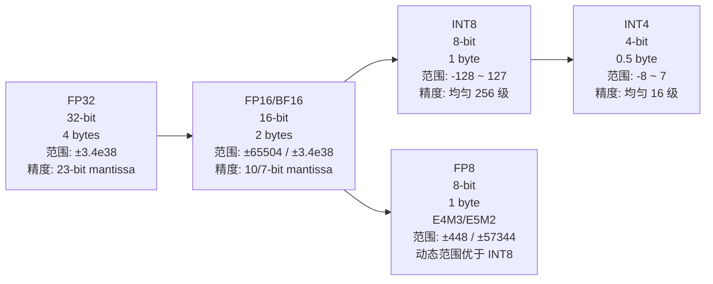
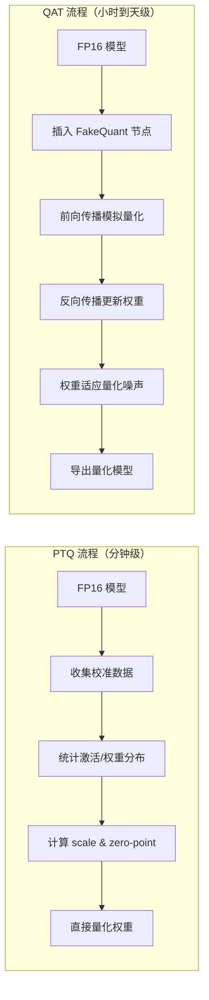
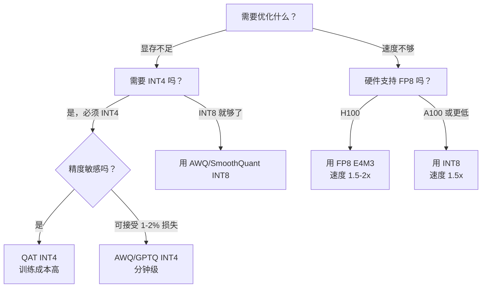

# 模型量化基础

> 用低精度表示高精度数值，在可控精度损失下将显存压缩 2-4 倍、推理速度提升 1.5-3 倍

## 核心概念（含 Mermaid 图）

### 什么是量化

量化（Quantization）是将连续的高精度数值映射到离散的低精度表示的过程。在 LLM 推理中，就是把模型权重、激活值、KV Cache 从 FP32/FP16/BF16 转换为 INT8/INT4/FP8 等低精度格式。

**核心收益**：
- **显存节省**：FP16 → INT8 减半，FP16 → INT4 压缩到 1/4
- **速度提升**：低精度 GEMM（General Matrix Multiply，通用矩阵乘法，即深度学习中最核心的乘加运算）在 Tensor Core（GPU 中专为矩阵乘法设计的硬件单元）上吞吐量更高
- **能耗降低**：低精度访存带宽消耗更小

> **术语说明**：GEMM 是最基础的线性代数运算，Transformer 中绝大多数计算（QKV 投影、FFN）都可以表示为 GEMM。Tensor Core 是 NVIDIA GPU 中专门加速 GEMM 的硬件单元。

### 精度演进：FP32 → FP16 → INT8 → INT4 → FP8

> 注：浮点数由三部分组成——sign（符号位）、exponent（指数位，决定数值范围）、mantissa（尾数/小数位，决定精度）。FP16 比 FP32 减少了 exponent 和 mantissa 的位数，INT 格式则完全没有 exponent，用均匀分布的离散值表示。



### 量化的数学原理

#### 均匀量化公式

在讲公式之前，先建立一个直觉：**量化就是把"连续的温度值"压缩到"整数档位"。**

想象你有 0-100°C 的温度计，要压缩到 0-255 的整数。你需要知道"每个整数代表多少度"——这就是 **scale**（缩放因子）。如果范围是 0-100°C，scale = 100/255 ≈ 0.39，意味着"每个整数代表 0.39°C"。

最常用的对称均匀量化公式：

```
量化:   q = round(x / s) + z
反量化: x_hat = (q - z) * s

其中:
  x      → 原始浮点值（如模型权重 1.5）
  q      → 量化后的整数（INT8 范围 [-128, 127]）
  s      → 缩放因子（scale），相当于"每个整数代表多少浮点值"
           s = max(|x|) / 127，即把最大权重映射到 127
  z      → 零点（zero-point），用于对齐浮点 0 到整数 0
           对称量化时 z=0，因为浮点 0 直接对应整数 0
  x_hat  → 反量化后的近似值，和原始值的差异就是量化误差
```

**示例**：权重范围为 [-3.2, 3.2]，对称 INT8 量化
```
s = 3.2 / 127 ≈ 0.0252
x = 1.5 → q = round(1.5 / 0.0252) = round(59.52) = 60
反量化: x_hat = 60 * 0.0252 = 1.512 → 误差 0.012
```

#### 非对称量化

当数据分布不对称时（如激活值 ReLU 后全为正），使用非对称量化：

```
q = round((x - x_min) / (x_max - x_min) * 255)
反量化: x_hat = q * (x_max - x_min) / 255 + x_min
```

此时零点 z = round(x_min / s)，用于对齐浮点 0 到整数 0。

#### 缩放粒度

| 粒度 | 说明 | 典型场景 | 精度 | 开销 |
|------|------|----------|------|------|
| per-tensor | 整个 tensor 共用一个 scale | 简单 PTQ | 较低 | 最低 |
| per-channel | 每个输出通道独立 scale | 权重量化 | 高 | 低 |
| per-group | 每组（如 128 个）权重独立 scale | INT4 量化 | 最高 | 中 |
| per-token | 每个 token 独立 scale | 激活量化 | 高 | 中 |

### 为什么量化能节省显存：具体字节数对比

```
70B 模型在不同精度下的显存占用：

FP32:  70B × 4 bytes = 280 GB  → 需要 4× A100-80G
FP16:  70B × 2 bytes = 140 GB  → 需要 2× A100-80G
INT8:  70B × 1 byte  = 70 GB   → 1× A100-80G
INT4:  70B × 0.5 byte = 35 GB  → 1× A100-80G，余量可加大 batch
FP8:   70B × 1 byte  = 70 GB   → 1× A100-80G/H100-80G

加上 KV Cache 后的完整显存预算（batch=16, seq=8192, GQA-8）:
  FP16 权重 + FP16 KV: 140 + 64 = 204 GB → OOM on 1× A100
  INT8 权重 + INT8 KV: 70  + 32 = 102 GB → OOM on 1× A100
  INT4 权重 + INT8 KV: 35  + 32 = 67 GB  → 可行！余量给激活值
```

### 为什么量化能提升速度

```
NVIDIA GPU Tensor Core 理论吞吐量（TFLOPS，以 A100-80G 为例）:

FP32:     19.5 TFLOPS
TF32:     156  TFLOPS  (8x FP32)
FP16:     312  TFLOPS  (16x FP32)
BF16:     312  TFLOPS  (16x FP32)
INT8:     624  TFLOPS  (32x FP32)  → INT8 GEMM 是 FP16 的 2x
FP8(E4M3):1979 TFLOPS  (H100)     → FP8 是 FP16 的 ~6x (H100)

带宽角度（A100-80G HBM2e）:
  HBM2e 带宽: 2.0 TB/s
  INT8 权重体积是 FP16 的 1/2 → 权重访存时间减半
  对于 weight-bound 的 decode 阶段，直接转化为延迟减半

  > weight-bound（访存受限）：瓶颈在从显存读取权重的速度，而非计算速度。
  > 类比：做饭时等水烧开（IO 慢），而不是等切菜（计算慢）。

实际推理加速比（decode 阶段，batch=1）:
  FP16 → INT8: ~1.5-2x
  FP16 → INT4: ~2-3x
  FP16 → FP8 (H100): ~1.5-2x
```

### 量化精度损失的来源

```
精度损失的三大来源：

1. 截断误差（Clipping）
   - 超过量化范围的异常值被截断到 max/min
   - 影响：权重分布中的 outlier 被削平
   - 缓解：扩大量化范围或使用非对称量化

2. 舍入误差（Rounding）
   - round(x/s) 引入的最大误差 = s/2
   - 影响：所有值都有微小扰动，累积后可能显著
   - 缓解：更细粒度的 per-group/per-token 量化

3. 异常值敏感性（Outlier Impact）
   - LLM 中存在少量 extreme activation（magnitude 远超其他值）
   - 这些 outlier 撑大了 scale，导致普通值的量化粒度变粗
   - 影响：这是 LLM 量化最大的精度杀手
   - 缓解：SmoothQuant / AWQ 等异常值感知方案
```

### Post-training Quantization (PTQ) vs Quantization-Aware Training (QAT)

| 维度 | PTQ | QAT |
|------|-----|-----|
| **原理** | 直接用校准数据计算 scale，不更新权重 | 在训练中模拟量化噪声，微调权重 |
| **训练成本** | 极低（只需少量校准数据） | 高（需要 full training loop） |
| **精度** | INT8 接近无损，INT4 有明显损失 | INT4 可接近 FP16 |
| **适用场景** | INT8 推理、快速部署 | INT4 极限压缩、对精度要求极高 |
| **校准数据** | 100-1000 条样本即可 | 需要完整训练集或大语料 |
| **时间** | 分钟级 | 小时到天级 |
| **代表工具** | AWQ、GPTQ、SmoothQuant | QLoRA、LLM-QAT |



### 各主流模型对量化的原生支持

| 模型 | INT8 PTQ | INT4 PTQ | FP8 | 推荐方案 |
|------|----------|----------|-----|----------|
| Llama 3/3.1 8B | ✅ 无损 | ✅ MMLU -0.5 | ❌ | AWQ INT4 |
| Llama 3.1 70B | ✅ 无损 | ✅ MMLU -1.0 | ❌ | AWQ INT4 |
| Qwen2.5 7B/72B | ✅ 无损 | ✅ | ❌ | GPTQ INT4 |
| Mistral 7B | ✅ 无损 | ✅ | ❌ | AWQ INT4 |
| Mixtral 8x7B | ✅ | ⚠️ MoE 量化复杂 | ❌ | SmoothQuant INT8 |
| DeepSeek-V3 | ⚠️ MLA 特殊 | ⚠️ | ✅ H100 | 原生 FP8 |
| GPT-4 / Claude | N/A | N/A | N/A | 闭源 |

## 部署视角

### 量化决策树



### 生产环境量化检查清单

- [ ] 在目标硬件上测试量化后推理速度（不要只看理论 TFLOPS）
- [ ] 用 200+ 条校准数据跑 PTQ，覆盖典型输入分布
- [ ] 量化后跑 MMLU/GSM8K/代码生成等关键 benchmark，确认损失 < 2%
- [ ] 验证极端长上下文场景（quantization 对长序列更敏感）
- [ ] INT4 量化后检查 token 生成质量（是否有重复、乱码）
- [ ] 监控量化后推理的 P99 延迟（确保无退化）

### 量化与 vLLM/SGLang 的兼容性

| 引擎 | INT8 权重 | INT4 权重 | INT8 KV Cache | FP8 |
|------|-----------|-----------|---------------|-----|
| vLLM | ✅ | ✅ (AWQ/GPTQ) | ✅ | ✅ (H100) |
| SGLang | ✅ | ✅ (AWQ/GPTQ) | ✅ | ✅ (H100) |
| TensorRT-LLM | ✅ | ✅ | ✅ | ✅ |
| Ollama | ✅ | ✅ (GGUF) | ❌ | ❌ |

## 面试视角

### 面试官常问问题

**Q1: "简单解释一下量化是什么？为什么 LLM 可以量化？"**

满分回答要点：
- 量化 = 用低精度整数近似高精度浮点，核心公式 q = round(x/s) + z
- LLM 可以量化是因为权重分布相对集中，大部分值在 [-3, 3] 范围内
- INT8 有 256 个离散值，步长约 0.02，对多数权重来说足够精细
- 激活值中存在 outlier 是主要挑战，需要特殊处理

**Q2: "INT8 量化会导致多少精度损失？什么情况下损失最大？"**

满分回答要点：
- 标准 PTQ INT8 在 Llama/Mistral 等模型上 MMLU 损失 < 0.5%
- 损失最大的场景：激活值 outlier 严重（per-tensor 量化时 scale 被 outlier 撑大）
- 模型越大，量化越友好（大模型本身有冗余容量）
- 长文本生成比分类任务对量化更敏感

**Q3: "量化的 trade-off 是什么？什么时候不该量化？"**

满分回答要点：
- **Trade-off 三角**：精度 vs 压缩率 vs 部署成本
  - INT8：精度几乎无损，压缩 2x，部署成本极低 → 首选
  - INT4：压缩 4x，但 MMLU 可能掉 1-3%，需要仔细验证
  - FP8：需要 H100 硬件，但精度接近 FP16，吞吐大幅提升
- **不该量化的场景**：
  - 数学推理、代码生成等对精度极度敏感的任务
  - 模型本身已经很小（7B 以下），量化收益有限
  - 硬件不是瓶颈（显存充足、吞吐满足 SLA）
  - 需要 FP16 做后续微调或 LoRA adapter

**Q4: "为什么 INT8 GEMM 比 FP16 GEMM 快？"**

满分回答要点：
- 硬件层面：INT8 Tensor Core 每个 cycle 可以处理更多 MAC 操作（INT8 是 FP16 的 2x 吞吐）
- 访存层面：INT8 权重占 FP16 一半内存，HBM 带宽减半 → weight-bound 的 decode 阶段直接受益
- 但注意：在 compute-bound 的 prefill 阶段，加速比可能小于 2x
- 实际加速比还取决于是否 fused dequantize（反量化是否和 GEMM 融合）

**Q5: "per-tensor、per-channel、per-group 量化各适用于什么场景？"**

满分回答要点：
- per-tensor：最简单，适合激活值量化（同一 batch 内分布相近），但对 outlier 敏感
- per-channel：每个输出通道独立 scale，适合权重量化（不同 neuron 的 magnitude 差异大）
- per-group：如每 128 个权重一个 scale，适合 INT4（16 级量化需要更细粒度补偿）
- 选择原则：精度要求越高，粒度越细，但计算/存储 overhead 越大

## 最佳实践

### 量化入门推荐

- **第一步**：先用 INT8 AWQ 或 SmoothQuant，几乎无损，部署简单
- **第二步**：如果显存仍然紧张，尝试 INT4 AWQ，验证精度
- **第三步**：如果有 H100，直接上 FP8，精度和速度兼得

### 避坑指南

- INT4 量化后用 GSM8K 和代码生成验证，不要只看 MMLU
- 校准数据要覆盖业务真实分布（不能只用 Wikipedia）
- per-group INT4 的 group_size 设为 128 是 sweet spot（64 太碎，256 太粗）
- 量化后第一次推理可能很慢（dequantize kernel 预热），多做几次 warmup
- MoE 模型量化要特别注意，router 权重对精度极其敏感，建议 INT8 而非 INT4
- GGUF 格式（llama.cpp）的量化和 AWQ/GPTQ 不同，量化等级标记方式不同（Q4_K_M vs Q8_0）

---

*下一节：[量化方案详解](./quantization-schemes.md)*
