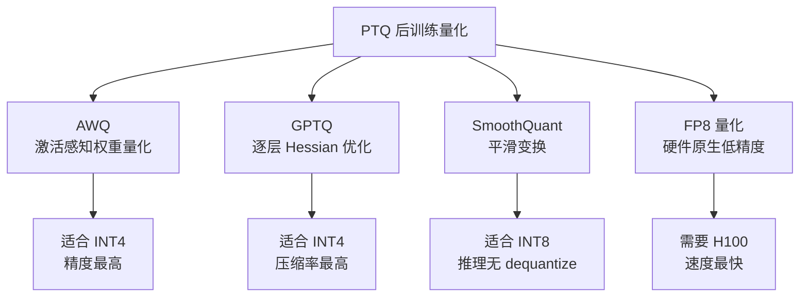
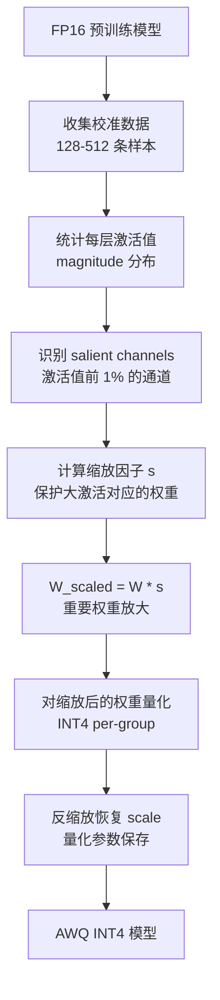
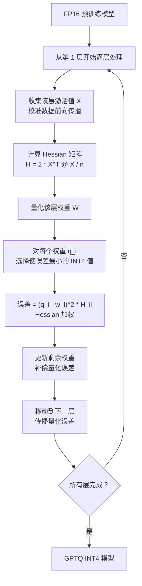
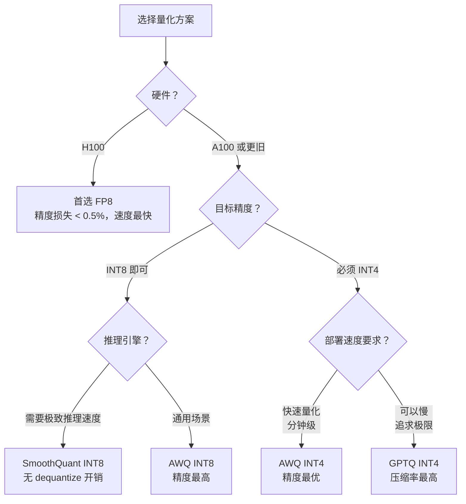

# 量化方案详解

> 深入 AWQ、GPTQ、SmoothQuant、FP8 四大主流方案的原理、对比和选型策略

## 前置知识

- [模型量化基础](./quantization-basics.md) — 理解量化公式、PTQ vs QAT、精度损失来源

## 核心概念（含 Mermaid 图）

### 方案全景图



## AWQ（Activation-aware Weight Quantization）

### 核心发现

AWQ（2023，MIT Han Lab）的关键观察是：**并非所有权重都同等重要**。激活值大的 channel 对应的权重如果被量化误差破坏，对最终输出影响远大于激活值小的 channel。

```
关键洞察：
  在 Linear 层 Y = X @ W 中：
    如果 X 的第 j 列（channel）的 activation 很大
    那么 W 的第 j 行的小误差会被放大到输出 Y
    → 这些权重需要更精细的保护

  传统 INT4 均匀量化：对所有权重一视同仁
  AWQ：放大重要权重、缩小不重要权重后再量化
```

### AWQ 流程



### 为什么 activation-aware 比 uniform 量化好

```
均匀量化的问题：
  假设权重范围 [-3.2, 3.2]，INT4 有 16 个离散值，步长 = 0.427
  权重 w = 0.21 → 量化为 0，误差 0.21
  如果这个 w 对应的 activation = 100，输出误差 = 0.21 * 100 = 21 → 巨大！

AWQ 的做法：
  检测到大 activation 后，对对应权重乘以 s > 1（放大）
  放大后权重范围变大，量化步长相对变小 → 量化误差减小
  同时缩小不重要的权重，让它们承受更大的量化误差（反正不影响输出）

数学上：
  Y = X @ W = (X / s) @ (W * s)
  AWQ 找到最优的 per-channel scaling factor s
  最小化量化后输出误差 ||X @ W - Q(X/s) @ Q(W*s)||
```

### 权重保护机制

AWQ 只保护 salient weights（约 1% 的权重），其余正常量化：

```python
# 伪代码：AWQ 核心逻辑
for layer in model:
    # 1. 计算激活值 scale
    act_scale = compute_activation_scale(calib_data)

    # 2. 找到 salient channels（激活值最大的 1%）
    salient_mask = act_scale > percentile(act_scale, 99)

    # 3. 对这些 channel 的权重做缩放
    for channel in salient_channels:
        weight[channel] *= scaling_factor
        # 量化时这些权重有更大的数值范围 → 更小的相对误差

    # 4. 正常量化所有权重
    quantized_weight = int4_quantize(weight, group_size=128)
```

### AWQ 的优势与局限

| 优势 | 局限 |
|------|------|
| INT4 精度损失极低（MMLU -0.3%） | 需要校准数据 |
| 量化速度快（分钟级） | 对 MoE 模型的 router 保护不够 |
| 不需要训练，纯 PTQ | 校准数据分布影响量化质量 |
| 兼容现有推理引擎 | 极端 INT3 以下精度不够 |

## GPTQ（Generative Pretrained Quantization）

### 核心思想

GPTQ（2022）的核心是**逐层量化 + Hessian 加权误差最小化**。它把量化视为一个优化问题：给定一层 FP16 权重，找到最优的 INT4 近似，使得量化前后该层的输出差异最小。

### GPTQ 流程



### 逐层量化原理

```
关键创新：不是全局一起量化，而是一层一层来

第 t 层：
  输入 X_t 已经固定（前面 t-1 层量化完毕）
  找到最优的量化 W_t^q 使得：
    min ||(X_t @ W_t - X_t @ W_t^q)||^2
        W_t^q

  展开 = (W_t - W_t^q)^T @ (X_t^T @ X_t) @ (W_t - W_t^q)
       = (W_t - W_t^q)^T @ H @ (W_t - W_t^q)

  其中 H = X_t^T @ X_t 就是 Hessian 矩阵的近似
```

### Cholesky 分解与误差回传

```
GPTQ 的逐列量化策略：

1. 对 H 做 Cholesky 分解：H = L @ L^T
   → 将二次型转化为对角形式，降低优化复杂度

2. 逐列（column-wise）贪心量化：
   for each column j of W:
     尝试所有 16 个 INT4 值
     选择使 (q_j - w_j)^2 * H_jj + 交叉项误差 最小的值

3. 量化误差回传：
   量化第 j 列后，产生的误差会影响后续列
   更新未量化列的误差累积：
     W_{:, j+1:} -= (W_{:, j}^q - W_{:, j}) @ H_{j, j+1:} / H_{jj}

4. 进入下一层时，输入已经是量化后的输出
   → 误差逐层累积，所以第一层的量化精度最关键
```

### GPTQ vs AWQ 对比

| 维度 | GPTQ | AWQ |
|------|------|-----|
| **核心方法** | Hessian 加权优化 | 激活值感知缩放 |
| **量化速度** | 较慢（逐层优化） | 快（直接统计） |
| **INT4 精度** | MMLU -1.0~2.0% | MMLU -0.3~0.8% |
| **校准数据** | 需要 | 需要 |
| **误差传播** | 显式回传 | 无显式处理 |
| **实现复杂度** | 高（Hessian/Cholesky） | 低（统计+缩放） |
| **推荐场景** | 追求极致压缩 | 追求精度+速度平衡 |

## SmoothQuant

### 核心思想

SmoothQuant（2022，MIT Han Lab）解决的是**激活值 outlier 导致激活量化困难**的问题。它的创新在于：把量化的困难从激活值"平滑"转移给更容易量化的权重。

```
问题：
  LLM 激活值中有 extreme outlier（某些 token 的激活值 magnitude 是平均的 10-100 倍）
  如果 per-tensor 量化这些 outlier，scale 被撑大 → 正常值的量化粒度变粗 → 精度暴跌

  但权重通常没有 outlier，权重量化相对容易

SmoothQuant 的方案：
  Y = X @ W
  引入平滑因子 s（per-channel）：
    Y = (X / s^(1/2)) @ (W * s^(1/2))

  效果：
    X 的 outlier 被除以 s^(1/2) → 激活值范围缩小 → 激活量化变容易
    W 乘以 s^(1/2) → 权重范围扩大 → 但权重量化本来就鲁棒，多花一些精度无妨
    数学等价：X @ W = (X/s^(1/2)) @ (W*s^(1/2))
```

### per-channel vs per-tensor 量化

```
per-tensor 量化（传统方法）:
  整个 tensor 共用一个 scale
  outlier 撑大 scale → 正常值量化误差大
  精度损失：MMLU -3% 以上

per-channel 量化（SmoothQuant）:
  每个输入 channel 独立 scale
  outlier 只影响自己 channel 的 scale
  精度损失：MMLU -0.5% 以内

per-token 量化（另一种选择）:
  每个 token 独立 scale
  对 sequence 内分布差异大的情况好
  但 inference 时需要动态计算 scale，开销大
```

### SmoothQuant 部署优势

```
SmoothQuant 的最大卖点：推理时不需要 dequantize

传统量化推理流程：
  1. 加载 INT8 权重
  2. dequantize 到 FP16
  3. FP16 GEMM
  4. 输出

SmoothQuant 推理流程：
  1. 激活值 INT8 量化
  2. INT8 GEMM（权重已经是 INT8）
  3. 输出
  → 全程无 dequantize，速度更快

这是因为 SmoothQuant 的平滑变换是离线完成的
推理时权重直接就是 INT8，激活值也是 INT8
```

## FP8 格式详解

### FP8 不是单一格式

FP8 有三种主要变体，区别在于指数位和小数位的分配：

```
FP8 格式对比：

E4M3 (标准 FP8):
  1 sign + 4 exponent + 3 mantissa
  范围：[-448, 448]
  精度：2^3 = 8 级小数精度
  适用：权重、激活值通用
  NaN 支持：有

E4M3nv (NVIDIA 变体):
  1 sign + 4 exponent + 3 mantissa
  范围：[-240, 240]（更小）
  特殊：无 NaN，-0 到 +0 的范围映射更密集
  适用：NVIDIA 内部优化，TensorRT-LLM 使用

E5M2 (IEEE 风格):
  1 sign + 5 exponent + 2 mantissa
  范围：[-57344, 57344]
  精度：2^2 = 4 级小数精度（更粗）
  适用：激活值（需要大动态范围）
  NaN 支持：有
```

### FP8 选择建议

```
权重量化：E4M3（范围够用，精度高）
激活量化：E5M2（outlier 多，需要大范围）
KV Cache：E4M3（值分布集中，精度更重要）
混合策略：权重 E4M3 + 激活 E5M2 = 最佳 trade-off

注意：
  H100 Tensor Core 原生支持 E4M3 和 E5M2 的矩阵乘
  不需要 dequantize → FP8 × FP8 → FP32 accumulate
  理论吞吐：FP8 是 FP16 的 2x（H100 上达 3958 TFLOPS）
```

## H100 vs A100 量化支持差异

| 特性 | A100 (Ampere) | H100 (Hopper) |
|------|---------------|---------------|
| FP8 Tensor Core | ❌ 不支持 | ✅ 原生支持（E4M3/E5M2） |
| FP8 GEMM 吞吐 | N/A | 3958 TFLOPS (E4M3) |
| FP16 GEMM 吞吐 | 312 TFLOPS | 1979 TFLOPS |
| INT8 GEMM 吞吐 | 624 TFLOPS | 3958 TFLOPS |
| INT4 GEMM | ✅ 支持 | ✅ 支持 |
| Transformer Engine | ❌ | ✅ 自动 FP8 混合精度训练 |
| 推荐量化方案 | INT8/AWQ INT4 | FP8（首选）或 INT4 |

## 各方案精度对比

### MMLU Benchmark 对比（相对 FP16 的下降幅度）

以下数据综合自原论文和社区验证（Llama 2 7B / 70B 级别模型）：

| 方案 | Llama 7B | Llama 70B | 校准数据量 | 量化时间 |
|------|----------|-----------|-----------|----------|
| FP16（基准） | 45.3 | 63.4 | - | - |
| SmoothQuant INT8 | 45.0 (-0.3) | 63.1 (-0.3) | 128 | ~1 min |
| AWQ INT8 | 45.1 (-0.2) | 63.2 (-0.2) | 128 | ~1 min |
| GPTQ INT8 | 45.0 (-0.3) | 63.0 (-0.4) | 128 | ~5 min |
| AWQ INT4 (g=128) | 43.8 (-1.5) | 62.1 (-1.3) | 128 | ~2 min |
| GPTQ INT4 (g=128) | 42.5 (-2.8) | 61.5 (-1.9) | 128 | ~30 min |
| GPTQ INT4 (g=64) | 43.2 (-2.1) | 61.9 (-1.5) | 128 | ~60 min |
| FP8 E4M3 | 44.8 (-0.5) | 62.8 (-0.6) | - | 0 |

注：g = group_size，越小精度越高但开销越大

### 推理速度对比（decode 阶段，batch=1，relative to FP16）

| 方案 | A100 相对速度 | H100 相对速度 |
|------|-------------|-------------|
| FP16（基准） | 1.0x | 1.0x |
| INT8 | 1.6x | 2.0x |
| INT4 (AWQ) | 2.2x | 2.5x |
| FP8 E4M3 | N/A | 1.8x |

## 部署视角

### 方案选型决策树



### 各方案生产就绪度

| 方案 | vLLM 支持 | SGLang 支持 | TRT-LLM 支持 | 生产成熟度 |
|------|-----------|-------------|-------------|-----------|
| SmoothQuant INT8 | ✅ | ✅ | ✅ | 高 |
| AWQ INT8/INT4 | ✅ | ✅ | ✅ | 高 |
| GPTQ INT4 | ✅ | ✅ | ✅ | 高 |
| FP8 E4M3 | ✅ H100 | ✅ H100 | ✅ H100 | 中（H100 普及中） |

## 面试视角

### 面试官常问问题

**Q1: "AWQ 和 GPTQ 都是 INT4 量化方案，你选哪个？为什么？"**

满分回答要点：
- **首选 AWQ**：量化速度快（分钟 vs 小时）、INT4 精度损失更小（MMLU -0.3% vs -1.5%）、实现更简单
- **选 GPTQ 的场景**：需要极致压缩率（GPTQ 的 Hessian 优化在极限压缩下更好）、模型对 AWQ 的激活统计不敏感
- **实际部署**：大多数团队用 AWQ，因为速度快、精度好，性价比更高
- **混合策略**：对精度要求极高的 layer 用 AWQ INT8，其余用 INT4

**Q2: "SmoothQuant 的 'smooth' 到底 smooth 了什么？为什么有效？"**

满分回答要点：
- Smooth 的是**激活值的 outlier**：通过 per-channel 缩放，把激活值中的极端大值缩小
- 同时把对应的权重大等比放大，保持数学等价 X @ W = (X/s) @ (W*s)
- 有效的原因：权重对量化噪声的容忍度远高于激活值（权重有多个冗余路径，激活值是单次计算）
- 把困难从"难量化的激活"转移到"容易量化的权重"上

**Q3: "GPTQ 为什么要逐层量化？为什么不一起量化所有层？"**

满分回答要点：
- 逐层量化是因为**Hessian 矩阵大小**：全局 Hessian 是 O(num_params^2)，70B 模型完全无法计算
- 逐层后每层 Hessian 大小是 O(hidden_size^2)，如 4096^2 ≈ 16M，可管理
- 逐层还有好处：量化第 t 层后，用量化后的输出作为 t+1 层的输入 → 误差传播被考虑
- 同时量化所有层需要解一个超大规模的整数优化问题，NP-hard

**Q4: "FP8 相比 INT8 有什么优势？"**

满分回答要点：
- **动态范围**：FP8 E4M3 范围 [-448, 448]，INT8 范围 [-128, 127]，FP8 能表示更大范围
- **小值精度**：FP8 有 mantissa，小值的表示更精细；INT8 均匀分布，小值和大值的粒度一样
- **硬件加速**：H100 原生 FP8 Tensor Core，不需要 dequantize
- **混合精度**：FP8 可以权重和激活都用 FP8，全程低精度计算；INT8 通常只量化权重

**Q5: "FP8 的 E4M3 和 E5M2 怎么选？"**

满分回答要点：
- E4M3（3-bit mantissa）：精度高、范围小 → 适合权重、KV Cache
- E5M2（2-bit mantissa）：范围大、精度低 → 适合激活值（outlier 多）
- 最佳实践：权重用 E4M3、激活用 E5M2 的混合策略
- H100 支持两者之间的矩阵乘，可以混合使用

## 最佳实践

### 量化参数调优建议

- **AWQ INT4**：group_size=128 是 sweet spot，64 提升有限但存储增大一倍
- **GPTQ INT4**：group_size=128，seq_len=2048 校准，至少 128 条样本
- **SmoothQuant INT8**：alpha=0.5（平滑强度）是默认值，大多数情况不需要调
- **FP8**：检查 H100 驱动和 CUDA 版本是否支持 FP8 Tensor Core（CUDA 12.0+）

### 避坑指南

- AWQ 量化后一定要在业务数据上验证，不能用校准数据做验证（过拟合）
- GPTQ 量化 70B 模型很慢（30-60 分钟），建议先用 7B 验证参数
- FP8 在 H100 上需要设置 `torch.float8` 或使用 TensorRT-LLM 的 FP8 模式
- MoE 模型的 expert 权重可以 INT4，但**router 和 gating 权重必须保持 FP16/INT8**
- 量化后的模型做 LoRA 微调时，LoRA adapter 通常用 FP16（adapter 很小，不影响显存预算）
- 多 GPU 量化：AWQ/GPTQ 都是单机单卡操作，量化完再分发到多卡

---

*下一节：[KV Cache 量化](./kv-cache-quant.md)*
