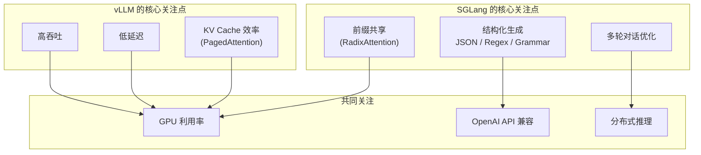
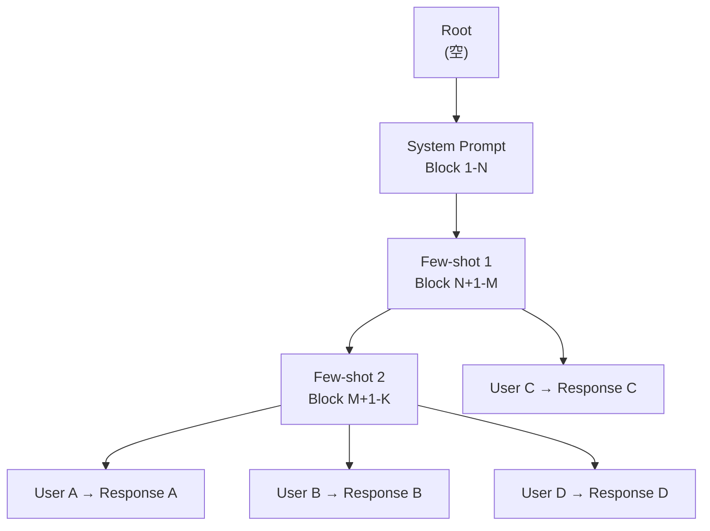
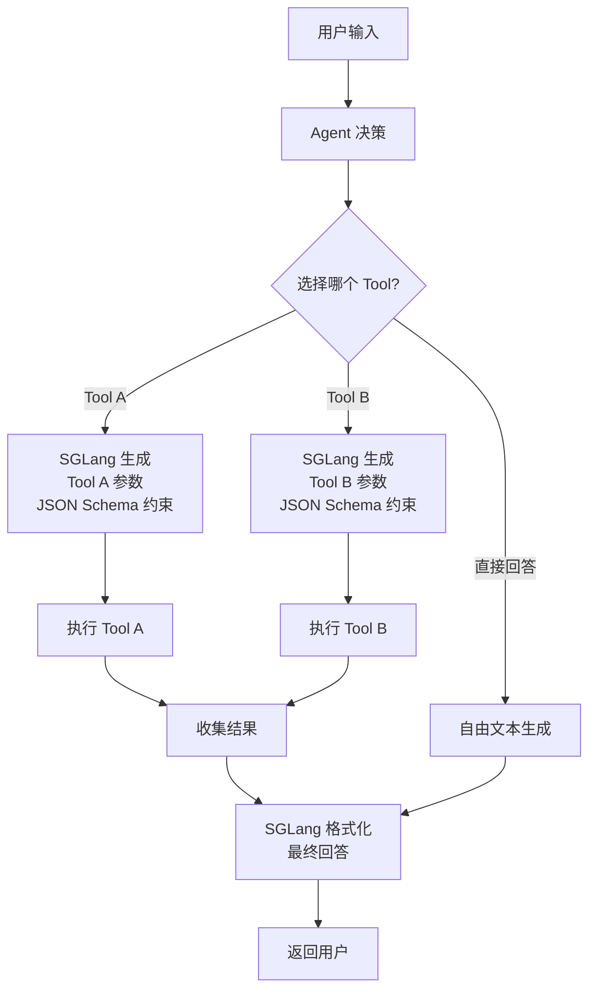

# SGLang 深度解析

> 一句话概括：SGLang 是面向 Agent 和结构化生成场景的推理引擎，其核心创新 RadixAttention 通过前缀树管理 KV Cache，配合 FSM 约束生成，在 Agent 工作流中可实现 2-5x 的性能提升。

## 前置知识

- 理解 Trie（前缀树）数据结构
- 了解有限状态机（FSM）和上下文无关文法（CFG）的基本概念
- 熟悉 JSON Schema 和正则表达式
- 了解 Function Calling / Tool Use 在 LLM 中的工作原理

## SGLang 的定位

SGLang（Structured Generation Language）由 UC Berkeley 和 CMU 联合开发，其设计哲学是：**推理引擎不仅要跑得快，还要理解生成的结构。**



SGLang 的两大核心创新：

1. **RadixAttention**：将 KV Cache 组织成前缀树（Radix Tree），跨请求共享相同前缀的 KV Cache，特别优化了 Agent 场景中大量共享 system prompt 和 few-shot examples 的场景。
2. **结构化生成（Structured Generation）**：使用有限状态机（FSM）在生成过程中约束输出格式，确保输出严格符合 JSON Schema、正则表达式或自定义语法规则。

## RadixAttention 原理

### 问题分析

在 Agent 和多轮对话场景中，大量请求共享相同的前缀：

```
Request 1: [System Prompt] [Few-shot 1] [Few-shot 2] [User Question A]
Request 2: [System Prompt] [Few-shot 1] [Few-shot 2] [User Question B]
Request 3: [System Prompt] [Few-shot 1] [User Question C]
Request 4: [System Prompt] [Few-shot 1] [Few-shot 2] [User Question D]
```

使用传统的 KV Cache 管理（如 vLLM 的 PagedAttention），每个请求独立存储完整的 KV Cache，即使前缀相同也各自计算和存储。

### RadixAttention 的解决方案



**核心机制**：

1. **Trie 结构管理**：KV Cache blocks 被组织成前缀树，每个节点代表一个 token block。相同前缀的请求共享同一个子树。
2. **引用计数**：每个 node 维护一个引用计数（reference count），记录有多少活跃请求使用该 node。
3. **增量计算**：新请求到达时，在 trie 中匹配最长前缀，只对不匹配的后缀部分执行 prefill 计算。
4. **LRU 淘汰**：当显存不足时，淘汰引用计数为 0 且最久未使用的 leaf nodes。

### 定量收益

假设一个典型 Agent 场景：

- System prompt：500 tokens
- Few-shot examples：2000 tokens
- User query：100 tokens
- 并发请求数：64

| 方案 | Prefill 计算量 | KV Cache 占用 |
|------|--------------|-------------|
| 无共享（每个请求独立） | 64 × 2600 = 166,400 tokens | 64 × 2600 blocks |
| RadixAttention | 500 + 2000 + 64 × 100 = 8,900 tokens | ~2600 + 64 × 100 blocks |
| **加速倍数** | **~18x**（前缀计算完全消除） | **~18x**（前缀存储共享） |

实际场景中，由于 trie 管理的 overhead 和部分匹配的不完美，收益约为 **2-5x**。

### RadixAttention vs vLLM Prefix Caching

两者都利用了 prefix 共享，但有本质区别：

| 特性 | vLLM Prefix Caching | SGLang RadixAttention |
|------|-------------------|---------------------|
| **数据结构** | Hash 表（key = block hash） | Radix Tree（前缀树） |
| **匹配策略** | 精确匹配（完全相同的 block） | 最长前缀匹配 |
| **跨请求共享** | 是 | 是（更灵活） |
| **支持部分匹配** | 否（需要 block 级别完全匹配） | 是（匹配到 block 内的任意位置） |
| **淘汰策略** | LRU | 引用计数 + LRU |
| **适用场景** | System prompt 相同 | 任意前缀重叠 |

## 结构化生成

### 为什么需要结构化生成

LLM 的原生输出是自由文本，但在许多场景下我们需要严格格式化的输出：

```python
# 场景 1：Function Calling
# 期望输出严格的 JSON 格式
{
    "name": "search_database",
    "arguments": {
        "query": "latest products",
        "limit": 10
    }
}

# 场景 2：数据抽取
# 从非结构化文本中抽取结构化信息
{
    "person": {"name": "John", "age": 30},
    "company": {"name": "TechCorp", "role": "Engineer"}
}

# 场景 3：代码生成
# 生成语法正确的 Python 代码
def fibonacci(n: int) -> int:
    if n <= 1:
        return n
    return fibonacci(n-1) + fibonacci(n-2)
```

如果没有结构化生成，LLM 可能输出：
- JSON 缺少逗号或括号
- 字段名拼写错误
- 多出解释性文字（"好的，以下是结果：..."）
- Markdown 代码块标记

### FSM 约束生成原理

```mermaid
stateDiagram-v2
    [*] --> Start: 开始生成

    state "JSON Object" as jsonObj {
        Start --> LBrace: 只能输出 "{"
        LBrace --> KeyStart: 输出 key 开始
        KeyStart --> KeyChar: 输出字符
        KeyChar --> KeyChar: 输出字符
        KeyChar --> KeyEnd: 输出 key 结束 "
        KeyEnd --> Colon: 只能输出 ":"
        Colon --> ValueStart: 开始 value

        ValueStart --> StringVal: 字符串值
        ValueStart --> NumVal: 数值
        ValueStart --> BoolVal: true/false
        ValueStart --> NullVal: null
        ValueStart --> NestedObj: 嵌套 "{"

        StringVal --> CommaOrBrace: value 完成
        NumVal --> CommaOrBrace
        BoolVal --> CommaOrBrace
        NullVal --> CommaOrBrace
        NestedObj --> CommaOrBrace

        CommaOrBrace --> KeyStart: "," 继续
        CommaOrBrace --> RBrace: "}" 结束
        RBrace --> [*]
    }

    state "非法 token" as reject {
        note right of reject: 所有不在\nFSM 路径上的\ntoken 被 mask 掉
    }

    LBrace -. 只能输出双引号 .-> KeyStart
    Colon -. 根据 JSON Schema\n确定 value 类型 .-> ValueStart
```

**工作原理**：

1. **Grammar → FSM 编译**：将 JSON Schema / 正则表达式 / CFG 编译为一个有限状态机。每个状态定义了当前允许的 token 集合。
2. **Token Masking**：在每个生成步骤，FSM 根据当前状态确定允许的 token 集合，将不允许的 token 的 logit 设为负无穷（-inf），使采样器永远不会选择这些 token。
3. **状态转移**：采样器选择的 token 驱动 FSM 转移到下一个状态。
4. **终止条件**：当 FSM 到达接受状态（accepting state），生成完成。

### SGLang 支持的约束类型

| 约束类型 | 说明 | 示例 |
|---------|------|------|
| **Regex** | 正则表达式约束 | `r"\d{4}-\d{2}-\d{2}"`（日期格式） |
| **JSON Schema** | JSON 结构约束 | 完整 JSON Schema 定义 |
| **EBNF/CFG** | 上下文无关文法 | SQL、Python 代码语法 |
| **选择列表** | 枚举约束 | `["positive", "negative", "neutral"]` |

### 使用示例

```python
from sglang import function, assistant, user, gen
import sglang as sgl

@sgl.function
def extract_info(s, text):
    s += user(f"从以下文本中提取人物信息，以 JSON 格式返回：\n{text}")
    s += assistant(gen("json_output",
        max_tokens=256,
        regex=r'\{.*\}',  # 确保输出是 JSON
    ))

# 运行时确保输出符合 JSON 格式
result = extract_info.run(
    text="张三，35岁，在TechCorp担任高级工程师。"
)
```

使用 JSON Schema 约束：

```python
import sglang as sgl
from sglang.srt.constrained import build_regex_from_schema

schema = '''
{
    "type": "object",
    "properties": {
        "name": {"type": "string"},
        "age": {"type": "integer"},
        "company": {"type": "string"}
    },
    "required": ["name", "age", "company"]
}
'''

# 编译 schema 为 regex（内部使用 FSM）
regex = build_regex_from_schema(schema)

# 生成时强制遵守 schema
response = sgl.gen(
    prompt="Extract: 张三, 35, TechCorp",
    regex=regex
)
# 保证输出是合法的 JSON: {"name": "张三", "age": 35, "company": "TechCorp"}
```

## SGLang vs vLLM 对比

| 维度 | SGLang | vLLM |
|------|--------|------|
| **核心创新** | RadixAttention + 结构化生成 | PagedAttention + Continuous Batching |
| **KV Cache 策略** | 前缀树（跨请求共享） | 分页（独立管理） |
| **结构化生成** | 原生支持（FSM 级别） | 有限支持（Outlines 集成） |
| **Prefill 优化** | Trie 匹配跳过已计算前缀 | Prefix Caching（block hash 匹配） |
| **多轮对话** | 优秀（天然支持 prefix 共享） | 良好（需启用 prefix caching） |
| **Agent 场景** | 最优（结构化生成 + prefix 共享） | 良好 |
| **纯推理吞吐** | 高（接近 vLLM） | 最高 |
| **API 兼容** | OpenAI 兼容 | OpenAI 兼容 |
| **成熟度** | 快速迭代中 | 生产就绪 |
| **典型用户** | Agent 开发者、RAG 场景 | 通用推理服务 |

**什么时候选 SGLang？**
- 你的应用大量使用 Function Calling / Tool Use
- 多轮对话场景中 system prompt 和 few-shot 相同
- 需要严格的 JSON 输出格式
- Agent 工作流中有大量可复用的中间状态

**什么时候选 vLLM？**
- 通用推理服务（聊天、补全）
- 需要最大的模型覆盖范围
- 生产环境要求最成熟的方案
- 不需要结构化生成

## Function Calling 场景中的应用

在 Agent 场景中，结构化生成是关键基础设施：



**结构化生成在 Function Calling 中的价值**：

1. **参数准确性**：JSON Schema 约束确保生成的参数类型正确（整数不会是字符串，必填字段不会缺失）。
2. **无需后处理**：不需要额外的 JSON 解析和错误修复逻辑。
3. **降低幻觉**：FSM 约束将输出空间缩小到合法格式内，减少无效输出。
4. **降低延迟**：不需要"生成 → 解析 → 重试"循环，一次生成即为合法格式。

## 面试视角

### 为什么结构化生成对 Agent 场景很重要？

**推荐回答**：

"Agent 场景的核心是 LLM 与外部工具/系统的交互，这种交互要求 LLM 的输出是**机器可解析的精确格式**。

没有结构化生成时，LLM 调用工具的典型流程是：
1. 生成工具调用（可能是 JSON，但也可能带有额外文字）。
2. 解析输出。
3. 如果解析失败，重试或 fallback。
4. 执行工具调用。

问题在于第 3 步：LLM 作为概率模型，天然会偶尔输出格式不正确的内容。这会引入额外的延迟（重试）和系统复杂度（错误处理逻辑）。

结构化生成通过 FSM 在 token 级别约束输出，从根本上保证了**100% 的格式正确率**。在 Agent 场景中，这意味着：
- 工具调用零失败（格式层面）。
- 不需要解析重试逻辑。
- 系统可靠性大幅提升。
- 延迟可预测（一次生成即完成）。"

### 追问：FSM 约束生成会带来什么开销？

- **Token Masking 开销**：每个生成步骤需要查询 FSM 状态并 mask 不允许的 token。这涉及查找表和 bitwise 操作，开销约 1-3%。
- **状态转移开销**：每个 token 驱动一次 FSM 状态转移，对于大型 grammar（如复杂 JSON Schema），状态数可能达到几百个。
- **与采样并行化**：token masking 需要在采样之前完成，无法与 GPU 计算 overlap。

总体而言，结构化生成的额外开销在 5% 以内，但换来的是 100% 的格式正确率，这个 trade-off 在 Agent 场景中是非常值得的。

### RadixAttention 的局限性是什么？

1. **管理开销**：维护 trie 结构、引用计数和 LRU 淘汰比简单的 block 分配更复杂。
2. **碎片化**：在 trie 删除操作后可能产生 trie 结构的碎片，需要定期整理。
3. **适用场景有限**：当请求的前缀重叠度低时，RadixAttention 的收益很小。对于完全独立的请求（如随机问答），退化为类似 PagedAttention 的行为。
4. **多轮对话之外的收益**：在非对话场景（如独立查询），prefix 共享的命中率低。

### SGLang 能否替代 vLLM 作为通用推理引擎？

目前还不建议。原因：
- SGLang 的社区成熟度和生产验证程度不如 vLLM。
- 在纯推理吞吐（不涉及结构化生成或前缀共享）场景下，SGLang 的性能与 vLLM 持平或略低。
- vLLM 的模型覆盖范围和硬件支持更全面。

但在 Agent 和结构化输出场景下，SGLang 是更优选择。建议的架构是：

```
通用推理请求 → vLLM 集群
Agent/结构化请求 → SGLang 集群
```

## 最佳实践

### 启动配置

```bash
# SGLang 服务启动（类似 vLLM 的体验）
python -m sglang.launch_server \
  --model-path meta-llama/Llama-3-8B-Instruct \
  --host 0.0.0.0 \
  --port 30000 \
  --mem-fraction-static 0.85 \
  --max-running-requests 256
```

### 性能调优建议

1. **最大化前缀共享**：在 Agent 场景中，将 system prompt 和 few-shot examples 放在请求的最前面，确保 RadixAttention 可以共享。
2. **使用结构化生成**：所有需要机器解析的输出都使用 JSON Schema 或 regex 约束。
3. **监控 trie 命中率**：观察 prefix cache hit rate，如果低于 30%，考虑优化 prompt 设计。
4. **batch 大小**：SGLang 的 `max-running-requests` 类似于 vLLM 的 `max-num-seqs`，根据显存调整。

### 与 vLLM 的选择决策

```
你的场景是什么？
├── 通用推理服务（聊天、补全）
│   └── 选 vLLM
├── Agent / Function Calling
│   └── 选 SGLang
├── 多轮对话 + 相同 system prompt
│   └── 优先 SGLang（RadixAttention 优势大）
├── 需要严格的 JSON / 代码输出
│   └── 选 SGLang
├── 需要最大的模型覆盖
│   └── 选 vLLM
└── 不确定
    └── 先选 vLLM，后续根据需求评估 SGLang
```

---

*下一节：[模型量化](../04-inference-optimization/quantization-basics.md)*
