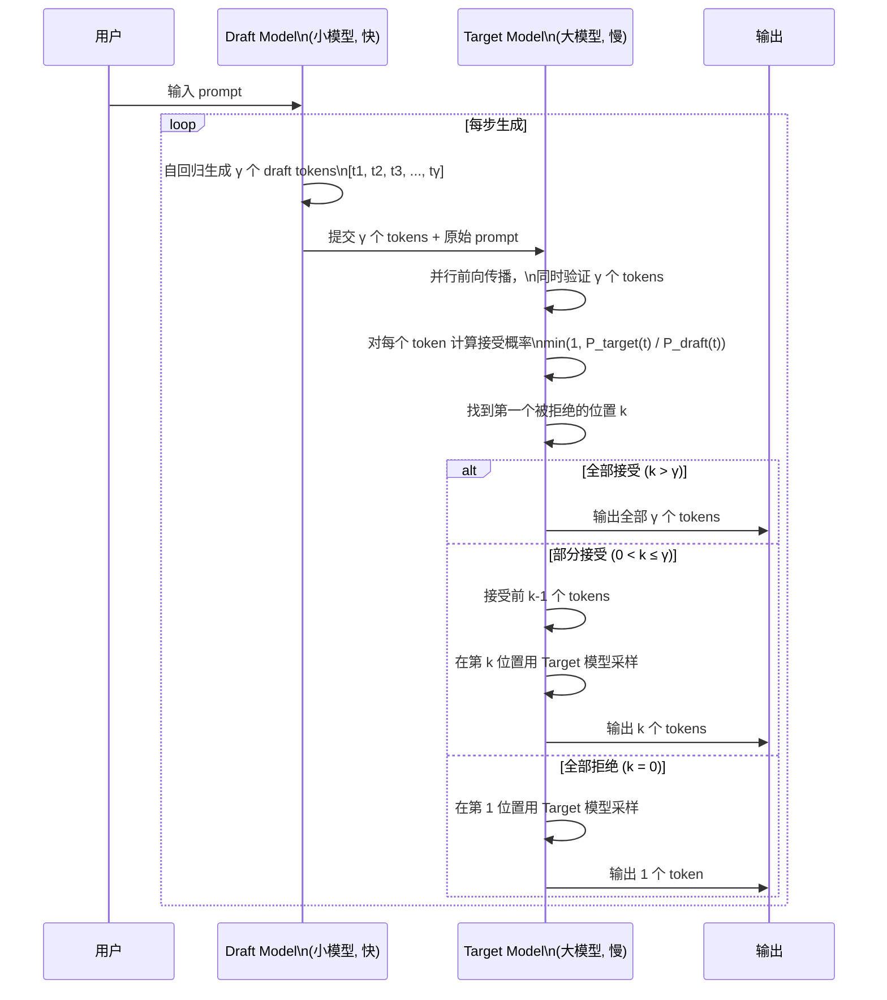
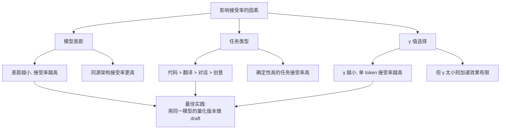
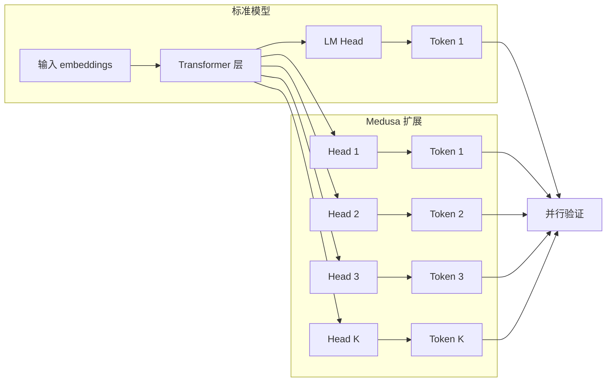

# Speculative Decoding

> 用小模型快速生成 draft tokens，大模型并行验证，在几乎不损失精度的前提下实现 1.5-3x 加速。

## 核心概念：投机解码原理

传统自回归解码每次只能生成一个 token，然后要等大模型做一次前向传播才能生成下一个。Speculative Decoding 的核心洞察是：**大模型的前向传播可以并行验证多个候选 token，而不只验证一个**。



### 算法流程详解

```
1. Draft 阶段：小模型自回归生成 γ 个候选 tokens
   - γ 通常为 3-6（太多接受率低，太少加速效果弱）
   - 小模型可以是：独立小模型 / 同一模型的量化版本 / 训练好的预测头

2. Verify 阶段：大模型并行验证所有 γ 个 tokens
   - 用大模型对 [prompt + draft tokens] 做一次前向传播
   - 对每个 draft token t_i，计算接受概率 α_i = min(1, P_target(t_i) / P_draft(t_i))
   - 从第一个 token 开始，逐个用随机采样决定是否接受

3. 接受/拒绝逻辑
   - 如果 t_i 被接受 → 继续检查 t_{i+1}
   - 如果 t_i 被拒绝 → 停止，在位置 i 用大模型重新采样一个 token
   - 输出被接受的 tokens + 最多一个新采样 token
```

**关键保证：Speculative Decoding 的采样分布与直接运行大模型完全一致（数学上无损）。**

## 加速比分析

### 理论加速比

```
理论加速比 = 1 + γ × 接受率

其中：
  γ = 每次生成的 draft token 数
  接受率 = draft token 被 target 接受的概率
```

| γ 值 | 接受率 50% | 接受率 60% | 接受率 70% | 接受率 80% |
|------|-----------|-----------|-----------|-----------|
| γ=3 | 2.5x | 2.8x | 3.1x | 3.4x |
| γ=5 | 3.5x | 4.0x | 4.5x | 5.0x |
| γ=8 | 5.0x | 5.8x | 6.6x | 7.4x |

### 实际加速比

实际加速比低于理论值，因为 draft model 也需要计算开销：

```
实际加速比 = (接受的 draft tokens 数 + 1) / (1 + draft model 开销比)
```

| 场景 | Draft Model | γ | 接受率 | 实际加速比 |
|------|------------|---|-------|----------|
| 通用文本 | LLaMA-7B → LLaMA-70B | 4 | 60% | ~2.0x |
| 代码生成 | CodeGen-1B → CodeGen-16B | 5 | 75% | ~2.5x |
| 翻译任务 | 3B → 70B | 3 | 80% | ~2.2x |
| 创意写作 | 7B → 70B | 4 | 40% | ~1.5x |

> 接受率越高，加速效果越好。接受率取决于 draft 和 target 模型的差距。

## 接受率分析

### 什么情况下接受率高？



**高接受率场景：**

| 场景 | 原因 | 典型接受率 |
|------|------|----------|
| 代码补全 | 代码有大量重复模式和语法约束 | 70-85% |
| 翻译 | 目标语言输出确定性高 | 65-80% |
| 摘要 | 输出相对可预测 | 60-75% |

**低接受率场景：**

| 场景 | 原因 | 典型接受率 |
|------|------|----------|
| 创意写作 | 多种合理表达，模型间差异大 | 30-50% |
| 开放问答 | 答案多样性高 | 40-55% |
| 数学推理 | 每步推理依赖前一步 | 35-50% |

## Medusa 方案

Medusa 是 Speculative Decoding 的一个变体，**不需要额外的 draft 模型**。



### Medusa vs 标准 Speculative Decoding

| 维度 | 标准 Speculative | Medusa | EAGLE |
|------|-----------------|--------|-------|
| Draft 模型 | 独立小模型 | 无（多头扩展） | 特征层预测 |
| 额外训练 | 不需要（可用任意小模型） | 需要训练 K 个头 | 需要训练预测层 |
| 训练成本 | 低 | 低（~1-2 GPU 天） | 低（~1 GPU 天） |
| 部署复杂度 | 高（需部署两个模型） | 低（单模型） | 低（单模型） |
| 接受率 | 50-70% | 60-75% | 65-80% |
| 加速比 | 1.5-2.5x | 2-3x | 2-3x |

### Medusa 的优势

1. **无需独立小模型**：避免维护两个模型版本
2. **共享计算**：draft 和 target 共享 backbone 计算，减少冗余
3. **训练简单**：只训练额外的 decode head，backbone 冻结
4. **部署轻量**：只需部署一个扩展后的模型

## 部署视角

### vLLM 中的 Speculative Decoding

```python
# vLLM 配置示例
from vllm import LLM

llm = LLM(
    model="meta-llama/Llama-2-70b",  # target model
    speculative_model="meta-llama/Llama-2-7b",  # draft model
    num_speculative_tokens=4,  # γ = 4
    use_v2_block_manager=True,
)

output = llm.generate(prompt, sampling_params)
```

### 调优建议

| 参数 | 默认值 | 调优方向 |
|------|-------|---------|
| num_speculative_tokens (γ) | 4 | 接受率 > 60% 时增大到 5-6 |
| draft model 大小 | 7B (70B target) | 尝试量化版本或同源模型 |
| batch size | 正常 | speculative 下可适当增大 |

## 面试视角

**面试官可能问：**

1. **"Speculative Decoding 为什么能加速？它不会多算一遍吗？"**

   这是最经典的面试问题。核心回答：

   - 传统方法：每生成 1 个 token → 大模型做 1 次前向传播（计算密集）
   - Speculative：生成 γ 个 token → 小模型做 γ 次（快） + 大模型做 1 次并行验证
   - 关键：大模型的 1 次并行验证可以同时检查 γ 个 token，而不是做 γ 次
   - 当接受率 > 50% 且 γ >= 3 时，平均每步产出 > 1 个 token，而大模型计算量不变
   - 因此加速比 = 每步产出 / 大模型前向传播次数 ≈ 1 + γ × 接受率

2. **"Speculative Decoding 会损失精度吗？"**

   不会。Speculative Decoding 的接受概率 α = min(1, P_target/P_draft) 保证了**输出分布与直接运行大模型完全一致**（通过 rejection sampling 保证）。这是一种**无损加速**。

3. **"什么时候不适合用 Speculative Decoding？"**

   - draft model 和大模型太不相似（接受率 < 30%）
   - 生成极短输出（< 20 tokens），overhead 占比过大
   - 资源紧张场景（小模型本身也占 GPU 显存）
   - Prefill 阶段（Speculative 只加速 decode 阶段）

4. **"Medusa 和标准 Speculative Decoding 哪个更好？"**

   - Medusa 优势：部署简单（单模型），共享计算
   - 标准方案优势：不需要训练，可灵活替换 draft model
   - 实际中 Medusa 接受率略高（60-75% vs 50-70%），推荐优先尝试

5. **"Speculative Decoding 的显存开销是多少？"**

   - Draft model 额外占用：7B 模型约 14GB（FP16）或 7GB（INT8）
   - 对于 70B + 7B 组合：70B 占 140GB + 7B 占 14GB = 154GB → 2×H100 80GB 刚好
   - Medusa 方案无额外模型显存，只需额外的 head 权重（~数百 MB）
   - EAGLE 方案类似，特征预测层开销很小

## 适用场景和限制

### 最佳适用场景

| 场景 | 原因 | 推荐配置 |
|------|------|---------|
| 代码补全 | 代码有大量重复模式和语法约束 | γ=5, draft=CodeLLM |
| API 文档生成 | 格式固定，可预测性强 | γ=4-5 |
| 数据提取（JSON/CSV） | 结构化输出，token 序列可预测 | γ=4-6 |
| 翻译 | 目标语言输出确定性高 | γ=3-4 |

### 不适用场景

| 场景 | 原因 | 替代方案 |
|------|------|---------|
| 创意写作 | 多种合理表达，接受率太低 | Early Exit |
| 数学推理 | 每步推理严格依赖前一步 | 无好替代 |
| 极短回复（< 10 tokens） | overhead 占比过大 | 直接 decode |
| 资源受限（单卡 70B） | 无多余显存放 draft model | Medusa / EAGLE |

### 与其他技术的兼容性

```
Speculative Decoding 可与以下技术叠加使用：
  ✅ Continuous Batching：兼容，效果独立
  ✅ PagedAttention：兼容，显存管理无关
  ✅ FP8/INT8 量化：兼容，draft 和 target 可分别量化
  ✅ FlashAttention：兼容，加速预填充阶段

  ⚠️ 多 LoRA：每个请求不同 LoRA 时 draft model 难以匹配
  ❌ 与 Early Exit 互斥：两种方法都试图减少 decode 步数，叠加效果递减
```

## 最佳实践

1. **γ 值从 4 开始调**：太小加速效果弱，太大接受率骤降
2. **优先用同源量化版做 draft**：7B-quantized → 7B 比 7B 不同架构 → 7B 接受率更高
3. **代码场景收益最大**：代码有大量语法约束，接受率可达 75%+
4. **监控实际加速比**：不要假设，要测量实际的 step acceptance rate
5. **结合其他优化**：Speculative Decoding + Continuous Batching 效果叠加

## 部署视角

### 生产环境调优 Checklist

- [ ] 选择 draft model：优先选同源架构的小模型
- [ ] 设置 γ = 4（默认起点）
- [ ] 跑 100 个真实请求，统计实际接受率
- [ ] 接受率 > 60% → γ 加到 5-6；接受率 < 40% → 换 draft model 或 γ 减到 2-3
- [ ] 压测端到端 QPS 和 P99 延迟
- [ ] 监控 step acceptance rate 分布（不同 prompt 类型接受率可能差异很大）

---

*下一节：[FP8 推理](./fp8-inference.md)*
