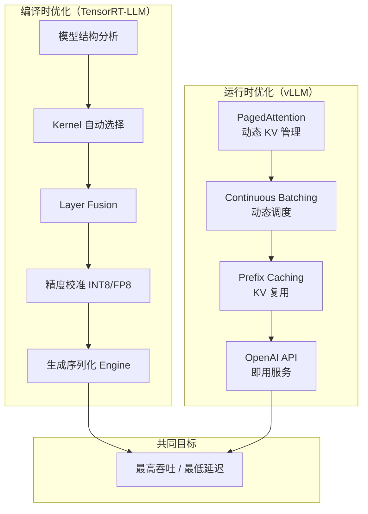
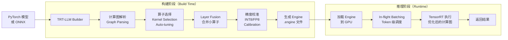
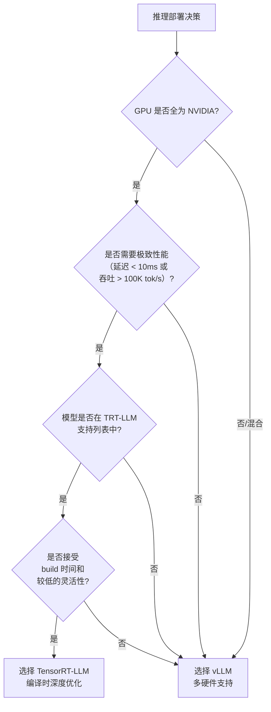

# TensorRT-LLM 深度解析

> 一句话概括：TensorRT-LLM 是 NVIDIA 官方的 LLM 推理加速库，通过编译时深度优化（kernel fusion、precision calibration）在 NVIDIA GPU 上提供业界最高的推理性能。

## 前置知识

- 理解计算图和计算图优化的基本概念
- 了解 TensorRT 的基本工作原理（ONNX → Engine → Runtime）
- 了解 kernel fusion 和 operator fusion 的概念
- 了解 INT8/FP8 量化的基本原理

## TRT-LLM vs vLLM 的定位差异

这是面试中经常被问到的问题。理解两者的定位差异是选择的基础：



| 维度 | TensorRT-LLM | vLLM |
|------|-------------|------|
| **优化时机** | **编译时**：构建 engine 时深度优化 | **运行时**：服务启动时加载，动态优化 |
| **优化方式** | 静态计算图分析 + kernel 选择 + fusion | KV Cache 管理 + 调度策略 |
| **Kernel 策略** | 自动搜索最优 kernel 配置（AutoTVM 思路） | 使用优化的 custom kernel（PagedAttention） |
| **灵活性** | 低：修改模型需要重新 build | 高：支持任意 HuggingFace 模型 |
| **构建时间** | 几分钟到几十分钟 | 即时启动 |
| **量化流程** | 自动校准（calibration） | 加载预量化权重（AWQ/GPTQ checkpoint） |

**一句话总结**：TRT-LLM 是**编译器思路**——花时间在构建阶段找到最优执行方案；vLLM 是**运行时思路**——在请求处理过程中动态优化资源分配。

## TRT-LLM 编译优化管线



### 构建阶段详解

**1. 计算图解析**

TRT-LLM 将 PyTorch 模型转换为内部计算图表示，识别每个 layer 的类型（Attention、MLP、Normalization 等）和依赖关系。

**2. 算子选择（Kernel Selection / Auto-tuning）**

对于每个算子，TRT-LLM 从 kernel 库中选择最优实现。选择依据包括：

- GPU 架构（Ampere A100 vs Hopper H100 vs Ada L40）
- Tensor shape（batch size、sequence length、hidden size）
- 精度（FP16 vs BF16 vs FP8 vs INT8）

对于关键算子（如 GEMM），TRT-LLM 会在构建阶段进行**微基准测试（micro-benchmark）**，测量不同 kernel 配置的实际性能，选择最快的一个。

**3. Layer Fusion**

将多个连续的小算子合并为一个大 kernel，减少 kernel launch overhead 和中间数据的显存读写。典型融合：

```
原始计算图:                Fusion 后:
  Input                      Input
    │                          │
  ┌─┴─┐                      ┌─┴──────────┐
  │Add│                      │            │
  └─┬─┘                      │ Fused      │
    │    ┌─────┐             │ Kernel     │
  ┌─┴─┐  │     │             │ (Add+Norm  │
  │Mul│  │Bias │    ──→      │ +Bias+...+ │
  └─┬─┘  │     │             │  GELU)     │
    │    └─────┘             │            │
  ┌─┴──────────┐             └─┬──────────┘
  │LayerNorm   │               │
  └─┬──────────┘             Output
    │
  ┌─┴─┐
  │GELU│
  └────┘
```

**4. 精度校准（INT8 Calibration）**

TRT-LLM 使用**校准数据集（calibration dataset）**来自动确定 INT8 量化的缩放因子（scale）和零点（zero point）：

- 通过 calibration dataset 收集每层激活的分布（直方图）。
- 使用 KL 散度最小化原则选择最优的量化阈值。
- 生成 per-tensor 或 per-channel 的量化参数。

相比加载预量化权重，TRT-LLM 的自动校准优势在于：可以对未量化的原始 FP32/BF16 模型直接生成 INT8/FP8 engine。

### 推理阶段详解

**In-flight Batching**

与 vLLM 的 Continuous Batching 类似但实现不同：

- vLLM 在**序列级别**调度：当某个 sequence 完成时，从队列取新 sequence 填入 batch。
- TRT-LLM 的 In-flight Batching 在**token 级别**管理：每个 token 位置独立跟踪，可以更细粒度地利用 batch slot。

实际效果上两者相似，但 TRT-LLM 的实现由于是静态计算图，batch 管理的开销更小。

**Tensor Parallelism**

TRT-LLM 支持动态 Tensor Parallelism：

- 将模型的大矩阵按行或列切分到多个 GPU。
- Attention 层的 QKV 矩阵按列切分，MLP 层的 up_proj 按列切分、down_proj 按行切分。
- 跨 GPU 通信通过 NCCL AllReduce 实现。

## TRT-LLM 核心特性

### Kernel Fusion 详解

TRT-LLM 的 fusion 策略分为几个层次：

1. **Element-wise Fusion**：将连续的 element-wise 操作（Add、Mul、GELU 等）融合为一个 kernel。
2. **Reduction Fusion**：将 element-wise 操作后接 reduction（如 LayerNorm）融合。
3. **Attention Fusion**：将 Attention 的 QKV 投影、softmax、output 投影融合为单个 kernel。
4. **全层 Fusion**：在理想情况下，可以将整个 Transformer block 融合为一个 kernel。

Fusion 的收益：
- 减少 kernel launch 次数（从几十次减少到几次）。
- 减少中间数据的全局显存读写。
- 提升 L2 Cache 命中率。

在 A100 上，kernel fusion 可以带来 **1.3-1.5x** 的加速。

### Dynamic Tensor Parallelism

TRT-LLM 支持在运行时调整 TP 策略：

```
单 GPU (TP=1):    [完整模型]
双 GPU (TP=2):    [模型前半] <--NCCL--> [模型后半]
四 GPU (TP=4):    [1/4] <--NCCL--> [1/4] <--NCCL--> [1/4] <--NCCL--> [1/4]
```

关键设计：
- 切分策略在 build 时确定，但可以在不同 deployment 配置中灵活调整。
- 通信开销通过 overlapping computation 和 communication 来隐藏。

## TRT-LLM 构建流程

### 完整构建步骤

**Step 1：安装与准备**

```bash
pip install tensorrt_llm
# 或使用 NVIDIA NGC 容器
docker pull nvcr.io/nvidia/tritonserver:24.01-trtllm-python-py3
```

**Step 2：构建 Engine**

```bash
# 以 Llama-3-8B 为例
cd /usr/local/bin
python build.py \
  --model_dir /path/to/Llama-3-8B-Instruct \
  --dtype bfloat16 \
  --use_inflight_batching \
  --world_size 1 \
  --tp_size 1 \
  --pp_size 1 \
  --max_batch_size 256 \
  --max_input_len 4096 \
  --max_output_len 2048 \
  --output_dir ./llama3_trt \
  --remove_input_padding
```

**Step 3：序列化与部署**

```python
import tensorrt_llm
from tensorrt_llm.runtime import ModelRunner

# 加载 engine
runner = ModelRunner.from_dir(
    engine_dir="./llama3_trt",
    rank=0,
)

# 推理
output_ids = runner.generate(
    input_ids=prompt_ids,
    max_new_tokens=128,
    temperature=0.7,
)
```

### 关键构建参数

| 参数 | 说明 | 推荐值 |
|------|------|--------|
| `--dtype` | 计算精度（float16/bfloat16/float32） | bfloat16（A100/H100）或 float16 |
| `--use_inflight_batching` | 启用动态 batch | 生产环境必开 |
| `--tp_size` | Tensor Parallelism 大小 | 8B 模型: 1; 70B 模型: 4-8 |
| `--max_batch_size` | 最大 batch size | 根据显存设置，通常 128-512 |
| `--max_input_len` | 最大输入长度 | 根据业务需求，通常 4096 |
| `--max_output_len` | 最大输出长度 | 根据业务需求，通常 512-2048 |
| `--remove_input_padding` | 移除输入 padding | 开启可提升吞吐 10-20% |
| `--int8_mode` | INT8 量化模式 | 1 (per-tensor) 或 2 (per-channel) |
| `--fp8` | 启用 FP8 (H100+) | H100 上必开 |

## 支持模型列表

NVIDIA 持续扩展 TRT-LLM 的模型支持范围。截至 2026 年中，主要支持：

| 模型族 | 具体模型 | 备注 |
|--------|---------|------|
| **Llama** | Llama-2/3/3.1/4 (7B-405B) | 主力支持，优化最好 |
| **Mistral** | Mistral-7B, Mixtral 8x7B/8x22B, Mistral Large | MoE 支持 |
| **Qwen** | Qwen2/2.5/3 (7B-72B) | 中文模型 |
| **DeepSeek** | DeepSeek-V3 (MoE) | 671B 参数 MoE |
| **Gemma** | Gemma-2B/7B/27B | Google 模型 |
| **Phi** | Phi-3/Phi-4 | 小模型场景 |
| **Claude** | 部分支持（需 API） | 有限支持 |

**注意**：TRT-LLM 的模型支持需要针对每种架构编写优化代码，所以覆盖率不如 vLLM。部署新模型前，先查阅 TRT-LLM 的 [GitHub 支持列表](https://github.com/NVIDIA/TensorRT-LLM)。

## 部署场景选择

### 什么时候用 TRT-LLM 而不是 vLLM？



**选择 TRT-LLM 的场景**：
1. **性能敏感型**：延迟要求极严格（如实时翻译、对话机器人），且 GPU 全是 NVIDIA。
2. **单一模型大规模部署**：部署的模型固定，不需要频繁切换或更新模型。
3. **量化需求**：需要在 FP32/BF16 模型上直接做 INT8/FP8 量化（无需预先训练的量化权重）。
4. **MoE 模型**：Mixtral 等 MoE 模型在 TRT-LLM 上有专门的专家路由优化。

**选择 vLLM 的场景**：
1. **需要快速迭代**：经常更新或切换模型。
2. **多模型/多租户**：需要同时服务多种模型。
3. **非 NVIDIA 硬件**：使用 AMD、Intel GPU 或 CPU 推理。
4. **生态需求**：需要 OpenAI API 兼容、丰富的工具集成。

## 面试视角

### TRT-LLM 为什么在某些场景下比 vLLM 快？

**推荐回答**：

"TRT-LLM 在 NVIDIA GPU 上通常比 vLLM 快 20%-100%，主要原因有三：

1. **编译时 kernel 选择**：TRT-LLM 在构建阶段会对关键算子（如 GEMM）进行 micro-benchmark，为当前 GPU 和输入 shape 选择最快的 kernel 配置。而 vLLM 使用固定的 custom kernel，无法针对具体硬件微调。

2. **更激进的 kernel fusion**：TRT-LLM 可以将多个连续的 layer（如 LayerNorm + Linear + GELU）融合为单个 kernel，减少了 kernel launch overhead（在 decode 阶段，每个 step 都要 launch 所有 kernel，launch overhead 占比更高）和中间数据的显存读写。

3. **静态计算图优化**：TRT-LLM 知道完整的计算图，可以进行跨层优化（如常量折叠、算子重排），而 vLLM 的 PyTorch 后端在 eager mode 下只能逐算子执行。

但需要注意的是，这些优势的前提是：模型在 TRT-LLM 支持列表中、build 时间可以接受、不需要频繁切换模型。"

### 追问：TRT-LLM 的缺点是什么？

- **模型覆盖率低**：每种模型架构需要专门的支持代码，新模型可能无法使用。
- **build 时间长**：大型模型的构建可能需要 10-30 分钟，不适合快速迭代。
- **灵活性差**：修改模型（如调整 layer 数、hidden size）需要重新 build。
- **仅支持 NVIDIA**：无法在 AMD、Intel GPU 或 CPU 上运行。

### 什么是 In-flight Batching？和 Continuous Batching 的区别？

两者本质上做的是同一件事——不等整个 batch 完成就动态替换已完成的请求。区别在于实现层次：

- **vLLM 的 Continuous Batching**：在**请求/序列级别**管理。当某个请求的所有 token 都生成完毕后，释放其 KV Cache 并从队列取新请求。
- **TRT-LLM 的 In-flight Batching**：在**token 级别**管理。每个 batch position 独立跟踪，可以更细粒度地填充。

实际效果上差异不大，但 TRT-LLM 的 token 级管理在 batch 利用率上略高 5-10%。

### TRT-LLM 的 INT8 量化是如何做到无损的？

TRT-LLM 使用**校准（calibration）**方法：

1. 用一个代表性数据集（通常 512-1024 条样本）跑前向传播。
2. 收集每层激活值的分布直方图。
3. 使用 KL 散度最小化原则，找到最优的量化阈值（threshold），使得量化前后的分布差异最小。
4. 对 GEMM 的权重使用 per-channel 量化，对激活使用 per-tensor 量化。

这种方法比训练后量化（PTQ）更精确，因为它考虑了实际的激活分布，而非简单的 min-max 映射。在 Llama-2-7B 上，INT8 量化通常只带来 < 0.5% 的精度损失，但推理速度提升 1.5-2x。

## 最佳实践

### TRT-LLM + Triton Inference Server 部署

NVIDIA 推荐的生产部署方式是将 TRT-LLM 集成到 Triton Inference Server：

```
Client → Triton Inference Server → TRT-LLM Backend → GPU
```

优势：
- Triton 提供 gRPC、HTTP、Streaming 多种协议。
- 支持动态 batching、模型版本管理、并发模型。
- 内置 Prometheus metrics 和日志。
- 支持 multi-model serving（同时部署多个模型）。

### 性能优化 checklist

1. **使用 `--remove_input_padding`**：对变长输入序列去除 padding，提升 10-20% 吞吐。
2. **开启 In-flight Batching**：生产环境必开。
3. **根据 GPU 选择精度**：A100 用 BF16，H100 用 FP8。
4. **调整 max_batch_size**：不要设得过大（超过 GPU 能实际处理的值会浪费显存）。
5. **使用 Triton**：而不是直接调用 TRT-LLM Python API，Triton 提供了更好的服务化能力。

---

*下一节：[SGLang 深度解析](./sglang-deep-dive.md)*
