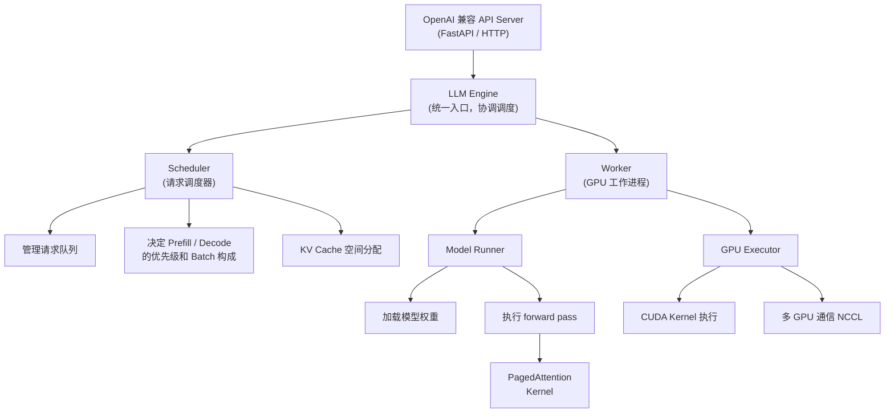
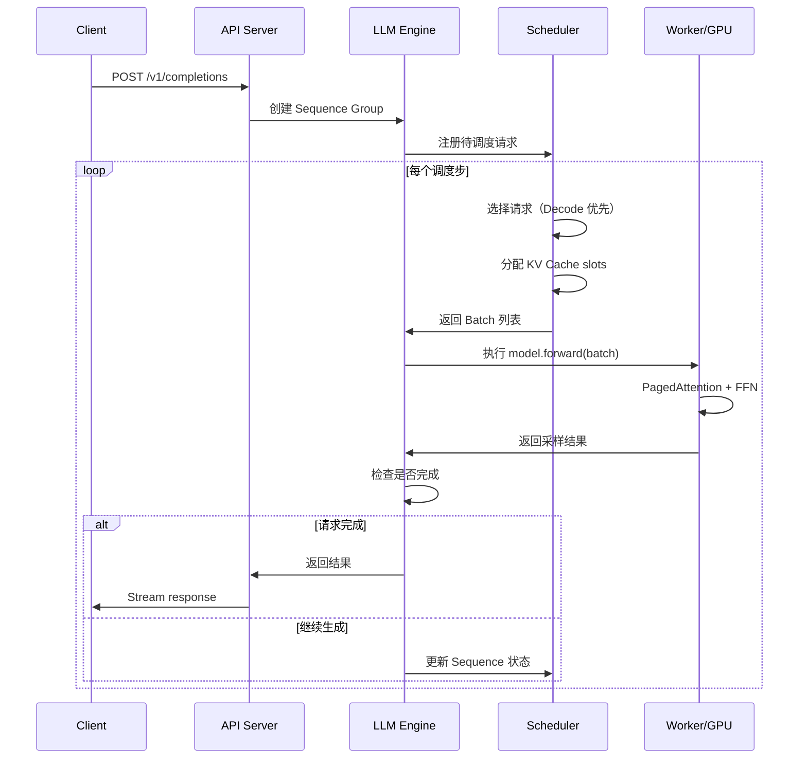
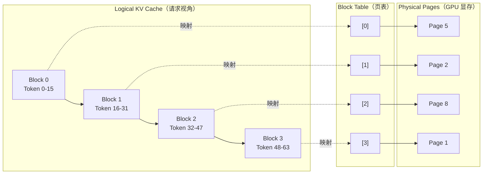
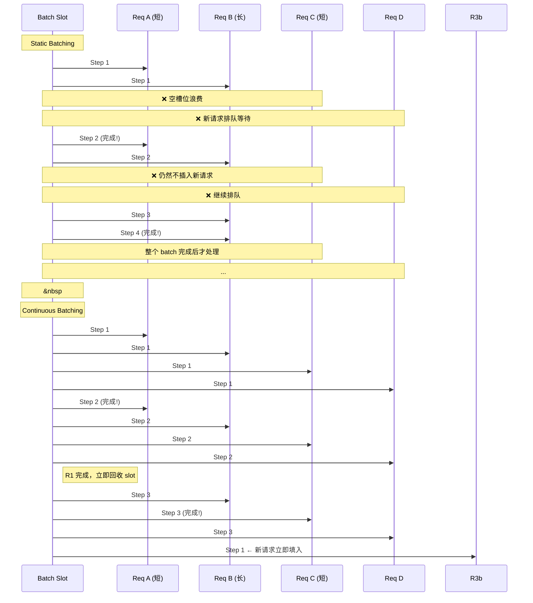
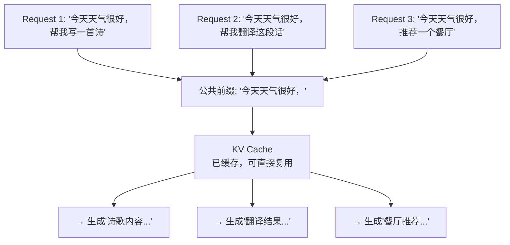

# vLLM 深度解析

> 一句话概括：vLLM 是目前生态最成熟、使用最广泛的开源 LLM 推理引擎，其核心创新 PagedAttention 将显存利用率从 ~60% 提升到 ~95%。

## 前置知识

- 理解 KV Cache 的概念及其在自回归生成中的作用
- 了解操作系统虚拟内存和分页管理的基本思想
- 熟悉 Python 异步编程和 HTTP 服务的基本概念

## vLLM 架构概览

vLLM 的整体架构由四个核心组件组成，采用分层设计：



- **API Server**：提供 OpenAI 兼容的 REST API，处理 HTTP 请求和流式响应。
- **LLM Engine**：核心协调器，接收请求、管理异步任务、协调 Scheduler 和 Worker。
- **Scheduler**：调度器，决定哪些请求进入 batch。采用**优先级调度策略**：decode 阶段的请求优先（因为已经投入了计算资源），prefill 阶段的请求在有空闲 KV 空间时插入。
- **Worker**：每个 Worker 对应一个 GPU，负责加载模型权重和执行 forward pass。多 GPU 场景下通过 NCCL 进行通信。

### 请求处理流程



## PagedAttention 详细原理

### 问题背景

在自回归生成中，KV Cache 的大小与 sequence length 成正比。不同请求的 sequence length 差异很大（从几十到上万 token），导致：

- **静态分配**：按最大可能长度预分配，显存浪费严重。
- **动态分配**：按需分配，但会产生显存碎片，利用率仅 ~60%。

### 核心思想：虚拟内存分页

PagedAttention 借鉴操作系统虚拟内存思想，将 KV Cache 分页管理：



**关键设计**：

1. **固定大小的 Block**：每个 Block 存储固定数量 token 的 KV Cache（默认 16 tokens）。无论请求的实际长度如何，都按 Block 粒度分配。
2. **Block Table**：每个 sequence 维护一个 Block Table，记录 logical block index 到 physical page 的映射。
3. **非连续 KV Cache 访问**：Attention 计算时，PagedAttention kernel 通过 Block Table 进行间接寻址，从物理上不连续的 page 中读取 KV。
4. **按需分配**：只在需要时分配新的 physical page，避免了预分配浪费。

### Block Table 的工作示例

假设 Block size = 4 tokens，一个长度为 10 的 sequence：

```
Logical KV:  [T0 T1 T2 T3] [T4 T5 T6 T7] [T8 T9 _  _ ]
Block Index:      0              1              2

Block Table:  [0 → Page 7]  [1 → Page 3]  [2 → Page 12]

Physical Pages:
  Page 3:  [T4 T5 T6 T7]    ← 物理上不连续
  Page 7:  [T0 T1 T2 T3]
  Page 12: [T8 T9 _  _ ]
```

**显存利用率提升的定量分析**：假设 100 个请求的平均长度为 500 token，最大长度为 4096：

- 传统静态分配：100 × 4096 tokens 的 KV = 全部预分配，实际只用了 12.2%。
- 动态分配（有碎片）：100 × 500 tokens 的 KV + 20-40% 碎片 = 利用率 ~60%。
- PagedAttention：100 × 500 tokens 的 KV + 最后一 block 的浪费（最多 15 token）= 利用率 ~95%。

### PagedAttention 的 Kernel 实现

vLLM 的 PagedAttention kernel 使用 CUDA C++ 编写，核心优化包括：

- **合并内存访问**：将多个 Block Table 的查找合并为一次 coalesced memory access。
- **共享内存缓存**：将频繁访问的 KV 数据加载到共享内存，减少全局内存访问延迟。
- **Warp-level 并行**：每个 warp 处理一个或多个 token 的 attention 计算。

## Continuous Batching 详细原理

### Static Batching vs Continuous Batching



**定量对比**（以 Llama-2-7B 在 A100 上为例，mixed-length requests）：

| 指标 | Static Batching | Continuous Batching | 提升倍数 |
|------|----------------|--------------------|--------|
| 吞吐（req/s） | ~10 | ~40 | **4x** |
| GPU 利用率 | ~55% | ~85% | **1.5x** |
| 平均延迟 | 高（被长请求阻塞） | 低（短请求优先返回） | **2-3x** |
| P99 延迟 | 很高 | 中等 | **3-5x** |

### Continuous Batching 的调度策略

vLLM 的 Scheduler 采用以下策略：

1. **Decode 优先**：已经处于 decode 阶段的请求优先调度，避免浪费已分配的 KV Cache。
2. **Prefill 机会性调度**：在 decode 请求不占满 batch 时，插入 prefill 请求。
3. **Chunked Prefill**：当单个 prefill 请求过长时，将其拆分为多个 chunk，避免长时间占用 GPU。
4. **内存水位线**：当 KV Cache 使用超过阈值时，停止接受新的 prefill 请求，优先完成已有 decode。

## Prefix Caching 机制

vLLM 的 prefix caching 利用 KV Cache 的复用，加速具有相同前缀的请求。



**工作原理**：

1. **Block Hash**：vLLM 对每个 Block 的 token sequence 计算 hash 值。
2. **Cache Lookup**：新请求到达时，逐 block 匹配 hash，找到最长前缀匹配。
3. **KV 复用**：匹配到的 prefix blocks 直接复用已有 KV Cache，跳过 prefill 计算。
4. **LRU 淘汰**：当 cache 空间不足时，按 LRU 策略淘汰最久未使用的 blocks。

**启用方式**：`--enable-prefix-caching`

**适用场景**：
- System prompt 相同的批量请求（如所有请求都带有相同的 instruction）
- Few-shot 示例相同的多轮对话
- RAG 场景中相同检索模板的请求

**性能影响**：对于 prefix 命中率 80% 的场景，TTFT 可降低 60-80%。

## 关键参数详解

### 启动参数完整参考

```bash
vllm serve meta-llama/Llama-3-8B-Instruct \
  --host 0.0.0.0 \
  --port 8000 \
  --tensor-parallel-size 1 \
  --max-num-seqs 256 \
  --gpu-memory-utilization 0.9 \
  --swap-space 16 \
  --enable-prefix-caching \
  --max-model-len 8192 \
  --quantization fp8 \
  --max-num-batched-tokens 8192 \
  --disable-log-requests
```

### 参数逐项解释

| 参数 | 默认值 | 说明 | 调优建议 |
|------|--------|------|---------|
| `--tensor-parallel-size` | 1 | Tensor Parallelism 的 GPU 数量 | 大模型（>30B）设为 2-8；小模型保持 1 |
| `--max-num-seqs` | 256 | 每个调度步的最大并发序列数 | A100-80G 可设 256-512；显存不足时降低 |
| `--gpu-memory-utilization` | 0.9 | 用于 KV Cache 的 GPU 显存比例 | 0.9 是安全值；独占 GPU 可设 0.95；多进程共享需降低 |
| `--swap-space` | 4 | CPU 交换空间大小（GB） | 设为 16-32 可处理突发流量；但不建议依赖 swap（延迟高） |
| `--enable-prefix-caching` | 关闭 | 启用 prefix cache | prefix 命中率高时必开；否则有 2-5% 的 hash 计算开销 |
| `--max-model-len` | 模型默认 | 最大支持的序列长度 | 根据业务需求设置；过大会减少可并发请求数 |
| `--quantization` | None | 量化方案（awq/gptq/fp8/squeeze_llm） | FP8 在 H100 上有 1.5-2x 加速；AWQ 在 A100 上效果好 |
| `--max-num-batched-tokens` | 自动 | 每个 batch 的最大 token 数 | 控制 prefill 阶段的显存占用；设为 max_model_len × max_num_seqs |
| `--enforce-eager` | False | 禁用 torch.compile | 仅用于调试；生产环境不要开启 |
| `--disable-log-requests` | False | 禁用请求日志 | 高 QPS 场景建议开启，减少 I/O 开销 |

### `max_num_seqs` 的深层影响

这个参数决定了 vLLM 的调度粒度：

- **过小**（如 16）：GPU 利用率低，吞吐受限。适合低 QPS、低延迟场景。
- **适中**（如 128-256）：平衡吞吐和延迟。大多数场景的推荐值。
- **过大**（如 512+）：吞吐最高，但 TTFT 和 TPOT 都会增加。适合离线批量推理。

### `gpu_memory_utilization` 的计算

```
总可用显存 = GPU 总显存 × gpu_memory_utilization
模型权重占用的显存 = 参数量 × 精度字节数
KV Cache 可用显存 = 总可用显存 - 模型权重显存 - 激活显存

KV Cache 可存储的 token 数 = KV Cache 可用显存 / (每 token KV 字节数)
每 token KV 字节数 = num_layers × 2 × hidden_size × precision_bytes
```

以 Llama-3-8B（32 layers, hidden_size=4096, BF16）在 A100-80G 上为例：

```
模型权重 = 8B × 2 bytes = 16 GB
可用显存 = 80 GB × 0.9 = 72 GB
KV Cache 预算 = 72 - 16 - ~4（激活）= ~52 GB
每 token KV = 32 × 2 × 4096 × 2 bytes = ~512 KB
最大 token 数 ≈ 52 GB / 512 KB ≈ 100,000 tokens
```

## vLLM OpenAI API 兼容模式详解

vLLM 内置与 OpenAI API 完全兼容的 HTTP 服务器，无需额外代码即可替换 OpenAI 端点：

```bash
vllm serve meta-llama/Llama-3-8B-Instruct \
  --api-key sk-my-key \
  --port 8000
```

客户端代码（无需修改）：

```python
from openai import OpenAI

client = OpenAI(
    base_url="http://localhost:8000/v1",
    api_key="sk-my-key"
)

response = client.chat.completions.create(
    model="meta-llama/Llama-3-8B-Instruct",
    messages=[{"role": "user", "content": "Hello!"}],
    max_tokens=100,
    temperature=0.7,
    stream=True  # 流式响应也支持
)

for chunk in response:
    print(chunk.choices[0].delta.content or "", end="")
```

**支持的 API 端点**：
- `POST /v1/completions` — 文本补全
- `POST /v1/chat/completions` — 聊天补全（含 system/user/assistant 角色）
- `POST /v1/embeddings` — Embedding 生成（支持 embedding 模型时）
- `GET /v1/models` — 列出可用模型
- `POST /v1/audio/transcriptions` — 音频转录（多模态场景）

**与 OpenAI 的差异**：
- 部分高级参数（如 `logit_bias`、`response_format` 中的 JSON Schema）支持有限
- `seed` 参数支持确定性生成
- 不支持 function calling 的原生实现（需要 SGLang 或其他方案）

## 生产环境最佳实践

### 启动配置模板

```bash
# 生产环境推荐配置（Llama-3-8B, A100-80G, 高 QPS 场景）
vllm serve meta-llama/Llama-3-8B-Instruct \
  --host 0.0.0.0 \
  --port 8000 \
  --tensor-parallel-size 1 \
  --max-num-seqs 256 \
  --gpu-memory-utilization 0.9 \
  --swap-space 16 \
  --enable-prefix-caching \
  --max-model-len 4096 \
  --disable-log-requests \
  --log-stats
```

### 监控指标

vLLM 内置 Prometheus 兼容的 metrics 端点（`GET /metrics`）：

```
# 关键指标
vllm:num_requests_running      # 当前运行请求数
vllm:num_requests_waiting      # 等待队列中的请求数
vllm:gpu_cache_usage_perc      # GPU KV Cache 使用率
vllm:cpu_cache_usage_perc      # CPU KV Cache 使用率
vllm:prompt_tokens_total       # 累计 prompt token 数
vllm:generation_tokens_total   # 累计生成 token 数
vllm:time_to_first_token_seconds    # TTFT 分布
vllm:time_per_output_token_seconds  # TPOT 分布
vllm:e2e_request_latency_seconds    # 端到端延迟分布
```

推荐配置 Grafana 告警：
- KV Cache 使用率 > 90% 持续 5 分钟 → 扩容
- P99 TTFT > 1 秒 → 检查排队队列
- GPU 利用率 < 50% → 可能是 batch size 过小或模型加载问题

### 常见问题排查

| 问题 | 可能原因 | 排查方法 |
|------|---------|---------|
| OOM | KV Cache 超出显存 | 降低 `gpu_memory_utilization` 或 `max-num-seqs` |
| 高 TTFT | Prefill 排队严重 | 检查 `num_requests_waiting`；考虑 chunked prefill |
| 高 TPOT | Decode batch 太大 | 降低 `max-num-seqs`；检查 GPU 利用率 |
| 请求超时 | Sequence 过长 | 设置合理的 `max-model-len` |
| 显存泄漏 | 旧版本 bug | 升级到最新稳定版；检查 swap 使用 |
| 模型不兼容 | 架构不在 supported list | 查阅 vLLM 文档；考虑使用 transformers 后端 |

### 性能调优 checklist

1. **GPU 独占运行**：确保没有其他进程抢占 GPU。
2. **使用 FP8/INT8 量化**：在 H100 上 FP8 可获得 1.5-2x 加速。
3. **调整 batch size**：根据 QPS 需求调整 `max-num-seqs`。
4. **启用 prefix caching**：如果请求有共同前缀。
5. **多实例部署**：单实例 GPU 利用率饱和后，启动多实例 + Load Balancer。
6. **关闭不必要的日志**：高 QPS 场景 `--disable-log-requests` 可减少 5-10% 开销。

## 面试视角

### PagedAttention 如何解决碎片问题？

**推荐回答**：

"传统的 KV Cache 管理方式面临两个问题：静态预分配浪费大量显存（因为大多数请求远短于最大长度），动态分配则会产生显存碎片（因为 sequence 长度不可预测，分配和释放的时间点不一致）。

PagedAttention 的解决方案是引入操作系统的分页思想：

1. 将 KV Cache 划分为固定大小的 Block，每个 Block 存储固定数量（如 16 个）token 的 KV。
2. 每个 sequence 通过 Block Table 映射 logical block 到 physical page。
3. Physical page 可以非连续分配，消除了碎片问题。
4. 唯一浪费的空间是 sequence 最后一个 Block 中未填满的部分，最多浪费 (block_size - 1) 个 token 的空间。

效果：显存利用率从 ~60% 提升到 ~95%，间接使吞吐提升了 2-4 倍，因为更多的请求可以同时存放在显存中。"

### 追问：PagedAttention 会带来什么开销？

- **间接寻址开销**：Attention kernel 需要通过 Block Table 进行间接内存访问。vLLM 通过 CUDA kernel 优化（合并访问、共享内存缓存）将此开销控制在 2-5% 以内。
- **Block Table 存储**：每个 sequence 需要维护 Block Table，但对于长序列来说这个 overhead 很小。

### Continuous Batching 的核心挑战是什么？

Continuous Batching 面临的核心挑战是**异构序列长度的调度和 KV Cache 管理**：

1. 不同 sequence 在每一步的 token 数量不同（有的生成了 `<eos>`，有的还在生成），batch 大小动态变化。
2. KV Cache 需要精确跟踪每个 sequence 的已使用 block 数。
3. Prefill 和 decode 阶段的计算特性不同，需要权衡两者的调度比例。
4. 多 GPU 场景下，跨 GPU 的 KV Cache 管理更加复杂。

### vLLM 的调度器为什么让 Decode 优先？

Decode 请求已经投入了计算资源（KV Cache 已分配），如果不继续处理会造成资源浪费。而 Prefill 请求还没有开始消耗 GPU 计算资源，可以等待。这种策略保证了**已完成的投资不被浪费**，提高了整体效率。

---

*下一节：[TensorRT-LLM 深度解析](./trt-llm-deep-dive.md)*
