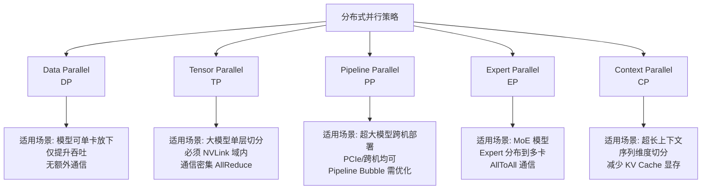
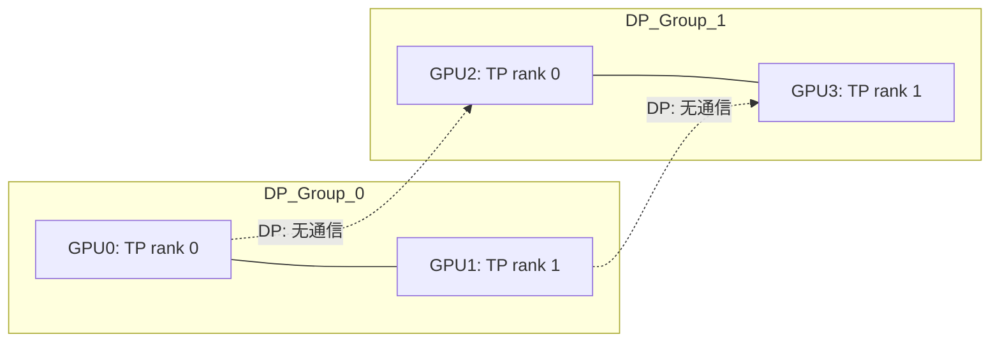
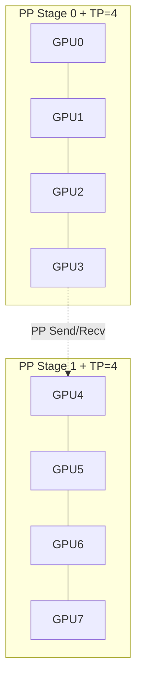
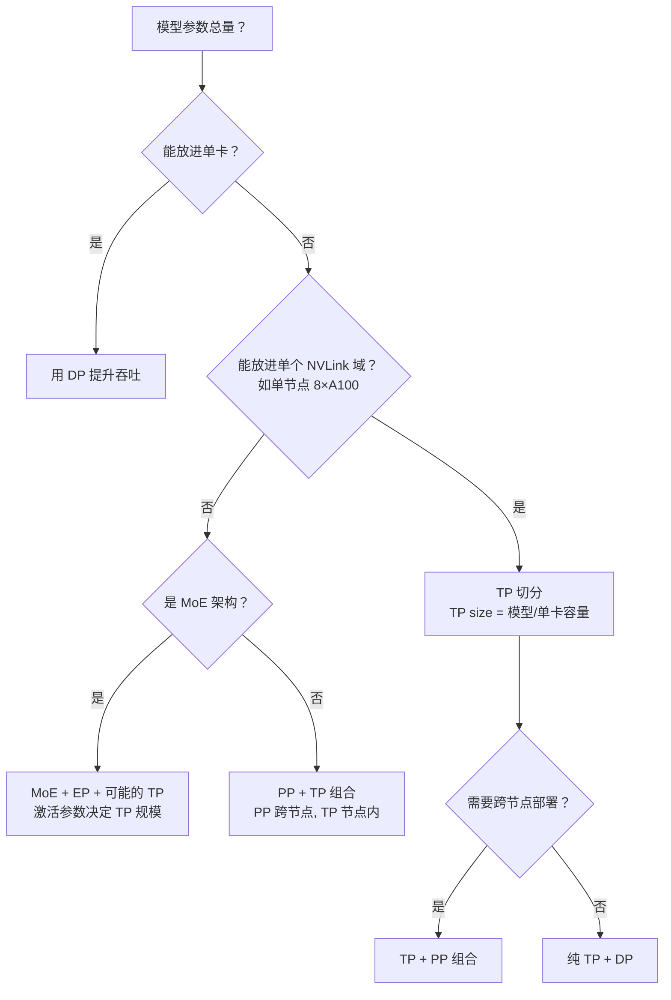

# 分布式推理概述

> 一句话概括核心：当单块 GPU 的显存放不下模型、算力撑不住吞吐时，必须通过并行策略把计算和存储切分到多块 GPU 上协同完成。

## 为什么需要分布式

### 单卡放不下（Memory Wall）

| 模型规模 | FP16 权重体积 | 推理 KV Cache（示例） | 单卡 A100-80G 能放？ |
|----------|--------------|---------------------|---------------------|
| 7B       | ~14 GB       | ~2-4 GB             | 能                  |
| 70B      | ~140 GB      | ~10-20 GB           | 不能                |
| 671B     | ~1.3 TB      | ~50-100 GB          | 不能                |
| DeepSeek-V3 (671B, MoE) | ~1.3 TB | 激活态 ~37B | 不能 |

A100-80G 只有 80 GB 显存。70B 模型仅权重就需要 140 GB，远超单卡容量。即使使用 INT8 量化（70B ~ 70 GB），KV Cache 仍然会溢出。

### 单卡算不动（Compute Wall）

假设 A100 FP16 Tensor Core 峰值 312 TFLOPS，推理一个 70B 模型单 token 前向推理约需 140 TFLOP（2 × params）。理论最快 0.45 s/token，实际由于 Memory Bound（HBM 带宽 2 TB/s），瓶颈在访存而非计算：

```
单次 token 生成需读取全部权重 = 140 GB
A100 HBM 带宽 = 2 TB/s
理论下界 = 140 GB / 2 TB/s = 70 ms
实际约 100-200 ms（含 KV Cache 读写、通信开销）
```

对于 QPS=100 的服务，单 token 延迟 200 ms 意味着需要至少 20 路并发，单卡无法支撑高 QPS 场景。

## 核心概念：四种并行策略



### 1. Data Parallel（DP）

- **原理**: 多张 GPU 各持有一份完整模型副本，不同 GPU 处理不同请求
- **通信**: 无（请求独立）
- **优点**: 零额外通信开销，实现最简单
- **缺点**: 只能提升吞吐，不能解决模型放不下的问题
- **适用**: 模型 < 单卡显存，需要高吞吐的场景

### 2. Tensor Parallel（TP）

- **原理**: 将每层的权重矩阵切分到多卡，层内计算分布式完成
- **通信**: 每层结束需要 AllReduce 同步
- **优点**: 显存和计算均匀分布，延迟最低
- **缺点**: 通信密集，必须在 NVLink 域内（跨 PCIe/网络延迟无法接受）
- **适用**: 7B~70B 模型，NVLink 连接的 GPU 集群内

### 3. Pipeline Parallel（PP）

- **原理**: 按层切分模型，不同 GPU 负责不同的层
- **通信**: 相邻 GPU 之间 Send/Recv 中间激活值
- **优点**: 可以跨 PCIe 甚至跨机，适合超大模型
- **缺点**: 存在 Pipeline Bubble（GPU idle 时间），调度复杂
- **适用**: 超大模型（70B+），跨节点部署

### 4. Expert Parallel（EP）

- **原理**: MoE 模型中，不同 Expert 分布到不同 GPU，Router 决定 token 路由
- **通信**: AllToAll 通信（token 分发 + 结果聚合）
- **优点**: 激活参数量远小于总参数量，推理效率高
- **缺点**: 负载均衡困难，AllToAll 通信量大
- **适用**: MoE 架构模型（DeepSeek-V3、Mixtral 等）

### 5. Context Parallel（CP）

- **原理**: 将序列维度（context length）切分到多卡
- **通信**: 跨卡 Attention 需要通信
- **优点**: 显著减少单卡 KV Cache 显存
- **缺点**: 长序列时通信开销增大
- **适用**: 超长上下文场景（128K+ tokens）

## 通信开销对比

| 并行策略 | 通信原语 | 通信量 | 带宽要求 | 延迟敏感度 |
|----------|----------|--------|----------|-----------|
| DP | 无（独立推理） | 0 | 无 | 无 |
| TP | AllReduce | 2 × (P-1)/P × hidden_size × batch | 极高（NVLink） | 极高（每层同步） |
| PP | Send/Recv | hidden_size × batch × micro-batches | 中等（PCIe 可行） | 低（层间异步） |
| EP | AllToAll | tokens × hidden_size × top_k | 高（跨卡） | 中等 |
| CP | AllGather/ReduceScatter | seq_len × hidden_size / P | 高 | 中等 |

**AllReduce 详解**（以 Ring AllReduce 为例）：
- 每卡发送数据量：2 × (P-1)/P × M（M 为同步张量大小）
- 理论带宽利用率：可达到链路带宽的 (P-1)/P
- 当 P=4 时，每卡额外传输 1.5× 数据量

**Send/Recv 详解**（PP 相邻卡通信）：
- 每次传输一个 micro-batch 的激活值
- 通信量 = hidden_size × batch_size_per_micro
- 延迟被 bubble 掩盖，不关键

**AllToAll 详解**（MoE token 分发）：
- 每个 token 需要发送到 top_k 个 Expert 所在卡
- 最坏情况：所有 token 都路由到同一张卡 → 严重不均衡
- 通信量 = tokens × hidden_size × top_k / P

## 并行策略组合

实际部署中通常需要多种并行策略组合使用：

### TP + DP（最常见）



- NVLink 域内做 TP（如 2-8 卡一组），域间做 DP
- 适合：模型可放入 NVLink 域（如 70B/TP=8）

### TP + PP + DP（超大模型）



- 先用 PP 跨节点切分层，再用 TP 在节点内切分每层
- 适合：模型超过单节点容量

### MoE + EP + TP（MoE 模型）

- TP 在 Expert 内部切分（每个 Expert 内再做 TP）
- EP 将不同 Expert 分布到不同 GPU
- Router 负责跨卡 token 分发（AllToAll）

## 并行策略选择决策树



## 部署视角

### 典型配置参考

| 模型 | GPU | 并行策略 | 说明 |
|------|-----|----------|------|
| Llama-3-8B | 1×A100 | 无 | 单卡直接部署 |
| Llama-3-70B | 8×A100（单节点） | TP=8 | 全 NVLink |
| Llama-3-70B | 2×Node（8+8 GPU） | TP=8 + DP=2 | 双副本提升吞吐 |
| DeepSeek-V3 | 多节点 | MoE + EP + TP | 激活 37B，Expert 分布 |

### 显存估算公式

```
单卡显存 ≈ (模型参数 / TP_size) × 2字节
         + KV_Cache × batch_size
         + 激活值 + 通信 buffer

KV_Cache ≈ 2 × num_layers × num_heads × head_dim × seq_len × batch × 2字节
```

## 面试视角

### Q1: 为什么 TP 必须在 NVLink 域内？

**核心原因**：TP 需要在每一层的 forward pass 结束时做 AllReduce 同步。以 70B 模型 TP=8 为例：
- hidden_size = 8192，batch_size = 1（推理通常 batch=1 或小 batch）
- 每次 AllReduce 同步 ~32 KB 数据
- 但每层都要做，100 层就要做 100 次 AllReduce
- NVLink 带宽 ~200 GB/s，PCIe Gen5 ~64 GB/s，跨机网络 ~25 Gbps ≈ 3 GB/s
- 跨机 AllReduce 延迟是 NVLink 的 50-100 倍，直接拖垮推理速度

### Q2: DP 和 TP 的本质区别是什么？

- DP 是请求级别的并行（不同请求在不同卡上），通信开销为零
- TP 是计算级别的并行（一个请求被多卡协同完成），每层都需要通信
- 通俗理解：DP 是"各干各的"，TP 是"一起干一件事"

### Q3: 如何选择 TP size？

经验法则：
- TP size 通常取 2 的幂（2/4/8）
- TP size 受限于 NVLink 拓扑（通常不超过单节点的 GPU 数）
- TP size 越大，通信开销占比越高，scaling efficiency 递减
- 实测：NVLink 内 TP=8 的 scaling efficiency 约 85-92%

### Q4: 不同并行策略各自的优缺点和适用场景？

| 策略 | 优点 | 缺点 | 典型场景 |
|------|------|------|----------|
| DP | 零通信开销，最简单 | 不能解决显存不足 | 小模型高吞吐 |
| TP | 延迟低，显存均匀分布 | 必须 NVLink，通信密集 | 大模型单节点部署 |
| PP | 可跨机，灵活 | Pipeline Bubble，调度复杂 | 超大模型跨节点 |
| EP | 激活参数少，效率高 | 负载均衡难，AllToAll 重 | MoE 模型推理 |
| CP | 减少 KV Cache | 长序列通信重 | 超长上下文 |

### Q5: 实际部署中如何权衡并行策略？

**经验法则**：

1. **优先 TP，不够加 PP**：TP 延迟最低，优先用 TP 把模型放进单节点；放不下再加 PP 跨节点
2. **TP size 受限于 NVLink 拓扑**：一般不超过 8（单节点最大 GPU 数）
3. **DP 提升吞吐不降低延迟**：需要更高 QPS 时才加 DP 副本
4. **MoE 按激活参数规划**：不要被总参数量吓到，看激活参数决定 TP/PP 规模

**真实案例**：
- Llama-3-70B on 1×8×A100: TP=8，单节点搞定，延迟 ~50ms/token
- Llama-3-70B on 2×4×A100: TP=4 + PP=2，跨节点，延迟 ~80ms/token
- DeepSeek-V3 on 多节点: MoE + EP + TP，激活 37B 决定单卡压力

---

*下一节：[张量并行](./tensor-parallel.md)*
