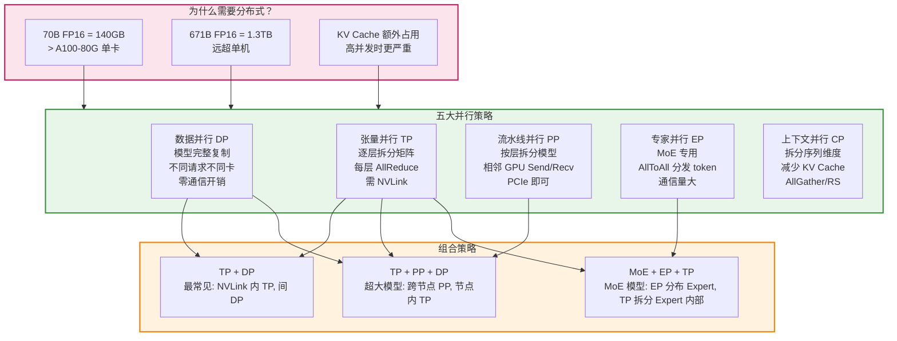
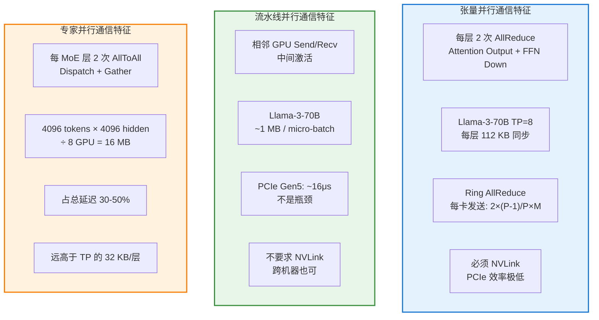
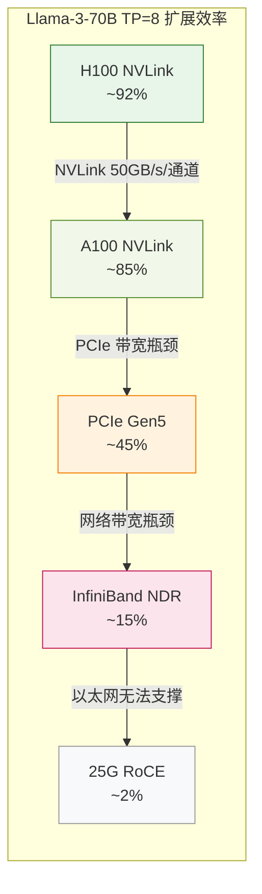
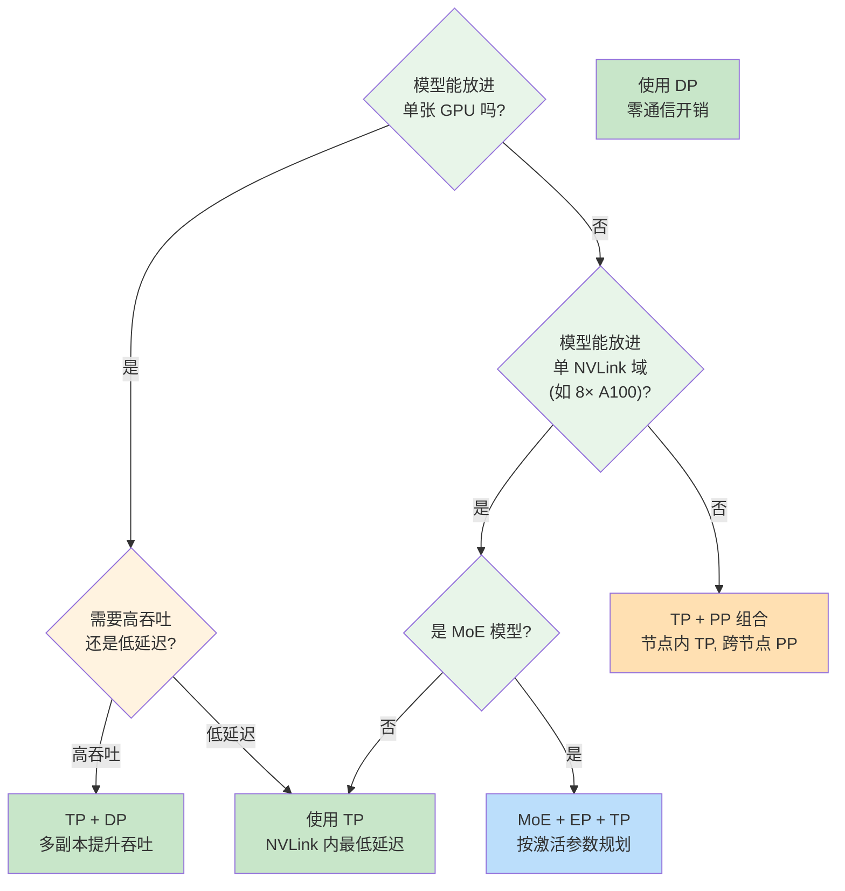
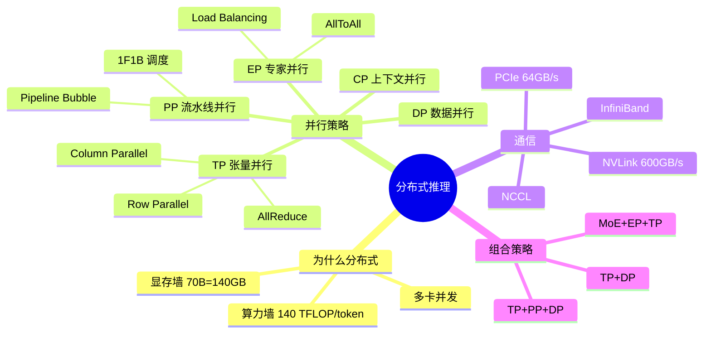

# 大模型怎么部署到多块 GPU 上

> 当模型参数超过单卡显存容量时，需要将模型拆分到多块 GPU 上。本模块讲解分布式推理的核心概念和并行策略。

## 为什么这个模块对 FDE 至关重要

70B 模型的 FP16 权重是 140GB，远超单张 A100-80G 的容量。671B 的 DeepSeek-V3 更是需要 1.3TB。分布式推理是唯一解法，但不同的并行策略带来的性能代价完全不同：

- "TP=4 时，每层 2 次 AllReduce 的通信开销有多大？跨 NVLink 和跨 PCIe 差多少倍？"
- "流水线并行的 Pipeline Bubble 怎么计算？1F1B 调度能减少多少？"
- "MoE 模型的 AllToAll 通信量是 TP 的几倍？为什么 MoE 部署更难？"
- "什么时候选 TP+PP 组合？什么时候只需要 TP+DP？"

**分布式推理的核心矛盾：计算可以线性拆分，但通信开销不是线性的。选择错误的并行策略，可能让 8 张卡的性能还不如 4 张。**



## 并行策略通信开销对比



### 通信开销量化对比

| 策略 | 通信原语 | 通信量 (Llama-3-70B) | 带宽要求 | 延迟敏感度 |
|------|---------|---------------------|---------|-----------|
| DP | 无 | 0 | 无 | 无 |
| TP | AllReduce | 每层 ~32 KB (TP=4) | 极高 (必须 NVLink) | 极高 (逐层同步) |
| PP | Send/Recv | ~1 MB / micro-batch | 中等 (PCIe 即可) | 低 (层间异步) |
| EP | AllToAll | ~16 MB / MoE 层 | 高 (跨卡) | 中等 |
| CP | AllGather/RS | seq_len × hidden / P | 高 | 中等 |

**关键数字：TP=4 时，每卡每次 AllReduce 发送 1.5 倍的数据量；TP=8 时发送 1.75 倍。**

## TP 扩展效率（不同互联方式）



**结论：TP 必须在 NVLink 域内执行。超过 NVLink 范围（通常是单机 8 卡），TP 的效率急剧下降。**

## 流水线并行的 Bubble 分析

```mermaid
flowchart LR
    subgraph Naive["Naive Pipeline Bubble"]
        N1["Bubble = (P-1)/(M+P-1)"]
        N2["P=4, M=4: 43%"]
        N3["P=8, M=8: 47%"]
    end

    subgraph Optimized["1F1B 调度优化"]
        O1["Bubble ≈ (P-1)/M"]
        O2["P=4, M=8: ~19%"]
        O3["推理只有 Forward\n优化手段不同"]
    end

    subgraph Inference["推理专用优化"]
        I1["Continuous Batching\n最大化 Decode 吞吐"]
        I2["Chunked Prefill\n避免长 Prompt 阻塞"]
        I3["Speculative Decoding\n减少 Decode 步数"]
    end

    Naive -->|"增加 M 减少 Bubble"| Optimized
    Optimized -->|"推理场景"| Inference

    style Naive fill:#fce4ec,stroke:#c2185b
    style Optimized fill:#fff3e0,stroke:#f57c00
    style Inference fill:#e8f5e9,stroke:#388e3c
```



## 策略选择决策树



## 典型部署配置

| 模型 | GPU | 策略 | 延迟 | 说明 |
|------|-----|------|------|------|
| Llama-3-8B | 1× A100 | 无 | ~15ms/token | 单卡即可 |
| Llama-3-70B | 8× A100 (单节点) | TP=8 | ~50ms/token | 全 NVLink |
| Llama-3-70B | 2×8 A100 (双节点) | TP=8 + DP=2 | ~50ms/token | 双副本，2 倍吞吐 |
| Llama-3-70B | 2×4 A100 (跨节点) | TP=4 + PP=2 | ~80ms/token | 跨节点通信 |
| DeepSeek-V3 | 多节点 | MoE + EP + TP | 不定 | 激活 37B 驱动规划 |

## 内存估算公式

**单卡显存：**
```
= (模型参数 / TP_size) × 2 bytes + KV_Cache × batch_size + 激活 + 通信缓冲
```

**KV Cache：**
```
= 2 × num_layers × num_heads × head_dim × seq_len × batch × 2 bytes
```

**MoE 显存：**
```
= (总参数 / EP_size) × 2 bytes + KV_Cache × batch_size + 路由缓冲 + AllToAll 缓冲
```

## 学习路径

| 顺序 | 文档 | 核心内容 | 面试考点 |
|------|------|---------|---------|
| 1 | [分布式推理概述](./distributed-overview.md) | 并行策略对比、通信开销分析 | 什么时候需要分布式推理 |
| 2 | [张量并行 TP](./tensor-parallel.md) | Megatron-LM 逐行/逐列拆分 | TP 的通信开销和延迟影响 |
| 3 | [流水线并行 PP](./pipeline-parallel.md) | 按层拆分、Pipeline Bubble | 如何减少 Pipeline Bubble |
| 4 | [MoE 并行](./moe-parallel.md) | 专家路由、跨节点分发 | MoE 部署的通信瓶颈 |

## 模块知识结构图



## 前置知识

建议先完成 [GPU 互联](/03-gpu-basics/gpu-interconnect/) 了解 GPU 间通信特性。

---

*上一节：[让推理变快：推理引擎与量化](/04-inference-optimization/)*
*下一节：[分布式推理概述](./distributed-overview.md)*
