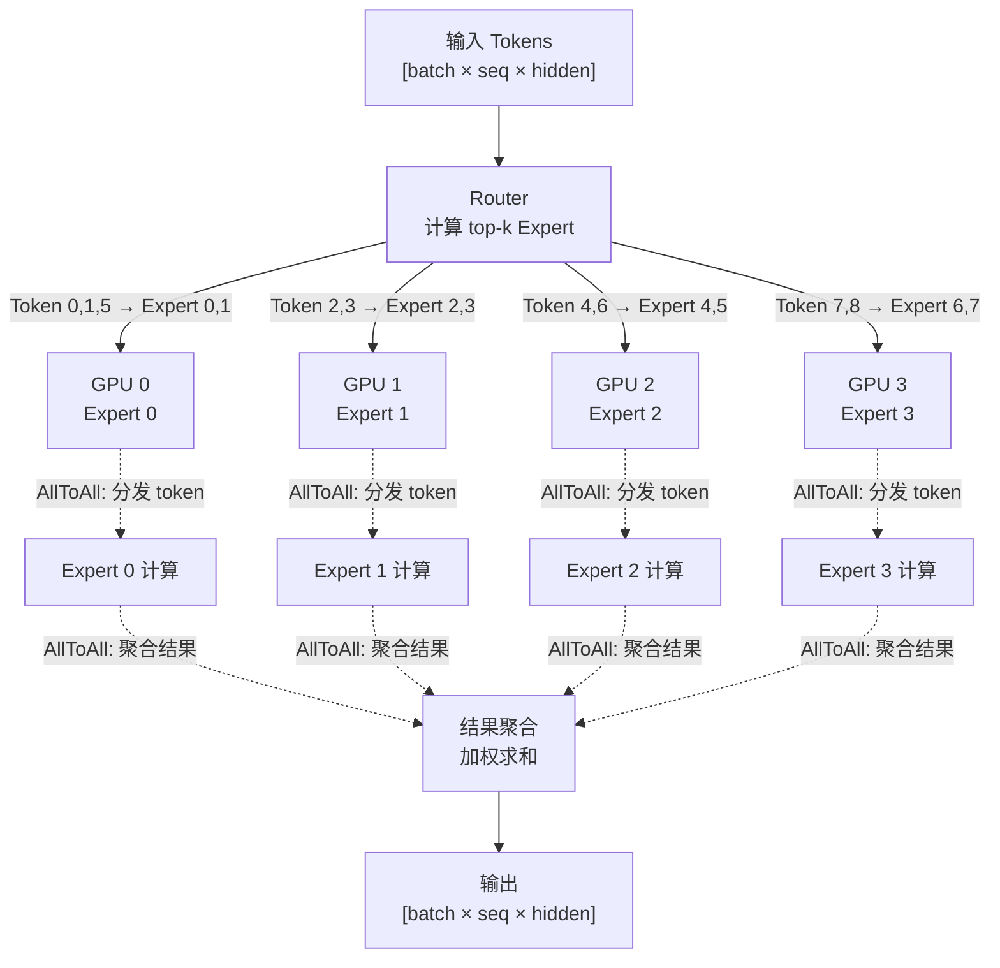
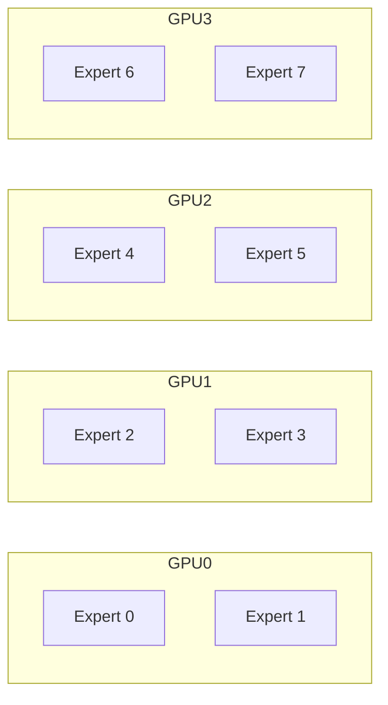
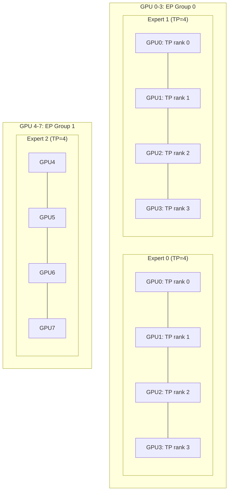
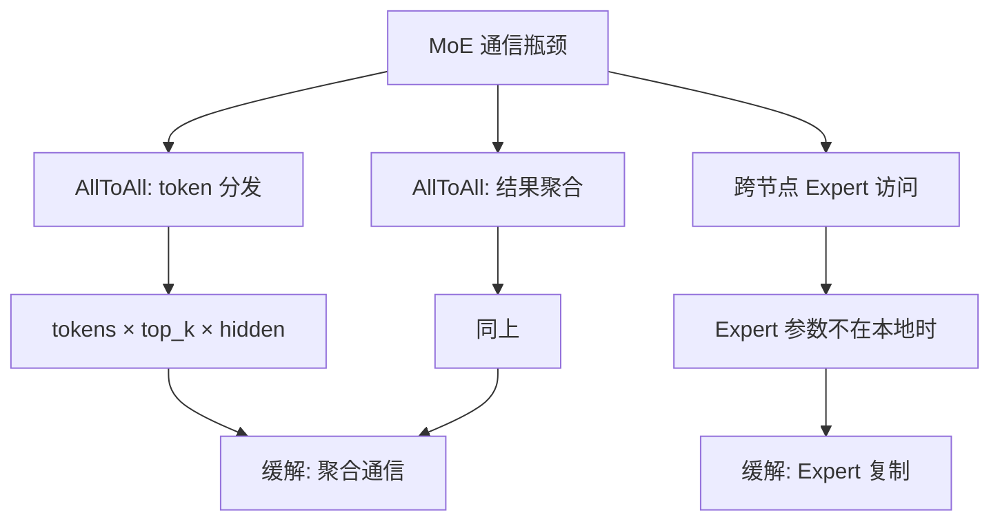

# MoE 并行

> 一句话概括核心：Mix-of-Experts 通过路由机制让每个 token 只激活部分 Expert，结合 Expert Parallel 将不同 Expert 分布到不同 GPU，实现"模型越大、激活越少"的高效推理。

## 前置知识

- [分布式推理概述](./distributed-overview.md) — 理解并行策略分类
- [MoE 架构](../02-model-architecture/moe-architecture.md) — 理解 Router + Expert 的工作原理

## 核心概念

### MoE 架构回顾

MoE 的核心思想是将 FFN 层替换为多个 Expert（通常是小型 FFN），每个 token 通过 Router 选择 top-k 个 Expert 进行计算。

```
传统 FFN:  Input → FFN → Output           (所有 token 走同一个 FFN)

MoE FFN:   Input → Router → top-k Expert  → 加权组合 → Output
                      ↗ Expert_0
           token_i → → Expert_1           (每个 token 只激活 2 个 Expert)
                      ↘ Expert_7
```

**关键参数**：
- `num_experts`：总 Expert 数量（如 DeepSeek-V3 有 256 个 Expert）
- `top_k`：每个 token 激活的 Expert 数（通常为 2）
- `expert_capacity`：每个 Expert 最多处理的 token 数

### MoE 跨卡 Expert 分布



**流程说明**：
1. **Router 计算**：在所有 token 上计算路由分数（Gating Network），确定每个 token 的 top-k Expert
2. **Token Dispatch（AllToAll）**：将 token 按 Expert 分配到对应 GPU
3. **Expert 计算**：各 GPU 独立计算自己负责的 Expert
4. **Result Gather（AllToAll）**：将 Expert 输出聚合回原始 token 顺序
5. **加权组合**：按路由权重组合 top-k Expert 的输出

## AllToAll 通信详解

### AllToAll 在 MoE 中的作用

MoE 中有两次关键的 AllToAll 通信：

```
Dispatch（前向分发）:
  GPU_i 持有: 一部分 token
  需要发送到: 不同 GPU 上的对应 Expert
  通信模式: 每个 GPU 向所有 GPU 发送不同数据
  
Gather（结果聚合）:
  各 GPU 计算完 Expert 输出
  需要将结果发回给持有原始 token 的 GPU
  通信模式: Dispatch 的逆操作
```

### AllToAll 通信量计算

```
Dispatch 通信量 = tokens × top_k × hidden_size × 4 bytes / num_gpus

以 Llama-MoE 为例:
  tokens = 4096 (batch × seq)
  top_k = 2
  hidden_size = 4096
  num_gpus = 8
  通信量 = 4096 × 2 × 4096 × 4 / 8 = 16 MB

  对比 TP 的 AllReduce: ~32 KB/layer
  MoE 的 AllToAll 通信量远大于 TP 的 AllReduce
```

### AllToAll vs AllReduce

| 维度 | AllReduce (TP) | AllToAll (MoE) |
|------|---------------|----------------|
| 通信量 | 小（hidden_size × 常数） | 大（tokens × hidden × top_k） |
| 通信模式 | 环形/树形 | 全互联 |
| 带宽利用率 | 高（可 pipeline） | 取决于数据分布 |
| 延迟敏感度 | 极高（每层同步） | 中等（可 batch） |

## Expert Parallel vs Tensor Parallel 的组合

### 纯 Expert Parallel（EP）



每个 Expert 完整放在一张 GPU 上，适合 Expert 较小的场景。

### EP + TP 混合

当单个 Expert 很大时（如 DeepSeek-V3 的 Expert 本身就需要多卡），需要在 Expert 内部再做 TP：



### 并行策略选择

| 场景 | 推荐策略 |
|------|----------|
| Expert 小，数量多 | 纯 EP |
| Expert 大，数量少 | EP + TP（Expert 内 TP） |
| 超长序列 | EP + CP（Context Parallel 切分序列） |
| 跨节点部署 | EP 跨节点 + TP 节点内 |

## 负载均衡策略

MoE 的核心挑战之一是 Expert 负载不均衡。如果所有 token 都路由到同一个 Expert，会导致：
- 该 GPU 成为瓶颈
- 其他 GPU 空闲
- AllToAll 通信倾斜

### Auxiliary Loss（辅助损失）

训练时添加辅助损失函数，鼓励均匀分配：

```
aux_loss = α × Σ(expert_i_fraction × expert_i_capacity_fraction)

其中:
  expert_i_fraction = token 分配到 expert_i 的比例
  expert_i_capacity_fraction = expert_i 使用容量占总容量的比例
  α = 平衡系数（通常 0.01）

目标: 最小化时，token 会均匀分布到所有 Expert
```

### Capacity Factor

```
capacity_factor = max_tokens_per_expert / (total_tokens / num_experts)

capacity_factor = 1.0: 严格均匀，超出丢弃
capacity_factor = 1.25: 允许 25% 溢出，溢出 token 走残差连接
capacity_factor = 2.0: 宽松分配，但可能导致显存浪费

推理时通常设 1.0-1.25，保证负载均衡
```

### 推理时的负载均衡

推理时无法像训练那样通过 loss 调整，常见策略：
1. **静态路由**：固定 token 到 Expert 的映射（简单但可能不均衡）
2. **动态重路由**：当 Expert 超限时，将 token 路由到下一个 Expert
3. **Load-aware Routing**：根据 Expert 队列长度动态选择

## DeepSeek-V3 的 MLA + MoE 架构简析

DeepSeek-V3（671B 参数，激活 37B）是 MoE 架构的代表：

```
总参数: 671B
激活参数: ~37B (每 token 只激活约 5.5% 的参数)

架构特点:
├── MLA (Multi-Head Latent Attention)
│   ├── 低秩 KV 压缩（减少 KV Cache）
│   └── 注意力计算高效
├── MoE FFN
│   ├── 256 个 Expert
│   ├── 每 token 激活 top-8 Expert（实际 1 个 routed + 1 个 shared）
│   └── 跨节点 Expert 分布（Expert Parallel）
└── 并行策略
    ├── 节点内 TP=4（Expert 内部）
    ├── Expert 跨节点分布（EP）
    └── 可能的 PP 跨节点分层
```

**DeepSeek-V3 推理优势**：
- 激活参数仅 37B，推理效率远高于同等规模的 Dense 模型
- MLA 大幅减少 KV Cache 显存
- Expert 并行使显存占用分散

## MoE 部署的通信瓶颈和缓解策略

### 通信瓶颈分析



### 缓解策略

| 策略 | 原理 | 效果 |
|------|------|------|
| 通信聚合 | 将多次小 AllToAll 合并为一次大 AllToAll | 减少 startup latency |
| Expert 复制 | 热门 Expert 在多卡上各放一份 | 减少跨卡访问 |
| Token Batching | 按 Expert 分组 token，批量发送 | 提高带宽利用率 |
| Overlap 计算通信 | 计算当前 batch 时预取下一个 batch | 隐藏通信延迟 |
| Hierarchical Routing | 先选组再选 Expert | 减少 AllToAll 目标数 |

## 部署视角

### vLLM 中的 MoE

```bash
# DeepSeek-V3 推理（MoE + EP）
vllm serve deepseek-ai/DeepSeek-V3 \
  --tensor-parallel-size 4 \
  --enable-expert-parallel

# MoE 模型需要注意 Expert 的分配
```

### 显存估算

```
MoE 显存 = (总参数量 / EP_size) × 2 bytes
         + KV_Cache × batch_size
         + Router buffer + AllToAll buffer

DeepSeek-V3 EP=8:
  权重显存 = 671B / 8 × 2 bytes = 168 GB
  需要多卡或量化才能放下
```

## 面试视角

### Q1: MoE 模型的并行策略如何选择？

**决策框架**：

1. **先看激活参数量**：MoE 的推理成本取决于激活参数（非总参数）
   - DeepSeek-V3 激活 37B → 按 37B 模型来规划
2. **TP size 由激活参数决定**：TP 切分的是激活态的计算
3. **EP size 由总 Expert 数决定**：EP 分布的是 Expert 的权重
4. **总 GPU 数 = TP_size × EP_size × PP_size**

### Q2: MoE 推理的主要性能瓶颈是什么？

**三个层次**：
1. **计算层**：Expert 内部的矩阵乘法（可通过 TP 优化）
2. **通信层**：AllToAll 的 token 分发/聚合（主要瓶颈）
3. **调度层**：Router 计算和负载不均衡

实际部署中，AllToAll 通信通常占 MoE 推理延迟的 30-50%。

### Q3: 为什么 MoE 可以跨机部署而 TP 不行？

- TP 的 AllReduce 每层都要同步，延迟直接叠加到每个 token
- MoE 的 AllToAll 只在 MoE layer 处发生，频率远低于 TP
- MoE 的 token 分发可以批量完成，对延迟不那么敏感
- MoE 中 Expert 计算是独立的，没有 TP 那种紧耦合的同步关系

### Q4: MoE 模型的负载均衡怎么做？

- **训练阶段**：Auxiliary Loss 引导均匀分配
- **推理阶段**：Capacity Factor 限制单 Expert 负载 + 溢出 token 走 shared Expert
- **部署阶段**：监控各 GPU 利用率，动态调整 Expert 分布

### Q5: DeepSeek-V3 相比传统 MoE（如 Mixtral）有什么创新？

- **MLA**：低秩注意力，大幅减少 KV Cache
- **更细粒度的 Expert**：256 个小 Expert vs Mixtral 的 8 个大 Expert
- **Shared Expert**：保留一个共享 Expert 处理 overflow token
- **更高的 top-k**：top-8 路由 vs Mixtral 的 top-2，增加灵活性

---

*分布式完成 → 进入 [生产部署架构](../07-production-deployment/deployment-architecture.md)*
