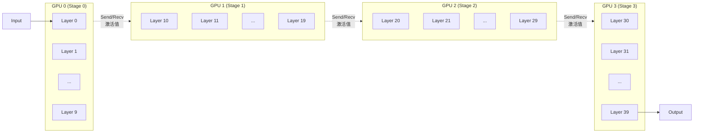
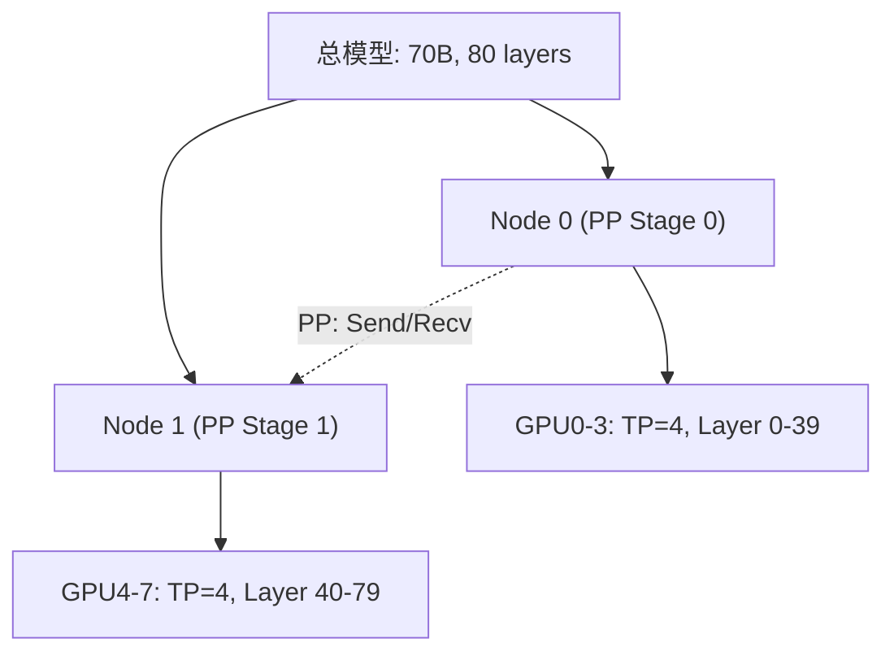

# 流水线并行（PP）

> 一句话概括核心：将 Transformer 的不同层分配到不同 GPU，通过 micro-batch 填充计算间隙，让多卡像流水线一样协同处理请求。

## 核心概念

### PP 分层放置原理

Pipeline Parallel 将模型的 Layer 维度切分，每张 GPU 负责连续的若干层。与 TP 按层内矩阵切分不同，PP 是按层间切分。



**关键特性**：
- GPU 之间传输的是中间激活值（hidden states），大小为 `batch × seq × hidden_size`
- 通信发生在相邻 GPU 之间（非 AllReduce，只是简单的 Send/Recv）
- 不需要 NVLink，PCIe 甚至跨机网络都可以接受（因为通信频率低）

### 为什么需要 Micro-Batch？

如果一次只处理一个请求（batch=1），GPU0 跑完 Layer 0-9 后传给 GPU1，GPU1 开始算 Layer 10-19，此时 GPU0 必须空闲等待 GPU1 完成才能处理下一个请求。这就是 **Pipeline Bubble**。

```
方案A（无 micro-batch，batch=1）:

GPU0: [Stage0-B1] 空闲等待 空闲等待 空闲等待
GPU1: 空闲等待   [Stage1-B1] 空闲等待 空闲等待
GPU2: 空闲等待   空闲等待    [Stage2-B1] 空闲等待
GPU3: 空闲等待   空闲等待    空闲等待    [Stage3-B1]

利用率 = 1/4 = 25%  （4 卡只有 25% 时间在做有用计算）
```

引入 micro-batch 后：

```
方案B（micro-batch=4）:

GPU0: [S0-B1][S0-B2][S0-B3][S0-B4]  空闲...  反向传播...
GPU1: 空闲  [S1-B1][S1-B2][S1-B3][S1-B4]  空闲...  反向传播...
GPU2: 空闲   空闲   [S2-B1][S2-B2][S2-B3][S2-B4] 空闲... 反向传播...
GPU3: 空闲   空闲    空闲   [S3-B1][S3-B2][S3-B3][S3-B4] 反向传播...

利用率显著提升（但仍存在 bubble）
```

## Pipeline Bubble 详解

### Naive Pipeline 的 Bubble 问题

```mermaid
gantt
    title Naive Pipeline Forward Pass (4 Stage, 4 Micro-batch)
    dateFormat S
    axisFormat %Ss
    
    section GPU 0 (Stage 0)
    MB1 : 0, 1
    MB2 : 1, 1
    MB3 : 2, 1
    MB4 : 3, 1
    
    section GPU 1 (Stage 1)
    idle1 : 0, 1
    MB1 : 1, 1
    MB2 : 2, 1
    MB3 : 3, 1
    MB4 : 4, 1
    
    section GPU 2 (Stage 2)
    idle1 : 0, 2
    MB1 : 2, 1
    MB2 : 3, 1
    MB3 : 4, 1
    MB4 : 5, 1
    
    section GPU 3 (Stage 3)
    idle1 : 0, 3
    MB1 : 3, 1
    MB2 : 4, 1
    MB3 : 5, 1
    MB4 : 6, 1
```



**Bubble 时间计算**：

```
设 P = pipeline stage 数
    M = micro-batch 数
    T = 每个 stage 的计算时间

总时间 = (M + P - 1) × T     (最后一个 micro-batch 完成)
有效计算时间 = M × T
bubble 比例 = 1 - M/(M+P-1) = (P-1)/(M+P-1)

P=4, M=4: bubble = 3/7 ≈ 43%
P=4, M=16: bubble = 3/19 ≈ 16%
P=8, M=8: bubble = 7/15 ≈ 47%
```

**结论**：增大 micro-batch 数可以减少 bubble 比例，但会增加显存消耗。

### 1F1B 调度（Interleaved Pipeline）

GPipe 和 PipeDream 提出的 1F1B（One Forward One Backward）调度显著减少了 bubble：

```mermaid
gantt
    title 1F1B Pipeline Schedule (4 Stage, 4 Micro-batch)
    dateFormat S
    axisFormat %Ss
    
    section GPU 0
    F1 : 0, 1
    F2 : 1, 1
    F3 : 2, 1
    F4 : 3, 1
    B1 : 4, 1
    B2 : 5, 1
    B3 : 6, 1
    B4 : 7, 1
    
    section GPU 1
    idle : 0, 1
    F1 : 1, 1
    F2 : 2, 1
    F3 : 3, 1
    B1 : 4, 1
    B2 : 5, 1
    B3 : 6, 1
    B4 : 7, 1
    
    section GPU 2
    idle : 0, 2
    F1 : 2, 1
    F2 : 3, 1
    B1 : 4, 1
    B2 : 5, 1
    B3 : 6, 1
    B4 : 7, 1
    
    section GPU 3
    idle : 0, 3
    F1 : 3, 1
    B1 : 4, 1
    B2 : 5, 1
    B3 : 6, 1
    B4 : 7, 1
```



1F1B 的核心思想：
- 先 warmup：连续 forward 所有 micro-batch 直到填满 pipeline
- 然后 1F1B：每完成一个 forward 就紧跟一个 backward，保持 GPU 持续计算
- Bubble 比例从 `(P-1)/(M+P-1)` 降到约 `(P-1)/M`（当 M >> P 时几乎消除）

**推理时的特殊性**：推理只有 forward pass（无 backward），所以 1F1B 的优化不直接适用。推理中常用的是 **continuous batching + micro-batch 预热** 来填充 bubble。

## PP vs TP 对比

| 维度 | Tensor Parallel (TP) | Pipeline Parallel (PP) |
|------|---------------------|----------------------|
| 切分维度 | 层内矩阵 | 层间 |
| 通信原语 | AllReduce | Send/Recv |
| 通信频率 | 每层 2 次 | 每 micro-batch 1 次 |
| 通信量 | 2 × layers × hidden_size × batch | P × hidden_size × batch × micro |
| 带宽要求 | 极高（必须 NVLink） | 中等（PCIe 可行） |
| Bubble | 无 | 有，需 micro-batch 优化 |
| 负载均衡 | 天然均衡 | 取决于层分配 |
| 适合模型 | 7B-70B | 70B+ |
| 扩展性 | 受限于 NVLink 域 | 可跨节点 |

## 什么时候选 PP 而不是 TP？

**选择 PP 的场景**：
1. 模型超过单个 NVLink 域容量（如 671B 模型需要 16+ 卡）
2. 跨节点部署（节点间无 NVLink）
3. 异构集群（不同 GPU 型号，可以分配不同数量的层）
4. 需要与 TP 组合使用（节点内 TP，节点间 PP）

**选择 TP 的场景**：
1. 模型可放入单节点
2. 对延迟敏感（PP 的 bubble 增加延迟）
3. 负载均衡要求高

**实际部署往往是组合**：



## 部署视角

### vLLM 中的 PP

```bash
# PP=2（将模型分成 2 个 stage）
vllm serve model --pipeline-parallel-size 2

# PP + TP 组合：8 卡 = TP=4 × PP=2
vllm serve model --tensor-parallel-size 4 --pipeline-parallel-size 2
```

### PP 部署注意事项

1. **Layer 分配策略**：
   - 均匀分配：每卡 `total_layers / PP_size` 层
   - 考虑 Embedding/Output 层只挂在首尾 stage 的显存开销

2. **Micro-batch 大小调优**：
   - 增大 → 减少 bubble，但增加显存
   - 经验值：micro-batch = PP_size × 2~4

3. **跨机 PP 的网络要求**：
   - 相邻 stage 间传输激活值：`hidden_size × batch × 4 bytes`
   - Llama-3-70B: 8192 × 32 × 4 = 1 MB/micro-batch
   - 对网络要求远低于 TP

## 面试视角

### Q1: Pipeline Bubble 是怎么产生的，怎么减少？

**产生原因**：
- Pipeline 中不同 stage 之间存在依赖关系
- GPU1 必须等 GPU0 算完才能开始，GPU2 必须等 GPU1 算完
- 在 warmup 阶段和收尾阶段，部分 GPU 处于空闲状态

**减少方法**：
1. 增加 micro-batch 数量（bubble 比例 = (P-1)/(M+P-1)）
2. 使用 1F1B 调度（训练时）
3. Interleaved pipeline：每卡负责多个不连续的 stage 段
4. 推理时利用 continuous batching 持续填充

### Q2: PP 和 TP 的本质区别是什么？

**TP** 是把一层矩阵计算拆开，要求同时执行、频繁同步（AllReduce），适合低延迟场景。

**PP** 是把不同层拆开，存在前后依赖，通过 micro-batch 提高并发度，适合超大模型。

一句话：TP 是"空间并行"（一起算），PP 是"时间并行"（流水线）。

### Q3: 推理时 PP 的 bubble 怎么优化？

推理没有 backward pass，所以 1F1B 不直接适用。主要优化方法：
1. **Continuous Batching**：不断有新请求进入 pipeline，保持各 stage 填充
2. **Speculative Decoding**：用小模型做 draft，大模型做 verify，增加 pipeline 深度
3. **Chunked Prefill**：把长序列的 prefill 阶段切块，和 decode 阶段交错执行

### Q4: PP 通信会不会成为瓶颈？

通常不会。理由：
- PP 只传输激活值，不传输权重
- 通信频率远低于 TP（只在 stage 边界，不是每层）
- 一个 micro-batch 的激活值通常 < 10 MB
- 即使是 PCIe Gen5（64 GB/s），1 MB 传输只需 ~16 us
- 相比计算时间（ms 级），通信可以忽略

---

*下一节：[MoE 并行](./moe-parallel.md)*
