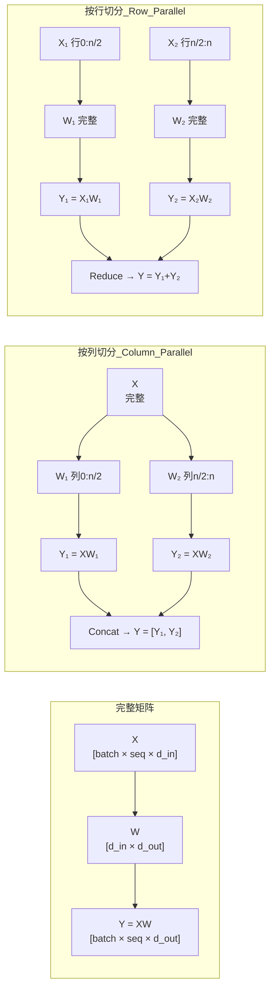
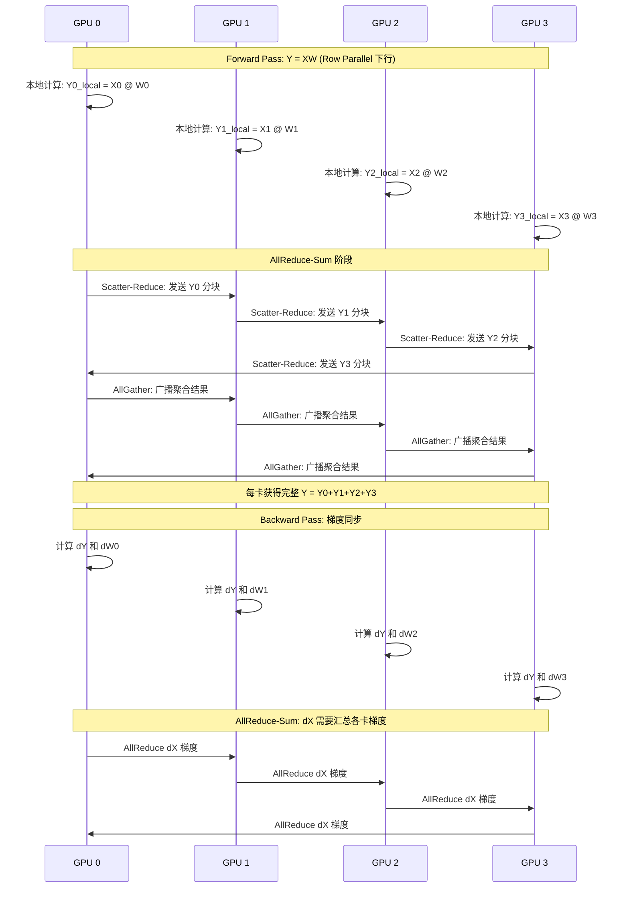
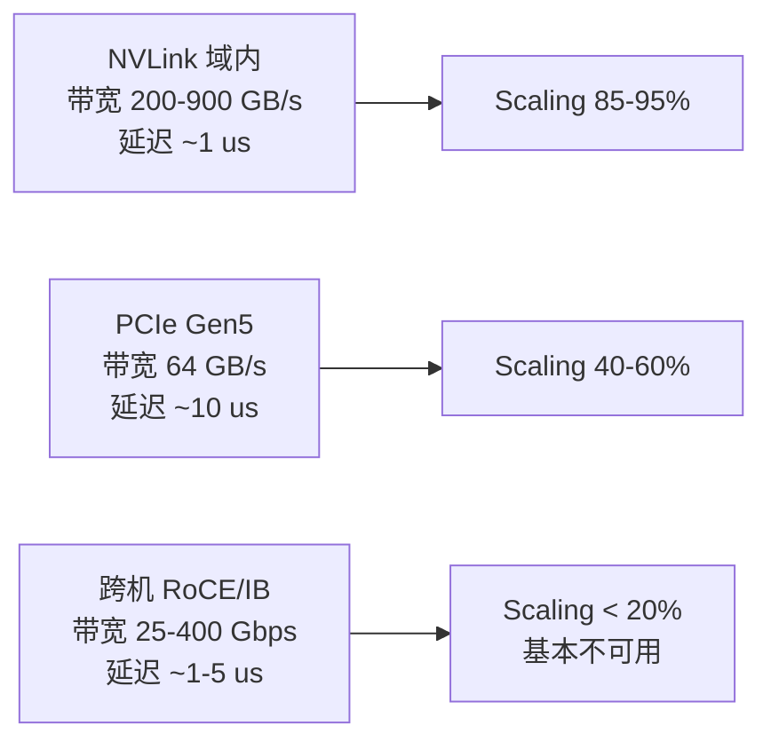

# 张量并行（TP）

> 一句话概括核心：将 Transformer 每层的权重矩阵按行或按列切分到多块 GPU，每层计算完成后通过 AllReduce 同步结果，实现单层级别的细粒度并行。

## 核心概念

### TP 矩阵切分原理

Tensor Parallel 的核心思想源自 Megatron-LM（NVIDIA, 2021）。其本质是将矩阵乘法 `Y = XW` 中的权重矩阵 W 切分到多个 GPU 上并行计算。



### 按列切分（Column Parallel）

将输出维度 d_out 切分为 P 份。每个 GPU 持有 W 的一部分列：

```
W = [W_0, W_1, ..., W_{P-1}]  每个 W_i 形状为 [d_in × d_out/P]

GPU_i 计算: Y_i = X @ W_i
最终结果:   Y = [Y_0, Y_1, ..., Y_{P-1}]  (concat)
```

### 按行切分（Row Parallel）

将输入维度 d_in 切分为 P 份。每个 GPU 持有 W 的一部分行：

```
W = [W_0; W_1; ...; W_{P-1}]  每个 W_i 形状为 [d_in/P × d_out]

GPU_i 计算: Y_i = X_i @ W_i
最终结果:   Y = Y_0 + Y_1 + ... + Y_{P-1}  (reduce sum)
```

## Megatron-LM TP 方案详解

Megatron-LM 的 TP 策略是：对不同的层采用不同的切分方式。

### Transformer Layer 的 TP 切分

```
Input
  │
  ├── LayerNorm
  │
  ├── Self-Attention
  │   ├── QKV Projection → 【按列切分】
  │   │   GPU0: W_Q0, W_K0, W_V0
  │   │   GPU1: W_Q1, W_K1, W_V1
  │   │
  │   └── Output Projection → 【按行切分】
  │       GPU0: W_O0 (部分行)
  │       GPU1: W_O1 (部分行)
  │
  ├── Add + LayerNorm
  │
  ├── MLP (FFN)
  │   ├── Up/Gate Projection → 【按列切分】
  │   │   GPU0: W_up0, W_gate0
  │   │   GPU1: W_up1, W_gate1
  │   │
  │   └── Down Projection → 【按行切分】
  │       GPU0: W_down0 (部分行)
  │       GPU1: W_down1 (部分行)
  │
  └── Add
```

### 为什么 QKV 可以按列切分？数学推导

多头注意力中，Q、K、V 的计算：

```
Q = X @ W_Q    [batch × seq, d_model] @ [d_model, d_model]
K = X @ W_K
V = X @ W_V
```

多头注意力的关键是：不同 head 之间计算完全独立。

```
Attention(Q, K, V) = Concat(head_0, head_1, ..., head_{h-1}) @ W_O

其中 head_i = Softmax(Q_i @ K_i^T / sqrt(d_head)) @ V_i
```

**按列切分 QKV 的正确性**：

```
W_Q = [W_Q0, W_Q1]  ← 按列切分，每个 GPU 持有部分 head

GPU0: Q0 = X @ W_Q0  → 计算 head_0 到 head_{h/2-1}
GPU1: Q1 = X @ W_Q1  → 计算 head_{h/2} 到 head_{h-1}

Attention 输出:
GPU0 计算 head_0...h/2-1 的输出 → Y0 (d_model/P 维)
GPU1 计算 head_{h/2}...h-1 的输出 → Y1 (d_model/P 维)

Concat → [Y0, Y1] = 完整注意力输出
```

由于不同 head 之间无交互，按列切分 QKV 后，每个 GPU 独立计算自己负责的 head，最后 concat 即可。**中间不需要通信**。

### 为什么 FFN 要按行+按列切分？GEMM 分块推导

标准 FFN（SwiGLU）结构：

```
Y = (X @ W_gate ⊙ SiLU(X @ W_up)) @ W_down
```

**上行（Up/Gate Projection）按列切分**：

```
W_gate = [W_gate0, W_gate1]  W_up = [W_up0, W_up1]

GPU0: h0_gate = X @ W_gate0,  h0_up = X @ W_up0
GPU1: h1_gate = X @ W_gate1,  h1_up = X @ W_up1

激活: a0 = h0_gate ⊙ SiLU(h0_up)   (GPU0 本地完成)
      a1 = h1_gate ⊙ SiLU(h1_up)   (GPU1 本地完成)
```

这里按列切分后，激活计算在各自 GPU 上独立完成，因为激活函数是 element-wise 的。

**下行（Down Projection）按行切分**：

```
W_down = [W_down0; W_down1]  ← 按行切分

a = [a0, a1]  ← 完整激活（分属不同 GPU）

GPU0: Y0 = a0 @ W_down0   (a0 的部分行)
GPU1: Y1 = a1 @ W_down1   (a1 的部分行)

最终: Y = Y0 + Y1  ← 需要 AllReduce
```

**正确性证明**：

```
完整计算: Y = a @ W_down = [a0, a1] @ [W_down0; W_down1]
                        = a0 @ W_down0 + a1 @ W_down1
                        = Y0 + Y1
```

因此下行投影必须按行切分，并通过 AllReduce 求和。

## AllReduce 通信详解

### AllReduce 时序图



**推理时 AllReduce 的关键点**：

1. **只在 Row Parallel 操作后需要 AllReduce**（Down Projection、Output Projection）
2. **Column Parallel 操作后不需要通信**（QKV、Up/Gate Projection），因为结果是 Concat 而非 Sum
3. 一个 Transformer Layer 通常需要 **2 次 AllReduce**（Attention Output + FFN Down）

### AllReduce 通信量计算

对于 Ring AllReduce 算法：

```
单次 AllReduce 每卡发送量 = 2 × (P-1)/P × M

其中 M 为需要同步的张量大小
      P 为并行度

以 Llama-3-70B 为例:
  hidden_size = 8192
  TP_size = 8
  每次 AllReduce 的 M = 8192 × 4 bytes (FP32) = 32 KB
  每卡发送量 = 2 × 7/8 × 32 KB = 56 KB

  每个 layer 2 次 AllReduce = 112 KB/layer
  80 layers = 8.96 MB/请求
```

看起来不大，但注意：
- 这是 per-token 的量，推理是 token-by-token 生成的
- 对于 batch_size > 1，通信量线性增长
- 每次 AllReduce 的 startup latency（约 1-5 us × 环跳数）累积起来不可忽略

## TP Scaling Efficiency 分析



| 互联方式 | 带宽 | 典型 TP=4 效率 | 典型 TP=8 效率 |
|----------|------|---------------|---------------|
| NVLink (H100) | 900 GB/s | ~95% | ~92% |
| NVLink (A100) | 200 GB/s | ~92% | ~85% |
| PCIe Gen5 | 64 GB/s | ~60% | ~45% |
| InfiniBand NDR | 400 Gbps ≈ 50 GB/s | ~25% | ~15% |
| RoCE 25G | 25 Gbps ≈ 3 GB/s | ~5% | ~2% |

**结论**：TP 跨 NVLink 效率可接受，跨 PCIe 明显下降，跨机几乎不可用。这也是为什么面试中常问"为什么 TP 必须在 NVLink 域内"。

## vLLM / TensorRT-LLM 中 TP 的实现

### vLLM

```bash
# TP=4 启动服务
vllm serve meta-llama/Llama-3-70B --tensor-parallel-size 4

# TP=8 + 多副本（DP 效果）
vllm serve meta-llama/Llama-3-70B --tensor-parallel-size 4 --pipeline-parallel-size 1
# 启动两次 = 2 个副本
```

vLLM 的 TP 实现：
- 使用 NVIDIA NCCL 做 AllReduce
- 在 CUDA kernel 级别融合 AllReduce（减少 kernel launch 开销）
- 支持 TP 与 PagedAttention 结合

### TensorRT-LLM

```python
import tensorrt_llm

# 构建时指定 TP
build_config = BuildConfig(
    max_batch_size=128,
    max_input_len=2048,
    max_output_len=512,
    tensor_parallel=4,  # TP size
)
```

TensorRT-LLM 的 TP 特点：
- 编译时静态分配权重到不同 GPU
- 使用自定义 CUDA kernel 实现高效的行/列切分矩阵乘法
- 支持 INT4/INT8 量化下的 TP

## 部署视角

### TP 部署检查清单

1. **确认 NVLink 拓扑**：`nvidia-smi topo -m`
2. **TP size 选择**：2 的幂，不超过单节点 GPU 数
3. **显存均匀性**：确保各卡显存分配均衡
4. **NCCL 环境变量**：
   ```bash
   export NCCL_IB_DISABLE=1        # 禁用 IB（NVLink 域内不需要）
   export NCCL_P2P_DISABLE=0       # 启用 P2P
   export NCCL_SHM_DISABLE=0       # 启用共享内存
   ```

### 常见故障

| 现象 | 原因 | 解决 |
|------|------|------|
| TP 初始化卡住 | NCCL 无法建立 ring | 检查 NVLink 连通性 |
| 各卡显存不均 | 权重分配不均 | 检查权重切分逻辑 |
| 推理速度远低于预期 | 跨 PCIe/网络做 TP | 确认 NVLink 拓扑 |

## 面试视角

### Q1: 为什么 TP 必须在 NVLink 域内？

**回答框架**：

1. **通信频率高**：每个 Transformer Layer 需要 2 次 AllReduce，80 层就要 160 次
2. **延迟敏感**：推理是 token-by-token 的，AllReduce 延迟直接加到每个 token 的生成时间
3. **带宽需求大**：虽然单次数据量不大，但高频累积的总通信量可观
4. **定量对比**：NVLink ~200 GB/s vs PCIe ~64 GB/s vs 网络 ~3 GB/s，跨机 TP 的通信时间可能是计算时间的 50 倍以上

### Q2: 为什么 QKV 按列切分后不需要通信？

因为多头注意力的不同 head 之间完全独立。按列切分 QKV 等价于每个 GPU 负责一部分 head，各自计算完后 concat 即可。只有在 FFN 的 Down Projection（按行切分）时，因为矩阵乘法是 sum 操作，才需要 AllReduce。

### Q3: TP=4 相比 TP=2 的 scaling efficiency 为什么下降？

- AllReduce 通信开销随 P 增大而增加（Ring AllReduce 通信量 ~ 2×(P-1)/P）
- P=2: 通信因子 = 1×；P=4: 1.5×；P=8: 1.75×
- 同时，更多的 GPU 意味着更多的同步等待（straggler 问题）
- NVLink 拓扑也影响：4 卡全互联比 2 卡互联的带宽利用率低

### Q4: 推理时 TP 的通信量和训练时有何不同？

- **推理**：只有 forward pass，batch_size 通常较小（1-32），通信量 = 2 × layers × AllReduce_per_layer × batch_size
- **训练**：forward + backward + weight gradient AllReduce，通信量约为推理的 3 倍
- **关键差异**：推理对延迟更敏感（SLO 要求），训练对吞吐更敏感

---

*下一节：[流水线并行](./pipeline-parallel.md)*
