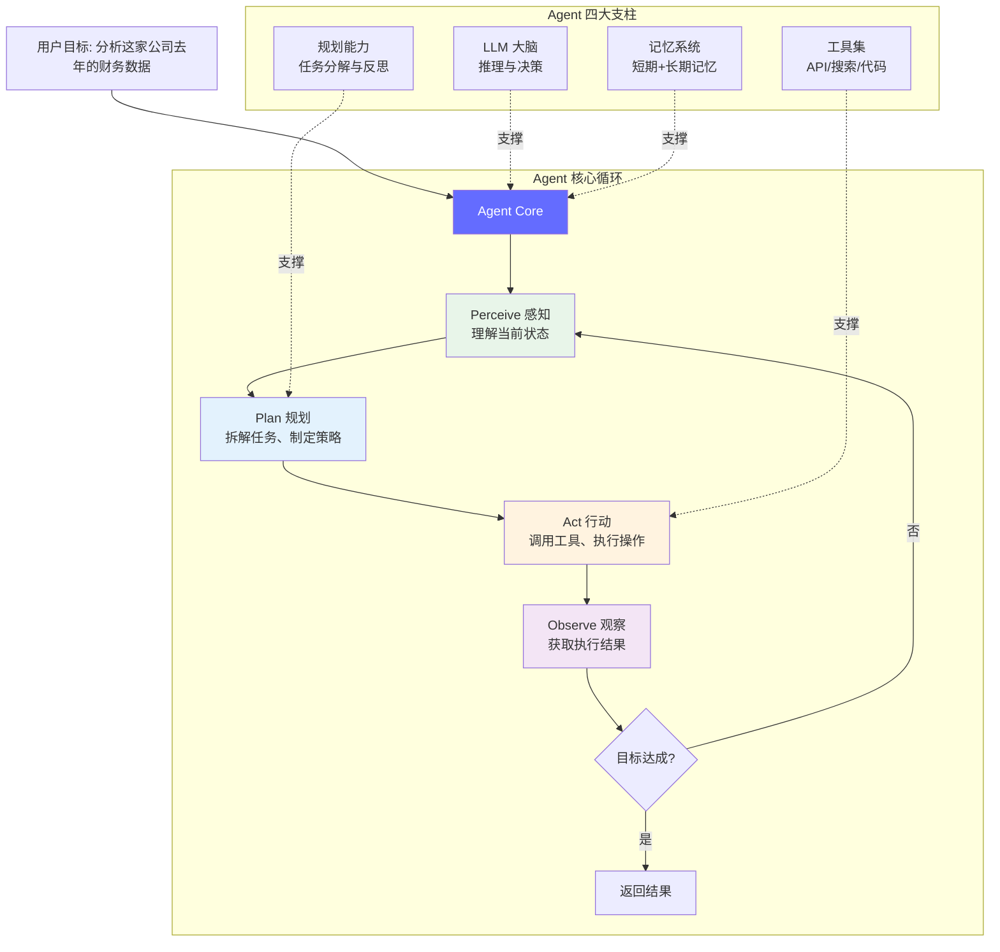
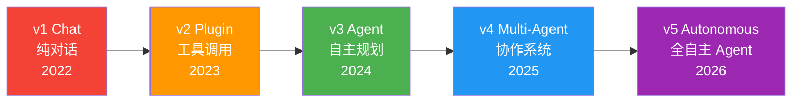
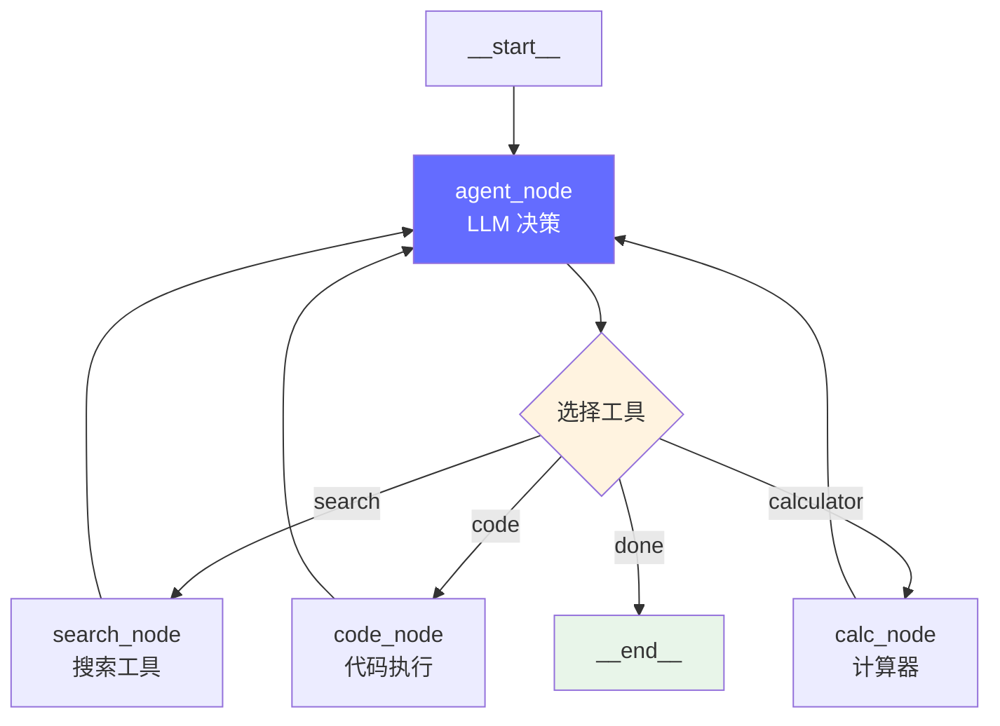
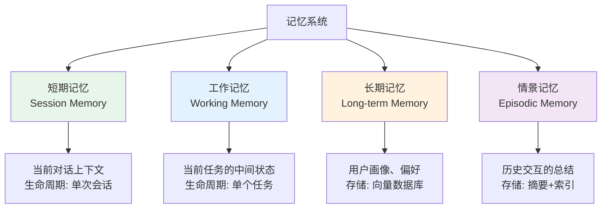
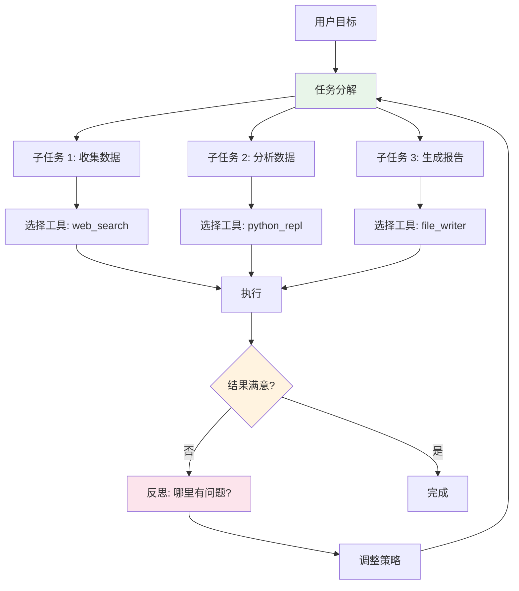
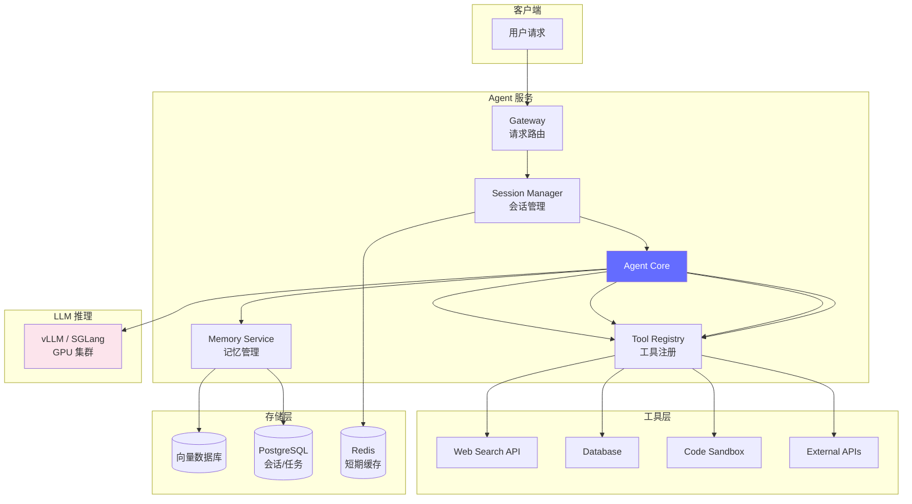

# Agent 架构与实战 — 让大模型自主完成任务

> Agent = LLM + 记忆 + 工具 + 规划。如果说 RAG 让 LLM 拥有了"知识"，那么 Agent 让 LLM 拥有了"行动力"。

---

## 前置知识

- [提示词工程](./prompt-engineering.md)
- [RAG 原理及应用](./rag-principles.md)

---

## 什么是 AI Agent

AI Agent 是能 **自主感知环境、做出决策、执行行动** 的大模型系统。

与普通对话的区别：

```
普通 LLM: 用户提问 → 模型回答 → 结束
Agent:     用户给目标 → Agent 规划步骤 → 调用工具 → 观察结果 → 调整策略 → 完成目标
```



---

## Agent 架构演进



| 阶段 | 特征 | 代表 |
|------|------|------|
| v1 Chat | 纯对话，无工具调用 | ChatGPT 3.5 |
| v2 Plugin | 单次工具调用 | ChatGPT Plugins |
| v3 Agent | 多步自主规划 | GPT-4 + Code Interpreter |
| v4 Multi-Agent | 多 Agent 协作 | CrewAI、AutoGen |
| v5 Autonomous | 长期任务、自我改进 | Devin（代码 Agent）、OpenManus |

---

## 主流 Agent 框架对比

### 框架矩阵

| 框架 | 维护方 | 核心理念 | 适合场景 | 2025-2026 状态 |
|------|--------|---------|---------|---------------|
| **LangGraph** | LangChain | 基于状态机的 Agent 工作流 | 复杂多步 Agent | ⭐⭐⭐⭐⭐ 主流 |
| **CrewAI** | CrewAI Inc. | 角色扮演式多 Agent 协作 | 团队协作场景 | ⭐⭐⭐⭐ 增长快 |
| **AutoGen** | Microsoft | 对话式多 Agent 框架 | 多轮研究讨论 | ⭐⭐⭐⭐ 稳定 |
| **OpenManus** | 社区开源 | 简化版 Manus Agent | 浏览器自动化 | ⭐⭐⭐⭐ 新兴 |
| **AG2** (原 AutoGen) | AG2 社区 | AutoGen 独立分支 | 多 Agent 研究 | ⭐⭐⭐ 发展中 |
| **LlamaIndex Agent** | LlamaIndex | RAG + Agent 融合 | 知识库问答 Agent | ⭐⭐⭐⭐ 增长中 |
| **Dify** | 国内团队 | 低代码 Agent 平台 | 企业快速搭建 | ⭐⭐⭐⭐ 国内热门 |

### LangGraph：生产环境首选

LangGraph 的核心思想：用 **有向图（State Machine）** 描述 Agent 的行为流程。



**LangGraph 最小示例：**

```python
from langgraph.graph import StateGraph, MessagesState, START, END
from langchain_openai import ChatOpenAI
from langchain_core.tools import tool

@tool
def search(query: str) -> str:
    """搜索网络获取最新信息"""
    return f"搜索结果: {query}"

@tool
def calculator(expression: str) -> str:
    """执行数学计算"""
    return str(eval(expression))

llm = ChatOpenAI(model="gpt-4o").bind_tools([search, calculator])

# 定义 Agent 节点
def agent_node(state: MessagesState):
    response = llm.invoke(state["messages"])
    return {"messages": [response]}

# 构建图
graph = StateGraph(MessagesState)
graph.add_node("agent", agent_node)
graph.add_node("search", search)
graph.add_node("code", calculator)

graph.add_edge(START, "agent")
graph.add_edge("search", "agent")
graph.add_edge("code", "agent")
graph.add_conditional_edges("agent", route_tools, {"search": "search", "code": "code", END: END})

app = graph.compile()
```

### CrewAI：多 Agent 协作

```python
from crewai import Agent, Task, Crew

# 定义角色
researcher = Agent(
    role='高级数据分析师',
    goal='分析用户提供的数据集',
    backstory='你是一名有 10 年经验的数据分析师，擅长统计分析和数据可视化',
    tools=[search_tool],
    verbose=True
)

writer = Agent(
    role='技术写作者',
    goal='将分析结果转化为清晰的报告',
    backstory='你是一名技术写作者，擅长将复杂的数据分析结果用简洁语言表述',
    verbose=True
)

# 定义任务
research_task = Task(
    description='分析 2025 年 AI 推理市场的规模、主要玩家和增长趋势',
    agent=researcher
)

write_task = Task(
    description='基于研究结果写一份市场分析报告',
    agent=writer
)

# 组建 Crew
crew = Crew(
    agents=[researcher, writer],
    tasks=[research_task, write_task],
    verbose=True
)

result = crew.kickoff()
```

---

## Agent 四大支柱详解

### 1. LLM 大脑

LLM 在 Agent 中承担三个角色：

```
决策器（Decision Maker）: 下一步做什么？
推理器（Reasoner）: 当前信息足够吗？需要更多数据吗？
生成器（Generator）: 如何组织最终回答？
```

**LLM 选型建议：**

| 需求 | 推荐模型 | 原因 |
|------|---------|------|
| 复杂多步推理 | GPT-4o / Claude 4 Opus | 最强的规划能力 |
| 中等任务 | Claude 4 Sonnet / GPT-4o-mini | 性价比好 |
| 简单工具调用 | Qwen 2.5 / Llama 3 | 开源、可自建 |

### 2. 记忆系统



**记忆设计原则：**

- 短期记忆用 **对话历史**（直接在 Prompt 中传递）
- 工作记忆用 **Python 变量**（任务执行中的中间状态）
- 长期记忆用 **向量数据库**（存储可检索的知识）
- 情景记忆用 **摘要 + 索引**（对历史对话的压缩总结）

### 3. 工具集

```python
# Agent 可用工具的典型集合
tools = [
    # 信息获取
    web_search,        # 网络搜索
    database_query,    # SQL 查询
    file_reader,       # 文件读取
    api_call,          # REST API 调用

    # 计算与分析
    python_repl,       # Python 代码执行
    calculator,        # 数学计算
    data_analysis,     # Pandas 分析

    # 输出生成
    file_writer,       # 写入文件
    email_sender,      # 发送邮件
    chart_generator,   # 生成图表

    # Agent 间通信
    agent_message,     # 向其他 Agent 发消息
    task_delegate,     # 委托子任务
]
```

### 4. 规划能力



**两种规划模式：**

| 模式 | 说明 | 优缺点 |
|------|------|--------|
| **一次性规划** | Agent 先规划所有步骤，然后执行 | 稳定但缺乏灵活性 |
| **迭代规划** | 每步结束后重新评估，动态调整 | 灵活但 token 消耗大 |

---

## Multi-Agent 协作模式

### 模式 1：流水线式

```
Agent 1 (研究员) → Agent 2 (分析师) → Agent 3 (写作者)
```

每个 Agent 的输出是下一个 Agent 的输入，适合有明确阶段的任务。

### 模式 2：层级式

```
Manager Agent
  ├─ Research Agent
  ├─ Analysis Agent
  └─ Review Agent
```

Manager 负责任务分配和质量控制。

### 模式 3：辩论式

```
Agent A (正方) ←→ Agent B (反方) → Agent C (裁判)
```

多个 Agent 从不同角度分析，最终由裁判汇总。

---

## Agent 在生产环境中的架构



### 关键运维指标

| 指标 | 说明 | 告警阈值 |
|------|------|---------|
| 任务完成率 | Agent 成功完成目标的比例 | {'<'}80% |
| 平均步数 | 完成任务需要的工具调用次数 | {'>'}20 步（可能进入循环） |
| Token 消耗 | 单次任务的总 token 用量 | {'>'}200K tokens |
| 端到端延迟 | 从请求到响应的总时间 | {'>'}60s |
| 工具调用失败率 | 工具调用失败的比例 | {'>'}10% |
| 幻觉率 | Agent 输出中不准确信息的比例 | {'>'}5% |

---

## 面试视角

### 常考问题

1. **"你理解 Agent 吗？它和普通对话有什么区别？"**

   回答框架：
   - Agent 不只是对话，而是"有目标的自主行为系统"
   - 核心区别：Agent 能调用工具、规划步骤、根据结果调整策略
   - 四大支柱：LLM（决策）+ 记忆（上下文）+ 工具（行动力）+ 规划（策略）
   - 普通 LLM 是"被动回答"，Agent 是"主动完成任务"

2. **"怎么设计一个 Agent 的记忆系统？"**

   - 短期记忆：对话历史，直接在 Prompt 中传递
   - 工作记忆：任务的中间状态，用 Python 变量管理
   - 长期记忆：向量数据库存储，支持语义检索
   - 情景记忆：对历史对话做摘要压缩
   - 关键问题：记忆太多 token 爆炸，记忆太少丢失上下文
   - 解决：记忆压缩（定期将长对话摘要化）+ 按需检索

3. **"Multi-Agent 什么时候用？单 Agent 不行吗？"**

   - 单 Agent 适合简单任务（搜索 + 总结）
   - Multi-Agent 适合复杂任务（需要不同专业视角）
   - Multi-Agent 的优势：职责分离、并行执行、减少单点错误
   - Multi-Agent 的成本：更高的 token 消耗、更长的延迟、更难调试
   - 决策标准：如果单 Agent 的任务步数超过 10 步且经常出错，考虑 Multi-Agent

4. **"Agent 在生产环境中最大的挑战是什么？"**

   - 可靠性：Agent 可能进入无限循环或做出错误决策
   - 成本：多步推理 + 多次工具调用 = 高 token 消耗
   - 延迟：每步推理都需要 LLM，端到端延迟可能超过用户容忍
   - 安全：Agent 能执行代码、调用 API，需要严格 sandbox
   - 调试：非确定性行为使得 bug 复现困难
   - 应对：限制最大步数、设置超时、工具沙箱化、全链路日志

5. **"你怎么评估一个 Agent 好不好？"**

   - 任务完成率：能不能成功完成目标（最重要的指标）
   - 效率：用了多少步、多少 token、多长时间
   - 可靠性：同样的目标执行 10 次，成功率多少
   - 安全性：有没有执行危险操作
   - 用户体验：用户是否满意、是否需要人工介入

---

## 扩展阅读

- [ReAct: Synergizing Reasoning and Acting](https://arxiv.org/abs/2210.03629) — Yao et al., 2022
- [LangGraph Documentation](https://langchain-ai.github.io/langgraph/) — 官方文档
- [CrewAI Documentation](https://docs.crewai.com/) — 官方文档
- [AutoGen: Enabling Next-Gen LLM Applications via Multi-Agent Conversation](https://arxiv.org/abs/2308.08155) — Microsoft
- [Self-RAG](https://arxiv.org/abs/2310.11511) — 自我反思的 Agent

---

*下一步：[AI 评测入门指南](./ai-evaluation.md)*
