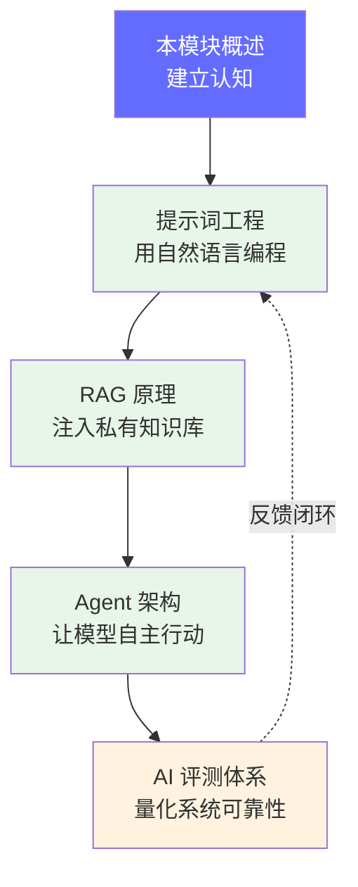

# AI 工程核心技术栈

> 掌握 AI 应用的四大核心技术：提示词工程、RAG、Agent 和 AI 评测——这是构建生产级 AI 应用的基础能力。

## 前置知识

- [模型是怎么工作的](../02-model-architecture/transformer-overview.md) — 理解 LLM 的能力边界（token 生成、temperature、上下文窗口）
- [推理引擎与量化](../04-inference-optimization/engine-overview.md) — 理解推理服务的延迟和成本约束
- [什么是 FDE](../01-basics/01-what-is-fde.md) — 理解 FDE 岗位的职责范围

## 为什么需要学这个

模型部署只是第一步。要让 LLM 产生业务价值，FDE 还需要掌握应用层的核心能力：

- **控制输出质量**：同样的模型，不同 Prompt 的输出差异巨大
- **注入私有知识**：LLM 的训练数据不包含你的业务信息，RAG 是桥梁
- **实现自主行动**：Agent 让 AI 从"对话工具"变成"自动化执行者"
- **保证系统可靠**：没有评测体系，AI 的每一次迭代都是盲盒

这四门技术是 FDE 向"应用层"延伸的核心能力，也是面试中高频考察的部分。

## 本模块学习地图

| 顺序 | 文档 | 解决什么问题 | 时长 |
|------|------|-------------|------|
| 1 | [提示词工程](./prompt-engineering.md) | 如何稳定地让模型输出想要的结果 | 30 分钟 |
| 2 | [RAG 原理](./rag-principles.md) | 如何让模型基于私有数据回答 | 1 小时 |
| 3 | [Agent 架构](./agent-architecture.md) | 如何让 AI 自主规划、调用工具、完成任务 | 1 小时 |
| 4 | [AI 评测](./ai-evaluation.md) | 如何量化和保证 AI 系统质量 | 45 分钟 |

## 核心概念速览

这四门技术构成了 AI 应用开发的完整闭环：

| 技术 | 一句话概括 | 核心能力 |
|------|-----------|---------|
| **提示词工程** | 用自然语言"编程"大模型 | 结构化指令、思维链、工具调用 |
| **RAG** | 让 LLM 拥有"外挂知识库" | 文档索引、向量检索、上下文增强 |
| **Agent** | 让 LLM 自主完成任务 | 规划、记忆、工具、多 Agent 协作 |
| **AI 评测** | 量化 AI 系统的好坏 | 精度/性能/安全/用户体验评估 |

## 面试视角

| 技术 | 常考题型 |
|------|---------|
| 提示词工程 | 如何设计生产 Prompt、Prompt vs 微调、减少幻觉 |
| RAG | RAG 架构、检索优化、延迟优化、评估方法 |
| Agent | Agent 架构、记忆系统、Multi-Agent、可靠性 |
| AI 评测 | Benchmark 选择、性能测试、RAG 评估、安全扫描 |

## 学完本模块后，你应该能够...

- [ ] 设计生产级 Prompt 模板并减少幻觉
- [ ] 构建 RAG 系统并优化检索质量
- [ ] 解释 Agent 的核心组件（规划、记忆、工具）
- [ ] 设计 AI 系统的评测方案（精度 + 性能 + 安全）

*上一节：[大模型怎么部署到多块 GPU 上](/05-distributed-inference/) | 下一节：[提示词工程](./prompt-engineering.md)*
